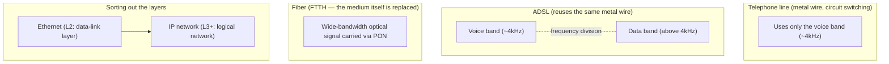

## Introduction

- **What You'll Learn From This Article**: What a "telephone line," "ADSL," and "fiber" each refer to as ways of realizing an access line, and how they differ; why ADSL lets you make a phone call and use the internet at the same time over the same wire; how fiber (FTTH) actually delivers a light signal to a home using a PON architecture; and why "Ethernet" and an "IP network" are not the same thing.
- **Intended Audience**: This article is written for infrastructure engineers who know terms like "ADSL," "fiber," and "Ethernet," but can't explain exactly what each one refers to physically and logically, or how they relate to telephone lines and IP networks.
- **Estimated Reading Time**: About 15 minutes

This article is part of the [Top 1% Series' full article guide](/en/sitemap).

## Prerequisites

- **Access line**: The "last segment" of a communication path — the link between a user's home or site and the telecom carrier's nearest facility (a local exchange or central office). Also known as the "last mile."
- **Frequency band**: The range of signal frequencies a transmission medium (a wire, a fiber, etc.) is physically capable of carrying. Splitting that range into separate bands lets a single medium carry multiple signals at once.
- **OSI L1/L2/L3**: L1 (physical layer) carries the raw electrical or optical signal itself; L2 (data-link layer) handles frame exchange between adjacent devices sharing the same medium; L3 (network layer) uses IP addresses to build a path to a distant destination.

## Getting the Big Picture

### In a Nutshell

**A "telephone line," "ADSL," and "fiber" are all just different ways of realizing the "access line" that connects a subscriber's home to the telecom carrier's nearest facility.** A telephone line refers to the circuit-switched voice network itself, whereas ADSL reuses that exact same metal wiring (copper pair) while layering digital data onto the frequency band voice doesn't use, and fiber replaces the transmission medium itself with optical fiber to expand bandwidth by orders of magnitude. **"Ethernet," meanwhile, sits on a completely different axis from all of this** — it's merely a data-link-layer (L2) standard that operates beneath an IP network, while an IP network is the logical network-layer-and-above (L3+) system that runs on top of it. So Ethernet is not the same thing as an IP network.

## Fundamentals, Thoroughly Explained

### What an Access Line Is: The Two Meanings of "Telephone Line"

The first thing that trips people up here is that **the phrase "telephone line" is actually used with two different meanings**:

1. The **circuit-switched voice network itself** — the service and mechanism whereby an exchange uses TDM (time-division multiplexing) to build a dedicated one-to-one path
2. The **physical copper twisted pair** actually strung from a subscriber's home to the nearest local exchange

What ADSL reuses is meaning (2), not meaning (1). ADSL has nothing to do with the telephone exchange's circuit-switching mechanism — it simply borrows the "physical asset" that is the metal wiring already reaching into the home, and layers a completely different use (data transmission) on top of it. Keeping this distinction in mind makes the rest of the explanation easier to follow.

### How ADSL Works: Why the Same Wire Can Carry a Call and Data at Once

Because human speech only needs to be intelligible, telephone voice traffic has always used a narrow frequency band of roughly **4kHz**. But the copper wire itself is physically capable of carrying a much wider frequency range than that. **ADSL (Asymmetric Digital Subscriber Line)** uses that unused, higher frequency band to layer digital data on top, via a modulation scheme called **DMT (Discrete Multi-Tone)**.

A **splitter** (or, per-phone, a small microfilter) installed at the subscriber's home filters the incoming signal by frequency, routing the low band (voice) to the phone and the high band (data) to the ADSL modem. As a result, **the circuit-switched voice call and the packet-switched data traffic coexist, via frequency division, on the very same single physical wire.** No new "ADSL line" is being laid.

Why "Asymmetric," and why does distance make it slower?

The "A" in ADSL (Asymmetric) refers to its deliberately asymmetric design, allocating a wider frequency band to downstream (download) than upstream (upload). This is based on the assumption that a typical user's traffic — browsing web pages, downloading files — is overwhelmingly downstream-heavy.

ADSL's speed is also heavily affected by the wiring distance from the local exchange. Higher-frequency signals attenuate much more sharply as they travel over a metal wire, so the farther the distance, the narrower the usable high-frequency (data) band becomes, and speed drops accordingly. This is also a useful contrast with why fiber (discussed below) is better suited to high speed over long distances — light attenuates far less than an electrical signal.

### How Fiber (FTTH) Works: The PON Architecture

**Fiber (FTTH: Fiber To The Home)** doesn't borrow existing metal wiring the way ADSL does — instead, it **replaces the transmission medium reaching the home with optical fiber itself.** Because an optical signal attenuates far less than an electrical one, fiber can carry orders of magnitude more bandwidth over much longer distances than ADSL.

The dominant architecture today is called **PON (Passive Optical Network)** (standards include GE-PON and GPON). A single fiber leaving the **OLT (Optical Line Terminal)** at the carrier's local exchange is split, partway along, by an **optical splitter** (a passive component that requires no electrical power), into multiple fibers, each reaching an **ONU (Optical Network Unit)** at a subscriber's home. The name PON ("Passive") comes from the fact that a single physical fiber can be branched and shared across multiple homes without any power-consuming active relay device in between.

How does PON let multiple homes share one fiber without collisions?

Downstream (OLT → each ONU), the OLT simply broadcasts its optical signal, the splitter fans it out to every ONU, and each ONU picks out only the data addressed to it. Upstream (each ONU → OLT), if multiple homes transmitted simultaneously, their optical signals would collide — so collisions are avoided through **TDMA (Time Division Multiple Access)**, in which the OLT individually assigns each ONU a time slot during which it's allowed to transmit. Whereas a telephone network's TDM keeps a fixed time slot assigned to a given call for its entire duration, PON's upstream TDMA differs in that it dynamically allocates time slots based on the transmission demand of every currently connected ONU.

The ONU converts the received optical signal back into an electrical signal and hands it to the subscriber's router as **Ethernet frames**. There's no ADSL-style "frequency division between voice and data band" concept here at all — telephone service (so-called "hikari denwa," or fiber-optic phone service) isn't layered onto a separate voice band either; instead, voice itself is digitized into packets and carried as IP packets over this same Ethernet link, in a form called VoIP (Voice over IP).

### Ethernet and IP Networks: Why They Aren't the Same Thing

Separate from everything above, there's another axis worth sorting out: **the relationship between "Ethernet" and an "IP network."**

**Ethernet** is a data-link-layer (L2) standard developed at Xerox PARC in the 1970s, for devices sharing the same physical medium to exchange frames with each other. It identifies destinations not by IP address but by **MAC address** (a physical address assigned to each device). Ethernet as a standard predates IP and the internet itself — **it wasn't created to carry IP.**

An **IP network**, by contrast, is a logical, network-layer-and-above (L3+) system that **runs on top of** Ethernet (or any other L2 medium). An IP packet is carried encapsulated as the payload (data portion) of an Ethernet frame. In other words, the structure is layered — "an IP packet sits inside an Ethernet frame" — so Ethernet is merely one component of an IP network (its L2 transport method), not the same thing as the IP network itself. In fact, protocols other than IP (such as ARP itself, which maps MAC addresses to IP addresses in the first place) are also carried over Ethernet — Ethernet is a general-purpose carrier that isn't limited to IP.

### Comparison Table: Where Each Term Sits

| Term | Layer / role | What it actually is |
|---|---|---|
| Telephone line (circuit-switched network) | The entire call-control and transmission scheme for carrying voice | Exchanges, TDM, metal wiring |
| ADSL | An access-line technology that reuses existing telephone wiring (metal wire) | DMT modulation above the voice band |
| Fiber (FTTH) | An access-line technology that replaces the medium with optical fiber | Optical transmission between OLT and ONU via PON |
| Ethernet | A data-link-layer (L2) standard | MAC addresses, frame format |
| IP network | A logical network-layer-and-above (L3+) system | IP addresses, routing |

## The View from the Top 1% (What Experts See)

### "Faster Access Lines" and "Authentication/IP Assignment" Are Separate Layers

The move to ADSL and fiber was purely an upgrade to the access line's transmission technology (L1/L2) — it didn't change the commercial and billing practice inherited from the telephone-line dial-up era, of authenticating each subscriber individually and dynamically assigning an IP address. That's why broadband connections have continued to reuse PPP-based connection methods such as PPPoE. **"The line got faster, so authentication and IP assignment must not be needed anymore" is a common misconception in practice — but the transmission technology of the line and the user authentication/address-management scheme running on top of it are entirely separate layers**, and it's important to keep that distinction clear.

### PPPoE's Limits and the Move to IPoE

Modern fiber connections are increasingly moving toward **IPoE**, a connection method that doesn't use PPPoE (it runs IP directly over Ethernet, without PPP in between). The reason is structural: PPPoE requires the carrier's local exchange to concentrate and process each subscriber's individual PPP session through a **network termination device (tunnel termination device)**, and as the number of subscribers grows, this concentration point becomes a bottleneck — speeds tend to degrade during congested periods such as evenings. IPoE sidesteps this bottleneck by routing IPv6 traffic directly, without going through a network termination device, and by tunneling IPv4 packets over the IPv6 network using an "IPv4 over IPv6" technique (carriers use different names for this, such as DS-Lite or MAP-E). It helps to think of this as IPoE replacing the very function PPP used to provide — "authenticate per line, hand out an IP address" — with a different mechanism (IPv6 address assignment tied to the subscriber's physical line, plus IPv6 routing coordinated with an authentication server).

## Common Misconceptions and Pitfalls

- **Misconception 1: "ADSL is a brand-new line, separate from the telephone line."**
  ADSL simply reuses the metal wiring already laid as a telephone line, via frequency division. It doesn't involve any new wiring.
- **Misconception 2: "Once you switch to fiber, the whole mechanism behind phone-number-based calling disappears."**
  Phone-number-based calling service itself survives, in the form of VoIP-based "hikari denwa" (fiber-optic phone service). It's simply been replaced by a mechanism that digitizes voice into IP packets carried over Ethernet, rather than transmitting it over a dedicated voice frequency band via circuit switching.
- **Misconception 3: "Ethernet and an IP network refer to the same thing."**
  Ethernet is a data-link-layer (L2) standard, while an IP network is a logical, network-layer-and-above (L3+) system — an IP packet is carried inside an Ethernet frame, a layered relationship.
- **Misconception 4: "ADSL is just a cheaper version of fiber, with essentially the same mechanism."**
  ADSL layers data onto existing metal wiring via frequency division, while fiber replaces the transmission medium itself with optical fiber — the underlying mechanisms are fundamentally different.

## Troubleshooting Perspective

Access-line trouble is best approached by isolating **which stage the problem is in: the line itself (L1), the device terminating the line (the ADSL modem or ONU), or the connection method running on top of it, such as PPPoE/IPoE (L2/L3).**

1. **ADSL speed is poor or unstable**: Check the modem's admin page for the **sync rate** and **noise margin**. Greater distance from the local exchange increases attenuation of higher frequencies, reducing speed; a missing splitter (microfilter) can also let a connected phone act as a noise source that destabilizes the sync.
2. **Fiber link won't establish**: Check the ONU's optical receive level (shown in dBm). An unusually low level (excessive attenuation) can be caused by a kinked fiber cable or wiring that exceeds the cable's minimum bend radius.
3. **The line connects, but PPPoE is unstable**: A classic symptom of congestion at the carrier's network termination device (slowdowns specifically during busy evening hours) — switching to IPoE (IPv4 over IPv6) can sometimes resolve this.

### Prevention and Long-Term Countermeasures

- In an ADSL setup, verify that a splitter (microfilter) is correctly installed at every modular jack a phone is connected to.
- When running fiber cabling, respect the cable's minimum bend radius and avoid sharp kinks.

## Summary

- The phrase "telephone line" carries two distinct meanings: the circuit-switched voice network itself, and the physical metal wiring reaching a subscriber's home.
- ADSL reuses existing telephone metal wiring, layering data onto the higher frequency band voice doesn't use via DMT modulation — it involves no new wiring.
- Fiber (FTTH) replaces the transmission medium itself with optical fiber, achieving wide bandwidth via the PON architecture (branching between OLT and ONU through an optical splitter).
- Ethernet is a data-link-layer (L2) standard, and an IP network is a logical network-layer-and-above (L3+) system — an IP packet is carried inside an Ethernet frame, a layered relationship — so the two are not the same thing.

**Starting Today**
1. When you see "ADSL" or "fiber," remember that these refer to differences in access-line transmission technology, on a separate axis from the telephone line (the circuit-switched voice network).
2. When "Ethernet" and "IP network" come up, remember these describe different layers — L2 versus L3 and above.

## References

- [G.992.1 : Asymmetric digital subscriber line (ADSL) transceivers | ITU-T](https://www.itu.int/rec/T-REC-G.992.1)
- [G.984.1 : Gigabit-capable passive optical networks (GPON): General characteristics | ITU-T](https://www.itu.int/rec/T-REC-G.984.1)
- [IEEE 802.3 Ethernet Working Group | IEEE 802](https://www.ieee802.org/3/)
