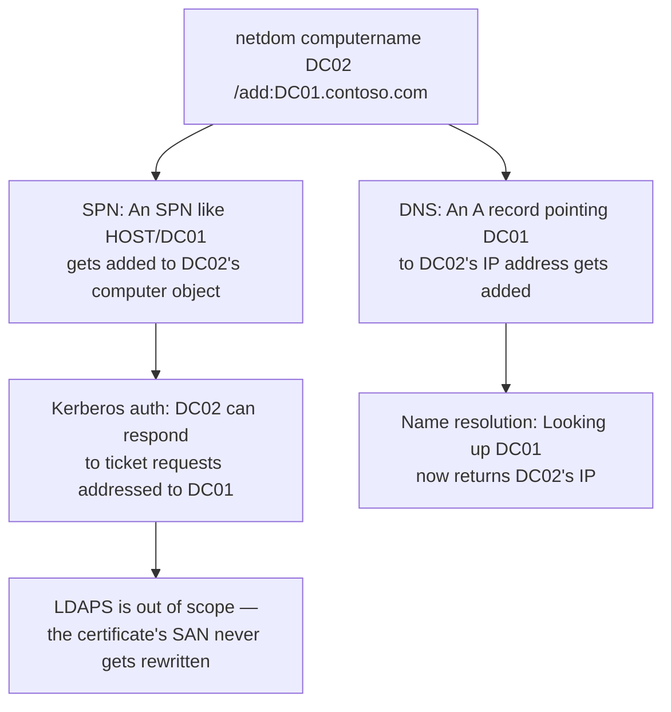

## Introduction

- **What You'll Learn From This Article**: The `/makeprimary` covered in [the difference between sysdm.cpl and netdom computername](/en/articles/ad-computername-netdom-guide) was a procedure for **completely swapping** the new DC's name for the old DC's name. This article covers a different technique, common in real-world DC replacement work: **letting the new DC keep its own distinct new name as-is, while simply adding the old DC's name as an alternate name.** After understanding how this technique rewrites SPNs and DNS, you'll systematically understand **why only LDAPS-dependent integration systems need extra certificate work beyond this alternate name.**
- **Intended Audience**: Readers who understand [the difference between netdom computername's `/add` and `/makeprimary`](/en/articles/ad-computername-netdom-guide), but can't explain the meaning of the option "keep operating with just `/add`, never calling `/makeprimary`," or why only certificate-dependent integration systems need separate handling.
- **Estimated Reading Time**: About 17 minutes

This article is part of the [Top 1% Series Complete Article Guide](/en/sitemap), and article 2.1 in the [Active Directory Series](/en/sitemap#series-list).

## Prerequisite Knowledge

- [How sysdm.cpl and netdom computername Differ](/en/articles/ad-computername-netdom-guide): The premise that adding an alternate name with `/add` and promoting it to primary with `/makeprimary` are separate, independent steps.
- [How SPN (Service Principal Name) Works](/en/articles/ad-spn-guide): The premise that an SPN is an identifier binding "which name, when called, gets answered as which account" in Kerberos authentication.

## Getting the Big Picture

The procedure covered in [the existing article](/en/articles/ad-computername-netdom-guide) — renaming the new DC to the old DC's name — was a careful procedure built on the premise of **fully decommissioning the old DC first, so that no moment of name duplication ever exists.** In real-world practice, though, there's another option commonly used: **letting the new DC use its own distinct new name (e.g. `DC02`) from the start, simply adding the old DC's name (e.g. `DC01`) as an alternate name, and never performing the rename (`/makeprimary`) at all.** **This technique's benefit is simple: the new DC's name stays unique as the new DC's own name from the very start, so the risk that comes with renaming never exists in the first place.** In exchange, legacy systems and scripts with the old DC's name hardcoded can keep working exactly as before, with no changes at all, through the alternate name added to the new DC.

## Deep Dive Into the Fundamentals

### What Adding an Alternate Name Concretely Does to SPN and DNS

Running `netdom computername DC02 /add:DC01.contoso.com` does two things. First, **an SPN like `HOST/DC01` or `HOST/DC01.contoso.com` gets added to DC02's computer object's `servicePrincipalName` attribute.** This means that even when a client requests a Kerberos ticket addressed to the old DC name `DC01`, the DC can search AD and identify DC02 itself as "the account holding the SPN `DC01`," correctly encrypting and returning the ticket. Second, **an A record gets added to the DNS server, pointing the name `DC01` to DC02's actual IP address.** This means that even when a client tries to resolve the name `DC01`, the IP address returned is DC02's own. **Only once both SPN and DNS are rewritten does both Kerberos authentication and name resolution, using the old DC name, successfully hold up against the new DC (DC02) as-is.**

How Does This Technique Differ From the Existing Article's "Full Rename"?

**[The existing article's](/en/articles/ad-computername-netdom-guide) technique promotes the old DC's name to the "primary name" itself, by running `/makeprimary`.** After promotion, the OS itself recognizes the name `DC01` as "its own name," and actively manages and updates it. **This article's technique, by contrast, stops at `/add` and never runs `/makeprimary` at all.** In this case, DC02's primary name remains `DC02` throughout. `DC01` stays nothing more than **a subordinate alias that only functions at the level of the SPN and DNS record.** Which one to choose comes down to a difference in operational policy: "do we want to keep using the old DC's name as the official name going forward," or "do we just want to quietly keep the old DC's name alive behind the scenes, purely for compatibility with legacy assets"?

### What Adding an Alternate Name Alone Can't Cover

Adding an alternate name only covers **two "name mapping tables": AD DS (the SPN) and DNS (the A record).** Because of this, the following cases don't get resolved by adding an alternate name alone.

- **Settings specifying an IP address directly**: Settings pointing at a destination by hardcoded IP address (the IP address itself, where the NTP server points, where the DNS server points, etc.) never go through name resolution at all, so regardless of the alternate name, the setting value itself must be changed to the new DC's IP address.
- **Firewall rules**: A firewall rule that explicitly allowed the old DC's IP address needs a separate configuration change, to allow the new DC's IP address instead.
- **LDAPS-dependent integration systems**: Covered in detail in the next section.

## What a Pro Sees Here (Top 1% Understanding)

### Why LDAPS Alone Doesn't Get Resolved by Adding an Alternate Name

**LDAPS is encrypted with TLS from the very start of the connection** (as covered in [how the LDAP protocol works](/en/articles/ad-ldap-protocol-guide), on port 636). **In a TLS connection, the client verifies whether the name it's trying to connect to is actually included in the `CN` (Common Name) or `SAN` (Subject Alternative Name) of the server certificate the other side presents.** This is a **third, entirely independent "name mapping table,"** completely separate from the SPN or DNS.

**`netdom computername`'s `/add` rewrites the SPN (AD DS) and DNS (zone data), but never touches the certificate itself at all.** The server certificate installed on DC02 normally only contains DC02's own name in its SAN, and adding the alternate name `DC01` never automatically adds `DC01` to the certificate's SAN. As a result, **a client attempting an LDAPS connection using the old DC name `DC01` succeeds at name resolution (DNS) and port reachability (the firewall), but at the TLS handshake stage, detects that "the certificate's SAN doesn't include `DC01`" and rejects the connection with a certificate error.**

The Concrete Remediation for Integration Systems Using LDAPS

Assuming an internal PKI like the one built in [the hands-on building an Enterprise CA with AD CS](/en/articles/ad-cs-handson-guide), three steps are needed:

1. **Install a server certificate on the new DC (DC02)**: Issue and install a certificate on DC02 carrying the Server Authentication EKU (Extended Key Usage), not the client authentication one.
2. **Include the old DC name (`DC01`) in that certificate's SAN**: When requesting the certificate's issuance, explicitly specify `DC01` as a SAN entry, in addition to DC02's own name. This lets certificate validation succeed correctly, even for a client connecting over TLS using the name `DC01`.
3. **Register the issuing root CA's certificate on the integration system's side**: If the integration system doesn't trust the issuer (the internal CA) of the newly issued certificate, the certificate chain validation itself fails, even with a correct SAN. The internal CA's root certificate needs to be registered in the integration system's own trusted root certification authority store.

**Until all three of these are in place, never assume adding the alternate name alone resolves an LDAPS connection.** If your plan includes a move to LDAPS, certificate preparation needs to proceed as an independent task, in parallel with adding the SPN/DNS alternate name.

## Common Misconceptions and Pitfalls

- **Misconception 1: "Adding an alternate name carries over every way of accessing something using the old DC name."**
  Adding an alternate name only covers two mapping tables: the SPN (AD DS) and DNS (the A record). A hardcoded IP address setting, a firewall rule, and an LDAPS certificate's SAN all need separate, individual handling.
- **Misconception 2: "If LDAP connects fine, LDAPS should connect just as fine too."**
  Plain-text LDAP (port 389) connects successfully as long as the SPN and DNS are correct. But LDAPS (port 636) needs to additionally pass through an entirely separate layer of verification: the certificate's SAN check.
- **Misconception 3: "Operating with just `/add` is an 'incomplete' state compared to running `/makeprimary`."**
  Stopping at just `/add` isn't an incomplete state — it's a legitimate choice based on a clear operational policy of never adopting the old DC name as the official name going forward.

## Troubleshooting Perspective

1. **LDAP (port 389) connects fine with the old DC name, but only LDAPS (port 636) fails with a certificate error**: Check whether the certificate installed on the new DC includes the old DC name in its SAN.
2. **Access using the old DC name appears to succeed overall, but only some systems fail to connect**: Check whether that failing system specifies an IP address directly, or uses LDAPS.
3. **You added the alternate name, but name resolution using the old DC name still fails**: Use `nslookup` or `Resolve-DnsName` to confirm the corresponding A record was actually created on the DNS server.

## Summary

- Operating with only `netdom computername`'s `/add`, without ever running `/makeprimary`, lets the new DC keep its own distinct name while adding the old DC's name as an alternate name — an option carrying none of the renaming risk.
- Adding an alternate name is achieved by rewriting two mapping tables: adding an SPN to AD DS, and adding an A record to DNS.
- Hardcoded IP address settings and firewall rules each need separate configuration changes, regardless of the alternate name.
- LDAPS checks the certificate's SAN — a third mapping table, independent of the SPN and DNS — so it never gets resolved by adding the alternate name alone; it needs three additional steps: issuing a certificate, adding to its SAN, and trusting the root CA.

**Takeaways to Apply Today**
1. When using an alternate name for a DC replacement, individually confirm that each of the three independent mapping tables — SPN, DNS, and certificate — has actually been handled.
2. If any integration system uses LDAPS, build certificate preparation into the plan as an independent task, running in parallel with the alternate-name work.

## References

- [Netdom computername | Microsoft Learn](https://learn.microsoft.com/en-us/windows-server/administration/windows-commands/netdom-computername)
- [Add SAN to secure Lightweight Directory Access Protocol (LDAP) certificate | Microsoft Learn](https://learn.microsoft.com/en-us/troubleshoot/windows-server/certificates-and-public-key-infrastructure-pki/add-san-to-secure-ldap-certificate)
- [Troubleshoot LDAP over SSL connection problems | Microsoft Learn](https://learn.microsoft.com/en-us/troubleshoot/windows-server/active-directory/ldap-over-ssl-connection-issues)
