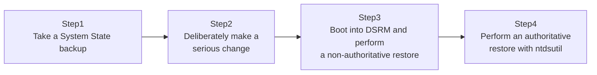

## Introduction

- **What You'll Learn From This Article**: [The Hands-On Lab for Restoring an Accidentally Deleted User or OU With the AD Recycle Bin](/en/articles/ad-recycle-bin-handson-guide) was a recovery method that only works within `tombstoneLifetime` (180 days by default), and only while AD DS itself is functioning normally. In this article, you'll prepare for the case where that assumption breaks down — where AD DS itself isn't functioning correctly, due to serious failure or data corruption — using **System State backup** and an `ntdsutil`-driven **Authoritative Restore**, hands-on.
- **Intended Audience**: Readers who understand how the AD Recycle Bin works, but have never actually practiced preparing for the more serious failures it can't save you from.
- **Estimated Reading Time**: About 25 minutes (about an hour if you build along with the hands-on)

This article is part of the [Top 1% Series Complete Article Guide](/en/sitemap), the 33rd article in the [Active Directory Series](/en/sitemap#series-list).

## Prerequisites

- [A Hands-On Lab: Restoring an Accidentally Deleted User or OU With the AD Recycle Bin](/en/articles/ad-recycle-bin-handson-guide): This article assumes you already know the concept of a tombstone, and the AD Recycle Bin's limits.

## The Big Picture

This hands-on consists of four steps.



## Hands-On Steps

### Step 1: Take a System State backup

Use the Windows Server Backup feature to back up the DC's `System State` — the full set of OS configuration information, including the AD DS database.

```powershell
Install-WindowsFeature Windows-Server-Backup
wbadmin start systemstatebackup -backupTarget:E: -quiet
```

**A System State backup includes not just the AD DS database file (`ntds.dit`), but the entire set of information a DC needs to function — SYSVOL, the registry, the certificate store, and more.** Once the backup finishes, create a test OU called `TestOU` with a test user inside it.

### Step 2: Deliberately make a serious change

To dirty the state after the backup was taken, delete `TestOU`.

```powershell
Remove-ADOrganizationalUnit -Identity "OU=TestOU,DC=example,DC=com" -Recursive -Confirm:$false
```

**Here's the key point.** To simulate an environment where the AD Recycle Bin isn't enabled, or `tombstoneLifetime` has long since expired, we'll try restoring from the Step 1 backup this time, without using the AD Recycle Bin at all.

### Step 3: Boot into DSRM and perform a non-authoritative restore

Restart the DC, booting it into **DSRM (Directory Services Restore Mode)**.

```powershell
bcdedit /set safeboot dsrepair
Restart-Computer
```

Log on with the DSRM administrator password (set when the DC was originally built), and run the restore from your backup.

```powershell
wbadmin start systemstaterecovery -version:<backup version identifier> -quiet
```

**The restore performed at this point is called a "non-authoritative restore."** It resets the DC to the state at backup time, but once that DC reboots into normal mode, it receives all the changes (via replication) that occurred after the backup from other healthy DCs — and ultimately catches back up to the latest state (which means `TestOU` ends up deleted again). **Simply performing a non-authoritative restore does not, in the end, bring back the `TestOU` you deleted.**

### Step 4: Perform an authoritative restore with ntdsutil

To actually bring `TestOU` back, you need to explicitly mark the restored object as **"treat this as newer than any change coming in from any other DC."** That's what `ntdsutil` is for. Still in DSRM mode, run the following.

```
ntdsutil
activate instance ntds
authoritative restore
restore subtree "OU=TestOU,DC=example,DC=com"
quit
quit
```

Running this deliberately rewrites the target object's and its child objects' **USN (update sequence number)** to a value higher than any other DC holds. Once the DC reboots into normal mode, other DCs see this rewritten USN as "newer than what I already have" and propagate `TestOU`'s revival, via replication, out to every other DC.

## What a Pro Sees Here (Top 1% Understanding)

### Why rewriting the USN is the decisive factor in the restore

As covered in [Understanding DC Health Checks from a "Top 1%" Perspective](/en/articles/dc-health-check-guide) and [Understanding Sites](/en/articles/ad-sites-guide), AD DS replication fundamentally works on a USN-based mechanism — newer changes overwrite older ones. A non-authoritative restore alone leaves the object at the backup-time USN, which every other healthy DC sees as merely "old information," and it eventually gets overwritten by replication regardless. **What an authoritative restore actually does is deliberately rewrite that USN to a future value, convincing every other DC that "this is the correct, most current state."** Understanding this mechanism is what makes it click why "restoring alone doesn't bring it back," and why the special `ntdsutil` procedure is needed at all.

### USN as resistance against a "rollback attack"

Flip this USN-based mechanism around, and it also serves as a defense against a malicious rollback attack — deliberately restoring a DC from an old backup to roll it back to an earlier state (say, one where a departed employee's account hadn't yet been disabled). Under an ordinary (non-authoritative) restore, a DC restored with an old USN simply gets pulled back to the correct, current state through replication with other healthy DCs. **This property — getting pulled back to the correct state through replication — is a concrete manifestation of the fact that AD DS isn't a system with a single point of failure, but a distributed system built on consensus among multiple DCs.**

## Common Misconceptions and Pitfalls

- **Misconception 1: "Simply restoring from backup (a non-authoritative restore) brings back a deleted object."**
  A non-authoritative restore alone ends up pulled back to the deleted state through replication with other DCs. Actually making the restored object stick requires an authoritative restore.
- **Misconception 2: "An authoritative restore can only be performed against the entire forest."**
  The `restore subtree` command lets you perform a partial authoritative restore, scoped to just one specific OU.
- **Misconception 3: "With the AD Recycle Bin in place, a System State backup is no longer necessary."**
  The AD Recycle Bin is a recovery method for within `tombstoneLifetime`, while AD DS itself is functioning normally. More serious failures beyond that require restoring from a System State backup. The two are complementary.

## Troubleshooting Perspective

1. **You've forgotten the DSRM password and can't log on**: You need to reset it ahead of time, using Domain Admin rights while booted in normal mode, with `ntdsutil`'s `set dsrm password` command.
2. **The object still doesn't come back after running `authoritative restore`**: Check whether the target DN (distinguished name) path is exact, and whether the DC you're restoring actually has replication partners (this can't be validated with a single standalone DC).
3. **Taking the backup itself fails**: Check whether the `Windows-Server-Backup` feature is correctly installed, and whether the backup destination has enough disk space.

## Summary

- A System State backup includes the full set of information a DC needs to function, including the AD DS database.
- A non-authoritative restore only resets to the backup-time state — subsequent replication ultimately catches it back up to the latest state (deleted, if that's what happened since).
- An authoritative restore uses `ntdsutil` to deliberately rewrite the USN, making other DCs recognize the restored object as the correct, current state.
- This USN-based mechanism also serves as a defense against malicious rollback attacks.
- The AD Recycle Bin and a System State backup are complementary safeguards, covering different severities of failure.

**Takeaways to Apply Today**
1. Even with the AD Recycle Bin enabled, keep taking regular System State backups separately.
2. Remember to periodically reset and record the DSRM password.

## References

- [Back up and Restore Active Directory Domain Services | Microsoft Learn](https://learn.microsoft.com/en-us/windows-server/identity/ad-ds/manage/ad-forest-recovery-backing-up-ad)
- [ntdsutil | Microsoft Learn](https://learn.microsoft.com/en-us/windows-server/administration/windows-commands/ntdsutil)
