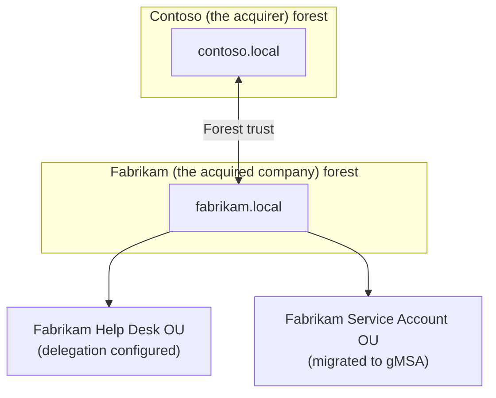

## Introduction

- **What You'll Learn From This Article**: This is the Active Directory Department's capstone project, where you'll **integrate, on your own, the techniques you've learned one at a time in earlier hands-on labs** (forest trusts, GPOs, delegation, gMSA, backup, Kerberoasting/DCSync auditing, and more) **into a single fictional corporate acquisition scenario.** Where earlier articles aimed at "following steps to reliably master one technique," this article takes a format much closer to real-world work: **presenting only requirements, and leaving you to design which techniques to combine, and how.**
- **Intended Audience**: Readers who've worked through the Active Directory Department's Junior, Senior, and Graduate School content and can execute each individual hands-on lab, but have never designed a single environment combining them.
- **Estimated Reading Time**: Expect several days to about a week, including design, building, and documentation (the heaviest single hands-on in this series).

This article is part of the [Top 1% Series Complete Article Guide](/en/sitemap). It's positioned as the capstone project within the [Active Directory Department's full curriculum](/en/university#active-directory-department).

## Prerequisite Knowledge

This hands-on doesn't teach any new technique. **You'll combine and use the techniques you've already mastered in the following completed hands-on labs.**

- [The Top 1% Hands-On for Building a Multi-Domain, Multi-Tree AD Forest](/en/articles/ad-multidomain-handson-guide)
- [The Top 1% Hands-On for Building a Forest Trust Between Two Independent Forests, Simulating an Acquisition](/en/articles/ad-forest-trust-handson-guide)
- [The Top 1% Hands-On for Actually Creating and Linking GPOs, and Experiencing Priority and Troubleshooting](/en/articles/ad-gpo-handson-guide)
- [The Top 1% Hands-On for Delegating OU Control: Giving the Help Desk Password-Reset Rights Only](/en/articles/ad-delegation-handson-guide)
- [The Top 1% Hands-On for Escaping Password Management With gMSA (Group Managed Service Accounts)](/en/articles/ad-gmsa-handson-guide)
- [The Top 1% Hands-On for System State Backup and Authoritative Restore](/en/articles/ad-backup-restore-handson-guide)
- [The Top 1% Hands-On for Reproducing Kerberoasting Yourself and Protecting Service Accounts](/en/articles/ad-kerberoasting-handson-guide)
- [The Top 1% Hands-On for Auditing the Replication Rights DCSync Abuses, and Defending With the Tier 0 Model](/en/articles/ad-dcsync-audit-handson-guide)

## The Assignment: a Fictional Corporate Acquisition Scenario

**You're an infrastructure engineer at a fictional company, "Contoso." Contoso has just acquired another fictional company, "Fabrikam." Your assignment is to build, on your own, an integrated AD environment that satisfies all of the following requirements.**

### Requirement 1: Build a Forest Trust

Contoso and Fabrikam will keep operating as separate forests for now. **Build a forest trust so employees at both companies can access each other's resources.**

### Requirement 2: Apply a Unified Security Policy to Fabrikam's Side

To align with Contoso's security standards, **design and apply a GPO that unifies password policy, lock-screen settings, and similar for Fabrikam's users.**

### Requirement 3: Delegate Only Limited Rights to Fabrikam's Help Desk Team

Fabrikam's existing help desk team stays in place. **Without granting Domain Admins rights, delegate only the rights actually needed for help desk work, such as password resets, to the relevant OU.**

### Requirement 4: Migrate Fabrikam's Legacy Service Accounts to gMSA

Investigation reveals several of Fabrikam's services have been running on service accounts with fixed passwords managed by a human. **Migrate these to gMSA, eliminating the password-management burden and leak risk.**

### Requirement 5: Establish a Backup Regimen

In case something goes wrong during the integration work, **establish a System State backup regimen for Fabrikam's DCs, and verify you can actually restore from it.**

### Requirement 6: Perform a Security Audit

To confirm whether Fabrikam's pre-integration environment meets Contoso's security bar, **audit Fabrikam's AD environment from a Kerberoasting and DCSync perspective, and report whatever issues you find along with your recommended fixes.**

## Deliverable Requirements: Assemble It as a Portfolio

**This hands-on's final deliverable isn't just screenshots of things working, or PowerShell output.** Put together a repository, on GitHub or similar, containing:

- **README.md**: An overview of this scenario, and the full picture of the design you adopted (including diagrams, such as Mermaid).
- **A record of your design decisions**: Why you chose that specific setting or configuration — especially anywhere multiple options existed (the direction of the trust, the GPO's scope, the granularity of delegation, and similar).
- **The steps you actually took**: A record of the commands and configuration changes you actually ran (be sure to remove any sensitive information).
- **A retrospective**: What challenges you discovered while doing this, and what you'd additionally consider in genuine real-world work.

**This deliverable itself is a concrete accomplishment you can present in a job search or as a portfolio piece.** Being able to show "I designed a solution combining multiple techniques under the realistic constraints of an acquisition integration, and can articulate my reasoning" is far more persuasive than simply saying "I did the Kerberoasting hands-on."

## What a Pro Sees Here (Top 1% Understanding)

### "Following Steps" and "Designing From Requirements" Are Entirely Different Skills

Every earlier hands-on in this series took the form of "Step 1, Step 2, ..." — following a fixed, predetermined sequence. **But what actually gets valued in real-world work isn't the ability to execute a procedure exactly as written — it's the ability to look at given requirements (Requirements 1 through 6 in this article) and design, yourself, which techniques to use, in what order, and how to combine them.** These are similar-looking but entirely different skills. Completing every individual hands-on doesn't make you immediately effective in real work if you've never designed one coherent environment combining them. This capstone project is deliberately designed to bridge exactly that gap.

### Why a "Fictional Corporate Acquisition" Setting?

There's a reason this hands-on deliberately models a multi-year, realistic project — an acquisition integration — instead of a single-shot technical demo. **Most real-world AD projects never wrap up with a single technology rollout — they involve multiple goals tangled together at once: organizational integration, security hardening, and operational handover.** Knowing forest trust alone doesn't help in a real project if you can't also see ahead to GPO unification, delegation, and a security audit. The ultimate goal of this capstone is elevating your knowledge of individual techniques into **the design ability to see an entire project.**

## Common Misconceptions and Pitfalls

- **Misconception 1: "This hands-on has one fixed, correct procedure."**
  There's no single correct answer here. Multiple valid approaches exist as long as they satisfy the requirements. Recording the design you chose, and why, in README.md is what matters.
- **Misconception 2: "Screenshots proving it worked are sufficient as a deliverable."**
  Screenshots matter, but they're not enough on their own. Being able to articulate the reasoning behind your design decisions is this hands-on's real value.
- **Misconception 3: "Having completed every individual hands-on means this one will go quickly too."**
  There's a real gap between knowing individual techniques and integrating them into one coherent design. Expect this to take considerable time.

## Troubleshooting Perspective

This hands-on's main challenge isn't individual technical troubleshooting — it's **design rework.**

1. **You thought you satisfied the requirements, but notice a contradiction later**: Before starting implementation, write out only the design section of README.md first, and confirm on paper that all six requirements are genuinely satisfied.
2. **You've forgotten the steps for an individual hands-on**: Don't hesitate to go back and re-read the prerequisite article for that requirement. This capstone tests design ability, not memorization.
3. **You're not sure how thorough to make this**: Use "could I show this README.md to an interviewer I've never met and explain my design decisions" as your bar for completeness.

## Summary

- This capstone project is an integrative exercise combining the techniques you've learned individually in the Active Directory Department, into a single fictional corporate acquisition scenario.
- What's being tested is the ability to design from requirements yourself, not the ability to follow a procedure.
- Assemble your deliverable as a portfolio piece — a document articulating the reasoning behind your design decisions, not just proof it worked.

**Takeaways to Apply Today**
1. Even while learning individual hands-on labs, build the habit of asking "under what future requirements would I actually use this?"
2. Beyond the technical deliverable itself, build the habit of articulating your reasoning in your day-to-day work too.

## References

- [The Active Directory Department's Full Curriculum](/en/university#active-directory-department)
