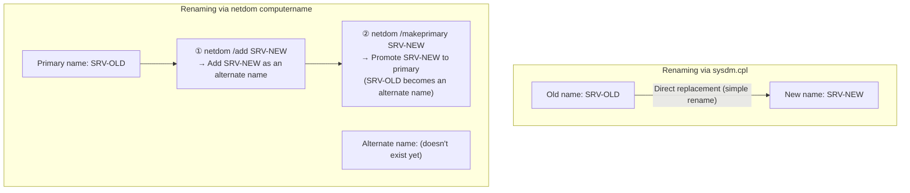

## Introduction

- **What You'll Learn From This Article**: There are two ways to rename a Windows computer — through System Properties (`sysdm.cpl`), and through the `netdom computername` command — and this article explains how each one actually achieves the rename under the hood. In particular, it digs into why taking over an existing host name requires the two-step process of "first adding it as an alternate name with `/add`, then promoting it to primary with `/makeprimary`," and what "primary host name" actually refers to in the first place. In the latter half, this knowledge is used to diagnose a real incident from an actual AD migration project: "two machines ended up with the same hostname, and logons stopped working."
- **Intended Audience**: This article is aimed at engineers who've been involved in an AD migration or domain controller swap-out involving a computer name change or handover, but who can't explain what the two-step `/add` then `/makeprimary` operation in `netdom` actually means, or what the phrase "primary host name" concretely refers to.
- **Estimated Reading Time**: About 18 minutes

This article is part of the [Top 1% Series' full article guide](/en/sitemap), and the second article in the [Active Directory series](/en/sitemap#series-list). Reading the first article, [Understanding the Difference Between AD and DC, and Domains vs. Forests, from a "Top 1%" Perspective](/en/articles/ad-dc-fundamentals-guide), first will make the term "domain controller (DC)" used throughout this article easier to follow.

## Prerequisites

- **NetBIOS name and DNS host name**: A Windows computer traditionally has two kinds of names: a short (up to 15 character) **NetBIOS name**, and a **DNS host name (FQDN)** such as `hostname.example.com`. Today, the DNS host name is used for most purposes, but the NetBIOS name continues to coexist for legacy compatibility.
- **SPN (Service Principal Name)**: In Kerberos authentication, this is an identifier that binds "a service invoked under this name responds as this account." An SPN in the form `HOST/computer-name` is registered on a computer account by default.
- **Computer account**: A dedicated account (object) created in AD DS for each device that joins the domain. Like a user account, it has a password (in practice, a random value the computer itself periodically rotates automatically, by default every 30 days).
- **Secure channel**: The encrypted Netlogon-based communication channel a computer establishes by using this password to authenticate itself to a DC. The substance of a "healthy" secure channel is simply "the computer can correctly present the password AD DS has on record for it" — if AD DS's record and the computer's own locally-held record fall out of sync, the secure channel breaks. The detailed mechanics of the secure channel and the Netlogon service are covered in a separate article.

## Getting the Big Picture

### In a Nutshell

**Renaming a computer via `sysdm.cpl` is a simple rename operation — it replaces the current name with a new one, on the spot. `netdom computername`, on the other hand, relies on an entirely different mechanism — the ability for a single computer to hold multiple names (a primary name plus alternate names) — and `/makeprimary` merely switches which of those names is treated as the "main" one.** Without understanding this difference in mechanism, using `netdom` to take over an existing hostname leaves you wondering why `/add` has to come first.



## Fundamentals, Explained Thoroughly

### Renaming via sysdm.cpl: A Simple Replacement

Renaming through Control Panel's "System" → "Change computer name" (`sysdm.cpl`) is **a simple rename operation that replaces the old name with the new one, on the spot.** Internally, for a domain-joined machine, this updates the SPNs on the AD DS computer account (such as `HOST/new-name`), the DNS host record, and the NetBIOS name based on the new name, and the change takes effect after a reboot. During this operation, the old name never briefly coexists alongside the new one — **at any given moment, the computer has exactly one name.**

### Renaming via netdom computername: A Mechanism for Holding Multiple Names

`netdom computername`, by contrast, is **less a rename command and more a management command for letting a single computer hold multiple names — one primary name, plus zero or more alternate names.** Its main subcommands are:

| Subcommand | What it does |
|---|---|
| `/enumerate` | Lists the currently registered primary name and alternate names |
| `/add <name>` | Registers the given name as a new **alternate name** (the primary name doesn't change at this point) |
| `/remove <name>` | Removes an already-registered alternate name (the primary name can't be removed) |
| `/makeprimary <name>` | Promotes a name that's **already registered** (an alternate name) to become the new primary name (requires a reboot to take effect) |

Why is being able to hold multiple names useful? The typical use case is **migrating to a new server without breaking clients, applications, or scripts that call it by an old name** — for example, during server consolidation or replacement. If you're consolidating several file servers into one, registering all the old servers' names as alternate names on the consolidated server lets both a path hardcoded as `\\old-server-A\share` and one hardcoded as `\\old-server-B\share` keep working, answered by the same single new server.

### Why Does Taking Over a Name Require the Two-Step `/add` Then `/makeprimary` Process?

Here's the crux of the matter. If you want a new server to take over an existing host name (say, `SRV-OLD`), you **can't directly designate a name that hasn't yet been registered as the primary name** — for instance, running something like `netdom computername SRV-NEW /makeprimary:SRV-OLD` won't work out of the gate. This is because of a constraint: **only a name that's already been registered as an alternate name via `/add` can be promoted to primary.**

This constraint has a sound rationale. `/makeprimary` doesn't just flip a displayed label — it's an operation that **elevates the SPN and DNS registrations corresponding to that name up to a state where they actually function as the primary identity.** If any arbitrary, unregistered name could be designated as primary on the spot, you'd be switching the name that anchors authentication without first verifying that its SPN and DNS registrations had been prepared in a consistent state — risking a temporary breakdown in Kerberos authentication or DNS resolution. Requiring the two-step process — **first safely adding it as an alternate name, confirming the registration has completed, and only then promoting it to primary** — is what guarantees this consistency.

<details>
<summary>Concrete commands for the two-step process</summary>

```powershell
# Check the currently registered primary name and alternate names
netdom computername SRV-OLD /enumerate

# Add SRV-NEW as an alternate name
netdom computername SRV-OLD /add:SRV-NEW

# Promote SRV-NEW to the primary name (SRV-OLD is demoted to an alternate name at this point)
netdom computername SRV-OLD /makeprimary:SRV-NEW

# A reboot is required for this to take effect
shutdown /r /t 0
```

After the promotion, the old name `SRV-OLD` isn't automatically removed — **it remains valid as an alternate name.** If you don't want references to the old name to keep working either, you need to explicitly remove it separately with `/remove:SRV-OLD`.

</details>

### What "Primary Host Name" Actually Refers To

Given everything above, the true identity of the primary host name can be summed up as: **when a computer has multiple names registered, the "main" name — the one that serves as the basis for its default SPN (such as `HOST/<primary name>`), the one that actively registers and updates the DNS forward-lookup (A) record, and the one displayed as the "computer name" in the `hostname` command or `sysdm.cpl`.** Alternate names function as SPNs and DNS records too, but the OS itself only actively recognizes and manages one name as "my own name" — and that's exclusively the primary name.

## The View From the Top 1% Perspective

### A Real Case: A Hostname Collision After an AD Migration Broke Logons

With the above knowledge in hand, let's diagnose the following real incident that occurred during an actual AD migration project.

> After completing the migration of FSMO and related roles from DC① to DC②, DC① was joined to the domain as a client machine. After signing out and attempting to log in with the newly created domain account, the error "There are currently no logon servers available to service the logon request" appeared. DC①'s DNS settings correctly pointed to DC②'s IP address, so why couldn't it log in? Logging into DC① with a local account revealed that the server's hostname had become identical to DC②'s. Why was it possible to join the domain at all while sharing the same hostname? After changing the hostname, reverting to a workgroup, and rejoining the domain, logins worked without issue.

Here's how this trouble can be untangled step by step:

1. **DC② had most likely deliberately taken over the old DC①'s name at some point during the migration.** One standard technique in AD migrations is to first build the new DC under a different, temporary name, migrate FSMO to it, formally demote and decommission the old DC, and then rename the new DC to the old DC's name. This is a common accommodation for cases where internal applications or scripts have the old DC's name hardcoded, letting them keep connecting to the new DC without any change on their end. The renaming techniques covered earlier (`netdom computername` or `sysdm.cpl`) are exactly what gets used at this step.
2. **On the other hand, the OS-level computer name of the demoted DC① itself isn't automatically changed just by the demotion process.** Demotion is strictly the operation of removing the DC role; renaming the computer is a separate, independent operation. As a result, DC① ended up with **the exact same computer name, as a separate entity**, as the name DC② now carried after being renamed to take over DC①'s original identity.
3. **When DC① then attempted to join the domain under this state, Windows' domain-join process detects that a computer account with the same name already exists in AD DS.** In many cases, the domain-join dialog presents a prompt to the effect of "An account with this name already exists. Do you want to reuse this account?" — and if you approve it, **the password (the secure channel's shared secret) of the existing same-named computer account — in this case, the computer account belonging to DC² itself, the domain controller — gets reset and overwritten with the new value from the joining DC① side.** This is the true explanation for "it was possible to join the domain despite the identical hostname" — rather than being rejected as an error, the join succeeds by effectively **hijacking** the existing account.
4. **With DC②'s own computer-account password overwritten, DC② ends up with a mismatch between its own authentication credentials and what's recorded in AD DS, and can no longer maintain its secure channel properly.** The domain controller's own authentication and logon processing (the Netlogon service) itself becomes unstable, and logon attempts using the newly created domain account fail with the error "there are currently no logon servers available to service the logon request." The reason logins failed despite DNS correctly pointing to DC②'s IP address had nothing to do with name resolution — **it was the breakdown of the authentication infrastructure itself.**
5. The remedy actually applied — "change the hostname, revert to a workgroup, then rejoin the domain" — lines up precisely with this diagnosis. Renaming DC① resolves the name collision; reverting to a workgroup completely discards the half-broken domain-join state; and rejoining under the new, distinct name creates an entirely new computer account, separate from DC②'s. This means **DC②'s own computer account no longer gets touched going forward**, which at minimum stops the ongoing incident of "DC① keeps overwriting DC②'s password."

<details>
<summary>Note: does this operation alone "automatically" fix the damage on DC②'s side?</summary>

There's a misconception worth flagging here. Reverting DC① to a workgroup and rejoining under a new name does **not** roll DC②'s computer-account password back to "the value before it was overwritten." DC①'s side of the fix is aimed purely at "no longer touching DC②'s account going forward" — it has no effect that undoes the overwrite that already happened.

Given that, why did logons recover in this case at all? It's likely because AD DS has a mechanism for computer-account (trust-account) passwords where **not just the latest value, but the previous generation's value too, remains valid for a certain grace period.** DC②, unaware its password had been overwritten, kept attempting Netlogon authentication with the (now one-generation-old) password it holds locally, and as long as this stayed within that grace window, authentication happened to keep succeeding by coincidence. This is **strictly a temporary, incidental reprieve** — not a real fix. If you run into this kind of incident in practice, don't sit back and hope it self-heals; the reliable fix is to run `Test-ComputerSecureChannel -Repair` (or `netdom resetpwd`) on DC② itself, explicitly resynchronizing its local credentials with what AD DS has on record.

</details>

<details>
<summary>Should you ever approve reusing an existing same-named account during a domain join?</summary>

The "An account with this name already exists — do you want to reuse it?" prompt shown during a domain join is a legitimate operation in cases of intentional re-provisioning (for example, removing a device from the domain temporarily while leaving its computer account intact on the AD side, then rejoining the same device later). However, **you should always confirm whether the existing account you're about to reuse actually belongs to the device you're currently trying to join.** As in the incident above, if the existing account's true owner turns out to be a different — and currently running — domain controller, approving the reuse directly hijacks that account. In practice, whenever this confirmation dialog appears, it's worth pausing and checking Active Directory Users and Computers, or the list of domain controllers, to confirm the name isn't actually in use by some other running server.

</details>

### How to Plan a New DC's Name Takeover in Practice

The root cause of the incident above wasn't the design decision itself — "have the new DC take over the old DC's name" — but rather **the missing step of renaming the old DC's computer name to something new and unique when repurposing that old DC for another use.** When planning a migration that hands over a DC's name to a new server, the following order is essential:

1. Build the new DC under a temporary name, and complete promotion, FSMO migration, and confirmation of healthy replication
2. Formally demote the old DC through the proper procedure and remove it completely from AD DS (how to verify a demotion afterward will be covered in a later article)
3. **If you plan to repurpose the machine that was the old DC, the very first thing to do is rename its computer name to a new, unique name that it will use going forward** (don't join it to the domain yet at this point — or revert it to a workgroup first)
4. Rename the new DC to the name the old DC used to hold (via `netdom computername` or `sysdm.cpl`)
5. Join the machine renamed in step 3 to the domain again, under its new name

With this ordering, there's never a moment where the name collision could occur, so the kind of computer-account hijack incident described above structurally can't happen.

### So Which Should You Actually Use: `sysdm.cpl` or `netdom computername`?

When carrying out step 4 above — "rename the new DC to the name the old DC used to hold" — both `sysdm.cpl` and `netdom computername` end up correctly updating the computer account's SPN, DNS record, and NetBIOS name either way. **For a one-off change where you can tolerate some downtime, either tool gets you to the same result.** Even so, `netdom computername` tends to be the one recommended in practice, for two reasons:

1. **It lets you "overlap" the cutover moment**: `sysdm.cpl` performs the old-to-new swap atomically in a single reboot, so the moment that reboot completes, the old name stops responding entirely. `netdom`, by contrast, lets you register the new name as an alternate via `/add` first, creating **a window where the old name keeps working while the new name is simultaneously reachable too**. This is exactly what makes it possible to migrate client DNS caches and hardcoded application targets over to the new name gradually, with close to zero downtime.
2. **It can be run remotely, without interactive prompts**: `sysdm.cpl` assumes GUI interaction, but `netdom computername <target computer name> /add:...` lets you **explicitly name the target and run it from the command line**. For AD migrations where you're methodically renaming multiple machines, this also makes it much easier to script and automate.

In short: "either tool gets you to the same final result (SPN, DNS, and NetBIOS name all correctly updated), but `netdom` is what gives you the 'overlap' and 'automation' that migration work actually needs."

## Common Misconceptions and Pitfalls

- **Misconception 1: "netdom computername is just a more advanced rename command than sysdm.cpl"**
  netdom isn't simply a rename command — it's a management command for letting a single computer hold multiple names. `/makeprimary` is less a "rename" and more "a switch of which name is treated as primary," and this difference in mechanism is exactly why `/add` has to come first.
- **Misconception 2: "A domain join that succeeds means the computer name used was a safe, unique name"**
  A domain join can succeed even when a same-named account already exists, in the form of a "reuse" prompt. A successful join doesn't guarantee that the name was actually unique.
- **Misconception 3: "Demoting a DC automatically restores its computer name (and everything else) back to its original state"**
  Demotion only removes the DC role; other settings, including the computer name and IP address, carry over unchanged. If you're repurposing the machine, you need to make any necessary configuration changes explicitly, on your own.

## The Troubleshooting Perspective

For AD issues related to computer names, the core question to ask is: **"does the computer account in AD DS actually correspond one-to-one with the device currently claiming that name?"**

1. **A specific domain controller suddenly starts throwing a flood of Netlogon-related errors, or its secure channel keeps dropping**: Suspect that that DC's own computer-account password may have been unintentionally changed or reset. Run `Test-ComputerSecureChannel` on the affected computer to check the state of its secure channel, and `Test-ComputerSecureChannel -Repair` (or `netdom resetpwd`) to explicitly resynchronize its local credentials with what AD DS has on record. Note that `-Repair` doesn't work on a domain controller itself, though — for a DC, use `repadmin` (covered in a later article) or, if needed, rebuild the DC.
2. **A domain-join operation shows a prompt saying "an account with this name already exists"**: Don't casually approve it — always check Active Directory Users and Computers or the list of domain controllers to confirm the name isn't currently in use by some other running server (especially a domain controller).
3. **After handing a DC's name over to a new server, something breaks after the old (now-demoted) server is repurposed for another use**: Check whether the old server's computer name has actually been changed to something new (and confirm it isn't a duplicate).

### Preventive Measures and Permanent Fixes

- When handing a DC's name over to a new server, always follow the order "rename the old server first → rename the new server second → rejoin the old server if needed" — never create a moment where the name is duplicated.
- Whenever a domain join shows a prompt about "reusing an existing same-named account," always pause and confirm who the name truly belongs to.
- When demoting a DC to repurpose it for another use, include "change the computer name" as an explicit checklist item in the demotion procedure.

## Summary

- Renaming via `sysdm.cpl` is a simple replacement, while `netdom computername` relies on a mechanism that lets a single computer hold multiple names (a primary plus alternates); `/makeprimary` promotes an already-registered alternate name to primary.
- You can't directly designate an unregistered name as primary, because that would skip the safeguard of confirming SPN and DNS registration consistency before letting that name function as the primary identity.
- "Primary host name" refers to the main name the OS itself manages as "its own name" — the one that anchors the default SPN and actively registers and updates DNS records.
- Because demoting a DC doesn't automatically change its computer name, forgetting to rename an old DC before repurposing it can lead to a name collision with the new DC, and from there, a computer-account hijack incident.

**What to Keep in Mind From Today**
1. When planning a migration that hands a DC's name over to a new server, always follow the order "rename the old server first, rename the new server second."
2. If a domain join shows a prompt about "an account with this name already exists," don't reflexively approve it — always confirm who the name truly belongs to first.

## References

- [Netdom computername | Microsoft Learn](https://learn.microsoft.com/en-us/windows-server/administration/windows-commands/netdom-computername)
- [Service Principal Names (SPNs) | Microsoft Learn](https://learn.microsoft.com/en-us/windows-server/security/kerberos/service-principal-names)
- [How the Secure Channel Works | Microsoft Learn](https://learn.microsoft.com/en-us/previous-versions/windows/it-pro/windows-2000-server/bb742499(v=technet.10))
- [Rename a domain controller | Microsoft Learn](https://learn.microsoft.com/en-us/troubleshoot/windows-server/identity/rename-domain-controller)
