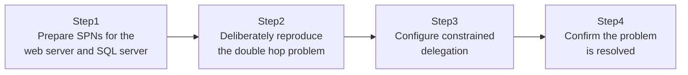

## Introduction

- **What You'll Learn From This Article**: You'll reproduce, with your own hands, an extremely common real-world problem — "a user logged into a web app, and reaching the SQL Server behind it as that same user, mysteriously fails" — known as the **double hop problem**, and feel exactly why it happens. Then you'll solve it with **Kerberos constrained delegation**, and understand why this approach is considered safe.
- **Intended Audience**: Readers who've read [Understanding Kerberos Authentication from a "Top 1%" Perspective](/en/articles/ad-kerberos-guide) but have never actually seen how "delegation" gets configured or how it behaves.
- **Estimated Reading Time**: About 25 minutes (about an hour if you build along with the hands-on)

This article is part of the [Top 1% Series Complete Article Guide](/en/sitemap), the 32nd article in the [Active Directory Series](/en/sitemap#series-list).

## Prerequisites

- [Understanding Kerberos Authentication from a "Top 1%" Perspective](/en/articles/ad-kerberos-guide): This article assumes you already know the difference between a TGT and a service ticket.
- [Understanding the SPN (Service Principal Name) Mechanism from a "Top 1%" Perspective](/en/articles/ad-spn-guide): This article assumes you already know that an SPN is registered on the account running a service.

## The Big Picture

This hands-on consists of four steps.



## Hands-On Steps

### Step 1: Set up the prerequisites for the web server and SQL server

Assume IIS is running on a server called `WebSrv`, and SQL Server is running on a server called `SqlSrv` (IIS's service account runs as the domain account `svc-web`). First, confirm SQL Server's SPN is correctly registered on the account running that service.

```powershell
setspn -L svc-sql
```

If you see an SPN like `MSSQLSvc/SqlSrv.example.com:1433`, you're set.

### Step 2: Deliberately reproduce the double hop problem

Build a web application on IIS on `WebSrv` with Windows authentication enabled, and have a user `taro` log into it from their browser. From within this web application's code, attempt to connect to SQL Server using `taro`'s own permissions, and you'll hit an error like this:

```
Login failed for user 'NT AUTHORITY\ANONYMOUS LOGON'.
```

**This is the so-called "double hop problem."** On the first hop, from the client (browser) to the web server, `taro`'s Kerberos credentials pass through correctly. But on the second hop, from the web server to the SQL server behind it, the web server cannot impersonate `taro` to reach the SQL server unless it has been explicitly permitted to "forward" `taro`'s credentials. **Kerberos is designed, by default, to never forward received identity information on to another server on its own** — so this denial is exactly the correct, intended behavior, not a bug.

### Step 3: Configure constrained delegation

To solve this, you need to explicitly register a setting in AD DS: "`WebSrv` (more precisely, the service account `svc-web` running on `WebSrv`) is permitted to reach `SqlSrv`'s SQL Service on `taro`'s behalf."

```powershell
Set-ADUser -Identity "svc-web" -Add @{"msDS-AllowedToDelegateTo" = @("MSSQLSvc/SqlSrv.example.com:1433")}
Set-ADAccountControl -Identity "svc-web" -TrustedToAuthForDelegation $true
```

**The single most important thing here is that the `msDS-AllowedToDelegateTo` attribute explicitly enumerates, one by one, exactly which destination SPNs delegation is permitted to.** `svc-web` is only permitted to impersonate `taro` toward the SQL Service listed here — it can't freely impersonate them toward any arbitrary service. This is exactly why it's called "constrained" delegation.

### Step 4: Confirm the problem is resolved

From the web application, try connecting to SQL Server as `taro` again. This time, instead of `ANONYMOUS LOGON`, you should confirm **you can log into SQL Server with `taro`'s own permissions.** Checking SQL Server's own audit log, the connecting user should now be recorded as `taro` themselves, not `svc-web`.

## What a Pro Sees Here (Top 1% Understanding)

### Why CredSSP and NTLM aren't the right fix for this problem

Search for the double hop problem, and you'll also find solutions involving CredSSP (the Credential Security Support Provider) or RDP-based delegation. But CredSSP works by temporarily holding something close to the user's actual password on the intermediate server, which tends to widen the blast radius if that intermediate server is ever compromised, compared to Kerberos constrained delegation. **What makes Kerberos constrained delegation superior is that it never relays raw, sensitive information like a password at all — it works entirely through handing off tickets issued by the KDC.** And NTLM authentication doesn't support the concept of delegation at all, so if you're hitting the double hop problem on a configuration using NTLM, the first step is to reconfigure things so Kerberos authentication is actually being used in the first place.

### The difference between constrained delegation and the newer resource-based constrained delegation

What we configured here is traditional constrained delegation, where **the delegating side (`svc-web`) registers "where it's allowed to delegate to."** Separately, Windows Server 2012 and later also support **resource-based constrained delegation**, which flips that around: **the destination side (the SQL server) registers "which accounts it will accept delegation from."** Its advantage is that the destination's administrator alone can complete the configuration, without needing administrative rights over the delegating side's domain — making it easier to support delegation across forest boundaries too. In practice, which one you choose often comes down to whether the same person or team administers both the delegating and destination sides.

## Common Misconceptions and Pitfalls

- **Misconception 1: "Once delegation is allowed, that service account can impersonate anyone toward any service in the domain."**
  Constrained delegation only permits impersonation toward services explicitly enumerated in `msDS-AllowedToDelegateTo`.
- **Misconception 2: "The double hop problem is a Kerberos misconfiguration or bug."**
  This is intentional, safe-by-design behavior, not a bug. Kerberos correctly denies credential forwarding unless it's been explicitly permitted.
- **Misconception 3: "NTLM authentication can also support delegation, as long as it's configured correctly."**
  NTLM authentication doesn't support the concept of delegation at all. Whenever delegation is required, confirm that Kerberos authentication is actually the one being used.

## Troubleshooting Perspective

1. **You configured delegation, but you're still hitting an `ANONYMOUS LOGON` error**: Check that the SPN string registered in `msDS-AllowedToDelegateTo` exactly matches the SPN actually registered on the SQL Server side.
2. **You configured delegation, but Kerberos authentication isn't actually being used at all (it's falling back to NTLM)**: Check IIS's Windows authentication provider settings, and confirm Kerberos is enabled and the SPN is registered correctly.
3. **`Set-ADAccountControl` fails to enable `TrustedToAuthForDelegation`**: Check whether you have sufficient permissions on that account, and whether the domain functional level supports constrained delegation.

## Summary

- The double hop problem occurs because the first hop, from the client to the web server, succeeds, but the second hop, from the web server to the server behind it, fails to carry the credentials forward.
- This is Kerberos's intended, safe-by-design behavior, not a bug.
- Kerberos constrained delegation lets you safely enable delegation only to explicitly permitted services.
- Compared to CredSSP, Kerberos constrained delegation has the advantage of never relaying sensitive information like a password.
- NTLM authentication doesn't support the concept of delegation at all.

**Takeaways to Apply Today**
1. When you hit an error like `ANONYMOUS LOGON`, suspect the double hop problem first.
2. When configuring delegation, enumerate only the services actually needed in `msDS-AllowedToDelegateTo`, keeping the delegation target as narrow as possible.

## References

- [Kerberos Constrained Delegation Overview | Microsoft Learn](https://learn.microsoft.com/en-us/windows-server/security/kerberos/kerberos-constrained-delegation-overview)
- [Understanding Kerberos Double Hop | Microsoft Learn](https://learn.microsoft.com/en-us/troubleshoot/windows-server/identity/new-kerberos-double-hop-solution)
