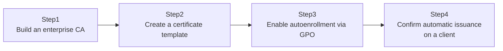

## Introduction

- **What You'll Learn From This Article**: Building on the public-key cryptography, CSR, and certificate chain knowledge from [Understanding PKI and Digital Certificates from a "Top 1%" Perspective](/en/articles/pki-guide), you'll actually build an **enterprise CA (Certificate Authority)** with **AD CS (Active Directory Certificate Services)**, create a certificate template, and experience automatically issuing certificates to domain-joined devices via GPO.
- **Intended Audience**: Readers who understand PKI theory but have never actually built an internal CA and distributed certificates from it.
- **Estimated Reading Time**: About 25 minutes (about an hour if you build along with the hands-on)

This article is part of the [Top 1% Series Complete Article Guide](/en/sitemap), the 37th article in the [Active Directory Series](/en/sitemap#series-list).

## Prerequisites

- [Understanding PKI and Digital Certificates from a "Top 1%" Perspective](/en/articles/pki-guide): This article assumes you already know public-key cryptography, CSRs, and certificate chain verification.
- [Understanding AD DS, AD CS, AD FS, AD LDS, and AD RMS from a Top-1% Perspective](/en/articles/ad-family-overview-guide): This article assumes you already know how AD CS integrates with AD DS.

## The Big Picture

This hands-on consists of four steps.



## Hands-On Steps

### Step 1: Build an enterprise CA

On a DC (or another domain-joined server), add the AD CS role.

```powershell
Install-WindowsFeature ADCS-Cert-Authority -IncludeManagementTools
Install-AdcsCertificationAuthority -CAType EnterpriseRootCA -CryptoProviderName "RSA#Microsoft Software Key Storage Provider" -KeyLength 2048 -HashAlgorithmName SHA256
```

**Specifying `EnterpriseRootCA` for `-CAType` here is the single most important point in this hands-on.** AD CS comes in two flavors: an **enterprise CA**, integrated with AD DS, and a **standalone CA**, which isn't. Only choosing an enterprise CA makes the certificate template management and GPO-based autoenrollment you're about to do possible at all.

### Step 2: Create a certificate template

Open the Certificate Templates console (`certtmpl.msc`), duplicate the existing "User" template to create a new one. On the "Security" tab, grant both "Enroll" and "Autoenroll" permissions to whoever you want to permit autoenrollment for (the `Domain Users` group, for example).

**The "Enroll" permission alone only lets a user manually request a certificate. Only adding the "Autoenroll" permission as well makes them eligible for GPO-driven automatic issuance.** Don't forget to add your new template to "Certificate Templates to Issue" from the Certification Authority snap-in (`certsrv.msc`).

### Step 3: Enable autoenrollment via GPO

Create a new GPO, and under "Computer Configuration" or "User Configuration" → "Policies" → "Windows Settings" → "Security Settings" → "Public Key Policies," open "Certificate Services Client - Auto-Enrollment," and configure it as follows.

- Configuration Model: Enabled
- Renew expired certificates, update pending certificates, and remove revoked certificates: checked
- Update certificates that use certificate templates: checked

Link this GPO to the target OU.

### Step 4: Confirm automatic issuance on a client

On a client under the target OU, apply the GPO.

```powershell
gpupdate /force
```

Open the certificate management console (`certmgr.msc`, or `certlm.msc`), and confirm that a certificate based on the template you created in Step 2 has been **automatically issued into the "Personal" store, without the user doing anything at all.**

## What a Pro Sees Here (Top 1% Understanding)

### Why only an enterprise CA makes autoenrollment possible

This autoenrollment mechanism works because **the certificate template information itself is stored in AD DS's configuration partition** — the partition shared forest-wide. Since GPO is fundamentally a mechanism that works in tandem with AD DS, this entire autoenrollment chain simply doesn't hold together for a standalone CA that isn't integrated with AD DS. **A standalone CA, in exchange for not depending on AD DS, is built around an administrator individually approving each certificate issuance — chosen for external-facing use, high-security scenarios, or anywhere integration with AD DS is deliberately avoided.**

### Certificate templates' "Enroll" and "Autoenroll": two separate permissions that look similar but aren't

A certificate template's security settings have two permissions that look alike but play different roles: "Enroll" and "Autoenroll." **"Enroll" is the permission for a user to manually request a certificate themselves through something like `certmgr.msc`; "Autoenroll" is an additional permission needed to make them eligible for GPO-driven automatic issuance.** Confuse the two and grant only "Enroll," and certificates won't be issued automatically no matter how correctly the GPO is configured.

## Common Misconceptions and Pitfalls

- **Misconception 1: "Once AD CS is built, certificates get distributed automatically."**
  Autoenrollment requires both granting the "Autoenroll" permission on the certificate template and explicit GPO configuration.
- **Misconception 2: "A standalone CA can autoenroll via GPO exactly the same way an enterprise CA can."**
  Autoenrollment is only possible with an enterprise CA integrated with AD DS.
- **Misconception 3: "Having 'Enroll' permission on a certificate template also makes you eligible for autoenrollment."**
  "Enroll" and "Autoenroll" are separate permissions — both must be explicitly granted for autoenrollment eligibility.

## Troubleshooting Perspective

1. **You configured the GPO, but certificates aren't being issued automatically**: Check whether "Autoenroll" permission is granted to the target group on the certificate template's Security tab, and whether that template has been added to the CA's "Certificate Templates to Issue."
2. **Only some clients aren't getting automatic issuance**: Check with `gpresult /r` whether the target GPO is correctly linked to that client's OU.
3. **Certificates get issued, but aren't renewed after they expire**: Check whether "Renew expired certificates" is checked in the GPO's autoenrollment settings.

## Summary

- AD CS comes in two flavors: an enterprise CA integrated with AD DS, and a standalone CA that isn't.
- Certificate autoenrollment is only possible with an enterprise CA, since certificate templates are stored in AD DS's configuration partition.
- A certificate template's "Enroll" and "Autoenroll" are separate permissions — both are needed for autoenrollment eligibility.
- Linking the GPO's "Certificate Services Client - Auto-Enrollment" setting to a target OU is what actually enables automatic issuance and renewal.

**Takeaways to Apply Today**
1. When considering internal certificate distribution, first check whether an enterprise CA plus autoenrollment can achieve it.
2. When configuring certificate template permissions, be careful not to confuse "Enroll" with "Autoenroll."

## References

- [Active Directory Certificate Services Overview | Microsoft Learn](https://learn.microsoft.com/en-us/windows-server/identity/ad-cs/active-directory-certificate-services-overview)
- [Configure Certificate Autoenrollment | Microsoft Learn](https://learn.microsoft.com/en-us/windows-server/identity/ad-cs/configure-server-certificate-autoenrollment)
