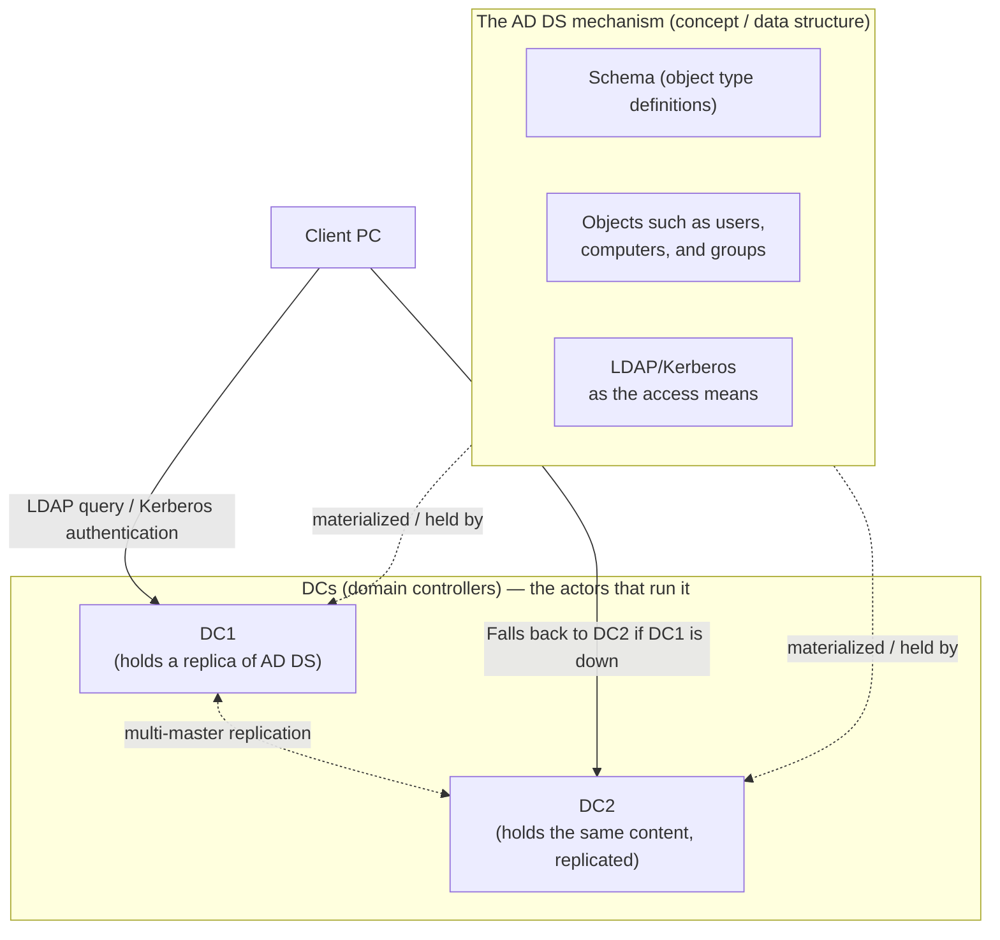
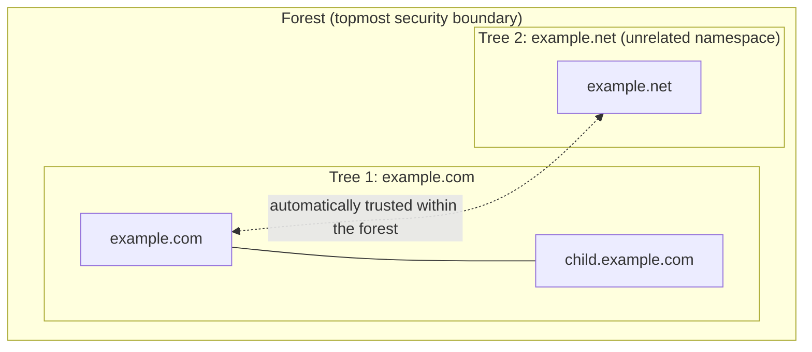
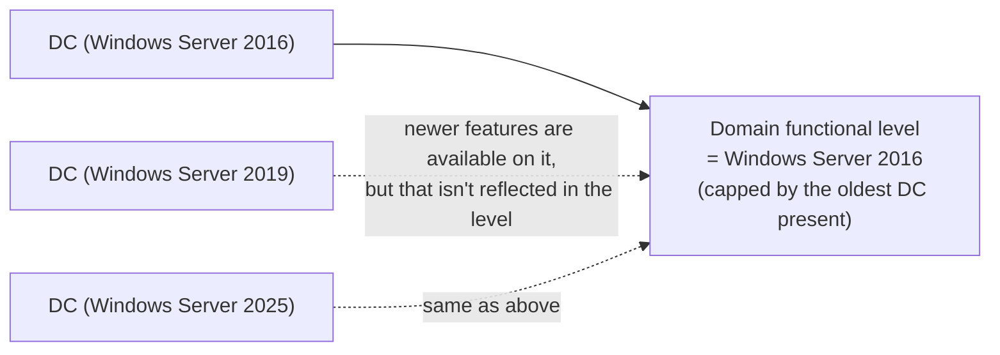

## Introduction

- **What You'll Learn From This Article**: Starting from the basic question "the difference between AD and DC never quite clicks for me in Japanese explanations" (a very common stumbling block for Japanese-speaking engineers, though the confusion itself is universal), this article systematically explains the division of labor between Active Directory Domain Services (AD DS) — a **mechanism** — and the domain controller (DC) — the **server that runs that mechanism** — what each of the three boundary layers (domain, tree, forest) actually separates, what functional levels constrain, and what the items that get installed alongside the AD DS role in Server Manager actually mean.
- **Intended Audience**: This article is aimed at engineers involved in AD migration projects or domain controller build/operation work who want to move beyond "I can follow the steps and it works" and be able to explain, in their own words, the basic terms AD and DC and the design units of forest and domain.
- **Estimated Reading Time**: About 20 minutes

This article is part of the [Top 1% Series' full article guide](/en/sitemap). It's the first article in a new series on Active Directory; upcoming articles will dig into DNS, FSMO, DC health checks, post-migration cleanup, and other topics that come up constantly in real AD migration work.

## Prerequisites

- **Directory service**: A mechanism that centrally manages information about an organization's "people and things" — users, computers, groups — as a structured, hierarchical database that can be searched and used for authentication. It's the same idea as a phone directory letting you look up a phone number from a name: AD DS lets you look up a user's attributes (group memberships, password hash, expiration date, and so on) from their username.
- **LDAP (Lightweight Directory Access Protocol)**: The standard protocol for searching, adding, modifying, and deleting entries in a directory service. AD DS accepts queries over LDAP.
- **Domains vs. workgroups**: In a workgroup, each PC holds only its own local user account information, with no central administrator. In a domain, authentication information is centralized in one place (AD DS), and every PC that has joined the domain queries that central store.
- **Kerberos authentication**: The default authentication protocol within an AD domain. This article focuses on the structure of AD DS itself, so it doesn't get into the internal workings of the authentication protocol. Its inner workings are covered thoroughly in [Understanding Kerberos Authentication from a "Top 1%" Perspective](/en/articles/ad-kerberos-guide).

## Getting the Big Picture

### In a Nutshell

**AD DS (Active Directory Domain Services) is the mechanism itself — a hierarchically structured database that centrally manages an organization's users, computers, groups, and so on, along with the query and authentication apparatus around it. A DC (domain controller) is the server that actually runs that AD DS, holds a replica of it, and responds to queries and authentication requests.** The former is a collection of mechanisms, data structures, and protocols; the latter is the physical or virtual server — the actor — that executes it.

The reason this terminology is confusing is that the word "AD" gets used ambiguously depending on context — sometimes referring to AD DS (the mechanism), sometimes to a DC (the server). From here on, this article deliberately distinguishes the two, writing "AD DS" and "DC" explicitly.

## Fundamentals, Explained Thoroughly

### What Is AD DS (Active Directory Domain Services)?

AD DS is a directory service implemented by Microsoft, based on X.500, an international standard for directory services. In substance, it's a **hierarchically structured database** organized according to a **schema** (a rulebook that defines the types of objects it can hold — users, computers, groups — and their attributes), searchable and updatable from the outside via the LDAP protocol, using Kerberos (and NTLM for compatibility) for authentication.

Understanding the schema through a concrete example

The schema is a set of definitions organized into two layers: "object types" and "attributes." For example, the `user` object type (class) defines attributes like `sAMAccountName` (logon name), `mail` (email address), and `memberOf` (group membership). When you actually create a new user in Active Directory Users and Computers, under the hood that corresponds to "generating one object that conforms to the `user` class, and writing the entered values into each of its attributes." Having a schema lets AD DS consistently enforce, at the database level, which attributes a given object type can or can't have and which attributes are required versus optional — and it guarantees that when one DC creates an object and another DC replicates it, both interpret it by the exact same rules.

The contents of this database are divided into three main **partitions** (naming contexts):

| Partition | What it holds | Replication scope |
|---|---|---|
| Domain partition | Objects belonging to that domain — users, computers, groups, and so on | Only among DCs within the same domain |
| Configuration partition | Forest-wide configuration information, including the configuration of **sites** (a physical-network grouping representing locations separated by low-bandwidth links) and the replication topology governing how replication happens between those sites | Among all DCs in the forest |
| Schema partition | The object type definitions themselves | Among all DCs in the forest |

This split — where only the domain partition stays confined to the domain, while the configuration and schema partitions are shared across the entire forest — is the key to understanding what the domain and forest boundaries discussed later actually mean.

Do you need a separate DB server, like SQL Server, to install AD DS?

No, you don't. **AD DS has its own dedicated, built-in database engine (ESE/JET, the Extensible Storage Engine), which gets set up automatically the moment you install AD DS.** In practice this database is a file called `NTDS.dit` sitting on each DC's local disk — there's no need to install a separate DB server product (like SQL Server) or configure a connection to another server at all.

This is different from how a business application (like ApexOne) separately requires Microsoft SQL Server. A business application is designed with "the application itself" and "the DB that stores its data" as separate products — since it doesn't include a DB of its own, you need to provision an RDBMS product like SQL Server on the side. AD DS, on the other hand, is designed around an assumption specific to directory-service workloads — extremely read-heavy, write-light access — and ships as a product that already bundles its own dedicated database engine, optimized for hierarchical structure (an LDAP namespace) rather than the general-purpose relational model SQL Server uses.

### What Is a DC (Domain Controller)?

A DC is a Windows Server role that holds an actual replica of the AD DS database described above and responds to LDAP queries and Kerberos authentication requests from clients. It's common to place multiple DCs within a single domain, and each DC replicates changes to the others using a scheme called **multi-master replication**. This isn't a simple master/subordinate relationship where one master handles all updates and the others just distribute read-only copies — rather, **a change made on any DC propagates out to all the other DCs** (with the exception of certain operations handled exclusively by a single DC through FSMO, which a later article covers).

The exception of RODCs (Read-Only Domain Controllers)

Besides ordinary (writable) DCs, there's also a type called an **RODC (Read-Only Domain Controller)**. An RODC holds only a read-only replica of the AD DS database and, by default, caches no password hashes at all (an administrator can designate specific accounts whose hashes may be cached). RODCs are used at sites where physical security can't be fully guaranteed (such as branch offices), so that even if the DC is stolen or compromised, the attacker can't obtain write access or the password hashes of every account.

In practice, the typical setting where an RODC gets chosen is a **branch office, factory, or retail location connected to HQ over a thin link**. These sites often lack HQ-level physical lock-and-key discipline, so the risk of unauthorized access to (or outright theft of) a server rack is relatively elevated — while there's still a desire to keep a DC locally, to keep authentication and name resolution fast within the site. With an RODC, even if it's stolen, there's no writable AD DS database or forest-wide password hashes to leak — the blast radius is limited to, at most, the password hashes of the users who routinely logged on at that site. RODCs also carry an operational benefit in environments like overseas sites, where link quality to HQ is unstable and replication delays or conflicts are more likely: since an RODC never accepts writes, there's no complex replication-conflict resolution to worry about. Unless otherwise noted, the rest of this article — and this series — assumes an ordinary, writable DC.

To summarize the relationship between the DC "server" and the AD DS "mechanism":

- AD DS can't exist without at least one DC, since there'd be no entity to hold the data
- Conversely, the DC role (server) exists purely to run the AD DS mechanism
- Therefore, the colloquial phrase "AD server" is, strictly speaking, shorthand for "a DC holding the AD DS role" — as concepts, AD DS itself and a server holding the DC role are clearly distinct

### Domain: The Boundary of Authentication and Policy

A **domain** is the smallest management unit in AD DS — a boundary that shares or isolates the following:

- A common domain partition (as noted above, holding only that domain's objects, not replicated to other domains)
- A default password policy and account lockout policy (one per domain — though "fine-grained password policies" let you set exceptions per group or user)
- A Kerberos "realm" — each domain constitutes one Kerberos authentication realm

Placing multiple DCs in a single domain just means those DCs share replicas of the same domain partition; the domain boundary itself remains singular. You split domains apart when you have requirements such as **wanting to apply different password policies per organization or site**, or **wanting a clean separation of administrative authority**.

### Trees and Forests: Namespace and Trust Relationships

**Trees** and **forests** come into play when you're dealing with multiple domains.

- **Tree**: A collection of one or more domains sharing a **contiguous DNS namespace**, such as `example.com` and its child domain `child.example.com`. Domains within the same tree are automatically joined by a two-way, transitive trust relationship (a parent-child trust).
- **Forest**: A collection of one or more trees, and **the topmost security boundary in AD DS**. Trees within a forest don't need contiguous DNS namespaces (unrelated namespaces, like `example.com` and `example.net`, can coexist as separate trees within the same forest). Every domain in a forest **shares the configuration and schema partitions** described earlier, and the root domains of the trees within a forest are also automatically joined by trust relationships.

The reason the forest is treated as the topmost boundary is that **powerful privileges affecting the entire forest — such as Schema Admins or Enterprise Admins — are only ever partitioned at the forest level.** A given domain's administrators (Domain Admins) hold strong privileges within their own domain, but can't directly manipulate objects in other domains. Schema changes (such as adding a new attribute), on the other hand, affect the entire forest, so an account holding that privilege is effectively the single most powerful entity from the perspective of any domain in the forest. **The assumption that "splitting into separate domains creates an independent security boundary" is a misconception — the real security boundary (one that fully isolates an untrusted party) is the forest**, and this is a critical premise in AD design.

What is a global catalog (GC)?

A forest typically has one or more DCs playing the role of **global catalog (GC)**. A GC holds a full, writable replica with every attribute for the domain it belongs to, while holding a **partial replica containing only a subset of commonly searched attributes** for every other domain in the forest.

A common misconception here is to think of a GC as some ad-hoc "cache of frequently-needed info jotted down in advance." In reality, the partial replica a GC holds for other domains is a **fully-fledged replica, kept continuously in sync through AD DS's ordinary replication mechanism** — not a temporary cache. Limiting it to a subset of attributes is purely a design optimization: "restrict it to just the attributes that get referenced frequently in forest-wide search scenarios, to keep the amount of data being replicated down." This lets forest-wide searches — such as "I want the email address of a user in a different domain" — be resolved with a single query to the GC, rather than querying that domain's own DCs one at a time. Confirming membership in universal groups (groups that can include members from any domain in the forest) also requires querying a GC, meaning that even a single-domain forest can, in certain steps of the logon process, require reachability to a GC. The relationship between GCs and FSMO (particularly the infrastructure master) will be covered in the article dedicated to FSMO.

### What Are Functional Levels (Domain/Forest Functional Level)?

A **functional level** controls "up to which version of AD DS functionality can be used within a given domain (or forest)." There are two kinds: the **Domain Functional Level (DFL)**, set per domain, and the **Forest Functional Level (FFL)**, set per forest.

The reason functional levels exist is simple: **a forest or domain can contain a mix of DCs running Windows Server 2012 R2 alongside DCs running Windows Server 2025.** Some newer AD DS features can't be safely enabled unless every DC is running a version capable of understanding that feature (for example, features that touch the replication mechanism itself). A functional level acts as a constraint of the form **"the functional level can only be raised as high as the oldest DC's OS version present in this domain/forest allows"** — and conversely, raising it lets you safely start using features introduced at or below that version from that point on.

To get a concrete sense of "what actually changes when you raise the functional level" in practice, here are some representative examples:

| Functional level | A change that comes up often in practice |
|---|---|
| Domain functional level: Windows Server 2008 | **Fine-Grained Password Policy** becomes available, letting you set different password policies per user or group |
| Forest functional level: Windows Server 2008 R2 | The **Active Directory Recycle Bin** can be enabled, letting you restore accidentally deleted objects (meeting the functional level alone doesn't turn it on automatically — it still needs to be explicitly enabled separately) |
| Domain functional level: Windows Server 2012 R2 | **Authentication policies and authentication policy silos** become available, letting you restrict which machines a given privileged account is allowed to log on to |

In other words, raising the functional level is really about "satisfying the prerequisite for using a new AD management or security feature" — raising it doesn't suddenly change existing behavior on its own. Raising the functional level itself must be done explicitly, via Active Directory Administrative Center or PowerShell (`Set-ADDomainMode` / `Set-ADForestMode`), and it also affects **whether older-OS DCs can be added going forward** (once you raise the level, DCs running an older OS than that level can no longer newly join). In many versions it's technically possible to lower the functional level again, but some features enabled after raising it aren't restored simply by lowering it — so in practice, it's safest to **plan the operation as a one-way decision**.

The relationship between domain functional level and forest functional level

The forest functional level can only be set to **at or below the lowest domain functional level among all domains belonging to that forest**. Conversely, a domain functional level can't be set above the forest functional level (you can't push an individual domain to a higher functional level than what the forest as a whole permits). In practice, the order of operations is: first align the domain functional levels of every domain in the forest, then raise the forest functional level.

### What Gets Installed Alongside the AD DS Role

When you select "Active Directory Domain Services" in the "Add Roles and Features" wizard in Server Manager, a confirmation dialog automatically proposes several management tools as add-ons. This is common Server Manager behavior — the wizard's "Include management tools (if applicable)" option is enabled by default, and it **proposes a full set of tools needed to manage the role you selected.** Here's a breakdown of the items commonly seen when adding AD DS:

| Item | Category | Why it's added |
|---|---|---|
| Active Directory Domain Services | Role | The actual role you wanted to install |
| File and Storage Services (Storage Services) | Role | Not an AD DS-specific dependency — it's simply **a baseline role that's always enabled by default on any Windows Server**. Once this DC is later promoted to a domain controller, it hosts the SYSVOL share (which stores Group Policy templates and scripts, and is replicated between DCs via DFSR) on top of the file-sharing mechanism this role provides |
| Group Policy Management (GPMC) | Feature | The management console for **Group Policy** (GPO, Group Policy Object) — a mechanism for bulk-distributing and enforcing OS and application settings across a domain or OU — which is one of AD DS's primary use cases. GPO's own creation/application rules and its relationship to SYSVOL are covered in more depth in [Understanding SYSVOL, DFSR, and Group Policy](/en/articles/ad-sysvol-dfsr-gpo-guide). Added as an accompanying tool when the AD DS role is selected |
| Remote Server Administration Tools → Role Administration Tools → AD DS and AD LDS Tools (AD module, Active Directory Administrative Center, AD DS Snap-Ins and Command-Line Tools, etc.) | Feature (management tools) | The standard tool set for managing this DC — and other DCs — from the GUI or PowerShell |
| .NET Framework 4.8 Features (including WCF Services and TCP Port Sharing) | Feature | Not AD DS-specific — it's a **baseline feature enabled by default** that many of Windows Server's management tools and PowerShell modules rely on as their runtime |

The key point here is **not to conflate "what's newly enabled as a result of adding the AD DS role" with "baseline functionality Windows Server already has from the start."** For items annotated above as "not an AD DS-specific dependency" (File and Storage Services, .NET Framework 4.8, and so on), those are already enabled even without AD DS installed — what's actually **newly** enabled alongside AD DS is, in practice, essentially just the Group Policy Management Console and the AD DS management tool set (RSAT).

This same role-selection screen also lists several similarly named roles carrying the "Active Directory" name — "Active Directory Certificate Services," "Active Directory Federation Services," and others. How these differ from AD DS is sorted out in [Understanding AD DS, AD CS, AD FS, AD LDS, and AD RMS](/en/articles/ad-family-overview-guide).

Why you don't need to select the DNS server on the "Server Roles" screen

At the stage of simply adding the AD DS role (the "Add Roles and Features" wizard), you don't need to separately select DNS Server functionality. That's because **the operation of actually promoting this server to a domain controller (the "Promote this server to a domain controller" wizard, launched from the notification flag in Server Manager) has its own, independent "Install DNS server" checkbox.** In many AD environments, a DC also serves as a DNS server (the reasons for this will be covered in detail in a later article on DNS), and if you select the DNS server role within that promotion wizard, the DNS server role ends up installed once the promotion completes — even if you never pre-selected DNS server at the role-selection stage. Adding it up front in the role-selection screen too causes no functional problems, but it's just redundant work, so as a rule of thumb, leave that decision to the promotion wizard.

### Baseline Features That Windows Server Has From the Start

Beyond the items noted above as "enabled by default regardless of AD DS," Windows Server has several features enabled from the start, independent of any role selection. Here are ones that commonly cause confusion when engineers browse the feature list in Server Manager and think "I don't remember enabling this":

| Feature | Role |
|---|---|
| Microsoft Defender Antivirus | Windows Server's built-in malware protection. The basic mechanism is shared with the client-edition Microsoft Defender |
| System Data Archiver | Underlying functionality for collecting and archiving system diagnostic data |
| Windows Admin Center Setup | Preparatory functionality that enables the browser-based management console, Windows Admin Center, on this server |
| Windows PowerShell (5.1) | The standard shell for management and automation. Nearly every management tool depends on it |
| Wireless LAN Service | The service that controls Wi-Fi adapters. Even on servers that never physically use Wi-Fi, this component is bundled in by default |
| WoW64 Support | The compatibility layer that lets 32-bit applications run on 64-bit Windows. The difference between x64 and x86 itself, from a practical installer-selection standpoint, is planned for a separate article |
| XPS Viewer | A viewer for documents in XPS format (XPS stands for "XML Paper Specification," a document format Microsoft devised as a competitor to PDF that preserves print layout as-is. "Microsoft XPS Document Writer," which shows up as a destination in the Print dialog, is the virtual printer that writes files out in this format — you won't run into it often in practice, but it still shows up today as the print-log format for some legacy applications and as an output format for line-of-business reporting in some systems) |

These are provided as part of Windows Server's baseline, independent of adding or removing roles — they're not "features that increased because AD DS was installed." Keeping this distinction in mind reduces the confusion of scanning Server Manager's feature list.

## The View From the Top 1% Perspective

### When a Multi-Domain, Multi-Tree Forest Is Actually Needed in Practice

For small-to-medium organizations, the simplest configuration — one forest, one tree, one domain — is almost always sufficient. Splitting into multiple domains is mainly considered in cases such as:

- **Mergers and acquisitions**: When an acquired company is already running its own independent AD environment, and immediately consolidating into a single domain isn't realistic, it's common to first let it coexist as a separate domain (or a separate forest with a cross-forest trust), then integrate it gradually
- **Regulatory or audit requirements**: When a specific business unit or dataset has password policy or audit-log retention requirements that differ substantially from the rest of the organization, requiring a clear separation of the policy boundary
- **Extreme geographic distribution and poor network quality**: When link quality or latency constraints between sites are severe enough to warrant separating the domain unit itself for replication-topology reasons (though in many cases, it's more realistic to optimize the replication topology using **sites** rather than splitting the domain)

Conversely, if the requirement is simply "we want to divide management by department," that can usually be satisfied without splitting the domain at all — using a combination of OUs (organizational units), Group Policy, and delegation of authority. It's important to recognize that **adding a domain is a costly decision that reliably increases the complexity of the entire forest** — more trust relationships to manage, a larger set of objects for the GC to replicate, and more DCs to operate. If you want to actually build a child domain and a separate tree and get hands-on confirmation of what's shared versus isolated between them, see the hands-on lab [Building a Multi-Domain, Multi-Tree AD Forest](/en/articles/ad-multidomain-handson-guide).

### What to Check Before Raising the Functional Level

Raising the functional level itself is a near-instant operation in the UI or via commands, but in practice, the trouble that most commonly arises is failing to check beforehand **whether an old DC that falls below the functional level you're about to raise to still exists somewhere in the environment.** If a DC you thought had been retired wasn't properly demoted and only lingers as an AD DS object, raising the functional level can fail outright, or appear to succeed while later surfacing inconsistencies during replication. The specific way to confirm that "all the old DCs really have been retired correctly" is covered in detail in a later article focused on DC health checks.

## Common Misconceptions and Pitfalls

- **Misconception 1: "AD and DC are just two different names for the same thing"**
  AD DS is the mechanism / data structure, and a DC is the server that runs it — these are clearly distinct conceptual layers. The colloquial phrase "AD server" is simply shorthand for "a DC holding the AD DS role."
- **Misconception 2: "Splitting into separate domains achieves complete security isolation"**
  The real security boundary is the forest. Splitting into domains still leaves forest-wide privileges — Schema Admins, Enterprise Admins — shared across them, so if you genuinely need to isolate an untrusted party, you need to separate the forest itself.
- **Misconception 3: "Raising the functional level lets even older-OS DCs use the new features as-is"**
  A functional level simply defines "the range of functionality that DCs running at least that OS version can process." You can't raise the level beyond what's possible while an older DC is still present, and once you do raise it, DCs running an OS below that level can no longer newly join.
- **Misconception 4: "One forest automatically means one tree and one domain too"**
  A forest can contain multiple trees (groups of domains with non-contiguous namespaces). The number of forests and the number of domains/trees are independent design choices.

## The Troubleshooting Perspective

Issues rooted in the structure of AD DS itself are best approached by first **isolating which boundary — domain or forest — the problem actually concerns.**

1. **An administrator account in one domain can't manipulate objects in a different domain**: This is expected behavior. A domain is an independent management boundary, and privileges don't automatically extend to other domains even within the same forest. Consider delegating the necessary operational privileges, or joining an appropriate universal group within the forest.
2. **Attributes of a user in a different domain within the forest can't be searched, or appear stale**: Check whether you're trying to search for an attribute not included in the GC's replicated attribute set, and whether GC replication is functioning correctly.
3. **Raising the functional level errors out, or succeeds but some features don't work**: Check whether an older-version DC than expected exists in the environment — particularly a "zombie DC" that was never properly demoted and lingers only as an AD DS object.

### Preventive Measures and Permanent Fixes

- Before deciding to add a domain or forest, always consider whether the requirement can be met using OUs, Group Policy, and delegation instead.
- When retiring an old DC, always go through a proper demotion procedure (the demotion wizard equivalent to `dcpromo`, or cleanup of the AD DS object after a forced removal) rather than simply shutting down or deleting the server.
- Before raising a functional level, always inventory the OS versions of every DC in the environment first.

## Summary

- AD DS (Active Directory Domain Services) is the mechanism itself that centrally manages an organization's information as a hierarchical structure; a DC (domain controller) is the server that runs it and holds a replica — these are clearly distinct conceptual layers.
- A domain is the boundary for authentication and password policy; a tree is a collection of domains sharing a contiguous namespace; a forest, which can contain multiple trees, is the topmost security boundary.
- A functional level is a domain/forest-wide feature control whose ceiling is set by the oldest DC's OS version present in the environment, and raising it should, in practice, be planned as an essentially one-way decision.
- Many of the items shown when adding the AD DS role in Server Manager aren't new AD DS-specific functionality — they're baseline features Windows Server already has, or the automatic addition of AD DS management tools (GPMC and RSAT).

**What to Keep in Mind From Today**
1. Whenever you use the phrase "AD server," consciously distinguish in your head whether you mean AD DS (the mechanism) or a DC (the server).
2. Recognize that adding a domain or forest, and raising a functional level, are both costly, essentially one-way decisions — inventory the DCs in your environment and re-confirm the requirements before executing either.

## References

- [Active Directory Domain Services Overview | Microsoft Learn](https://learn.microsoft.com/en-us/windows-server/identity/ad-ds/get-started/virtual-dc/active-directory-domain-services-overview)
- [Understanding Active Directory Domain Services (AD DS) | Microsoft Learn](https://learn.microsoft.com/en-us/windows-server/identity/ad-ds/get-started/adds-getting-started)
- [Forest Design Models | Microsoft Learn](https://learn.microsoft.com/en-us/windows-server/identity/ad-ds/plan/planning-forest-design)
- [Understanding Active Directory Domain Services (AD DS) Functional Levels | Microsoft Learn](https://learn.microsoft.com/en-us/windows-server/identity/ad-ds/active-directory-functional-levels)
- [Lightweight Directory Access Protocol (LDAP): The Protocol | RFC 4511](https://datatracker.ietf.org/doc/html/rfc4511)
