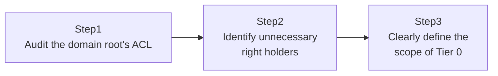

## Introduction

- **What You'll Learn From This Article**: You'll actually enumerate, from the domain root's ACL, who holds the two extended rights a technique called **DCSync** abuses — `Replicating Directory Changes` and `Replicating Directory Changes All` — and audit whether any account that shouldn't have them has slipped in. You'll then cover the idea of **Tier 0** — that accounts other than DCs which legitimately need this right (Microsoft Entra Connect, for example) must be protected with the same seriousness as Domain Admins itself. **This hands-on is for auditing and hardening your own organization's environment.**
- **Intended Audience**: Readers who've heard the words `mimikatz` and `DCSync` before, but have never actually checked which right is being abused, or how their own environment manages that right.
- **Estimated Reading Time**: About 20 minutes (about 40 minutes if you build along with the hands-on)

This article is part of the [Top 1% Series Complete Article Guide](/en/sitemap), the 43rd article in the [Active Directory Series](/en/sitemap#series-list).

## Prerequisites

- [The Top 1% Hands-On for Delegating OU Control to the Help Desk](/en/articles/ad-delegation-handson-guide): This article assumes you already know that a delegated permission is really just an ACE on an ACL.

## What DCSync Actually Abuses in the First Place

Replication, which keeps AD DS's data synchronized across multiple DCs, is a foundational mechanism of AD DS, covered in [Understanding Sites: Teaching AD About Physical Distance](/en/articles/ad-sites-guide). To perform this replication, a DC holds two extended rights on the domain root: `Replicating Directory Changes` (DS-Replication-Get-Changes) and `Replicating Directory Changes All` (DS-Replication-Get-Changes-All). **DCSync is a technique that abuses the fact that, as long as an account holds these two rights, it can behave as if it were a DC itself, request replication from another DC, and receive information — including every user's password hash — as part of what looks like an entirely legitimate replication exchange.**

## The Big Picture

This hands-on consists of three steps.



## Hands-On Steps

### Step 1: Audit the domain root's ACL

Retrieve the domain root's ACL and check who's been granted these two extended rights.

```powershell
$guid1 = "1131f6aa-9c07-11d1-f79f-00c04fc2dcd2"  # Replicating Directory Changes
$guid2 = "1131f6ad-9c07-11d1-f79f-00c04fc2dcd2"  # Replicating Directory Changes All

$acl = Get-Acl "AD:DC=example,DC=com"
$acl.Access | Where-Object { $_.ObjectType -eq $guid1 -or $_.ObjectType -eq $guid2 } | Select-Object IdentityReference, ActiveDirectoryRights
```

**By default, only Domain Admins, Enterprise Admins, and the `Domain Controllers` group that DCs themselves belong to should hold this right.** If any other account or group shows up here, always investigate why.

### Step 2: Identify unnecessary right holders

In practice, this audit may deliberately turn up the service account for **Microsoft Entra Connect (formerly Azure AD Connect).** **That's not abnormal.** Entra Connect legitimately needs this right to synchronize password hashes between on-premises AD DS and Microsoft Entra ID in the cloud. **What's concerning is an unexpected account or group holding this right, with no legitimate reason you can point to at all.** A classic example is a permission granted "temporarily" during some past troubleshooting exercise with an unclear root cause, then simply forgotten.

### Step 3: Clearly define the scope of Tier 0

Based on your audit, clearly enumerate **Tier 0** — the full set of accounts and systems that, if compromised, could lead to complete control over the entire forest.

```
Examples of Tier 0:
- Members of Domain Admins and Enterprise Admins
- Every DC
- Every service account holding Replicating Directory Changes / Changes All (Entra Connect, and so on)
- Backup software service accounts (since they can access System State backups)
```

**Accounts classified as Tier 0 should be protected with exactly the same rigor as Domain Admins itself.** Concretely, that means using dedicated accounts completely separate from anyone's day-to-day account, requiring multi-factor authentication, and restricting logon to dedicated jump servers only.

## What a Pro Sees Here (Top 1% Understanding)

### Why DCSync is "impersonating legitimate replication traffic," not an "intrusion"

The key to understanding DCSync's real nature is that it isn't exploiting some kind of security hole to "break in" — it's **simply invoking the legitimate replication protocol, using a legitimate right, through an entirely legitimate procedure.** The traffic itself, on the wire, is technically indistinguishable from normal DC-to-DC replication. **That's exactly why defending against DCSync can't be about detecting and blocking traffic — the focus has to be on rights management itself: never letting an account that shouldn't hold this right, hold it in the first place.**

### Why the Tier 0 concept goes beyond just the single box of Domain Admins

Many organizations assume "we just need to tightly manage members of the Domain Admins group." From the perspective of [Understanding Practical Server Security Measures](/en/articles/practical-server-security-measures-guide), that's not enough. **Even without membership in Domain Admins, simply holding the rights needed for DCSync can inflict damage effectively equivalent to Domain Admins itself.** Tier 0 redefines what needs protecting using a substantive criterion — "the actual blast radius if compromised" — rather than the superficial criterion of "is this account in the Domain Admins group," making it a more mature security model.

## Common Misconceptions and Pitfalls

- **Misconception 1: "DCSync is an attack that exploits some software vulnerability."**
  DCSync simply invokes the legitimate replication right and protocol through a legitimate procedure — it doesn't exploit any software vulnerability.
- **Misconception 2: "Managing only the members of the Domain Admins group means DCSync risk is under control."**
  DCSync can be carried out by anyone holding the replication rights, whether or not they're a member of Domain Admins. Auditing needs to be based on the rights themselves.
- **Misconception 3: "An Entra Connect service account holding this right is always a sign of a problem."**
  Entra Connect legitimately needs this right. What matters is finding a right holder you can't account for.

## Troubleshooting Perspective

1. **Your audit turned up an unfamiliar account**: Check with stakeholders what that account is used for, and whether it's even tied to a system that's still actively running.
2. **After removing a right, a legitimate service stopped working**: Before removing anything, always identify whether a service like Entra Connect legitimately needs that right.
3. **You're not sure how to decide the scope of Tier 0**: Judge each account and system individually against the question: "if this were compromised, would the entire forest be put at risk?"

## Summary

- DCSync is a technique that abuses two extended rights: `Replicating Directory Changes` and `Replicating Directory Changes All`.
- Beyond DCs themselves, a legitimate service like Entra Connect can also need this right.
- Defending against DCSync focuses on properly managing the rights themselves, not detecting traffic.
- Tier 0 redefines what needs protecting based on the actual blast radius of compromise, not the superficial criterion of Domain Admins membership.

**Takeaways to Apply Today**
1. Periodically audit the domain root's ACL for who holds the replication rights.
2. Keep accounts classified as Tier 0 completely separate from anyone's day-to-day account.

## References

- [Implementing Least-Privilege Administrative Models | Microsoft Learn](https://learn.microsoft.com/en-us/windows-server/identity/ad-ds/plan/security-best-practices/implementing-least-privilege-administrative-models)
- [Microsoft Entra Connect: Password Hash Synchronization | Microsoft Learn](https://learn.microsoft.com/en-us/entra/identity/hybrid/connect/how-to-connect-password-hash-synchronization)
