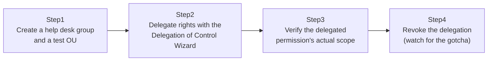

## Introduction

- **What You'll Learn From This Article**: This hands-on solves an extremely common real-world request — "I want help desk staff to be able to reset passwords, but I'm afraid to hand them Domain Admins" — using **Delegation of Control**. You'll use the Delegation of Control Wizard to grant a non-admin group password-reset-only rights, scoped to one specific OU, and confirm that permission works only within the scope you intended. We'll also cover a real-world gotcha you'll hit the moment you want to revoke a delegation.
- **Intended Audience**: Readers who've never tried splitting up permissions more finely than just adding more people to Domain Admins.
- **Estimated Reading Time**: About 20 minutes (about 45 minutes if you build along with the hands-on)

This article is part of the [Top 1% Series Complete Article Guide](/en/sitemap), the 31st article in the [Active Directory Series](/en/sitemap#series-list).

## Prerequisites

- [The Difference Between AD, DCs, Domains, and Forests](/en/articles/ad-dc-fundamentals-guide): This article already alludes to this hands-on's content, noting that "for a requirement as simple as splitting management by department, an OU plus Group Policy plus delegation of control is usually enough."

## The Big Picture

This hands-on consists of four steps.



## Hands-On Steps

### Step 1: Create a help desk group and a test OU

Create the group that will receive the delegated permission, the OU that defines its scope, and a test user.

```powershell
New-ADGroup -Name "HelpdeskStaff" -Path "DC=example,DC=com" -GroupScope Global
New-ADUser -Name "helpdesk1" -Path "DC=example,DC=com" -Enabled $true -AccountPassword (ConvertTo-SecureString "P@ssw0rd123!" -AsPlainText -Force)
Add-ADGroupMember -Identity "HelpdeskStaff" -Members "helpdesk1"

New-ADOrganizationalUnit -Name "SalesOU" -Path "DC=example,DC=com"
New-ADUser -Name "salesuser1" -Path "OU=SalesOU,DC=example,DC=com" -Enabled $true -AccountPassword (ConvertTo-SecureString "P@ssw0rd123!" -AsPlainText -Force)
```

**`helpdesk1` is just an ordinary user — not a member of Domain Admins or any other special group.** From here, we'll add exactly enough permission for password resets within `SalesOU`, nothing more.

### Step 2: Delegate rights with the Delegation of Control Wizard

Open `dsa.msc` (Active Directory Users and Computers), right-click `SalesOU`, and choose "Delegate Control." Walk through the wizard as follows.

1. Specify `HelpdeskStaff` as the group to delegate to.
2. From the list of tasks, check only "Reset user passwords and force password change at next logon."
3. Finish.

**Notice that a similar-but-different item, "Unlock a locked-out user account," sits right next to password reset in that list.** These are actually two separate permissions — delegating only one doesn't grant the other. Assuming "if I can reset passwords, I must also be able to unlock accounts" is a common real-world misconception.

### Step 3: Verify the delegated permission's actual scope

Log in as `helpdesk1` and try resetting the password for `salesuser1` inside `SalesOU`.

```powershell
Set-ADAccountPassword -Identity "salesuser1" -Reset -NewPassword (ConvertTo-SecureString "NewP@ss456!" -AsPlainText -Force)
```

**This should succeed.** Now run the same command against a user outside the delegated scope — say, another user directly under `DC=example,DC=com`. **This time, it should fail with Access Denied.** This confirms the delegated permission is precisely limited to the `SalesOU` scope.

Go further and try an operation other than a password reset, such as deleting `salesuser1` itself. That fails with Access Denied too. **This confirms that only the specific delegated task — resetting a password — is permitted, and every other operation is still denied by default.**

### Step 4: Revoke the delegation (watch for the gotcha)

When you want to revoke `HelpdeskStaff`'s delegated permission, the first instinct most people have is "I'll just run the Delegation of Control Wizard again." **But the Delegation of Control Wizard has no feature for revoking a permission at all.** It's a one-way tool — it can only add permissions.

To revoke a delegation, open `SalesOU`'s properties, go to the "Security" tab (if it's not visible, enable "Advanced Features" from `dsa.msc`'s "View" menu first), and manually find and remove the access control entry granted to `HelpdeskStaff`.

```powershell
# Checking the ACL directly with PowerShell
Get-Acl "AD:OU=SalesOU,DC=example,DC=com" | Select-Object -ExpandProperty Access | Where-Object { $_.IdentityReference -like "*HelpdeskStaff*" }
```

## What a Pro Sees Here (Top 1% Understanding)

### A delegated permission is really just one ACE added to the OU's ACL

What the Delegation of Control Wizard is actually doing is **adding a single ACE (access control entry) to the `SalesOU` object's ACL (access control list), granting the `HelpdeskStaff` group one specific extended right — in this case, "reset password."** The wizard is nothing more than a GUI-based convenience layer over this otherwise fairly involved ACL operation. Once you understand that, it's no surprise the wizard has no "undo" feature, and it becomes natural to reach for `dsacls` or `Get-Acl` to inspect and manipulate the ACL directly.

### Why delegate control instead of handing out Domain Admins

This is how the principle of least privilege, covered in [Understanding Practical Server Security Measures from a "Top 1%" Perspective](/en/articles/practical-server-security-measures-guide), gets put into concrete practice within AD DS. What a help desk staffer actually needs, day to day, is usually nothing more than the ability to reset a password. Hand them Domain Admins instead, and if that account is ever compromised, the entire forest is at risk. Scoping permissions down to exactly what that person needs is the basic building block of real-world security design.

## Common Misconceptions and Pitfalls

- **Misconception 1: "Delegating password-reset rights also lets someone unlock a locked-out account."**
  These are two separate permissions. If you need both, check both boxes in the wizard.
- **Misconception 2: "To revoke a delegation, just run the wizard again."**
  The Delegation of Control Wizard has no revoke feature. You have to manually remove the ACE from the Security tab.
- **Misconception 3: "Delegating permission on an OU extends that permission to the entire domain containing it."**
  By default, a delegated permission is scoped to that OU and the objects beneath it only.

## Troubleshooting Perspective

1. **An operation you thought you delegated still gets denied**: Check whether you checked the correct task in the wizard (password reset and unlock are separate), and whether you delegated on the right OU.
2. **You want to check what's currently delegated**: Check `SalesOU`'s Security tab (with Advanced Features enabled), or run `dsacls "OU=SalesOU,DC=example,DC=com"` to see the current ACL.
3. **You fully revoked a delegation, but the old permission still seems to apply**: Group-membership-based permissions can take a moment to reflect, until that user logs off and back on to refresh their token.

## Summary

- The Delegation of Control Wizard lets you delegate a specific operation, scoped to a specific OU, to a non-admin group — without ever handing out Domain Admins.
- "Reset password" and "unlock account" are separate permissions; delegate both explicitly if you need both.
- A delegated permission is really just one ACE added to the OU's ACL — the wizard is a convenience layer over that.
- The Delegation of Control Wizard has no revoke feature; revoking one is a manual operation from the Security tab.

**Takeaways to Apply Today**
1. When a request comes in to "give the help desk Domain Admins," consider whether delegation of control can achieve the same thing instead.
2. When you delegate a permission, record what you delegated (the group, the OU, the task) somewhere, in case you need to revoke it later.

## References

- [Delegate Administration | Microsoft Learn](https://learn.microsoft.com/en-us/windows-server/identity/ad-ds/plan/delegating-administration)
- [dsacls | Microsoft Learn](https://learn.microsoft.com/en-us/windows-server/administration/windows-commands/dsacls)
