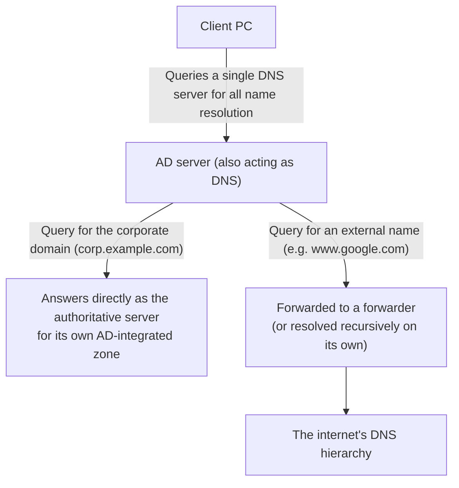
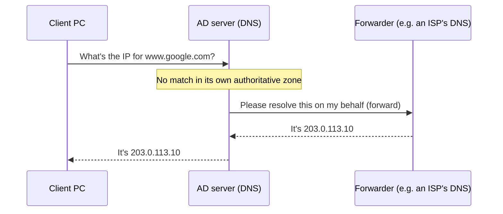

## Introduction

- **What You'll Learn From This Article**: Starting from a common real-world symptom — "`ping 8.8.8.8` succeeds, but browsing the internet doesn't work" — this article systematically explains DNS design specific to AD environments: why a DC so often doubles as a DNS server, why Windows doesn't automatically fall back to a secondary DNS server when the primary can't resolve a name, and why a DC's own DNS setting is often recommended to point at `127.0.0.1` rather than its own real IP address.
- **Intended Audience**: This article is aimed at engineers involved in building and operating AD environments who can't concretely explain DNS forwarder configuration, the actual behavior when multiple DNS servers are registered, or the reasoning behind AD-specific DNS design choices.
- **Estimated Reading Time**: About 20 minutes

This article is part of the [Top 1% Series' full article guide](/en/sitemap), and the fourth article in the [Active Directory series](/en/sitemap#series-list). General DNS mechanics — recursive resolvers, authoritative servers, caching and TTL — are covered in [Understanding How DNS Works from a "Top 1%" Perspective](/en/articles/dns-guide); this article builds on that foundation and focuses specifically on DNS design unique to AD environments.

## Prerequisites

- **Recursive resolvers and authoritative servers**: A recursive resolver queries the root, then TLD servers, then authoritative servers in sequence on the client's behalf; an authoritative server gives the official answer for the zone it manages. See [Understanding How DNS Works from a "Top 1%" Perspective](/en/articles/dns-guide) for details.
- **AD-integrated zones**: A method of storing DNS zone data (the set of records) inside the AD DS database rather than in a conventional zone file. This lets the zone data itself replicate to multiple DCs via AD DS's own replication mechanism.
- **Dynamic DNS Update**: A mechanism by which a client or server automatically registers and updates the record for its own hostname and IP address with the DNS server (RFC 2136).

## Getting the Big Picture

### In a Nutshell

**A DNS server in an AD environment plays two roles at once on a single machine: for the corporate domain, it's the official answerer (an authoritative server); for everything else, it's a broker (a recursive resolver) that hands the query off to someone else (a forwarder, or its own recursion).** Keeping this dual role in mind makes it much easier to spot the cause of "partial breakage" symptoms — where internal names resolve fine but internet names don't, for example.

## Fundamentals, Explained Thoroughly

### Why a DC So Often Doubles as a DNS Server

AD DS relies heavily on DNS throughout its internal workings. There are two main reasons:

1. **DC locator functionality depends on DNS SRV records**: The mechanism by which a client finds "where's the DC for this domain" (DC locator) is implemented by querying DNS for special SRV records like `_ldap._tcp.dc._msdcs.<domain-name>` (the detailed structure of this zone will be covered in a later article). In other words, if DNS isn't functioning properly, a client can't even find a DC in the first place.
2. **Unifying dynamic updates with replication via AD-integrated zones**: On startup, a DC dynamically registers a large number of records about itself with DNS — the SRV records mentioned above, plus host records. If the DC itself also hosts the DNS server role, and the zone is AD-integrated, replication of these records **piggybacks on AD DS's own multi-master replication**, eliminating the need to separately configure and manage zone transfers between DNS servers. In addition, AD-integrated zones support **secure dynamic updates** (only Kerberos-authenticated clients/computers can update their own records), which is more secure than dynamic updates against a conventional zone file.

For these reasons, many AD environments don't run DNS server functionality on an independent, dedicated server — instead, they commonly **have the DCs themselves double as DNS servers.**

### What a Forwarder Is: The True Explanation Behind "ping 8.8.8.8 Works, But I Can't Search"

When queried about a name outside the corporate domain (such as `www.google.com`), an AD-integrated DNS server broadly has two options:

- **Resolve it recursively on its own**: As explained in [Understanding How DNS Works from a "Top 1%" Perspective](/en/articles/dns-guide), this means working through the hierarchy starting from the root servers.
- **Forward it to a forwarder**: Rather than resolving it itself, it simply **forwards** the query as-is to a specific, pre-configured DNS server (such as an ISP's DNS server or a public DNS service), and relays whatever result comes back straight to the client.

In practice, it's common for firewall policy not to allow direct queries to the root servers (over UDP/TCP port 53), so configuring a forwarder is the typical setup. In DNS Manager, you can specify one or more forwarding destination IP addresses under the target server's properties, on the "Forwarders" tab.

Let's diagnose the following real-world symptom with this in mind.

> A PC couldn't search the internet. Running `ping 8.8.8.8` from the command prompt got a response, but internet searches still didn't work. Access to the DNS server itself appeared to be working.

This symptom is precisely explained by a misconfigured forwarder. **`ping 8.8.8.8` simply sends an ICMP packet to a directly specified IP address, and never goes through DNS name resolution at all.** In other words, the fact that this ping succeeded only proves that "the route to the internet itself (routing) is alive" — it has **nothing to do with whether DNS is functioning correctly.** A browser search (accessing something by name, like `www.google.com`), on the other hand, always requires DNS name resolution. If this AD server's **forwarder configuration is broken** (an invalid forwarding IP address, or communication to that IP blocked by a firewall, and so on), resolution of external names alone will fail across the board. **Resolution of names within the corporate domain (the range this DNS server can answer directly as the authoritative server) will keep working normally**, which is entirely consistent with the observation that "access to the DNS server itself appeared to be working" — in reality, the DNS server itself was reachable, but that DNS server **couldn't obtain a correct answer for external names.**

Conditional forwarding: combining forwarders and root hints

DNS Manager also has a **conditional forwarding** feature that forwards queries for a specific domain name (say, `partner.example.com`) to a specific forwarder. This is used when name resolution needs to work between two organizations' AD environments — for example, over a site-to-site VPN, or when a trust relationship has been established between two ADs. When troubleshooting forwarder issues, it's worth checking not just regular forwarder settings but also whether any conditional forwarders are misconfigured.

### Why Doesn't Primary/Secondary DNS Fail Over Automatically?

Windows network adapter settings let you specify up to two DNS servers (preferred/alternate). A common question here is: "when the main (preferred) DNS server fails to resolve a name, why doesn't it automatically try the secondary (alternate) DNS server?"

The short answer is: **this is intentional.** To understand why, you need to distinguish between two fundamentally different kinds of "failure" a DNS client can encounter.

| Kind of failure | Client behavior | Reason |
|---|---|---|
| **No response comes back at all (timeout)** | After waiting a certain amount of time, it queries the alternate (secondary) DNS server | It's safe to conclude the server is completely down, or the network is unreachable, so failover is a reliable operation |
| **A response does come back, but it's not what was wanted (NXDOMAIN, or an unintended/incomplete answer)** | **It doesn't query the alternate DNS server.** It accepts whatever response came back as the final result | The client has no way to determine whether that response is "a genuinely correct, authoritative answer" or "an incorrect answer caused by a server-side misconfiguration" |

The forwarder misconfiguration case above falls squarely into the latter category. The DNS server itself is responding normally (only its forwarding destination is wrong — the server process itself is alive), so from the client's perspective, this isn't a timeout — some response did come back — and it never automatically switches to the alternate DNS server.

**The idea that "when the main DNS server can't resolve a name, it should automatically ask the sub DNS server" sounds convenient at first glance, but in practice, it's a deliberate design decision that it's better not to do this.** If a client could freely hop to a different DNS server just because it didn't like the content of a response, **which DNS server's answer gets trusted for the same name would vary by circumstance, making name resolution results unpredictable.** Also, if a client treated a case where an authoritative server correctly answers "this domain doesn't exist (NXDOMAIN)" as a "failure" and asked yet another server, it could end up ignoring a genuinely correct "doesn't exist" answer and searching endlessly. The preferred/alternate DNS mechanism is strictly **a failover mechanism for judging whether the responding server itself is available — not a mechanism for deciding the correctness of a response's content by majority vote or plausibility checking.** Getting this distinction exactly right matters.

### Why It's Recommended to Point a DC at 127.0.0.1 Instead of Its Own Real IP Address

You'll sometimes hear the advice that an AD server (DC)'s own DNS setting "should point at the loopback address `127.0.0.1` rather than its own real IP address as the primary DNS server." The reasoning behind this advice includes the following:

- **Simplifying startup-time dependencies**: During a DC's boot sequence, the Netlogon service dynamically registers a number of records about itself, including the SRV records mentioned earlier. If it's configured to look up its own real IP address as the DNS server for this, timing issues in that DC's own network stack or DNS service initialization can sometimes make this lookup unstable during startup. Pointing it at `127.0.0.1` (loopback) instead is a way to more reliably ensure that **"ask my own DNS service first" holds regardless of the overall network stack's initialization state.**
- **Avoiding circular dependencies in multi-DC environments**: If DC-A's primary DNS points at DC-B's real IP, and DC-B's primary DNS points at DC-A's real IP, then during maintenance where both DCs reboot at the same time, a circular dependency can arise — "DC-A's startup depends on DC-B's DNS, and DC-B's startup depends on DC-A's DNS" — potentially destabilizing the boot sequence. If each DC relies on itself (`127.0.0.1`) first, this kind of mutual dependency can't occur.

There's another angle of caution around the 127.0.0.1 approach too

On the other hand, Microsoft has also officially published caveats about configuring `127.0.0.1` as a DNS server, from a different angle. **If a DC's DNS setting always points at itself (loopback), then when that DC's own DNS server functionality degrades partially — not a complete outage, but something like inconsistent zone data or a specific record responding incorrectly — the opportunity for a client (including the DC itself) to detect that degradation and automatically fail over to a healthy DC's DNS is lost.** Given the "as long as the primary responds, it won't switch to the secondary" behavior described earlier, always querying yourself carries the side effect of **making it harder to detect degradation in your own DNS via your own failover behavior.**

A practical middle ground is to **always specify another, healthy DC's real IP address as the secondary DNS.** This ensures that if your own DNS service ever stops completely, the client can correctly time out and fail over to the secondary (though, as noted, this doesn't guarantee detection of partial degradation — it's insurance against a full outage). In small environments, using `127.0.0.1` as primary is widely used and often causes no significant practical problems, while in large-scale, high-availability environments, it's recommended to account for this side effect and supplement it with separate health monitoring of the DNS server itself.

### What `ipconfig /registerdns` Actually Does

A client (or the DC itself) automatically re-registers and refreshes the record for its own hostname and IP address on a default schedule of roughly every 24 hours. `ipconfig /registerdns` is a command that **redoes this dynamic DNS update right now, without waiting for that automatic refresh.**

It's true that right after changing DNS settings (such as the DNS server's IP address), manually deleting or fixing a DNS record, or changing an IP address, "waiting for the next automatic update will eventually settle things into a correct state." However, there's a practical gap in the meantime: **the old (or missing) DNS record information stays in place until that automatic update actually runs.** Understanding `ipconfig /registerdns` as a practical command for confirmation and recovery — one that eliminates this waiting period and immediately reflects the change in DNS — makes it much easier to judge when to reach for it.

## The View From the Top 1% Perspective

### The Risk of a Single-DNS-Server Setup

Given the primary/secondary behavior covered above, it follows that **an AD environment with effectively only one DNS server (a single-DC environment, or one where the DNS server role is concentrated on a single DC) always carries the risk of being a single point of failure.** If that DC's DNS service stops completely, the client will time out and try to fall back to the secondary — but if there's no secondary candidate to begin with, there's nothing to fail over to. In practice, it's strongly recommended to run at least two DCs, each also holding the DNS server role, for the sake of availability.

### Redundancy and Selection of Forwarders

You can usually register multiple IP addresses for forwarders too. But just like the primary/secondary behavior above, this failover is fundamentally based on **"whether it responds at all,"** and this mechanism alone can't save you from a situation where one specific forwarder returns an incorrect answer (due to its own misconfiguration, or DNS cache poisoning, for example). Combining several trustworthy, independent providers (such as an ISP and a public DNS service) is a practical way to spread that risk.

## Common Misconceptions and Pitfalls

- **Misconception 1: "If ping succeeds, everything about that server (or route) is working correctly"**
  `ping` is nothing more than an ICMP reachability check, and has nothing to do with whether DNS or other higher-layer application protocols are functioning correctly. A ping to a directly specified IP address, in particular, never goes through DNS at all.
- **Misconception 2: "If the primary DNS is broken, Windows will automatically switch to the secondary"**
  As long as a server responds at all (even with incorrect content), Windows's DNS client accepts that response as the final result and doesn't switch to the secondary. Failover only kicks in when there's no response at all (a timeout).
- **Misconception 3: "Setting 127.0.0.1 as the DNS eliminates all DNS-related trouble"**
  Pointing at 127.0.0.1 has the benefit of simplifying startup-time dependencies, but it also carries the side effect of making it harder to detect partial degradation of your own DNS service. Always specify another, healthy DC as the secondary.

## The Troubleshooting Perspective

For DNS problems in an AD environment, the rule of thumb is to **first isolate whether internal-domain name resolution or internet name resolution is the one failing.**

1. **Both internal and external name resolution fail**: Check whether the DNS server the client is querying is reachable at all (confirm with `nslookup`, explicitly specifying the DNS server's IP), and whether the DNS server's service is actually running.
2. **Only internal domain name resolution succeeds, and only external name resolution fails (the ping scenario in this article)**: Check the DNS server's forwarder configuration — whether the forwarding IP address is valid, and whether traffic to it is being blocked by a firewall.
3. **Name resolution is unstable only on a specific DC**: Check whether that DC's DNS setting specifies another healthy DC as the secondary. If not, that single DC's own DNS degradation directly affects it.
4. **A DNS record was fixed, but the change isn't reflected**: In addition to clearing the client-side cache (`ipconfig /flushdns`), run `ipconfig /registerdns` on the affected machine to reflect the change immediately, without waiting for the automatic refresh.

### Preventive Measures and Permanent Fixes

- Run at least two DCs, each also holding the DNS server role, and have them designate each other as secondary DNS.
- Register multiple, independent forwarder providers to avoid relying on a single forwarder.
- Maintain separate health monitoring of the DNS server itself (service uptime, response validity) rather than relying solely on client-side failover.

## Summary

- A DC so often doubles as a DNS server because DC locator functionality depends on DNS SRV records, and AD-integrated zones let record replication piggyback on AD DS's own replication.
- "`ping 8.8.8.8` works, but I can't search" is a classic example of a symptom caused by the fact that ping never goes through DNS at all while a browser search always does — and it's most often caused by a misconfigured forwarder.
- As long as the primary DNS responds at all, Windows won't automatically switch to the secondary DNS, even if that response's content is wrong. Failover only kicks in when there's no response at all.
- Pointing a DC's own DNS setting at `127.0.0.1` simplifies startup-time dependencies, but it also carries the side effect of making it harder to detect degradation in your own DNS — always specify another, healthy DC as the secondary.

**What to Keep in Mind From Today**
1. When you run into "ping works, but a specific feature doesn't," remember that ping proves nothing about the health of that protocol layer (such as DNS, at a higher layer).
2. When reviewing DNS server settings in an AD environment, always confirm that both the primary and secondary actually point at two separate, healthy DCs.

## References

- [DNS Support for Active Directory Domain Controller Location | Microsoft Learn](https://learn.microsoft.com/en-us/troubleshoot/windows-server/networking/dns-support-for-active-directory-domain-controller-location)
- [Configure a DNS server to use forwarders | Microsoft Learn](https://learn.microsoft.com/en-us/troubleshoot/windows-server/networking/configure-dns-server-to-resolve-names-for-hosts-on-other-dns-server)
- [Dynamic Updates in the Domain Name System (DNS UPDATE) | RFC 2136](https://datatracker.ietf.org/doc/html/rfc2136)
- [The Case Against Using 127.0.0.1 as a DNS Server Address on Windows DNS Servers | Microsoft AskDS Blog](https://learn.microsoft.com/en-us/archive/blogs/askds/the-case-against-using-127-0-0-1-as-a-dns-server-address-on-windows-dns-servers)
- [ipconfig | Microsoft Learn](https://learn.microsoft.com/en-us/windows-server/administration/windows-commands/ipconfig)
