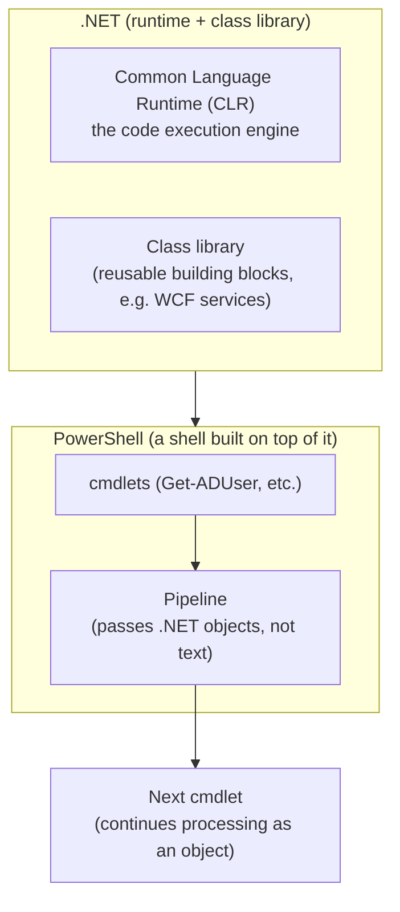

## Introduction

- **What you'll get from this article**: [Understanding AD vs. DC, and Domains vs. Forests](/en/articles/ad-dc-fundamentals-guide) mentioned that "adding the AD DS role brings .NET Framework 4.8 features along as a baseline feature enabled by default," but never explained why that's connected to managing AD with PowerShell. This article systematically covers the relationship between .NET Framework (a set of runtime and class libraries) and PowerShell (a shell/scripting language built on top of it), PowerShell's design philosophy of passing **objects, not text**, through its pipeline — unlike most other shells — and why and how the two lineages, Windows PowerShell 5.1 and PowerShell 7, differ.
- **Intended audience**: Readers who use PowerShell commands like `Get-ADUser` regularly, but can't explain how the term ".NET Framework" relates to the PowerShell they're using.
- **Estimated reading time**: About 16 minutes

This article is part of the [Top 1% Series — Full Article Guide](/en/sitemap), and the 22nd entry in the [Active Directory series](/en/sitemap#series-list). Reading [Understanding AD vs. DC, and Domains vs. Forests](/en/articles/ad-dc-fundamentals-guide) first will make this article easier to follow.

## Prerequisite Knowledge

- **Features that accompany the AD DS role**: Covered in [Understanding AD vs. DC, and Domains vs. Forests](/en/articles/ad-dc-fundamentals-guide) — the behavior where adding the AD DS role in Server Manager brings along the Group Policy Management Console and .NET Framework 4.8 features, among other things.
- **The big picture of terms like runtime, library, SDK, and API**: A general sort-out of these terms themselves is covered in [What Is a Framework?](/en/articles/software-framework-guide). This article zooms in on "runtime (execution engine)" specifically and digs even deeper, using .NET Framework as the concrete example.

## Getting the Big Picture

### In a nutshell

**.NET Framework is a set of an "execution engine (runtime)" and "common building blocks (class library)" for running applications on Windows, and PowerShell is a command-line shell and scripting language built on top of that .NET Framework functionality.** When you run a PowerShell command (a cmdlet) like `Get-ADUser`, what actually comes back isn't a plain string — it's a .NET **object**. This object-oriented pipeline is the single biggest design characteristic that fundamentally sets PowerShell apart from traditional text-based shells like bash.

## Deep Dive into the Fundamentals

### What an "execution engine (runtime)" concretely is

This is the single hardest point to grasp, so let's separate it from "software"/"an application" using concrete examples, all the way through.

**Most of what you'd normally call "an application" — a file like `notepad.exe`** — is a file that already contains the exact machine-code instructions the CPU can run directly. Windows just loads this file into memory and tells the CPU "start executing from here"; the CPU then interprets and executes the file's contents directly. No special "execution engine" beyond the OS is needed at all here.

**A .NET-based application (a PowerShell cmdlet, or a compiled .NET program) is a completely different story.** What's actually written inside these files isn't machine code the CPU can run directly — it's **IL** (Intermediate Language), a CPU-independent, "half-finished" form of code. IL, on its own, can't make the CPU do anything. This is exactly where the **CLR** (Common Language Runtime) — a runtime, or execution engine — comes in. The CLR's specific job is to **translate the IL being executed into real machine code for that specific machine (that specific CPU), on the spot, as it goes** (JIT compilation, or Just-In-Time compilation).

In other words, **if "the application" is the contents of the file — the blueprint of what should run — then "the execution engine (runtime)" is the craftsperson who reads that blueprint and, on the spot, translates it into a form the CPU can actually carry out, running the whole show.** A .NET-based program can't get the CPU to execute anything at all, literally, unless the CLR craftsperson is present. That's the core reason ".NET Framework, an execution engine, needs to be separately installed and enabled on Windows." The class library is like a toolbox of prebuilt tools this craftsperson (the CLR) draws on while working — a different role from the execution engine itself. A command-line shell (PowerShell or cmd.exe) is one of the applications built on top of all of this — the "front desk" through which a human types commands to operate it.

### What .NET Framework is: a runtime plus a class library

**.NET Framework** is a Windows-only software execution platform that first appeared in 2002. It's made up of two major pieces. One is the **CLR** (Common Language Runtime), the engine that actually executes written code. The other is a **class library** — a set of prebuilt building blocks for things like file operations, network communication, XML processing, and WCF services (a mechanism for communication between distributed applications) that a huge range of applications need in common. Instead of writing these building blocks from scratch, application developers just call the ones .NET Framework already provides. The behavior touched on in [Understanding AD vs. DC, and Domains vs. Forests](/en/articles/ad-dc-fundamentals-guide) — "adding the AD DS role enables .NET Framework 4.8 features alongside it" — happens because many of the AD DS-related management tools and PowerShell modules rely on this .NET Framework class library as their runtime foundation.

.NET Framework 4.8 is "the last major version"

Microsoft has explicitly stated that .NET Framework, ending with 4.8 (2019) and 4.8.1 (2022), won't receive any further major feature additions. Microsoft's development focus has shifted entirely to **.NET** (formerly .NET Core), the open-source, cross-platform successor covered below. Even so, .NET Framework will continue shipping with Windows and continue receiving fixes for security and reliability. Since a great many existing applications and management tools, built for Windows over many years, still run on .NET Framework today, it's best understood not as "a finished, obsolete technology," but as "a foundation whose feature development has stopped, but which remains in active use."

### The essence of PowerShell: a pipeline that carries objects, not text

In a traditional shell like Linux's `bash`, when you pipe (`|`) the output of one command into the next, what gets passed is **just a string of text**. The receiving command has to parse that string itself — typically using regular expressions — to extract whatever information it needs.

PowerShell takes a fundamentally different approach. What a cmdlet like `Get-ADUser` returns is the **.NET object itself, with its attributes, before it's ever formatted into a string.** The next cmdlet can access that object's attributes (properties) directly, by name. For example, `Get-ADUser -Filter * | Where-Object {$_.Enabled -eq $false}` retrieves every AD user, then filters down to only those whose `Enabled` attribute is `$false` — with no string parsing involved anywhere. This "hand it off as an object" design is a direct consequence of the fact that PowerShell is built on top of .NET.

### Windows PowerShell 5.1 vs. PowerShell 7: two different lineages

Today, PowerShell you encounter in practice falls broadly into two lineages:

- **Windows PowerShell 5.1**: The version built into Windows by default (`powershell.exe`), built on top of the traditional **.NET Framework**. It receives no further new-feature development — it's in a maintenance phase (security fixes and the like).
- **PowerShell 7**: A separately installed version with its own executable, `pwsh.exe`, built on top of **.NET** (formerly .NET Core), the successor to .NET Framework. It's the cross-platform successor, running on Windows as well as Linux and macOS, and is the current focus of development.

Can the ActiveDirectory module be used from PowerShell 7?

In the past, using an older module deeply dependent on .NET Framework functionality — like the `ActiveDirectory` module — from PowerShell 7 required going through the **Windows PowerShell Compatibility** feature (a mechanism that automatically spins up a hidden Windows PowerShell 5.1 process in the background and relays commands to it via implicit remoting). Today, many major modules, including `ActiveDirectory`, have been updated to be natively compatible with PowerShell 7, so this compatibility layer doesn't need to be top-of-mind nearly as often as it used to. That said, some older third-party modules still only work through that compatibility layer.

## What Top-1% Engineers See

### How to triage a "PowerShell is slow / not working" report

When fielding a PowerShell trouble report, the first thing a top-1% engineer checks is **"which lineage of PowerShell this is actually happening in."** Running `$PSVersionTable` immediately shows you `PSVersion` and `PSEdition` (`Desktop` means the Windows PowerShell 5.1 line, `Core` means the PowerShell 7 line). Even the same script can have subtly different available syntax and module behavior depending on whether it's running under Windows PowerShell 5.1 (.NET Framework) or PowerShell 7 (.NET) — investigating without first making this distinction can lead you to suspect the wrong thing entirely.

## Common Misconceptions and Pitfalls

- **Misconception 1: ".NET Framework and PowerShell are just two names for the same thing."**
  .NET Framework is a general-purpose execution platform for running applications on Windows, used far beyond PowerShell — for ASP.NET web applications, among many other things. PowerShell is just one of many applications built using .NET Framework's functionality.
- **Misconception 2: "Installing PowerShell 7 automatically replaces Windows PowerShell 5.1."**
  PowerShell 7 is an independent product, installed side by side, with its own separate executable (`pwsh.exe`) and installation location, distinct from Windows PowerShell 5.1. Installing PowerShell 7 leaves the standard Windows PowerShell 5.1 (`powershell.exe`) fully in place.
- **Misconception 3: "PowerShell's pipe works the same way bash's pipe does."**
  A bash pipe passes text (a string); a PowerShell pipe passes the .NET object itself. They may look similar on the surface, but their underlying design philosophies are completely different.

## Troubleshooting Perspective

PowerShell-related trouble is usually caused by confusing which lineage (Windows PowerShell 5.1 or PowerShell 7) is actually running.

1. **A script only fails in one of the two environments**: First check `$PSVersionTable` to confirm which lineage the affected environment is actually running.
2. **An older module fails to load under PowerShell 7**: That module may not be natively compatible with PowerShell 7, and might need to go through the Windows PowerShell Compatibility feature.
3. **Installing or running an AD-management PowerShell module throws an error**: Check whether the target server's .NET Framework version is too old, and whether the AD DS role's accompanying features, covered in [Understanding AD vs. DC, and Domains vs. Forests](/en/articles/ad-dc-fundamentals-guide), were correctly enabled.

### Prevention and Long-Term Countermeasures

- Make it a habit to check `$PSVersionTable` first, before anything else, whenever troubleshooting a script or module issue.
- Before writing a new script, confirm in advance which PowerShell lineage the target server will actually be running.
- Before adopting an older third-party module, check in advance whether it's natively compatible with PowerShell 7.

## Summary

- .NET Framework is a set of runtime and class libraries for running applications on Windows, and PowerShell is a shell/scripting language built on top of it.
- PowerShell's pipeline passes the .NET object itself between commands — a fundamentally different design from text-based shells like bash.
- Two independent lineages exist side by side: Windows PowerShell 5.1 (built on the traditional .NET Framework, development complete) and PowerShell 7 (built on the successor .NET, cross-platform, the current focus of development).
- .NET Framework 4.8 features get enabled alongside the AD DS role because many AD DS-related management tools and PowerShell modules rely on this .NET Framework class library as their runtime foundation.

**What to keep in mind starting today**
1. When troubleshooting anything PowerShell-related, make it a habit to check `$PSVersionTable` first to determine whether you're in Windows PowerShell 5.1 or PowerShell 7.
2. Before adopting an older third-party module, check its native compatibility with PowerShell 7.

## References

- [Differences between Windows PowerShell 5.1 and PowerShell 7.x | Microsoft Learn](https://learn.microsoft.com/en-us/powershell/scripting/whats-new/differences-from-windows-powershell)
- [Migrating from Windows PowerShell 5.1 to PowerShell 7 | Microsoft Learn](https://learn.microsoft.com/en-us/powershell/scripting/whats-new/migrating-from-windows-powershell-51-to-powershell-7)
- [.NET Framework official support policy | .NET](https://dotnet.microsoft.com/en-us/platform/support/policy/dotnet-framework)
