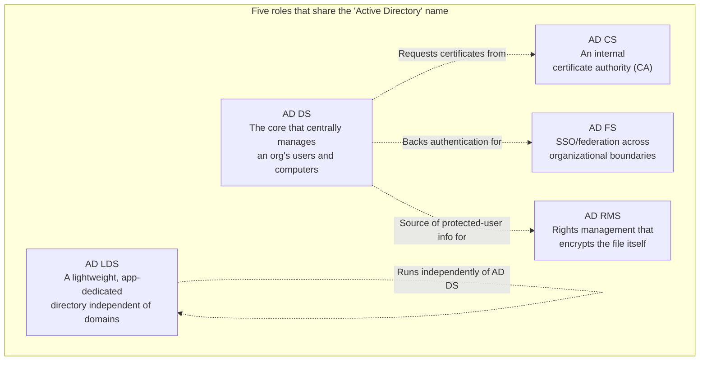

## Introduction

- **What you'll get from this article**: Open the "Add Roles" screen in Server Manager and, alongside "Active Directory Domain Services," you'll see similarly named roles: "Active Directory Certificate Services," "Active Directory Federation Services," "Active Directory Lightweight Directory Services," and "Active Directory Rights Management Services." This article systematically sorts out why these all share the "Active Directory" name despite having completely different implementations and purposes, what each one exists to do, and when you'd actually use it. It also covers where AD FS and AD RMS currently sit in Microsoft's product strategy — a practically important piece of context.
- **Intended audience**: Readers who have followed this series through AD DS (the substance of a domain controller) and now find themselves wondering, "I've seen AD CS and AD FS on the Add Roles screen before, but what actually distinguishes them from AD DS?"
- **Estimated reading time**: About 17 minutes

This article is part of the [Top 1% Series — Full Article Guide](/en/sitemap), and the 18th entry in the [Active Directory series](/en/sitemap#series-list). Reading [Understanding AD vs. DC, and Domains vs. Forests](/en/articles/ad-dc-fundamentals-guide) first will make the contrast with AD DS easier to follow.

## Prerequisite Knowledge

- **AD DS (Active Directory Domain Services)**: The core directory service this series has focused on so far, centrally managing users, computers, and groups. See [Understanding AD vs. DC, and Domains vs. Forests](/en/articles/ad-dc-fundamentals-guide) for details.
- **LDAP**: The standard protocol for searching, adding, modifying, and deleting entries in a directory service. Some of the roles covered here are built on top of this shared "common language."
- **Server Role**: A unit of functionality you can add or remove from Server Manager on Windows Server. A single server can host multiple roles, or each role can be split across dedicated servers.

## Getting the Big Picture

### In a nutshell

**The five roles that carry the "Active Directory" name aren't variations of one technology — they're five independent products that happen to share a common design philosophy and brand: directory services.** Where AD DS is "the core that manages an organization's users and computers," AD CS "issues certificates," AD FS "delivers SSO across organizational boundaries," AD LDS "hosts a lightweight, application-dedicated directory that doesn't depend on AD DS," and AD RMS "encrypts the file itself and restricts what can be done with it." Each solves an entirely different problem.

The "Active Directory" name carries strong brand equity, so Microsoft has attached it to essentially any product that applies the directory-service way of thinking. Without knowing this naming history, it's easy to look at an individual role name and mistakenly assume it's "just another extension of AD DS" — that's the real source of confusion in this area.

## Deep Dive into the Fundamentals

### AD CS (Active Directory Certificate Services): an internal certificate authority

AD CS is a role that lets you build a **Certificate Authority (CA)** for issuing and managing digital certificates used within your organization, integrated with AD DS. It lets you issue and auto-renew certificates for internal web servers, client certificates for wireless (802.1X) authentication, smart card logon certificates, and code-signing certificates — all without relying on an external commercial CA.

The biggest benefit of AD DS integration is **certificate templates** and **autoenrollment**. Through Group Policy, you can configure "automatically distribute and renew this type of certificate for every domain-joined PC," eliminating manual certificate issuance and renewal work. The typical architecture is a hierarchy of a root CA (the top-level anchor of trust, usually kept offline and tightly secured) and one or more subordinate (issuing) CAs.

### AD FS (Active Directory Federation Services): SSO across organizational boundaries

AD FS is a role that uses **claims-based authentication** to enable single sign-on (SSO) into web applications and partner-company systems outside your organization, using nothing but AD DS credentials. AD DS's Kerberos authentication, in principle, only works within the same forest (or between domains with an established trust). AD FS instead uses standard protocols like **SAML and WS-Federation** to pass along the result of AD DS authentication as a signed token called a "claim," reaching beyond the forest — and beyond the organization itself — to services such as SaaS applications.

How does AD FS differ from AD DS's forest trust?

AD DS does have a mechanism for establishing trust with another forest — a forest trust — but that mechanism only extends the range of trust **within the same Kerberos/NTLM authentication world**. AD FS, on the other hand, **converts authentication into an entirely different standard, such as SAML or OAuth/OIDC**, before handing it off outside the organization. The other party doesn't even need to be running Active Directory at all — as long as they speak SAML or OIDC, whether it's Google Workspace or an in-house web app, AD FS can federate with it.

**As a practically important note, Microsoft strongly recommends Microsoft Entra ID (formerly Azure AD) — not AD FS — as the identity foundation for new cloud scenarios.** New capabilities like conditional access, phishing-resistant multi-factor authentication, and risk-based controls are being invested in heavily on the Entra ID side; AD FS itself remains supported, but it receives essentially no new features. If you have an existing AD FS environment bridging on-premises AD and the cloud, now is a reasonable time to start considering a migration to Entra ID (or a hybrid setup using Entra Connect).

### AD LDS (Active Directory Lightweight Directory Services): a lightweight directory independent of domains

AD LDS is an LDAP-based directory service just like AD DS, but it **requires no domain or forest membership whatsoever**. It's an independent directory instance. A single server can run multiple independent AD LDS instances side by side, one per application, each with its own schema (data structure definition).

The problem this solves: "a web application needs an LDAP directory for authentication and user information, but we don't want to extend the schema of our production AD DS just for that one app, and we don't want to place a real domain controller in the DMZ either." Extending the AD DS schema is a heavyweight operation that affects the entire forest, and doing it for the sake of a single externally facing application isn't a risk worth taking. With AD LDS, you can instead provision a disposable, application-specific directory that's completely isolated from production AD DS. It's used for things like an extended-authentication directory placed in the DMZ, or giving each tenant of a multi-tenant SaaS product its own separate directory instance.

### AD RMS (Active Directory Rights Management Services): encrypting the file itself

AD RMS takes a different approach from the previous four roles: instead of controlling "who can access something," it controls "**what they're allowed to do once they have access**." It encrypts Word documents and emails and embeds rules like "viewing is allowed, but printing, forwarding, and copying are not" directly into the file. This rule travels with the file and stays in effect even after the file leaves your internal network.

**AD RMS is currently positioned as legacy in Microsoft's product strategy.** Migration to its cloud-based successor, **Microsoft Purview Information Protection** (formerly Azure Information Protection / Azure RMS), is recommended. It continues to ship with Windows Server 2025 for backward compatibility and continues to receive security fixes for the life of the OS, but no new features are planned. There's essentially no reason to build a new AD RMS environment from scratch today.

## What Top-1% Engineers See

### Why do they all carry the "Active Directory" name?

The implementations of these five roles are completely different, but what they share is that each is **built on the directory-service design philosophy and brand**. AD DS and AD LDS are both, literally, LDAP-based hierarchical directories. AD CS, AD FS, and AD RMS aren't directories themselves, but each is designed to use AD DS's user and computer information as its **root of trust** — AD CS looks up who certificates should be issued to, AD FS looks up the attributes of an authenticated user, and AD RMS looks up the list of users allowed to access a protected file, all from AD DS. This shared pattern — "use AD DS as the root of trust" — is the actual technical reason these products share a name. A top-1% engineer, on encountering an unfamiliar role name, first asks: "Is this an extension of AD DS itself, or is it a separate product that merely uses AD DS as its foundation to solve a different problem?"

Do AD CS, AD FS, and AD RMS work without AD DS?

The short answer: **only AD LDS is fully independent of AD DS — the other three (AD CS, AD FS, and AD RMS) are, in practice, built assuming AD DS is present.** That said, the strength of that dependency varies. **AD CS** can technically run in a "standalone CA" mode that doesn't join a domain, but most of what makes AD CS actually convenient — certificate template management, automatic enrollment and renewal to clients — is only available in the AD-DS-integrated "enterprise CA" mode, so there's rarely a real-world reason to choose AD CS without AD DS. **AD FS and AD RMS** are both designed to pull the user and group information they authenticate or license against directly from AD DS, making AD DS an effectively hard prerequisite for both.

## Common Misconceptions and Pitfalls

- **Misconception 1: "Installing AD FS automatically extends AD DS's functionality to the outside world."**
  AD FS is a role you must explicitly build and configure separately from AD DS — it's independent infrastructure for converting Kerberos into SAML/WS-Federation. It isn't something you gain automatically by adding it on top of AD DS.
- **Misconception 2: "AD LDS is just a stripped-down, inferior version of AD DS."**
  AD LDS isn't a subset of AD DS — it's a distinct product with characteristics AD DS doesn't have: no domain membership required, an independent schema per instance, and the ability to run multiple instances side by side on one server. The two serve different purposes; neither is strictly superior.
- **Misconception 3: "Deploying AD RMS gets you the same capabilities as Microsoft Purview Information Protection."**
  AD RMS is a legacy, on-premises-only implementation with no new features planned. If you're building an information-protection foundation from scratch today, the cloud-based Microsoft Purview Information Protection is the currently recommended path.

## Troubleshooting Perspective

For every role covered in this article, the biggest source of trouble is a misjudgment about whether it should be deployed at all.

1. **Before reflexively deploying AD CS just because "we need a certificate"**: Confirm whether the certificate is for internal use only or for an internet-facing server. Internet-facing servers should, as a rule, use certificates from a commercial CA that's already trusted by browsers by default.
2. **When asked to "let this outside contractor log in with an AD account too"**: Don't casually widen a forest trust — consider claims-based federation via AD FS (or, more modern still, Entra ID) instead. A forest trust brings the entire trusted forest into scope, which tends to grant an outside contractor a disproportionately broad amount of trust.
3. **When asked to "extend the AD DS schema just for this one application"**: First consider whether the schema extension is truly necessary, or whether provisioning an independent directory with AD LDS would be safer. Schema extensions affect the entire forest and are difficult to reverse.

### Prevention and Long-Term Countermeasures

- Before adding any new role, always separate the question into "does this extend AD DS itself, or is it an independent product merely built on top of AD DS?"
- For AD FS and AD RMS, always evaluate whether migrating to Microsoft Entra ID or Microsoft Purview Information Protection is a realistic option before building anything new.
- When told an AD DS schema extension is required, consider first whether AD LDS could serve as an alternative.

## Summary

- The roles carrying the "Active Directory" name are AD DS (the core of user/computer management), AD CS (an internal certificate authority), AD FS (SSO across organizational boundaries), AD LDS (a lightweight, domain-independent directory), and AD RMS (rights management for individual files) — five roles with completely different purposes and implementations.
- What they share is a design philosophy of using information in AD DS as a **root of trust** — that shared pattern is the actual technical basis for the shared name.
- AD FS's new-feature investment has shifted to Microsoft Entra ID, and AD RMS is legacy with migration to Microsoft Purview Information Protection recommended — decisions about building anything new should account for this current product-strategy positioning.

**What to keep in mind starting today**
1. When considering adding a new role, first separate "does this extend AD DS itself, or is it an independent product?"
2. Before building AD FS or AD RMS from scratch, check whether migrating to Entra ID or Microsoft Purview Information Protection is realistic instead.

## References

- [Active Directory Lightweight Directory Services | Microsoft Learn](https://learn.microsoft.com/en-us/previous-versions/windows/desktop/adam/active-directory-lightweight-directory-services)
- [Why Use Active Directory Lightweight Directory Services | Microsoft Learn](https://learn.microsoft.com/en-us/previous-versions/windows/desktop/adam/why-use-active-directory-lightweight-directory-services-)
- [Compare the Azure Rights Management service with AD RMS | Microsoft Learn](https://learn.microsoft.com/en-us/azure/information-protection/compare-on-premise)
- [Is ADFS End of Life? Status and Migration Path](https://www.datawiza.com/blog/adfs-migration)
