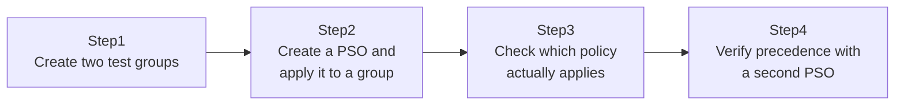

## Introduction

- **What you'll get from this article**: This hands-on actually creates and applies a **Fine-Grained Password Policy (PSO)** to overcome a long-standing AD DS limitation — that a single domain can only have one password policy. You'll apply stricter password requirements to an IT admins group and standard requirements to a general staff group, both inside the same domain, and run into the practical pitfalls that come with PSOs.
- **Intended audience**: Readers who've wished they could vary a domain's password policy by department, but only know how to edit the Default Domain Policy.
- **Estimated reading time**: About 20 minutes (about 45 minutes if you build along with the hands-on)

This article is part of the [Top 1% Series Complete Article Guide](/en/sitemap), the 29th article in the [Active Directory Series](/en/sitemap#series-list).

## Prerequisites

- **Domain functional level**: Using PSOs requires the domain functional level to be Windows Server 2008 or higher. See [The Difference Between AD, DCs, Domains, and Forests](/en/articles/ad-dc-fundamentals-guide) for details.

## Why Do We Even Need a PSO?

AD DS's password policy (password length, complexity requirements, expiration, and so on) is traditionally set in a single GPO, the Default Domain Policy, and **applies exactly once, to the entire domain.** Even if you wish "IT admin accounts specifically should require a longer password," no amount of clever OU-level GPO linking helps — password-policy settings specifically don't follow the normal GPO inheritance/precedence rules at all. **This was the constraint that frustrated many administrators before PSOs existed.** A PSO is a dedicated mechanism, separate from GPOs, built specifically to work around this constraint.

## The Big Picture

This hands-on consists of four steps.



## Hands-On Steps

### Step 1: Create two test groups

Create two global groups that will get different password requirements.

```powershell
New-ADGroup -Name "ITAdmins" -Path "DC=example,DC=com" -GroupScope Global
New-ADGroup -Name "GeneralStaff" -Path "DC=example,DC=com" -GroupScope Global
New-ADUser -Name "itadmin1" -Path "DC=example,DC=com" -Enabled $true -AccountPassword (ConvertTo-SecureString "P@ssw0rd123!" -AsPlainText -Force)
Add-ADGroupMember -Identity "ITAdmins" -Members "itadmin1"
```

### Step 2: Create a PSO and apply it to a group

Create a PSO with stricter password requirements (14-character minimum, 60-day expiration) and apply it to the `ITAdmins` group.

```powershell
New-ADFineGrainedPasswordPolicy -Name "ITAdmins-StrictPolicy" `
    -Precedence 10 `
    -MinPasswordLength 14 `
    -MaxPasswordAge "60.00:00:00" `
    -ComplexityEnabled $true `
    -PasswordHistoryCount 24

Add-ADFineGrainedPasswordPolicySubject -Identity "ITAdmins-StrictPolicy" -Subjects "ITAdmins"
```

**The most important thing to note here is that `Add-ADFineGrainedPasswordPolicySubject` only accepts a "user or global security group" as its target.** You cannot target an OU directly. If you want to manage this along your org chart's OU structure, you need a separate global group containing the OU's users — commonly called a **shadow group** — created purely for applying the PSO.

### Step 3: Check which policy actually applies

Check which password policy actually applies to the `itadmin1` user.

```powershell
Get-ADUserResultantPasswordPolicy -Identity "itadmin1"
```

If `MinPasswordLength` shows 14, the PSO is applying correctly. Running the same command against a user in the `GeneralStaff` group instead returns the standard Default Domain Policy settings, since that user isn't in a group targeted by any PSO.

### Step 4: Verify precedence with a second PSO

Apply a second PSO with different settings to the same `ITAdmins` group.

```powershell
New-ADFineGrainedPasswordPolicy -Name "ITAdmins-LenientPolicy" `
    -Precedence 5 `
    -MinPasswordLength 8 `
    -MaxPasswordAge "90.00:00:00" `
    -ComplexityEnabled $true `
    -PasswordHistoryCount 12

Add-ADFineGrainedPasswordPolicySubject -Identity "ITAdmins-LenientPolicy" -Subjects "ITAdmins"
```

Run `Get-ADUserResultantPasswordPolicy -Identity "itadmin1"` again. **`MinPasswordLength` should now show 8, not 14.** That's because `ITAdmins-LenientPolicy`'s `Precedence` value (5, not 10) is numerically smaller. **For PSOs, a lower Precedence number means higher priority.**

## What a Pro Sees Here (Top 1% Understanding)

### Don't confuse the direction of the Precedence number with GPO link order

A PSO's Precedence follows a "lower number wins" rule — a completely different rule from the intuition you'd bring from ordinary GPO link order (covered in [The Top 1% Hands-On for GPO Precedence and Troubleshooting](/en/articles/ad-gpo-handson-guide), where a child OU wins over a parent). **Unlike a GPO, a PSO exists as an independent object inside AD DS (`msDS-PasswordSettings`) and never goes through GPO inheritance/precedence rules at all.** Confusing the two leads to genuine confusion about "why doesn't this behave like a GPO?"

### A practical tip for designing PSOs

It's common in practice for the same user to belong to multiple groups that each have a PSO applied (say, both `ITAdmins` and `AllStaff`). In that case, only a single PSO — the one with the lowest Precedence number — ends up applying. **Settings from multiple PSOs are never merged together.** To avoid accidental Precedence collisions, name each PSO clearly to state its intent and space out Precedence values with room to spare (10, 20, 30, and so on), so you can slot in an intermediate-priority PSO later without renumbering everything.

## Common Misconceptions and Pitfalls

- **Misconception 1: "A PSO can be linked directly to an OU."**
  A PSO can only apply to a user or a global security group. If you want to manage it by OU, you need a shadow group.
- **Misconception 2: "Once you create a PSO, AD DS stops using the Default Domain Policy's password policy at all."**
  Any user or group not targeted by a PSO continues to use the Default Domain Policy's password policy.
- **Misconception 3: "If multiple PSOs apply to one user, the stricter setting from each is merged together and applied."**
  There's no merging. Only a single PSO — the one with the lowest Precedence number — applies.

## Troubleshooting Perspective

1. **Created and applied a PSO, but `Get-ADUserResultantPasswordPolicy` doesn't reflect it**: Confirm the target is a user or global security group, and that the user is actually a member of that group.
2. **An unexpected PSO is applying**: List every PSO that applies to each group the user belongs to with `Get-ADFineGrainedPasswordPolicy -Filter *`, and compare their Precedence values.
3. **Can't create a PSO due to a domain functional level constraint**: Check the domain functional level with `Get-ADDomain` and confirm it's Windows Server 2008 or higher.

### Prevention and Permanent Countermeasures

- Space out PSO Precedence values (in steps of 10, for example) so you can slot in an intermediate priority later.
- If you plan to manage password policy by OU, document the shadow-group operating rules clearly from the start.
- After adding a new PSO, always run `Get-ADUserResultantPasswordPolicy` against a target user to confirm the intended setting is actually applying.

## Summary

- The Default Domain Policy's password policy applies exactly once, to the entire domain — it can't be varied by OU the way ordinary GPOs can.
- A PSO (Fine-Grained Password Policy) lets you apply different password requirements per user or per global security group.
- Since a PSO can't be linked directly to an OU, managing it by OU requires a shadow group.
- When multiple PSOs apply to the same user, they are never merged — only the single PSO with the lowest Precedence number applies.

**Takeaways to apply today**
1. When a request comes in to change password requirements for just one department, consider a PSO before reaching for a GPO.
2. When designing PSOs, leave room between Precedence values.

## References

- [Fine-Grained Password Policies | Microsoft Learn](https://learn.microsoft.com/en-us/windows-server/identity/ad-ds/get-started/adac/introduction-to-active-directory-administrative-center-enhancements--level-100-)
- [New-ADFineGrainedPasswordPolicy | Microsoft Learn](https://learn.microsoft.com/en-us/powershell/module/activedirectory/new-adfinegrainedpasswordpolicy)
