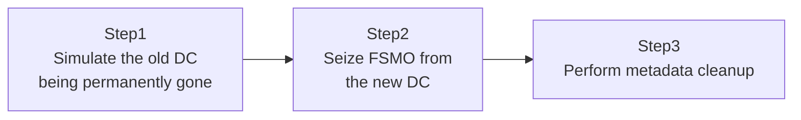

## Introduction

- **What You'll Learn From This Article**: [The Hands-On Lab for Migrating From an Old DC to a New One](/en/articles/ad-migration-handson-guide) covered the graceful, legitimate **Transfer** of FSMO roles, done while the old DC is still alive. This article covers the opposite scenario: simulating a disaster where **the old DC has been completely lost, to a hardware failure or something similarly catastrophic, and can never boot again**, you'll forcibly wrest away its FSMO roles through a **Seize**, hands-on.
- **Intended Audience**: Readers who've performed an FSMO transfer before, but have never actually tried this last-resort seize, and haven't felt firsthand how serious it is.
- **Estimated Reading Time**: About 20 minutes (about 45 minutes if you build along with the hands-on)

This article is part of the [Top 1% Series Complete Article Guide](/en/sitemap), the 34th article in the [Active Directory Series](/en/sitemap#series-list).

## Prerequisites

- [Understanding FSMO (Operations Masters) from a "Top 1%" Perspective](/en/articles/fsmo-guide): This article assumes you already know what the five FSMO roles mean, and the difference between Transfer and Seize.
- [The Hands-On Lab for Migrating From an Old DC to a New One](/en/articles/ad-migration-handson-guide): This article assumes you already know the graceful transfer procedure, which this article deliberately contrasts against.

## The Big Picture

This hands-on consists of three steps.



## Hands-On Steps

### Step 1: Simulate the old DC being permanently gone

For this hands-on, assume a DC called `OLD-DC01` has been completely lost to a hardware failure and can never boot again. In your test environment, actually shut down `OLD-DC01` and disconnect it from the network.

```powershell
Stop-Computer -ComputerName "OLD-DC01" -Force
```

**The single premise of this entire hands-on is that `OLD-DC01` absolutely will never recover.** If there's even a remaining chance `OLD-DC01` will eventually recover, you should attempt that recovery first, not seize.

### Step 2: Seize FSMO from the new DC

From the still-living `NEW-DC01`, use `ntdsutil` to seize the FSMO roles that `OLD-DC01` held.

```
ntdsutil
roles
connections
connect to server NEW-DC01
quit
seize schema master
seize naming master
seize pdc
seize rid master
seize infrastructure master
quit
quit
```

**As the word "seize" implies, this isn't a "transfer" done with the legitimate holder's cooperation — it's a forced "wresting away."** As covered in [Understanding FSMO (Operations Masters)](/en/articles/fsmo-guide), if multiple DCs end up performing these roles at the same time, serious inconsistencies in AD DS result. That's exactly why the next step is absolutely non-negotiable after a seize.

### Step 3: Perform metadata cleanup

**After seizing, `OLD-DC01` must never be reconnected to the network, ever.** If `OLD-DC01` ever came back up still believing it holds the FSMO roles, both `NEW-DC01` and `OLD-DC01` would each believe they're the one performing the same FSMO role simultaneously, causing severe inconsistency across all of AD DS. To prevent this, you completely remove `OLD-DC01`'s remaining information from AD DS with **metadata cleanup.**

```powershell
Get-ADDomainController -Filter {Name -eq "OLD-DC01"} | Remove-ADDomainController -Force
```

**This step is the single most important, and most commonly overlooked, part of the entire seize procedure.** The real-world risk concentrates less in the seize itself and more in this cleanup step — properly erasing all trace of the old DC that supposedly will never come back, from AD DS.

## What a Pro Sees Here (Top 1% Understanding)

### Why you should "attempt recovery first"

A seize is a last resort — irreversible once performed. If the old DC is merely disconnected due to a temporary network hiccup, waiting for it to come back and performing a graceful transfer is far safer. **The criterion for whether to seize isn't technical difficulty — it comes down entirely to one question: can you say with certainty that this old DC, physically or logically, will truly never recover?** Get this judgment wrong, seizing from an old DC that was actually still recoverable, and you end up exactly with the serious incident described in Step 3 — two DCs simultaneously believing they hold the same FSMO role.

### Why seizing the RID master specifically requires extra caution

Among the five FSMO roles, seizing the RID master calls for special care. The RID master distributes, to each DC, the pool of RIDs it uses to assign to newly created security principals (users, computers, and so on). **If the old DC were ever to come back to life after the RID master was seized, both the old and new DCs could end up handing out duplicate RIDs from the same pool** — potentially resulting in the catastrophic scenario of two indistinguishable security principals, effectively sharing the same SID, within the same forest. After seizing the RID master, the top-1% practice is to consider the additional safety measure covered in [Understanding FSMO (Operations Masters)](/en/articles/fsmo-guide) — deliberately invalidating the already-assigned range of the RID pool, via `Set-ADObject` with the `m:` option.

## Common Misconceptions and Pitfalls

- **Misconception 1: "Seizing is just a faster, convenient alternative to transferring."**
  Seizing is a last resort for when the old DC is completely and permanently lost. As long as the old DC is alive, always prefer a graceful transfer.
- **Misconception 2: "Once the seize completes, the work is done."**
  After seizing, you must never reconnect the old DC to the network, and performing metadata cleanup is mandatory.
- **Misconception 3: "A seized old DC can be reconnected to the network once its issue is eventually resolved."**
  Reconnecting a seized old DC to the network must always be avoided. If it needs to return, its OS must be reinstalled and it must be rebuilt as an entirely new DC.

## Troubleshooting Perspective

1. **Replication errors started happening frequently after the seize**: Check whether metadata cleanup completed correctly, with `repadmin /showrepl`.
2. **You accidentally reconnected the seized old DC to the network**: Disconnect it from the network immediately, and check the current holder of each FSMO role on both DCs with `netdom query fsmo` to confirm there's no conflict. If a conflict is found, specialized recovery steps may be necessary.
3. **The seize command itself fails**: Check whether the account running it has the necessary permissions for a seize, such as membership in Enterprise Admins.

## Summary

- Seizing is a last resort for when the old DC is completely and permanently lost — as long as it's alive, always prefer a graceful transfer.
- After seizing, you must never reconnect the old DC to the network, and metadata cleanup is mandatory.
- Additional safeguards against duplicate RID assignment are especially recommended after seizing the RID master.
- Reusing a seized old DC requires reinstalling its OS and rebuilding it as an entirely new DC.

**Takeaways to Apply Today**
1. Whenever an FSMO migration becomes necessary, rigorously ask yourself first: "will this old DC truly never recover?"
2. Make it a habit to always pair a seize with metadata cleanup, performed in the same sitting.

## References

- [Seize an operations master role | Microsoft Learn](https://learn.microsoft.com/en-us/troubleshoot/windows-server/identity/seize-or-transfer-operations-master-roles-in-ad-ds)
- [Clean up server metadata | Microsoft Learn](https://learn.microsoft.com/en-us/windows-server/identity/ad-ds/manage/remove-metadata)
