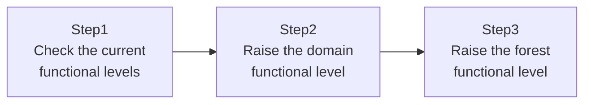

## Introduction

- **What You'll Learn From This Article**: After decommissioning the old DC in [The Hands-On Lab for Migrating From an Old DC to a New One](/en/articles/ad-migration-handson-guide), this article covers a finishing step many organizations overlook: **raising the domain functional level and forest functional level.** You'll understand what it means for this operation to be irreversible, and why every domain's functional level must be aligned before the forest functional level can be raised.
- **Intended Audience**: Readers who finished decommissioning an old DC but never got around to raising functional levels — or didn't even know this step existed.
- **Estimated Reading Time**: About 15 minutes (about 30 minutes if you build along with the hands-on)

This article is part of the [Top 1% Series Complete Article Guide](/en/sitemap), the 39th article in the [Active Directory Series](/en/sitemap#series-list).

## Prerequisites

- [The Hands-On Lab for Migrating From an Old DC to a New One](/en/articles/ad-migration-handson-guide): This article assumes you already know the full flow through decommissioning an old DC.

## The Big Picture

This hands-on consists of three steps.



## Hands-On Steps

### Step 1: Check the current functional levels

Even after decommissioning the old DC, the domain and forest functional levels don't automatically go up on their own. Check the current values.

```powershell
Get-ADDomain | Select-Object DomainMode
Get-ADForest | Select-Object ForestMode
```

**It's common to find the functional level still stuck at a low value matching the old DC's OS version, even though the old DC no longer exists.** That's because decommissioning the old DC doesn't automatically raise the functional level at all.

### Step 2: Raise the domain functional level

After confirming every DC in the target domain runs an OS version compatible with the level you're raising to, raise the domain functional level.

```powershell
Set-ADDomainMode -Identity "example.com" -DomainMode "Windows2016Domain"
```

**Pause here before running this command.** Raising the domain functional level is an **irreversible operation.** Once raised, you can never add a DC running an older OS version to that domain again. If there's even a remaining chance of a plan to add an older-OS DC in the future, hold off on running this command.

### Step 3: Raise the forest functional level

After confirming every domain in the forest has already raised its domain functional level to the target level, raise the forest functional level.

```powershell
Set-ADForestMode -Identity "example.com" -ForestMode "Windows2016Forest"
```

**Raising the forest functional level requires every domain in the forest to have already reached at least the same domain functional level you're raising to.** In a multi-domain forest, if even one domain is still stuck at a lower functional level, this command fails.

## What a Pro Sees Here (Top 1% Understanding)

### Why raising a functional level is irreversible

A functional level is essentially an AD DS-wide "agreement" that enables new features available from that level onward (Fine-Grained Password Policies, covered in [A Hands-On Lab: Applying Different Password Requirements With a PSO](/en/articles/ad-fgpp-handson-guide), assumed a Windows Server 2008-or-later functional level, for example). **Once you actually start using a new feature that the new functional level assumes, an older-version DC simply lacks the ability to process that new feature correctly at all.** So the path of lowering the functional level again to readmit an older DC is deliberately closed off. This is AD DS's own safety mechanism, protecting against breaking backward compatibility.

### Why the forest functional level acts as a "ceiling" on domain functional levels

Every domain's functional level must be aligned before raising the forest functional level, because some of the new features a forest functional level enables involve **information shared across the entire forest** — things like the configuration partition and schema partition, covered in [The Difference Between AD, DCs, Domains, and Forests](/en/articles/ad-dc-fundamentals-guide). If even one domain is left with lower-functional-level DCs while forest-wide new features get enabled, that domain's DCs could end up unable to correctly process information that's supposed to be shared across the whole forest. **Understanding that the forest functional level is, in effect, capped by the lowest domain functional level currently in the forest** makes it click why functional-level management in a multi-domain environment tends to get complicated.

## Common Misconceptions and Pitfalls

- **Misconception 1: "Decommissioning the old DC automatically raises the functional level."**
  A functional level never gets raised automatically — it requires explicitly running a command.
- **Misconception 2: "You can revert a functional level later, after raising it."**
  Raising a functional level is irreversible. If there's even a remaining chance of adding an older-OS DC in the future, hold off on raising it.
- **Misconception 3: "The forest functional level and domain functional levels can be set independently of each other."**
  Raising the forest functional level requires every domain in the forest to have already reached at least the same domain functional level.

## Troubleshooting Perspective

1. **`Set-ADDomainMode` fails**: Check whether that domain still has an older-OS DC incompatible with the level you're raising to.
2. **`Set-ADForestMode` fails**: Check whether every domain in the forest has already raised its domain functional level to the target level.
3. **A specific application stops working after raising the functional level**: Check whether that application depends on behavior specific to the older functional level. Thoroughly verifying this in a test environment before running it in production matters here.

## Summary

- Decommissioning the old DC doesn't automatically raise the functional level.
- Raising a functional level is an irreversible operation — think through future plans carefully before running it.
- Raising a domain functional level requires every DC in that domain to run a compatible OS version.
- Raising a forest functional level requires every domain in the forest to have reached the same level.

**Takeaways to Apply Today**
1. Include raising functional levels as a checklist item at the end of a DC migration project.
2. Before raising a functional level, confirm with stakeholders that there's genuinely no plan to add an older-OS DC in the future.

## References

- [Understanding Active Directory Domain Services (AD DS) Functional Levels | Microsoft Learn](https://learn.microsoft.com/en-us/windows-server/identity/ad-ds/active-directory-functional-levels)
- [Set-ADDomainMode | Microsoft Learn](https://learn.microsoft.com/en-us/powershell/module/activedirectory/set-addomainmode)
