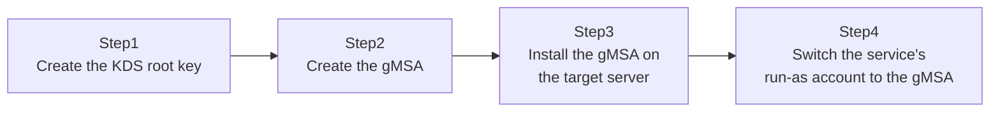

## Introduction

- **What You'll Learn From This Article**: A traditional service account has a static password that an administrator sets manually and has to periodically rotate manually. In this article, you'll build a **gMSA (group Managed Service Account)**, where **AD DS itself automatically generates the password and rotates it automatically**, and feel firsthand what it's like to be freed from the burden of managing a service account's password.
- **Intended Audience**: Readers who manage service account passwords manually, writing them down in a spreadsheet or a password manager.
- **Estimated Reading Time**: About 20 minutes (about 45 minutes if you build along with the hands-on)

This article is part of the [Top 1% Series Complete Article Guide](/en/sitemap), the 36th article in the [Active Directory Series](/en/sitemap#series-list).

## Prerequisites

- [The Top 1% Hands-On for Solving the "Double Hop Problem" With Kerberos Constrained Delegation](/en/articles/ad-constrained-delegation-handson-guide): This article assumes you already know how service accounts get used in practice.

## Why Traditional Service Accounts Were a Problem in the First Place

At many organizations, a service account named something like `svc-app` gets a fixed password set by an administrator, written down somewhere, and registered as the account a service runs under. **In many cases, this password never actually gets changed, even once the password policy's expiration date arrives.** That's because changing the password requires updating every single service configuration using that account at the same time — forget even one, and you get a service outage — so in practice, many organizations decide "if it's working, don't touch it," and the same password stays in use for years. This is a clear security risk.

## The Big Picture

This hands-on consists of four steps.



## Hands-On Steps

### Step 1: Create the KDS root key

A gMSA's password is automatically generated by AD DS itself, based on a forest-wide key called the **KDS (Key Distribution Services) root key.** If you haven't already, create exactly one for your forest.

```powershell
Add-KdsRootKey -EffectiveTime ((Get-Date).AddHours(-10))
```

**Notice that `-EffectiveTime` is specified as a time in the past.** In production, you'd normally have to wait for this KDS root key to reliably replicate out to every DC, which by default means the gMSA can't actually be used for **about 10 hours** after creation. If you want to verify this works right away in a test environment, backdating the effective time like this skips that wait entirely.

### Step 2: Create the gMSA

Create the gMSA account, scoped to the server permitted to use it (`WebSrv01` in this case).

```powershell
New-ADServiceAccount -Name "gmsa-webapp" -DNSHostName "gmsa-webapp.example.com" -PrincipalsAllowedToRetrieveManagedPassword "WebSrv01$"
```

**Only the computers (or groups) specified in `-PrincipalsAllowedToRetrieveManagedPassword` can retrieve this gMSA's current password.** Any server not listed here will fail to retrieve the password, even if you try to configure this gMSA as a service's run-as account there.

### Step 3: Install the gMSA on the target server

Log onto `WebSrv01` and make this gMSA usable there.

```powershell
Install-ADServiceAccount -Identity "gmsa-webapp"
Test-ADServiceAccount -Identity "gmsa-webapp"
```

If `Test-ADServiceAccount` returns `True`, `WebSrv01` is correctly able to retrieve this gMSA's password.

### Step 4: Switch the service's run-as account to the gMSA

Change the target Windows service's run-as account to this gMSA.

```powershell
Set-Service -Name "MyAppService" -Credential (New-Object System.Management.Automation.PSCredential ("EXAMPLE\gmsa-webapp$", (New-Object System.Security.SecureString)))
```

**The single most important thing here is that we're passing an empty password in the password field.** A gMSA's account name gets a trailing `$`, and no password is specified at all. Once Windows recognizes this account as a gMSA, it never prompts for a password — it automatically retrieves the current password from AD DS whenever it needs to authenticate. **The administrator never needs to know, or ever type, this account's actual password, at any point.**

## What a Pro Sees Here (Top 1% Understanding)

### A gMSA's password automatically rotates roughly every 30 days by default

A gMSA's password is automatically updated by AD DS itself, at the interval set in the `msDS-ManagedPasswordInterval` attribute (30 days by default). **The administrator never has to do anything for this automatic rotation, and services using the gMSA transparently switch to authenticating with the new password without ever noticing it changed behind the scenes.** This is conceptually very similar to the mechanism covered in [Understanding the Netlogon Service and the Secure Channel](/en/articles/ad-netlogon-guide), where a computer account's password rotates automatically.

### The difference between a gMSA and its older predecessor, the standalone MSA (sMSA)

Before gMSA, there was an even older mechanism called the **sMSA (standalone Managed Service Account).** sMSA shared the same idea of automatic password management, but had a major limitation: **a single sMSA account could only ever be used on one server.** gMSA's biggest advance is removing that limitation: by specifying multiple servers (or a group containing them) in `PrincipalsAllowedToRetrieveManagedPassword`, **the same gMSA can be shared across multiple servers** — a load-balanced fleet of web servers, for example.

## Common Misconceptions and Pitfalls

- **Misconception 1: "A gMSA's password can be manually reset just like an ordinary account."**
  A gMSA's password is fully and automatically managed by AD DS itself — it's never intended to be manually set or checked by an administrator.
- **Misconception 2: "A gMSA becomes usable immediately after the KDS root key is created."**
  In production, you need to wait about 10 hours by default for the KDS root key to replicate out to every DC.
- **Misconception 3: "A gMSA can only be used on one server."**
  That's the older sMSA's limitation. A gMSA can share the same account across multiple servers.

## Troubleshooting Perspective

1. **`Test-ADServiceAccount` returns `False`**: Check whether the KDS root key's propagation has completed (10 hours since creation, in production), and whether the target server is correctly listed in `PrincipalsAllowedToRetrieveManagedPassword`.
2. **The service fails to authenticate at startup**: Check whether the service's run-as account name is in the correct gMSA format, with the trailing `$` (`EXAMPLE\gmsa-webapp$`).
3. **You want to share the same gMSA across multiple servers, but only one succeeds**: Check whether the failing server is actually included in `PrincipalsAllowedToRetrieveManagedPassword`.

## Summary

- A gMSA is a service account mechanism where AD DS itself automatically generates and rotates the password.
- In production, the KDS root key needs about 10 hours to replicate out to every DC after creation.
- Only servers listed in `PrincipalsAllowedToRetrieveManagedPassword` can retrieve a gMSA's password.
- Unlike its predecessor sMSA, a gMSA can share the same account across multiple servers.

**Takeaways to Apply Today**
1. When you need a new service account, consider whether a gMSA can achieve it before reaching for the traditional approach.
2. When creating a new KDS root key in production, factor the roughly 10-hour propagation wait into your work plan.

## References

- [Getting Started with Group Managed Service Accounts | Microsoft Learn](https://learn.microsoft.com/en-us/windows-server/security/group-managed-service-accounts/getting-started-with-group-managed-service-accounts)
- [Test-ADServiceAccount | Microsoft Learn](https://learn.microsoft.com/en-us/powershell/module/activedirectory/test-adserviceaccount)
