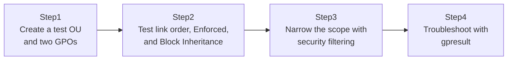

## Introduction

- **What you'll get from this article**: This turns the conceptual understanding from [Understanding SYSVOL, DFSR, and Group Policy from a "Top 1%" Perspective](/en/articles/ad-sysvol-dfsr-gpo-guide) — the GPC/GPT split — into muscle memory. You'll create several GPOs, link them, and see with your own eyes how link order, Enforced, and Block Inheritance change the effective result. We'll also cover narrowing an assignment to a specific group with security filtering, and the standard troubleshooting workflow for the very common real-world problem of "the GPO just doesn't apply," using `gpresult`.
- **Intended audience**: Readers who understand the GPO concept but can't yet confidently say which of two conflicting GPOs wins.
- **Estimated reading time**: About 25 minutes (about an hour if you build along with the hands-on)

This article is part of the [Top 1% Series Complete Article Guide](/en/sitemap), the 27th article in the [Active Directory Series](/en/sitemap#series-list).

## Prerequisites

- [Understanding SYSVOL, DFSR, and Group Policy from a "Top 1%" Perspective](/en/articles/ad-sysvol-dfsr-gpo-guide): this article assumes you already know that a GPO exists as two separate pieces — the GPC (the skeleton, inside AD DS) and the GPT (the actual data, inside SYSVOL).

## The Big Picture

This hands-on consists of four steps.



## Hands-On Steps

### Step 1: Create a test OU structure and two GPOs

First, create a parent-child OU structure and a test user inside it.

```powershell
New-ADOrganizationalUnit -Name "ParentOU" -Path "DC=example,DC=com"
New-ADOrganizationalUnit -Name "ChildOU" -Path "OU=ParentOU,DC=example,DC=com"
New-ADUser -Name "gpotest1" -Path "OU=ChildOU,OU=ParentOU,DC=example,DC=com" -Enabled $true -AccountPassword (ConvertTo-SecureString "P@ssw0rd123!" -AsPlainText -Force)
```

Next, create two GPOs whose settings conflict with each other. Here, we'll use Windows's desktop wallpaper setting as a simple example.

```powershell
New-GPO -Name "ParentOU-GPO" | New-GPLink -Target "OU=ParentOU,DC=example,DC=com"
New-GPO -Name "ChildOU-GPO" | New-GPLink -Target "OU=ChildOU,OU=ParentOU,DC=example,DC=com"
```

Open `gpmc.msc` (Group Policy Management Console) and edit each of `ParentOU-GPO` and `ChildOU-GPO` under "User Configuration → Policies → Administrative Templates → Desktop → Desktop Wallpaper," setting one to disabled (empty) and the other to a different value.

### Step 2: Test link order, Enforced, and Block Inheritance

Log in as `gpotest1`, run `gpupdate /force`, and check which setting is actually in effect. **The first thing to confirm is the basic principle: when ParentOU-GPO and ChildOU-GPO conflict, ChildOU-GPO — the one linked to the more specific, closer-to-the-leaf OU — wins.** Processing order runs "Local → Site → Domain → OU (parent to child)" — often abbreviated LSDOU — and whichever is processed last overwrites the same setting from earlier in the chain.

Next, enable **"Enforced"** on the link properties of `ParentOU-GPO`. Run `gpupdate /force` again, and **this time, instead of ChildOU-GPO's setting winning as you'd expect, the now-Enforced ParentOU-GPO's setting wins instead.** Enforced is an explicit override that reverses the normal precedence rule.

Finally, enable **"Block Inheritance"** on `ChildOU`'s properties. But confirm that as long as ParentOU-GPO's Enforced flag is still active, ParentOU-GPO's setting keeps applying even with inheritance blocked. **Block Inheritance is powerless against Enforced** — this is where you feel the full picture of how precedence actually works.

### Step 3: Narrow the scope with security filtering

A GPO is linked at the OU level, but sometimes you only want it to apply to "members of one specific group" within that OU. That's what **security filtering** is for.

```powershell
New-ADGroup -Name "GPOTargetGroup" -Path "OU=ChildOU,OU=ParentOU,DC=example,DC=com" -GroupScope Global
Add-ADGroupMember -Identity "GPOTargetGroup" -Members "gpotest1"

$gpo = Get-GPO -Name "ChildOU-GPO"
Set-GPPermission -Name "ChildOU-GPO" -TargetName "Authenticated Users" -TargetType Group -PermissionLevel None
Set-GPPermission -Name "ChildOU-GPO" -TargetName "GPOTargetGroup" -TargetType Group -PermissionLevel GpoApply
```

**The key point here is that we explicitly remove the "Apply" permission that's granted to "Authenticated Users" by default, and instead grant "Apply" only to a specific group.** Keep in mind that a GPO's link target (the OU) and the objects it actually applies to (whoever security filtering permits) are two completely separate layers.

### Step 4: Troubleshoot "the GPO doesn't apply" with `gpresult`

The single most common real-world problem is "I created and linked a GPO, but for some reason it's not taking effect." Start by running this on the affected client:

```powershell
gpresult /r /scope:user
```

This shows the list of GPOs actually applied to (and not applied to) that user. **If the GPO you're expecting doesn't show up in the "Applied Group Policy Objects" list, it isn't even reaching that user in the first place.** For a more detailed HTML report, generate one with:

```powershell
gpresult /h C:\report.html /f
```

## What a Pro Sees Here (Top 1% Understanding)

### The standard order for diagnosing "the GPO doesn't apply"

When a GPO doesn't show up under "Applied Group Policy Objects" in `gpresult`, a top-1% engineer works through the causes in this order:

1. **Is the link disabled?** Check in `gpmc.msc` whether the GPO's link is set to "Enabled."
2. **Is it excluded by security filtering?** As in Step 3, being inside the linked OU isn't enough if the object isn't in the security filtering's allowed list.
3. **Is it excluded by a WMI filter?** If the GPO has a WMI filter attached, confirm the client actually satisfies the filter's condition (OS version, etc.).
4. **Is inheritance blocked, or is the link order not what you expect?** Confirm the processing order actually matches the precedence rules from Step 2.
5. **Simple replication delay**: right after creating or changing a GPO, the GPC (AD DS side) and GPT (SYSVOL side) may not have finished replicating to every DC yet. Depending on which DC the client authenticated against, it may still be seeing the pre-change state.

Working through the causes in exactly this order reflects an accurate understanding that GPO application is decided by the product of several independent layers — link → security filtering → WMI filter → precedence — not any single one of them.

## Common Misconceptions and Pitfalls

- **Misconception 1: "Linking a GPO to an OU guarantees it applies to every user and computer under that OU."**
  Security filtering or a WMI filter can exclude objects from the assignment even when they're inside the linked OU.
- **Misconception 2: "A child OU's GPO always wins over a parent OU's GPO."**
  That's true normally, but if the parent OU's GPO link is set to "Enforced," this precedence reverses.
- **Misconception 3: "Setting Block Inheritance completely cuts off the influence of the parent OU's GPOs."**
  Block Inheritance has no effect on a parent OU's GPO that has been set to Enforced.

## Troubleshooting Perspective

1. **Edited a GPO, but it's not reaching the client**: Confirm you ran `gpupdate /force`. If it's still not reflected, suspect that GPC/GPT replication hasn't finished yet — wait, or force replication with `repadmin /syncall`.
2. **`gpresult` shows the GPO you expected under "Denied Group Policy Objects"**: Check the denial reason shown (security filtering, WMI filter, a disabled link, etc.).
3. **A different GPO's setting is winning than you expected**: Check the link order and the Enforced setting in `gpmc.msc` against the precedence rules from Step 2.

### Prevention and Permanent Countermeasures

- Standardize a GPO naming convention (e.g., including the target OU name or purpose) so anyone can tell what a GPO does just by looking at the list in `gpmc.msc`.
- Reserve Enforced for genuinely company-wide policies you never want overridden (a security baseline, for example), and avoid overusing it.
- Right after changing a GPO, always verify the actual applied result on the target client with `gpresult` before considering the change complete.

## Summary

- GPO precedence is fundamentally processed in LSDOU order (Local → Site → Domain → OU, parent to child), and whatever is processed last wins.
- "Enforced" is an explicit exception that reverses this precedence rule.
- "Block Inheritance" is powerless against a GPO that has been set to Enforced.
- A GPO's link target (the OU) and its actual scope of application (security filtering) are separate layers.
- Start diagnosing "the GPO doesn't apply" by checking the applied/denied lists with `gpresult /r`.

**Takeaways to apply today**
1. Whenever you create or change a GPO, make it a habit to confirm the actual applied result on a target client with `gpresult`.
2. Before setting Enforced, pause and consider whether you genuinely need to reverse the normal precedence order.

## References

- [Group Policy Processing and Precedence | Microsoft Learn](https://learn.microsoft.com/en-us/troubleshoot/windows-server/group-policy/group-policy-processing-precedence)
- [gpresult | Microsoft Learn](https://learn.microsoft.com/en-us/windows-server/administration/windows-commands/gpresult)
