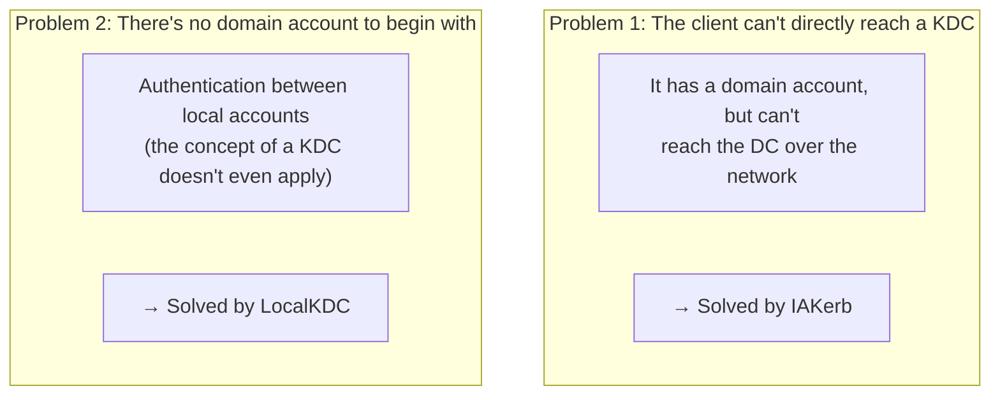
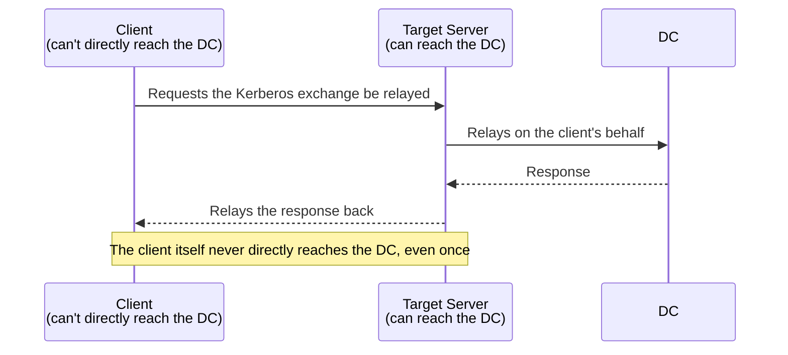

## Introduction

- **What You'll Learn From This Article**: Building on the structural problem covered in [How NTLM Authentication Works](/en/articles/ad-ntlm-mechanism-guide) — that non-domain-joined machines and workgroup environments depend on NTLM because no KDC exists for them — understand what specific problem each of two new mechanisms, rolling out starting with Windows Server 2025 and Windows 11 24H2, actually solves: **IAKerb** and **LocalKDC**. You'll also learn that the widely repeated claim "NTLM is disabled by default in Windows Server 2025" is actually inaccurate, and get NTLM's real deprecation roadmap straight.
- **Intended Audience**: Readers who understand how NTLM works and why non-domain-joined machines depend on it, but can't explain, based on current developments, how that dependency is actually going to get resolved going forward.
- **Estimated Reading Time**: About 20 minutes

This article is part of the [Top 1% Series Complete Article Guide](/en/sitemap), and article 13.2 in the [Active Directory Series](/en/sitemap#series-list). Reading [How NTLM Authentication Works](/en/articles/ad-ntlm-mechanism-guide) first is strongly recommended.

## Prerequisite Knowledge

- **Why NTLM Gets Used on Non-Domain-Joined Machines**: The structural problem covered in [How NTLM Authentication Works](/en/articles/ad-ntlm-mechanism-guide) — that a non-domain-joined machine simply has no corresponding KDC, which Kerberos is premised on.
- **Kerberos Fundamentals**: The basic AS-REQ/AS-REP and TGS-REQ/TGS-REP exchange, covered in [How Kerberos Authentication Works](/en/articles/ad-kerberos-guide).

## Getting the Big Picture

The scenarios where NTLM gets used actually split into **two distinct problems**, not one. IAKerb and LocalKDC are two separate mechanisms, each addressing a different one of these problems.

## Deep Dive Into the Fundamentals

### The Answer to Problem 1: IAKerb (Initiate and Accept Kerberos)

**IAKerb is a mechanism where, when a client has no direct network reachability to a DC to carry out a Kerberos exchange, the target server it's accessing relays that exchange with the DC on its behalf instead.** The underlying idea is close to [the KDC Proxy covered in How NTLM Authentication Works](/en/articles/ad-ntlm-mechanism-guide), but where the KDC Proxy was premised on building a dedicated server (such as an RD Gateway), **IAKerb achieves this relay as a standard feature built directly into the OS itself, requiring no dedicated server to be built at all.**

**This lets Kerberos replace NTLM in scenarios where NTLM fallback used to happen purely because of a lack of network reachability to the DC** (for example: accessing an internal resource from an outside network via a reverse proxy, rather than a VPN).

### The Answer to Problem 2: LocalKDC

**LocalKDC is a mechanism that lets Kerberos be used even for authentication between local accounts, which were never domain accounts to begin with.** As covered in [How NTLM Authentication Works](/en/articles/ad-ntlm-mechanism-guide), the concept of a corresponding KDC traditionally never existed for a local account at all. **LocalKDC solves this by giving each machine itself a small KDC function, dedicated to that machine's own local accounts.**

What Concretely Changes With "a KDC Dedicated to Local Accounts"?

Previously, in a scenario like "connecting from another PC to your own PC over Remote Desktop, using local account credentials," there was no option but to rely on NTLM's challenge-response. **Once LocalKDC is enabled, the target PC itself behaves as a small KDC for its own local account, and the connecting PC can carry out a Kerberos exchange (requesting a ticket) against that local KDC.** An external domain controller is never involved at all.

## What a Pro Sees Here (Top 1% Understanding)

### The Claim "NTLM Is Disabled by Default in Windows Server 2025" Isn't Accurate

A widely repeated misconception needs to be corrected precisely here. **Windows Server 2025 itself still ships with NTLM enabled by default.** What Windows Server 2025 actually introduced is **an enhanced set of tools for auditing NTLM usage**, and **previews of new alternatives for reducing NTLM dependency — IAKerb and LocalKDC.** **NTLM actually gets disabled by default starting with the generation after Windows Server 2025 (expected around 2027–2028)** — that's the real content of the roadmap Microsoft has publicly stated, as of 2026.

| Phase | Content | Timing |
|---|---|---|
| Phase 1 | Windows Server 2025 and Windows 11 24H2 ship enhanced auditing tools for NTLM usage (NTLM remains enabled by default) | Already shipped |
| Phase 2 | IAKerb and LocalKDC close off the scenarios that were causing NTLM fallback | Expected in the second half of 2026 |
| Phase 3 | NTLM (network authentication) gets disabled by default | The generation after Windows Server 2025 (expected around 2027–2028) |

**Assuming NTLM is already disabled, purely "because it's a cloud AMI" or "because it's a newer OS version," leads to confusion once actual behavior doesn't match that assumption.** As for the Windows Server 2025 AMI AWS provides, no official statement can be found of Microsoft's own OS defaults being changed there, and **the claim "NTLM is disabled in the AMI" should, at this point, be treated as unverified and inaccurate information.**

## Common Misconceptions and Pitfalls

- **Misconception 1: "NTLM is disabled by default in Windows Server 2025."**
  Windows Server 2025 itself still ships with NTLM enabled by default. Disabling NTLM by default is a change planned for the generation after it.
- **Misconception 2: "IAKerb and LocalKDC are the same mechanism, solving the same problem."**
  IAKerb solves "can't reach the DC," and LocalKDC solves "there's no domain account to begin with" — two separate, independent mechanisms.
- **Misconception 3: "Enabling IAKerb or LocalKDC lets you completely disable NTLM right now."**
  These mechanisms gradually close off the scenarios that used to cause NTLM fallback, but the point where NTLM could be fully retired immediately hasn't been reached yet.

## Troubleshooting Perspective

1. **IAKerb is supposedly enabled, but it's still falling back to NTLM**: Check whether the target server itself has reachability to the DC, and whether IAKerb's relay is actually functioning correctly.
2. **Authentication using LocalKDC fails**: Check that both the connecting and target machines are on builds that support LocalKDC (since it's a preview feature, support varies by build).
3. **A system designed on the assumption "NTLM should be disabled" turned out to actually be running on NTLM**: Always check the basis for that assumption (whether it comes from official documentation). Compare it against the real roadmap laid out in this article.

## Summary

- IAKerb is a mechanism where the target server relays the Kerberos exchange, when a client can't directly reach the DC.
- LocalKDC is a mechanism that lets Kerberos be used even for authentication between local accounts, which were never domain accounts to begin with.
- Windows Server 2025 still ships with NTLM enabled by default; disabling NTLM by default is a change planned for the generation after it.
- Assuming NTLM is disabled purely "because it's a cloud AMI" or "because it's a newer OS" is an unsupported misconception.

**Takeaways to Apply Today**
1. Whenever you come across information about NTLM's behavior, always check which phase of the official roadmap it's actually describing.
2. When researching a new Windows feature, clearly distinguish between "a preview-stage feature" and "a finalized spec, enabled by default."

## References

- [Advancing Windows Security: Disabling NTLM by Default | Microsoft](https://techcommunity.microsoft.com/)
- [Reducing NTLM Dependency: IAKerb and LocalKDC in Windows Insider Preview | Microsoft Tech Community](https://techcommunity.microsoft.com/blog/windows-itpro-blog/reducing-ntlm-dependency-iakerb-and-localkdc-in-windows-insider-preview/4524615)
- [NTLM Overview | Microsoft Learn](https://learn.microsoft.com/en-us/windows-server/security/kerberos/ntlm-overview)
