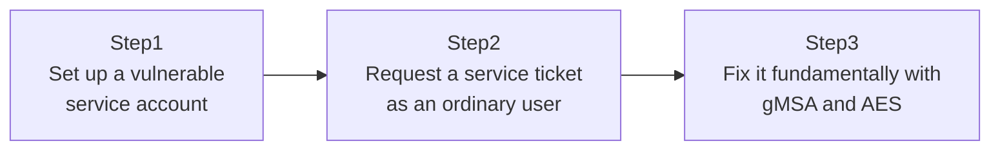

## Introduction

- **What You'll Learn From This Article**: You'll reproduce **Kerberoasting**, an attack technique that any ordinary domain user — with no special administrative rights at all — can carry out, in a safe test environment. You'll understand why this isn't a "vulnerability" at all, but a structurally unavoidable property of how the Kerberos protocol is designed, and why migrating to a gMSA, covered in [The Top 1% Hands-On for Escaping Service Account Password Management With a gMSA](/en/articles/ad-gmsa-handson-guide), is the most fundamental fix.
- **Intended Audience**: Readers who understand the basics of Kerberos authentication but have never experienced, from an attacker's perspective, how it can actually be abused. **This hands-on is for hardening your own test environment's defenses, for educational and defensive purposes. Never run these steps against someone else's production environment without authorization.**
- **Estimated Reading Time**: About 20 minutes (about 40 minutes if you build along with the hands-on)

This article is part of the [Top 1% Series Complete Article Guide](/en/sitemap), the 42nd article in the [Active Directory Series](/en/sitemap#series-list).

## Prerequisites

- [Understanding Kerberos Authentication from a "Top 1%" Perspective](/en/articles/ad-kerberos-guide): This article assumes you already know the difference between a TGT and a service ticket, and how a service ticket is encrypted with the service account's key.
- [Understanding the SPN (Service Principal Name) Mechanism from a "Top 1%" Perspective](/en/articles/ad-spn-guide): This article assumes you already know that an SPN is registered on the account running a service.

## The Big Picture

This hands-on consists of three steps.



## Hands-On Steps

### Step 1: Set up a vulnerable service account

For this test, create an SPN-registered service account with a weak password.

```powershell
New-ADUser -Name "svc-legacy" -Enabled $true -PasswordNeverExpires $true -AccountPassword (ConvertTo-SecureString "Summer2024!" -AsPlainText -Force)
setspn -A "MSSQLSvc/LegacySql.example.com:1433" "svc-legacy"
```

**This account has a password, `Summer2024!`, weak enough to break under a dictionary attack.** At many organizations, a legacy service account running for years ends up left with exactly this kind of password — "reasonably complex, but not resistant to a dictionary attack" — and nobody revisits it.

### Step 2: Request a service ticket as an ordinary user

This is the heart of this hands-on. Log on to the domain as an **ordinary user — not a member of Domain Admins or Enterprise Admins** — and run the following.

```powershell
Add-Type -AssemblyName System.IdentityModel
New-Object System.IdentityModel.Tokens.KerberosRequestorSecurityToken -ArgumentList "MSSQLSvc/LegacySql.example.com:1433"
```

**Confirm that this command succeeds, and you actually obtain a service ticket.** The user running this has zero permission to access the SQL Service that `svc-legacy` runs. And yet, as long as you know the SPN, **anyone** can simply request a service ticket for that service.

That service ticket is encrypted with a key derived from `svc-legacy`'s account password. An attacker would export this ticket from memory and attempt a dictionary or brute-force attack against it **offline** — meaning without any further communication with AD DS at all. Because it's an offline attack, it's never subject to the account lockout policy either.

### Step 3: Fix it fundamentally with gMSA and AES

The fundamental fix for this is migrating to a gMSA, built in [The Top 1% Hands-On for Escaping Service Account Password Management With a gMSA](/en/articles/ad-gmsa-handson-guide).

```powershell
Set-ADServiceAccount -Identity "gmsa-sql" -KerberosEncryptionType AES256
```

**A gMSA's password is a long, random string generated by AD DS itself.** It's, for practical purposes, unbreakable — not just against a dictionary attack, but against brute force within any realistic time frame. Pairing this with `-KerberosEncryptionType AES256`, pinning the encryption method to AES256 instead of the older, more easily cracked RC4, is another effective layer.

## What a Pro Sees Here (Top 1% Understanding)

### Why Kerberoasting is designed behavior, not a "vulnerability"

Kerberoasting isn't an implementation mistake or a bug in Kerberos. At the moment the KDC issues a service ticket, **it never checks at all whether the requesting user actually has permission to access that service.** That check only happens when the issued ticket is actually presented to the service itself. In other words, "being able to request a ticket" and "actually being able to access that service" are completely separate things. **This design is Kerberos working exactly as intended — it isn't a flaw that a patch can "fix."** The only effective countermeasure is raising the strength of the key encrypting that service ticket — the service account's password itself — to a level that's unbreakable.

### Why a weak encryption type (RC4) gives an attacker an edge

A service ticket can be encrypted with several methods, including the older RC4 and the newer AES. **A ticket encrypted with RC4 can be attacked with dramatically less computational effort than one encrypted with AES.** This is decided by the service account's `msDS-SupportedEncryptionTypes` attribute. In many environments, this attribute is never explicitly configured, for compatibility with older applications — and as a result, RC4 quietly keeps getting used. The `-KerberosEncryptionType AES256` setting from Step 3 closes off this weakness on its own, and is effective even by itself.

## Common Misconceptions and Pitfalls

- **Misconception 1: "Kerberoasting requires powerful rights like Domain Admins to carry out."**
  Kerberoasting can be carried out by any authenticated domain user, with no special rights required.
- **Misconception 2: "A sufficiently complex password alone is enough to defend against Kerberoasting."**
  A complex password a human memorizes and manages still has its limits. A gMSA's long, mechanically generated password, with no human ever involved, is a far more reliable countermeasure.
- **Misconception 3: "Disabling RC4 completely neutralizes Kerberoasting as an attack technique."**
  Disabling RC4 (standardizing on AES) is an effective countermeasure that dramatically raises the difficulty of cracking, but if the password itself is weak enough, it can, in principle, still eventually be cracked even under AES.

## Troubleshooting Perspective

1. **You want to find which service accounts are attractive Kerberoasting targets**: `Get-ADUser -Filter {ServicePrincipalName -ne "$null"} -Properties ServicePrincipalName` lists every account with a registered SPN — the full set of accounts that could be targeted.
2. **After switching to AES256, authentication fails for some clients**: An older OS or application may not support AES256. Confirm compatibility for affected clients before switching.
3. **You want to detect anomalous ticket requests**: Consider monitoring Event ID 4769 (a Kerberos service ticket was requested) on your DCs for patterns that wouldn't occur during normal business use, such as a burst of requests for many different SPNs in a short window.

## Summary

- Kerberoasting can be carried out by any authenticated ordinary user, with no special rights required.
- This is designed behavior in Kerberos, stemming from the fact that the KDC never checks access rights at ticket-issuance time.
- The only effective countermeasure is raising the service account's password strength to an unbreakable level.
- Migrating to a gMSA, combined with standardizing on AES256 encryption, is the most effective combination in practice.

**Takeaways to Apply Today**
1. List every account with `ServicePrincipalName` set, and audit its password strength and encryption type.
2. Make gMSA, not the traditional approach, the default for any new service account from the start.

## References

- [Decrypting the Selection of Supported Kerberos Encryption Types | Microsoft Learn](https://learn.microsoft.com/en-us/troubleshoot/windows-server/active-directory/decrypting-the-selection-of-supported-kerberos-encryption-types)
- [Kerberos Constrained Delegation Overview | Microsoft Learn](https://learn.microsoft.com/en-us/windows-server/security/kerberos/kerberos-constrained-delegation-overview)
