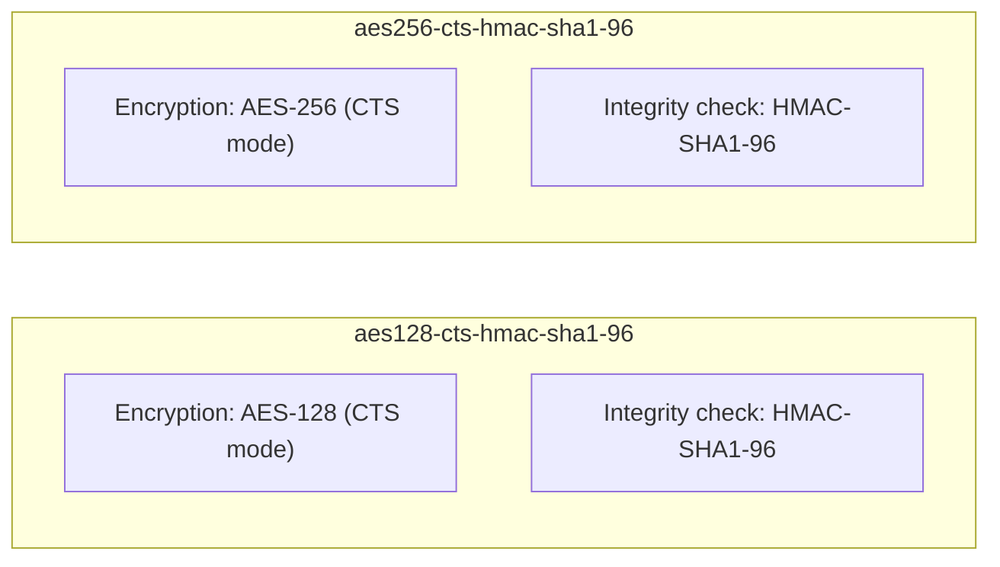

## Introduction

- **What You'll Learn From This Article**: Dig deeper into the part [the incident investigation into why you can't log in as Administrator after a new DC promotion](/en/articles/ad-dc-replace-ntlm-lockout-investigation-guide) lumped together as "the AES/RC4 key." Understand, systematically, an easily overlooked fact — **Kerberos's standard encryption types, both AES128 and AES256, actually use SHA-1 for integrity checking** — along with what the bitmask attribute `msDS-SupportedEncryptionTypes` actually represents, and how a client and a KDC actually decide which encryption type to use.
- **Intended Audience**: Readers who understand [how Kerberos authentication works](/en/articles/ad-kerberos-guide), but can't explain exactly how the encryption types lumped together under the single word "AES" are actually structured internally.
- **Estimated Reading Time**: About 18 minutes

This article is part of the [Top 1% Series Complete Article Guide](/en/sitemap), and article 13.3 in the [Active Directory Series](/en/sitemap#series-list).

## Prerequisite Knowledge

- [How Kerberos Authentication Works](/en/articles/ad-kerberos-guide): The premise that pre-authentication uses encryption and decryption with a key derived from the password.
- [The Incident Investigation Into Why You Can't Log In as Administrator After a New DC Promotion](/en/articles/ad-dc-replace-ntlm-lockout-investigation-guide): The premise that which encryption type's key an account holds gets decided at the moment its password is set.

## Getting the Big Picture

The understanding that "AES256 has higher cryptographic strength than AES128" is itself correct, but **this statement alone only explains half of the full picture of the encryption types Kerberos actually uses.** Kerberos's encryption types are built from a combination of two distinct roles: **"the part that encrypts the data"** and **"the part that confirms the data hasn't been tampered with."**



**Here's a fact many people overlook: AES128 and AES256 only differ in the length of the key used for encryption (128 bits vs. 256 bits) — the integrity-checking part is identical in both, using the same `HMAC-SHA1-96`, meaning SHA-1.**

## Deep Dive Into the Fundamentals

### Why Is SHA-1 Still Used Even in AES256?

**There's actually no variant using SHA-256 at all, among the standard AES-based encryption types used in Kerberos.** This is because [RFC 3962](https://datatracker.ietf.org/doc/html/rfc3962), the spec that defined the two AES-based Kerberos encryption types, `aes128-cts-hmac-sha1-96` and `aes256-cts-hmac-sha1-96`, **fixed the integrity-checking method to HMAC using SHA-1, for both of them.** The decision to "raise AES's key length to 256 bits" and the decision of "which hash function to use for integrity checking" turn out to have been **two independent, separate decisions** within Kerberos's standard spec.

<details>
<summary>Is Using SHA-1 Genuinely a Security Weakness?</summary>

**This is an easily misunderstood, genuinely important point.** Most of the context where SHA-1 gets called "unsafe" refers to the fact that **a practical collision attack against SHA-1 itself** (an attack that deliberately produces the same hash value from two different inputs) has become feasible. This is a serious problem for **use cases where "how resistant a hash value itself is to collisions" is the actual basis for security** — like a digital certificate's signature. **HMAC-SHA1, on the other hand, is an entirely different construction, using a key to perform the hashing, and a collision attack against SHA-1 itself doesn't directly threaten HMAC-SHA1's security.** Because of this, the claim "Kerberos uses HMAC-SHA1, so even AES256 is dangerous" isn't accurate. That said, Microsoft itself does recommend migrating to newer encryption methods, and the general direction — "it's an older method, so it will eventually get replaced by newer ones" — is itself a correct take.

</details>

### What `msDS-SupportedEncryptionTypes`'s Bitmask Actually Contains

The information covered in [the incident investigation](/en/articles/ad-dc-replace-ntlm-lockout-investigation-guide) — "which encryption type's key an account holds" — is actually managed as a **bitmask** (a method of expressing multiple settings as individual bits within a single number) in an attribute called `msDS-SupportedEncryptionTypes`.

```powershell
Get-ADUser -Identity Administrator -Properties msDS-SupportedEncryptionTypes |
    Select-Object Name, msDS-SupportedEncryptionTypes
```

**Output (illustrative):**

```
Name          msDS-SupportedEncryptionTypes
----          ------------------------------
Administrator                             28
```

| Bit (decimal) | Meaning |
|---|---|
| 4 | RC4-HMAC |
| 8 | AES128-CTS-HMAC-SHA1-96 |
| 16 | AES256-CTS-HMAC-SHA1-96 |
| 32 | AES256-CTS-HMAC-SHA1-96 (session key variant) |

**The value `28` is the sum of `4` (RC4) + `8` (AES128) + `16` (AES256), meaning "this account supports RC4, AES128, and AES256, all three."** If this attribute lacks the `16` (AES256) bit specifically, that account can't authenticate with AES256 at all.

### How a Client and a KDC Actually Decide Which Encryption Type to Use

When sending an AS-REQ, the client presents **a prioritized list of the encryption types it supports** to the KDC. The KDC cross-references this list against the target account's `msDS-SupportedEncryptionTypes`, and **picks the highest-priority encryption type both sides support in common.** **The `KDC_ERR_ETYPE_NOTSUPP` error, confirmed in [the incident investigation](/en/articles/ad-dc-replace-ntlm-lockout-investigation-guide), meant exactly this: this cross-reference found not a single common, mutually supported encryption type.**

## What a Pro Sees Here (Top 1% Understanding)

### Never Feel Safe Just Because "We Standardized on AES"

In many real-world environments, as covered in [the Kerberoasting hands-on](/en/articles/ad-kerberoasting-handson-guide), standardizing from RC4 to AES gets treated as the security-hardening goal. **This direction is correct, but the single statement "we standardized on AES" hides a finer-grained decision underneath it: "do we allow AES128, AES256, or both," and "how much do we tolerate HMAC-SHA1 being used for integrity checking."** The habit of accurately checking `msDS-SupportedEncryptionTypes`'s bitmask, per account, and confirming **that AES128-only, or a lingering mix with RC4, hasn't crept in unintentionally**, is what turns "we standardized on AES" into a claim backed by concrete evidence.

## Common Misconceptions and Pitfalls

- **Misconception 1: "If you're using AES256, SHA-256 is being used for integrity checking too."**
  Kerberos's standard AES256 (`aes256-cts-hmac-sha1-96`) uses SHA-1 for integrity checking. AES's key length and the hash function's kind are two separate settings.
- **Misconception 2: "Using SHA-1 at all makes Kerberos authentication dangerous."**
  The HMAC-SHA1 construction isn't directly affected by a collision attack against SHA-1 itself, and its security rests on an entirely different basis than, say, a digital certificate's signature.
- **Misconception 3: "If `msDS-SupportedEncryptionTypes` isn't set at all, that account can't use any encrypted Kerberos authentication at all."**
  When this attribute is unset (0), the default behavior generally falls back to RC4. Encryption doesn't become entirely unavailable — the risk is that a weaker method gets selected instead.

## Troubleshooting Perspective

1. **One specific account can't authenticate with AES256**: Check the `msDS-SupportedEncryptionTypes` value, and whether the `16` (AES256) bit is actually set.
2. **You want to audit every account's encryption-type support across the domain in bulk**: `Get-ADUser -Filter * -Properties msDS-SupportedEncryptionTypes` lists the value for every account.
3. **Behavior didn't change despite changing the encryption type**: As covered in [the incident investigation](/en/articles/ad-dc-replace-ntlm-lockout-investigation-guide), changing this attribute can also require recomputing existing key material, so a password reset may be necessary.

## Summary

- Kerberos's standard AES-based encryption types (AES128 and AES256) both use SHA-1 (HMAC-SHA1-96) for integrity checking. AES's key length and the hash function's kind are independent settings.
- HMAC-SHA1 isn't directly affected by a collision attack against SHA-1 itself, resting its security on a different basis than, say, a digital certificate's signature.
- `msDS-SupportedEncryptionTypes` is a bitmask representing which encryption types an account supports, expressing a combination like RC4/AES128/AES256 as a single number.
- A client and a KDC pick the highest-priority encryption type both sides support in common. With no common type, the result is a `KDC_ERR_ETYPE_NOTSUPP` error.

**Takeaways to Apply Today**
1. When confirming the state of "we standardized on AES," actually check `msDS-SupportedEncryptionTypes`'s bitmask on individual accounts.
2. When researching information about an encryption type, always keep in mind that "the encryption method" and "the integrity-checking method" are separate settings.

## References

- [RFC 3962 - Advanced Encryption Standard (AES) Encryption for Kerberos 5](https://datatracker.ietf.org/doc/html/rfc3962)
- [Decrypting the Selection of Supported Kerberos Encryption Types | Microsoft Learn](https://learn.microsoft.com/en-us/troubleshoot/windows-server/active-directory/decrypting-the-selection-of-supported-kerberos-encryption-types)
