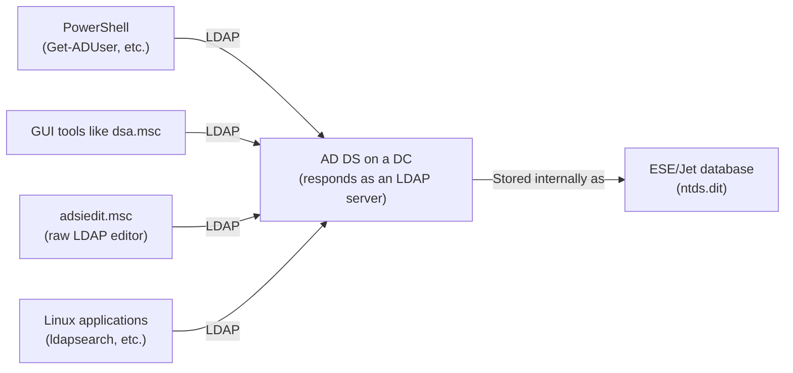

## Introduction

- **What you'll get from this article**: Ever since [Understanding AD vs. DC, and Domains vs. Forests](/en/articles/ad-dc-fundamentals-guide), this series has repeatedly said "AD DS accepts queries over the LDAP protocol" without digging into what LDAP itself actually does. This article systematically covers the structure of the data LDAP handles (DN, attributes, object classes), the types of operations (Bind, Search, Add/Modify/Delete), and what tools like `Get-ADUser` or `adsiedit.msc` are actually doing underneath. It also covers how ports 389, 636, 3268, and 3269 are used differently, and LDAP signing / LDAP channel binding — settings that inevitably come up in real security audits.
- **Intended audience**: Readers who understand the statement "AD DS runs on LDAP" but can't explain what the LDAP protocol itself is actually exchanging.
- **Estimated reading time**: About 18 minutes

This article is part of the [Top 1% Series — Full Article Guide](/en/sitemap), and the 19th entry in the [Active Directory series](/en/sitemap#series-list). Reading [Understanding AD vs. DC, and Domains vs. Forests](/en/articles/ad-dc-fundamentals-guide) first will make this article easier to follow.

## Prerequisite Knowledge

- **AD DS (Active Directory Domain Services)**: The directory service covered in [Understanding AD vs. DC, and Domains vs. Forests](/en/articles/ad-dc-fundamentals-guide), which centrally manages users, computers, and groups. LDAP is the standard protocol used to query AD DS.
- **`adsiedit.msc`**: Covered in [Post-Migration AD Cleanup](/en/articles/ad-migration-cleanup-guide), this is a general-purpose editor that gives direct, raw-attribute-level LDAP access to every partition in AD DS.

## Getting the Big Picture

### In a nutshell

**LDAP (Lightweight Directory Access Protocol) is the standard protocol for searching, adding, modifying, and deleting entries in a hierarchically structured database — a directory.** Internally, AD DS keeps user and computer information in its own database engine (ESE/Jet), but toward external clients and applications, it unifies its query interface behind this common language: LDAP. PowerShell commands like `Get-ADUser` and GUI tools like `dsa.msc` are both, underneath the surface the user never touches, ultimately sending LDAP requests to AD DS.

## Deep Dive into the Fundamentals

### The shape of LDAP's data: DN, attributes, and object classes

The directory LDAP handles is a tree structure (a DIT: Directory Information Tree) with objects nested inside one another, much like a folder hierarchy. The thing that uniquely identifies a single object within that tree — its address, in effect — is its **DN** (Distinguished Name). For example, "the user `tanaka` inside the `Sales` organizational unit (OU) in the `example.com` domain" is expressed as a DN like `CN=tanaka,OU=Sales,DC=example,DC=com`.

How to read a DN: right to left, root to leaf

A DN lists several comma-separated components (RDNs: Relative Distinguished Names), ordered so that **the rightmost elements are closest to the root of the directory, and the leftmost elements are closest to the leaf — the object itself.** For `CN=tanaka,OU=Sales,DC=example,DC=com`, reading right to left gives you: "within the forest/domain `example.com` (`DC=example,DC=com`), within the organizational unit `Sales` (`OU=Sales`), the object with common name `tanaka` (`CN=tanaka`)" — tracing the actual directory hierarchy as you go.

The main types of RDNs, and their relationship to a certificate's CSR

The most commonly used RDN types include:

| RDN | Meaning |
|---|---|
| `CN` | Common Name — the name representing the object itself, like a username or computer name |
| `OU` | Organizational Unit — AD's administrative folder unit |
| `DC` | Domain Component — each `.`-separated segment of a domain name (`example.com`) |
| `O` | Organization — a company name, for example |
| `C` | Country — an ISO country code (like `JP`) |
| `L` | Locality — a city or town |
| `ST` | State/Province |

These RDNs aren't actually specific to LDAP or AD DS at all — they're **a general-purpose "way of representing a name," originating from X.500, the international directory-service standard.** And the **CSR** (Certificate Signing Request) covered in [Understanding PKI and Digital Certificates](/en/articles/pki-guide) has a **Subject** field describing who the certificate is being issued to, written in exactly the same `CN=` / `O=` / `OU=` / `C=` format. In other words, a DN and a certificate's Subject aren't unrelated — **they're the same X.500-derived name-representation standard, reused in two different contexts: an LDAP directory, and a certificate.** Everything you learn here about reading a DN carries over directly to filling in a `CN=` or `O=` value in a certificate's Subject.

Every object's **object class** (what kind of object it is — a `user`, a `computer`, and so on) determines which **attributes** (name/value pairs such as name, password hash, or group membership) it's allowed to have. This "rulebook defining an object's type and its attributes" is exactly the **schema** touched on in [Understanding AD vs. DC, and Domains vs. Forests](/en/articles/ad-dc-fundamentals-guide).

### LDAP's core operations: Bind, Search, and Add/Modify/Delete

The operations an LDAP client exchanges with a server fall broadly into these categories:

- **Bind**: Performs authentication. It tells the LDAP server "as whom" the following operations should be carried out.
- **Search**: Searches for objects matching a **search filter** (a condition expression) within a specified range — a base DN to start from, plus a **scope** for how many levels deep beneath it to look. For example, the search filter `(&(objectClass=user)(sAMAccountName=tanaka))` expresses "objects whose object class is `user` AND whose `sAMAccountName` attribute is `tanaka`."
- **Add/Modify/Delete**: Adds an object, changes an attribute, or deletes an object.

Types of Bind: simple bind and SASL bind

There are two main flavors of Bind. A **simple bind** is the most basic approach: it sends the user's DN and password as-is (plaintext, unless the connection is encrypted). A **SASL bind** borrows an existing authentication mechanism, such as Kerberos (GSSAPI), so the password itself never travels over the LDAP wire. In a Windows environment, it's common for a domain-joined client to bind using a Kerberos ticket (Kerberos authentication was covered in detail in [Understanding the Kerberos Authentication Protocol](/en/articles/ad-kerberos-guide)).

### How ports 389, 636, 3268, and 3269 are used differently

LDAP doesn't use just one TCP port — different ports serve different purposes:

| Port | Name | Characteristics |
|---|---|---|
| 389 | LDAP | Plaintext by default. Can switch to encryption mid-connection using a procedure called `STARTTLS` |
| 636 | LDAPS | Encrypted with TLS from the very start of the connection (begins with an SSL/TLS handshake) |
| 3268 | Global Catalog (LDAP) | A port for searching across the entire forest against the global catalog, covered in articles like [Understanding FSMO](/en/articles/fsmo-guide) (plaintext by default) |
| 3269 | Global Catalog (LDAPS) | The TLS-encrypted version of 3268 |

A query to port 389 only covers objects within the domain partition that DC is responsible for, but a query to port 3268 can search **across every domain in the forest** — limited to attributes replicated into the global catalog. This is exactly why port 3268 comes into play in scenarios like "I want to search by username, but I don't know which domain that user belongs to."

## What Top-1% Engineers See

### LDAP signing and LDAP channel binding: the 2019 security advisory and what followed

Unprotected plaintext LDAP traffic over port 389 carries a risk: it can be tampered with in transit, or abused in an **NTLM relay attack**, where intercepted authentication material is relayed to impersonate the client against another server. Two settings address this: **LDAP signing** (attaches a digital signature to the traffic so tampering is detectable) and **LDAP channel binding** (ties the LDAP authentication to the underlying TLS layer, preventing relay attacks).

In August 2019, Microsoft published security advisory **ADV190023**, recommending that LDAP signing be set to "Require Signing" and LDAP channel binding be set to "require when supported." The original plan was to enable these by default in a future update, but in March 2020, out of concern for compatibility impact, Microsoft reversed course: **it would not force these on for existing environments.**

What changed in Windows Server 2025: newly built domain controllers are now protected by default

Windows Server 2025 moved the needle one step further. For **newly built domain controllers**, LDAP signing now behaves as "Require" by default, and LDAP channel binding also defaults to "require when supported." However, this is strictly a change to the **default for new deployments** — Windows Update does not automatically rewrite the settings on existing domain controllers. If you want to enable LDAP signing and channel binding in an existing environment, you need to configure it explicitly through Group Policy.

The practically important point: before switching LDAP signing or channel binding to "require," always check whether your environment still has legacy applications or network devices (multifunction printers with authentication integration, for example) that depend on plaintext LDAP. A batch of binds can suddenly start failing after the change, causing an authentication outage.

## Common Misconceptions and Pitfalls

- **Misconception 1: "LDAP is a protocol built exclusively for AD DS."**
  LDAP isn't AD DS-specific — it's a general-purpose standard protocol also used by other directory services like OpenLDAP. AD DS is simply one implementation that accepts queries in this common language.
- **Misconception 2: "As long as I'm using port 389, the traffic is always plaintext."**
  Even on port 389, a connection can switch to encryption mid-stream via the `STARTTLS` procedure. It's a mistake to assume "389 = always plaintext, 636 = always encrypted" as a fixed rule.
- **Misconception 3: "Requiring LDAP signing, by itself, fully prevents NTLM relay attacks."**
  LDAP signing's primary purpose is detecting tampering in transit. Preventing relay attacks themselves requires also enabling LDAP channel binding, which ties the authentication to the TLS layer. These two settings should be considered as a pair.

## Troubleshooting Perspective

LDAP-related trouble usually comes down to a mismatch between the security level the client expects and what the server requires.

1. **One specific application suddenly can't connect over LDAP**: Check whether Group Policy has changed the required level for LDAP signing or channel binding. That application may depend on plaintext binds or an older SASL mechanism.
2. **Users in a different domain of the same forest can't be found by search**: Check whether the query is going to port 389 (scoped to only your own domain). If a cross-forest search is needed, switch to querying port 3268 (the global catalog) instead.
3. **An attribute edited in `adsiedit.msc` doesn't take effect right away**: `adsiedit.msc` also communicates with AD DS over LDAP, so the change propagates through replication to other DCs. The replication delay covered in [Understanding AD Sites and Replication Topology](/en/articles/ad-sites-guide) may be a factor.

### Prevention and Long-Term Countermeasures

- Before raising the required level for LDAP signing or channel binding, always inventory every application and device in the environment for compatibility.
- Implement any process that needs a cross-forest search to use port 3268 (the global catalog), not port 389.
- Where plaintext traffic on port 389 is unavoidable, make sure to switch to encryption via `STARTTLS`.

## Summary

- LDAP is the standard protocol for searching, adding, modifying, and deleting entries against AD DS — it isn't a technology exclusive to AD DS.
- The data LDAP handles is a tree of objects, each uniquely identified by a DN (Distinguished Name); the attributes an object is allowed to have are determined by its object class (schema).
- Ports 389 (own domain, plaintext by default), 636 (own domain, TLS), 3268 (cross-forest, plaintext by default), and 3269 (cross-forest, TLS) need to be chosen based on your use case.
- LDAP signing and LDAP channel binding protect against tampering with plaintext LDAP traffic and NTLM relay attacks; Windows Server 2025 strengthened the defaults for newly built DCs, but existing environments are not automatically updated.

**What to keep in mind starting today**
1. When you need a cross-forest search, use port 3268 (the global catalog) instead of port 389.
2. Before changing LDAP signing or channel binding requirements, inventory the impact on legacy applications and devices in your environment first.

## References

- [Lightweight Directory Access Protocol | Wikipedia](https://en.wikipedia.org/wiki/Lightweight_Directory_Access_Protocol)
- [ADV190023 - Microsoft Guidance for Enabling LDAP Channel Binding and LDAP Signing | Microsoft Security Response Center](https://msrc.microsoft.com/update-guide/en-us/advisory/ADV190023)
- [2020, 2023, and 2024 LDAP channel binding and LDAP signing requirements for Windows (KB4520412) | Microsoft Support](https://support.microsoft.com/en-us/topic/2020-2023-and-2024-ldap-channel-binding-and-ldap-signing-requirements-for-windows-kb4520412-ef185fb8-00f7-167d-744c-f299a66fc00a)
- [LDAP signing for Active Directory Domain Services on Windows Server | Microsoft Learn](https://learn.microsoft.com/en-us/windows-server/identity/ad-ds/ldap-signing)
