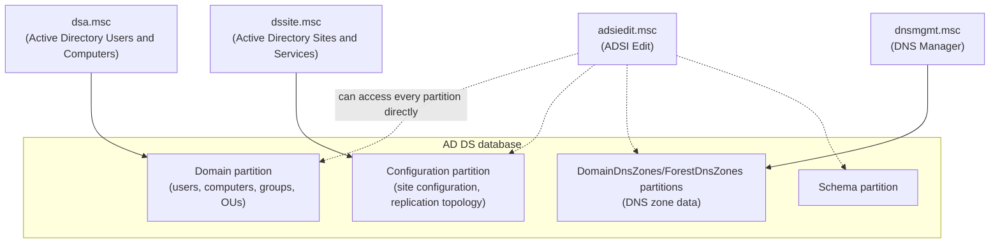

## Introduction

- **What You'll Learn From This Article**: After formally removing a DC during an AD migration, you end up checking four management consoles: `dsa.msc` (Active Directory Users and Computers), `dssite.msc` (Active Directory Sites and Services), `adsiedit.msc` (ADSI Edit), and `dnsmgmt.msc` (DNS Manager). This article systematically organizes **what part of AD DS each of these four consoles manages** and **why you need to check and clean up there.** Along the way, it also answers a common practical question: "why does information about an old computer that was removed from the domain keep lingering in dsa.msc's `Computers` container?"
- **Intended Audience**: This article is aimed at engineers who've checked these four consoles while following an AD migration procedure, but haven't quite organized in their heads what each console manages or why checking it matters.
- **Estimated Reading Time**: About 19 minutes

This article is part of the [Top 1% Series' full article guide](/en/sitemap), and the tenth article in the [Active Directory series](/en/sitemap#series-list). It assumes you understand partition types from [Understanding the Difference Between AD and DC, and Domains vs. Forests, from a "Top 1%" Perspective](/en/articles/ad-dc-fundamentals-guide), and DNS record details from [Reading DNS Zones and Records from a "Top 1%" Perspective](/en/articles/dns-zones-records-guide).

## Prerequisites

- **MMC (Microsoft Management Console) snap-ins**: Many of Windows's management tools (`dsa.msc`, `dssite.msc`, and so on) aren't each built as an independent standalone application — instead, **they're "plugged into" a common GUI shell called MMC as pieces that add functionality to it.** This "pluggable piece" is called a **snap-in**. The `.msc` file extension itself derives from this same mechanism — it stands for **"Microsoft Saved Console"** (an MMC configuration file that saves which snap-in(s) to load ahead of time). So double-clicking `dsa.msc` actually amounts to "launch MMC, and restore the state where the 'Active Directory Users and Computers' snap-in is loaded." This mechanism is also what lets you build your own custom console that brings several snap-ins together into a single MMC screen. Understanding that each `.msc` file shows a different part of a single database — AD DS — with a different look and set of operations makes the rest of this article easier to follow.

## Getting the Big Picture

### The Difference Between What the Four Consoles Manage

**These four consoles are different "windows" onto the same single database: AD DS.** Here's a breakdown of the range of data each one manages:

`dsa.msc`, `dssite.msc`, and `dnsmgmt.msc` are each dedicated consoles that manage a specific partition through an easy-to-use GUI. `adsiedit.msc`, on the other hand, is special: it's **not dedicated to any particular partition — it's a general-purpose LDAP editor that can directly access any partition within AD DS.**

## Fundamentals, Explained Thoroughly

### `dsa.msc` (Active Directory Users and Computers): The Window Onto the Domain Partition

`dsa.msc` is the console for managing the **domain partition** explained in [Understanding the Difference Between AD and DC, and Domains vs. Forests, from a "Top 1%" Perspective](/en/articles/ad-dc-fundamentals-guide) — the objects you touch most often in day-to-day operations: users, computers, groups, and OUs (organizational units).

In an AD migration context, you check two things here:

- **Whether the computer account of a demoted old DC has moved out of the `Domain Controllers` OU into the ordinary `Computers` container** (this happens automatically if demotion completed correctly). Or, if you're removing that machine entirely, you delete this account outright.
- **Whether any computer or user accounts remain in AD DS that no longer exist or are no longer used.**

Why does information keep lingering in the Computers container even after removing a machine from the domain?

A common practical question here is: "I removed a PC from the domain (put it back in a workgroup), so why does its computer name keep lingering forever in dsa.msc's `Computers` container?"

This is because **"the operation of leaving the domain on the PC side" and "the operation of deleting that computer account (object) on the AD DS side" are entirely separate operations.** The PC-side action of "leaving the domain and returning to a workgroup" is simply a **local configuration change on that PC** — it just stops that PC from using the domain's credentials. This operation doesn't automatically send a request to AD DS saying "please delete this computer account."

**The computer account on the AD DS side keeps existing unless an administrator explicitly deletes it.** This is actually an intentional design consideration — if the account were automatically deleted every time a machine left the domain, then even if you just wanted to rejoin the same PC to the domain, it would be treated as a brand-new computer account every time, requiring you to redo everything tied to that account — the scope of applied Group Policy, group memberships, and so on. It's easier to accept this behavior once you understand it as **a deliberate two-step design: "leave the account in place after leaving the domain, and let an administrator explicitly delete it if and when it's actually needed."**

### `dssite.msc` (Active Directory Sites and Services): The Window Onto the Configuration Partition

`dssite.msc` is the console for managing the **configuration partition** explained in [Understanding the Difference Between AD and DC, and Domains vs. Forests, from a "Top 1%" Perspective](/en/articles/ad-dc-fundamentals-guide) — the definition of sites (physical locations), the mapping between subnets and sites, and **the replication configuration of each DC itself.**

Specifically, under each site's `Servers` folder inside the `Sites` container, the DCs belonging to that site are registered as server objects, and under each server object sits an **NTDS Settings object** — the set of connection objects representing which other DCs that DC replicates with, and on what schedule.

`dssite.msc` matters in an AD migration context because **a properly demoted DC also has this server object and its NTDS Settings object automatically deleted.** So, **if an old DC's server object still remains in `dssite.msc`, that means the demotion process wasn't fully completed, and stale information about AD DS's replication configuration is still lingering.**

### The Difference Between `dsa.msc` and `dssite.msc`

In short: **`dsa.msc` is the window for managing "what exists in the domain" (who belongs to which group, in which OU); `dssite.msc` is the window for managing "where DCs physically and network-wise are, and how they replicate with each other."** Ordinary day-to-day user and group management is fully covered by `dsa.msc` alone, but **`dssite.msc` becomes the primary battleground when adding or removing a DC, or designing/troubleshooting the replication topology.** As noted above, confirming that an old DC has truly been completely removed requires checking not just `dsa.msc` (the presence or absence of a computer account) but also `dssite.msc` (the presence or absence of the server object and NTDS Settings) — only then can you conclude it's been fully removed at the AD DS structural level.

### `adsiedit.msc` (ADSI Edit): Direct Access to Every Partition

`adsiedit.msc` is a **general-purpose editor that can directly read and write raw LDAP attributes** across every partition in AD DS (domain, configuration, schema, DomainDnsZones, and ForestDnsZones included). Unlike the purpose-built, easy-to-use GUIs of `dsa.msc` or `dssite.msc`, it displays the object hierarchy and attribute values almost as-is, in raw form. The structure of LDAP itself — DNs and attributes — is covered in [Understanding the LDAP Protocol](/en/articles/ad-ldap-protocol-guide).

`adsiedit.msc` becomes necessary in AD migration cleanup mainly when **demotion couldn't complete normally (because the old DC had already failed or been lost, for example), and forced metadata cleanup via `ntdsutil` had to be used instead.** In that case, some of the object deletion and tidying that a normal demotion would have handled automatically can be left incomplete — leaving behind leftover objects that don't show up in `dsa.msc` or `dssite.msc`'s GUI, or can't be deleted through normal operations. In these cases, you identify and delete the object in question directly from `adsiedit.msc`.

adsiedit.msc is powerful, but dangerous

`adsiedit.msc` bypasses many of the safety mechanisms that a tool like `dsa.msc` provides during operations — confirmation prompts asking "are you sure you want to delete this," dependency checks, and so on — and writes directly to AD DS's data. Deleting or modifying the wrong attribute on the wrong object can seriously impact the integrity of AD DS as a whole. **It shouldn't be treated as a casual, everyday operational tool — it should be positioned as a last resort, used only in specific, limited situations that other GUI tools can't handle, and only with a thorough understanding of what you're doing.**

### `dnsmgmt.msc` (DNS Manager): The Window Onto DNS Zone Data

As explained in [Reading DNS Zones and Records from a "Top 1%" Perspective](/en/articles/dns-zones-records-guide), the DNS zone data managed by `dnsmgmt.msc` is stored, for an AD-integrated zone, in the dedicated `DomainDnsZones` and `ForestDnsZones` partitions. In AD migration cleanup, you check three things:

- Whether the **A record** corresponding to the old DC's hostname has been deleted
- Whether the **SRV records** corresponding to the old DC under the `_msdcs` zone have been deleted
- Whether the **CNAME record** corresponding to the old DC's GUID, directly under the `_msdcs` zone, has been deleted

## The View From the Top 1% Perspective

### Why You Need to Check as Many as Four Consoles

**When a proper (graceful) demotion is performed, most of the data these four consoles manage is actually cleaned up automatically.** Moving the computer account in `dsa.msc`, deleting the server object in `dssite.msc`, and deleting the records in `dnsmgmt.msc` are all part of what the demotion wizard itself performs internally.

So, **manually checking all four consoles one by one really matters in two specific scenarios:**

1. **When the old DC had already failed or been lost, a proper demotion couldn't be performed, and forced metadata cleanup via `ntdsutil` had to be used instead** — this path can leave part of the automatic cleanup incomplete (particularly the server object in `dssite.msc`, and in some cases DNS records), making manual checking and deletion essential.
2. **Even after a proper demotion, verifying (trust but verify) that the automatic cleanup truly completed fully** — in a production AD migration especially, it's practically important to build in a process of visually confirming the results rather than blindly trusting the automated process.

## Common Misconceptions and Pitfalls

- **Misconception 1: "If a computer or user disappears from dsa.msc, all of its data in AD DS is gone"**
  `dsa.msc` only manages the domain partition. Whether stale information remains in the configuration partition (`dssite.msc`) or DNS zone data (`dnsmgmt.msc`) can't be confirmed from `dsa.msc` alone.
- **Misconception 2: "Removing a PC from the domain automatically deletes its computer account in AD DS too"**
  Leaving the domain is just a local configuration change on the PC's side — the computer account on the AD DS side isn't deleted unless an administrator explicitly does so.
- **Misconception 3: "adsiedit.msc is more powerful, so it should be used for everyday management tasks too"**
  `adsiedit.msc` is a general-purpose editor that bypasses safety mechanisms — day-to-day operations should use purpose-built GUIs like `dsa.msc` or `dssite.msc`. `adsiedit.msc` is a last resort, used only in limited situations other tools can't handle.

## The Troubleshooting Perspective

Cleanup omissions after an AD migration are best approached by **first confirming whether the demotion was graceful, or a forced metadata cleanup.**

1. **A forced metadata cleanup was performed**: Always manually check all four consoles (`dsa.msc`, `dssite.msc`, `adsiedit.msc`, `dnsmgmt.msc`). A lingering server object or NTDS Settings in `dssite.msc` in particular is an easy thing to overlook.
2. **A graceful demotion was performed, but you want to double-check just in case**: Checking `dsa.msc`, `dssite.msc`, and `dnsmgmt.msc` is usually sufficient. Digging as far as `adsiedit.msc` is only needed if an anomaly is still found even after that.
3. **The old DC's name is still referenced somewhere in some form**: Combine this with the output of `repadmin /replsummary` or `repadmin /showrepl *`, covered in [Understanding DC Health Checks from a "Top 1%" Perspective](/en/articles/dc-health-check-guide), to identify which partition or console still holds the remnant.

### Preventive Measures and Permanent Fixes

- Wherever possible, perform a proper demotion while the old DC is still alive, avoiding forced metadata cleanup.
- If forced metadata cleanup is unavoidable, always build a checklist covering all four consoles into your work procedure.
- Even for a proper demotion, don't skip the step of visually verifying the results of the automatic cleanup in a production migration.

## Summary

- `dsa.msc` manages the domain partition (users, computers, groups, OUs); `dssite.msc` manages the configuration partition (site configuration, DC replication configuration); `dnsmgmt.msc` manages DNS zone data.
- `adsiedit.msc` alone isn't dedicated to any particular partition — it's a general-purpose editor that can directly access any partition in AD DS, and it's a last resort used only in limited situations other tools can't handle.
- Leaving the domain is just a local configuration change on the PC's side — the computer account on the AD DS side keeps existing until an administrator explicitly deletes it.
- A graceful demotion automatically handles much of the cleanup, but a forced metadata cleanup makes manually checking all four consoles essential.

**What to Keep in Mind From Today**
1. When confirming post-migration cleanup, first check whether the demotion was graceful or a forced metadata cleanup — and if it was the latter, always check all four consoles.
2. Don't conclude "nothing's left" based on `dsa.msc` alone — always also check `dssite.msc` for a lingering server object or NTDS Settings.

## References

- [Active Directory Users and Computers overview | Microsoft Learn](https://learn.microsoft.com/en-us/windows-server/identity/ad-ds/plan/appendix-c--managing-machine-accounts)
- [Active Directory Sites and Services overview | Microsoft Learn](https://learn.microsoft.com/en-us/previous-versions/windows/it-pro/windows-server-2012-r2-and-2012/cc772774(v=ws.11))
- [ADSI Edit overview | Microsoft Learn](https://learn.microsoft.com/en-us/previous-versions/windows/it-pro/windows-server-2012-r2-and-2012/cc772819(v=ws.11))
- [Clean Up Server Metadata | Microsoft Learn](https://learn.microsoft.com/en-us/previous-versions/windows/it-pro/windows-server-2012-r2-and-2012/cc816907(v=ws.11))
