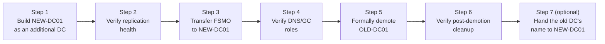

## Introduction

- **What You'll Learn From This Article**: This article walks you hands-on through the most common real-world task in AD operations — **replacing an aging DC with a new server (an AD migration)**. You'll add a new DC, verify replication health, transfer all five FSMO roles, formally demote the old DC, verify post-demotion cleanup, and, if needed, hand the old DC's name over to the new one — running the actual commands one by one along the way. Along the way, you'll also practice deliberately triggering a warning with `dcdiag /v` and learning to read what it means.
- **Intended Audience**: This article is aimed at readers who've read the AD DS series so far ([FSMO](/en/articles/fsmo-guide), [DC health checks](/en/articles/dc-health-check-guide), [dcdiag](/en/articles/dcdiag-guide), [post-migration AD cleanup](/en/articles/ad-migration-cleanup-guide), and so on) and understand the individual concepts, but haven't experienced the full end-to-end flow of an actual migration.
- **Estimated Reading Time**: About 40 minutes (budget around 3 hours if you're following along and building it yourself)

This article is part of the [Top 1% Series' full article guide](/en/sitemap), and the fifteenth article in the [Active Directory series](/en/sitemap#series-list) — **a hands-on capstone for the series as a whole.** Reading [Understanding FSMO (Operations Master) Roles](/en/articles/fsmo-guide), [Understanding DC Health Checks](/en/articles/dc-health-check-guide), [Reading dcdiag /v](/en/articles/dcdiag-guide), [Understanding Post-Migration AD Cleanup](/en/articles/ad-migration-cleanup-guide), and [What's the Difference Between sysdm.cpl and netdom computername?](/en/articles/ad-computername-netdom-guide) beforehand is strongly recommended.

## Prerequisites

This article assumes you're already familiar with nearly the entire AD DS series so far. In particular, the following are treated as prerequisites and not re-explained here:

- [Understanding FSMO (Operations Master) Roles](/en/articles/fsmo-guide): what the five roles mean, and the difference between transfer and seizure
- [Understanding DC Health Checks](/en/articles/dc-health-check-guide): how to read `repadmin /showrepl` and `net share`
- [Reading dcdiag /v](/en/articles/dcdiag-guide): what the major test items mean
- [Understanding Post-Migration AD Cleanup](/en/articles/ad-migration-cleanup-guide): the division of labor between `dsa.msc`, `dssite.msc`, `adsiedit.msc`, and `dnsmgmt.msc`

## Prerequisites for the Hands-On

- Two Windows Server 2025 VMs. One is assumed to already be running as a DC.
  - `OLD-DC01` (example IP: `10.0.40.11`): The sole existing DC of the `example.com` domain. It holds all five FSMO roles, and also doubles as the DNS server and global catalog.
  - `NEW-DC01` (example IP: `10.0.40.12`): A new server not yet joined to the domain.
- Configure `NEW-DC01`'s DNS server setting to point at `OLD-DC01`'s IP address beforehand (a new DC needs to be able to resolve the existing DC's name in order to join the domain).
- This lab assumes a disposable, throwaway environment.

## Getting the Big Picture

### The Overall Flow of Work



This order matters for the reason touched on in [Should All FSMO Roles Be Consolidated on One DC, or Spread Out?](/en/articles/fsmo-guide) — **the core principle of a safe migration is transferring FSMO (a transfer, not a seizure) while the current role holder (`OLD-DC01`) is still running normally.** If you take the old DC down first, you're forced into the much messier emergency option of a seizure.

## Step 1: Build `NEW-DC01` as an Additional DC

On `NEW-DC01`, open PowerShell as administrator and join it to the existing domain as an **additional DC**.

```powershell
Install-WindowsFeature AD-Domain-Services -IncludeManagementTools

Install-ADDSDomainController `
    -DomainName "example.com" `
    -InstallDns `
    -Credential (Get-Credential "EXAMPLE\Administrator") `
    -SafeModeAdministratorPassword (ConvertTo-SecureString "P@ssw0rd-DSRM!" -AsPlainText -Force)
```

Once this completes, `NEW-DC01` comes up as the second DC of `example.com`. By default, a newly promoted DC also gets the global catalog (GC) enabled automatically.

## Step 2: Verify Replication Health

Using the commands covered in [Understanding DC Health Checks](/en/articles/dc-health-check-guide) and [Reading dcdiag /v](/en/articles/dcdiag-guide), always confirm **that replication between the two DCs is functioning correctly** before proceeding to the FSMO transfer.

```powershell
# Run on both DCs, to confirm they recognize each other as replication partners
repadmin /showrepl

# Check NEW-DC01's own health
dcdiag /v
```

As covered in [Emphasizing repadmin's Subject (the Receiving Side)](/en/articles/dc-health-check-guide), the output of `repadmin /showrepl` shows **the replication state with the DC you ran it on as the receiving side** — so run it on both `OLD-DC01` and `NEW-DC01` to confirm replication is healthy in both directions. **Don't proceed to the FSMO transfer until you've confirmed replication is healthy.**

## Step 3: Transfer the FSMO Roles to `NEW-DC01`

Once replication health is confirmed, transfer all five FSMO roles to `NEW-DC01`, running the command from either `OLD-DC01` or `NEW-DC01` (wherever the Active Directory module is available).

```powershell
Move-ADDirectoryServerOperationMasterRole `
    -Identity "NEW-DC01" `
    -OperationMasterRole PDCEmulator, RIDMaster, InfrastructureMaster, SchemaMaster, DomainNamingMaster
```

As covered in [FSMO Transfer: Safely Moving a Role](/en/articles/fsmo-guide), this is **the proper transfer procedure, performed while the current role holder (`OLD-DC01`) is still running normally.** Running it prompts for confirmation for each role, so review the details as you proceed.

Once the transfer completes, always confirm the result:

```powershell
netdom query fsmo
```

Confirm that all five roles have moved to `NEW-DC01`.

## Step 4: Verify the DNS and GC Roles

FSMO only covers those five roles — **the DNS server and global catalog are separate, independent roles from FSMO.** As touched on in [The Risk of a Single-DNS-Server Configuration](/en/articles/ad-dns-guide), before decommissioning `OLD-DC01`, you need to confirm `NEW-DC01` can handle DNS resolution and GC search on its own without any problem.

```powershell
# Check whether NEW-DC01 holds the GC
Get-ADDomainController -Identity "NEW-DC01" | Select-Object IsGlobalCatalog

# Check that NEW-DC01's DNS server function responds correctly
nslookup example.com NEW-DC01.example.com
```

## Step 5: Formally Demote `OLD-DC01`

Once everything above is confirmed, formally demote `OLD-DC01` through the proper procedure.

```powershell
Uninstall-ADDSDomainController `
    -DemoteOperationMasterRole `
    -Credential (Get-Credential "EXAMPLE\Administrator") `
    -LocalAdministratorPassword (ConvertTo-SecureString "P@ssw0rd-Local!" -AsPlainText -Force)
```

Including `-DemoteOperationMasterRole` activates the safety net covered in [What Actually Happens if You Demote a DC Without Remembering to Transfer Its Roles First?](/en/articles/fsmo-guide) — "if this DC still happens to hold any FSMO roles, automatically transfer them to another DC before demoting" (in this hands-on lab, since you already transferred everything in Step 3, nothing should actually get transferred here).

## Step 6: Verify Post-Demotion Cleanup

Using the four consoles covered in [Understanding Post-Migration AD Cleanup](/en/articles/ad-migration-cleanup-guide), confirm that all trace of `OLD-DC01` has been fully removed.

1. **`dsa.msc`**: Confirm `OLD-DC01` no longer sits in the `Domain Controllers` OU, and has correctly moved to the `Computers` container (or been fully deleted).
2. **`dssite.msc`**: Confirm `OLD-DC01`'s server object under `Sites`, and its NTDS Settings object underneath it, have been deleted.
3. **`dnsmgmt.msc`**: Confirm `OLD-DC01`'s A record, and the SRV records and GUID-named CNAME record under the `_msdcs` zone, have been deleted.
4. **`repadmin /replsummary`**: Confirm `OLD-DC01`'s name doesn't show up anywhere as a replication partner.

**With a graceful demotion, most of this gets cleaned up automatically.** If any of it is still left behind, first check whether the demotion truly completed successfully (any errors left in the event log) before resorting to manually deleting it via `adsiedit.msc`.

## Step 7 (Optional): Hand `OLD-DC01`'s Name Over to `NEW-DC01`

If internal systems or scripts have `OLD-DC01`'s name hardcoded, you can rename `NEW-DC01` to `OLD-DC01`, following the procedure covered in [What's the Difference Between sysdm.cpl and netdom computername?](/en/articles/ad-computername-netdom-guide).

```powershell
# Register the current name as an alternate name
netdom computername NEW-DC01 /add:OLD-DC01

# Promote the registered alternate name to primary (NEW-DC01 becomes the alternate name at this point)
netdom computername NEW-DC01 /makeprimary:OLD-DC01

# A reboot is required for this to take effect
shutdown /r /t 0
```

If you do this, absolutely do not forget to **first rename the actual, now-demoted `OLD-DC01` machine (if you're repurposing it for another use) to a distinct, unique name.** As covered in [A Real Case: A Hostname Collision After an AD Migration Broke Logons](/en/articles/ad-computername-netdom-guide), skipping this step can lead to a serious authentication outage.

After rebooting, it's worth confirming the secure channel is healthy under the new name (`OLD-DC01`) using `Test-ComputerSecureChannel`, covered in [Understanding the Netlogon Service and the Secure Channel](/en/articles/ad-netlogon-guide).

## The View From the Top 1% Perspective

### Exercise: Deliberately Triggering and Reading a `dcdiag /v` Warning

In [Reading dcdiag /v](/en/articles/dcdiag-guide), we covered how, in a real-world AD migration, **it's actually rare to see `dcdiag /v` come back with zero warnings at all.** Here, let's deliberately introduce a minor inconsistency and practice reading and interpreting the resulting warning.

<details>
<summary>Exercise: Deliberately delete a DNS record to make dcdiag's DNS test fail</summary>

**Warning: only do this in a disposable, throwaway lab environment.**

1. Open `dnsmgmt.msc` and deliberately delete one of `NEW-DC01`'s GUID-named CNAME records under the `_msdcs.example.com` zone.
2. On `NEW-DC01`, run `dcdiag /v /test:DNS`.
3. Confirm that **the item related to the record you deleted shows up as a FAIL or a warning** in the DNS test. The output should indicate specifically which record couldn't be found.
4. From what's displayed, try to explain in your own words "which zone, which type of record, and why it's needed" — checking your answer against the role of GUID-based CNAME records covered in [Understanding DNS Zones and Records](/en/articles/dns-zones-records-guide).
5. Once you've confirmed this, either manually restore the deleted record, or run `ipconfig /registerdns` and `nltest /sc_reset:example.com` to trigger automatic re-registration, and confirm `dcdiag /v /test:DNS` passes again.

The point of this exercise isn't just "an error appeared" — it's **learning to work backward from the specific output to figure out which mechanism is actually broken.** That's exactly the skill that separates a confident, evidence-based response from a guess when you hit a real-world failure.

</details>

## Common Errors and How to Handle Them

- **`Move-ADDirectoryServerOperationMasterRole` fails with "access denied"**: Check whether the account you're running it as is a member of the privilege group appropriate to the role being transferred (Schema Admins for the Schema Master, and so on).
- **The demotion in Step 5 fails with a replication error**: Go back to Step 2 and re-confirm replication is genuinely healthy with `repadmin /showrepl`. Forcing a demotion through while replication is unhealthy risks needing the much messier recovery process covered in [The Difference Between Transfer and Seizure](/en/articles/fsmo-guide).
- **`OLD-DC01`'s name is still showing up in `dssite.msc` after demotion**: As covered in [Understanding Post-Migration AD Cleanup](/en/articles/ad-migration-cleanup-guide), the demotion likely didn't complete fully. Manual cleanup via `adsiedit.msc` may be needed.

## Cleaning Up the Lab Environment

To tear down this hands-on environment, run the following on the last remaining `NEW-DC01` (or the renamed DC, if you completed Step 7), to remove the entire domain:

```powershell
Uninstall-ADDSDomainController -LastDomainControllerInDomain -DemoteOperationMasterRole -Force
```

## Summary

- The core principle of a safe AD migration is **transferring FSMO while the old DC is still running normally** — seizure is a last resort for when the old DC is genuinely lost.
- Always make it a habit to confirm replication health with `repadmin /showrepl` before a FSMO transfer.
- Most of a demotion's cleanup happens automatically, but you shouldn't skip the final verification via `dsa.msc`, `dssite.msc`, `dnsmgmt.msc`, and `repadmin /replsummary`.
- What matters with `dcdiag /v` warnings isn't the count — it's whether you can work backward from the output to figure out exactly which mechanism is broken.

That's all 15 articles in the Active Directory series. If you'd like to review the whole thing by ear during a commute or while doing chores, check out [\[Listen\] The Active Directory Series, Fully Recapped](/en/articles/ad-audio-review-guide).

## References

- [Install-ADDSDomainController | Microsoft Learn](https://learn.microsoft.com/en-us/powershell/module/addsdeployment/install-addsdomaincontroller)
- [Move-ADDirectoryServerOperationMasterRole | Microsoft Learn](https://learn.microsoft.com/en-us/powershell/module/activedirectory/move-addirectoryserveroperationmasterrole)
- [Uninstall-ADDSDomainController | Microsoft Learn](https://learn.microsoft.com/en-us/powershell/module/addsdeployment/uninstall-addsdomaincontroller)
