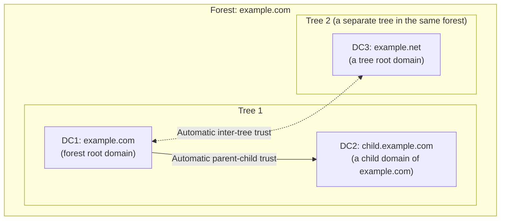

## Introduction

- **What You'll Learn From This Article**: This hands-on lab lets you **verify with your own eyes** the principle covered in [Understanding the Difference Between AD and DC, and Domains vs. Forests](/en/articles/ad-dc-fundamentals-guide) — that "only the domain partition stays confined to the domain, while the configuration and schema partitions are shared across the entire forest" — by actually building three domain controllers. You'll construct a forest root domain (`example.com`), a child domain (`child.example.com`), and a separate tree within the same forest (`example.net`), then use real commands like ADUC, `netdom`, and `repadmin` to verify exactly what's shared between them and what isn't.
- **Intended Audience**: This article is aimed at readers who've read [Understanding the Difference Between AD and DC, and Domains vs. Forests](/en/articles/ad-dc-fundamentals-guide) and grasp the concepts of domain/tree/forest, but want to get hands-on and actually confirm how they're built and how they interact.
- **Estimated Reading Time**: About 35 minutes (budget 2–3 hours if you're following along and building it yourself)

This article is part of the [Top 1% Series' full article guide](/en/sitemap), and the fourteenth article in the [Active Directory series](/en/sitemap#series-list). **This is a hands-on (get-your-hands-dirty) article, positioned as a capstone for the deep-dive articles that came before it.** Reading [Understanding the Difference Between AD and DC, and Domains vs. Forests](/en/articles/ad-dc-fundamentals-guide), [What's the Difference Between sysdm.cpl and netdom computername?](/en/articles/ad-computername-netdom-guide), [Understanding FSMO (Operations Master) Roles](/en/articles/fsmo-guide), and [Understanding AD "Sites" and Replication Topology](/en/articles/ad-sites-guide) beforehand is strongly recommended. For how to build the VMs themselves, see the [hands-on prep manual](/en/articles/handson-prep-guide) and [initial setup for Windows Server](/en/articles/windows-server-setup-guide).

## Prerequisites

This hands-on lab assumes you're already familiar with the content of the AD DS series so far. Three points in particular are essential:

- **Partition isolation**: The domain partition replicates only among DCs within the domain, while the configuration and schema partitions replicate among every DC in the entire forest. See [Understanding the Difference Between AD and DC, and Domains vs. Forests](/en/articles/ad-dc-fundamentals-guide) for details.
- **Trees and forests**: A **tree** is a collection of domains sharing a contiguous DNS namespace; a **forest** is a collection of trees. Domains within the same tree are automatically joined by a parent-child trust, and separate trees are also automatically joined by a trust relationship between their root domains.
- **FSMO**: The Schema Master and Domain Naming Master are held by a single DC across the entire forest, while the RID, PDC Emulator, and Infrastructure Master are each held by one DC per domain. See [Understanding FSMO (Operations Master) Roles](/en/articles/fsmo-guide) for details.

## Prerequisites for the Hands-On

- Three Windows Server 2025 VMs (each with initial setup, a static IP address, and SSH or RDP access completed via the [hands-on prep manual](/en/articles/handson-prep-guide) and [initial setup for Windows Server](/en/articles/windows-server-setup-guide)). This article uses the following hostnames:
  - `DC1` (example IP: `10.0.30.11`): The first DC of the forest root domain, `example.com`
  - `DC2` (example IP: `10.0.30.12`): The first DC of `child.example.com` (a child domain of `example.com`)
  - `DC3` (example IP: `10.0.30.13`): The first DC of `example.net` (a separate tree in the same forest as `example.com`)
- On all three, temporarily set the DNS server IP address to **the machine's own IP address** for now (you'll change this to point at `example.com`'s DNS server as the build progresses).
- This lab assumes a disposable, throwaway environment. Run it on an **isolated network segment** so it doesn't affect a production environment or an existing domain.

## Getting the Big Picture

### The Environment You'll Build



### The Overall Flow of Work

1. **Step 0**: Build DC1 as the first DC of the `example.com` forest root domain
2. **Step 1**: Promote DC2 as `child.example.com`, a child domain of `example.com`
3. **Step 2**: Promote DC3 as `example.net`, a separate tree in the same forest as `example.com`
4. **Verifications 1–5**: Confirm partition isolation, trust relationships, the global catalog, and FSMO placement with real commands

## Step 0: Build DC1 as the `example.com` Forest Root Domain

On DC1, open PowerShell as administrator, add the AD DS role, and then create the forest.

```powershell
# Add the AD DS role (no reboot required)
Install-WindowsFeature AD-Domain-Services -IncludeManagementTools

# Create a new forest (also installs the DNS server role)
Install-ADDSForest `
    -DomainName "example.com" `
    -DomainNetbiosName "EXAMPLE" `
    -InstallDns `
    -SafeModeAdministratorPassword (ConvertTo-SecureString "P@ssw0rd-DSRM!" -AsPlainText -Force)
```

`-SafeModeAdministratorPassword` is the password used for **DSRM (Directory Services Restore Mode)** — a dedicated recovery mode for when the AD DS database itself is corrupted. Keep it recorded separately, since it's distinct from your ordinary domain administrator account. After running the command and following the confirmation prompts, the machine reboots automatically and DC1 comes up as the first DC of `example.com`.

After the reboot, change DC2 and DC3's DNS settings from their temporary self-reference to **DC1's IP address** (at this point, DC2 and DC3 haven't joined the domain yet).

## Step 1: Promote DC2 as the Child Domain `child.example.com`

On DC2, after adding the AD DS role, promote it as a **child domain** of the existing forest (`example.com`). This operation requires credentials with **Enterprise Admin** privileges in `example.com`.

```powershell
Install-WindowsFeature AD-Domain-Services -IncludeManagementTools

Install-ADDSDomain `
    -NewDomainName "child" `
    -ParentDomainName "example.com" `
    -DomainType "ChildDomain" `
    -InstallDns `
    -Credential (Get-Credential "EXAMPLE\Administrator") `
    -SafeModeAdministratorPassword (ConvertTo-SecureString "P@ssw0rd-DSRM!" -AsPlainText -Force)
```

`-NewDomainName` takes only a **single label** (`child`), while `-ParentDomainName` specifies the parent domain's fully qualified name (`example.com`). Together, these create a domain whose full name is `child.example.com`.

## Step 2: Promote DC3 as the Separate Tree `example.net`

On DC3, similarly add the AD DS role, and then promote it as a **new tree** in the existing forest. The difference from the child domain is that you specify `TreeDomain` for `-DomainType`, and the **fully qualified name** (`example.net`) for `-NewDomainName`.

```powershell
Install-WindowsFeature AD-Domain-Services -IncludeManagementTools

Install-ADDSDomain `
    -NewDomainName "example.net" `
    -ParentDomainName "example.com" `
    -DomainType "TreeDomain" `
    -InstallDns `
    -Credential (Get-Credential "EXAMPLE\Administrator") `
    -SafeModeAdministratorPassword (ConvertTo-SecureString "P@ssw0rd-DSRM!" -AsPlainText -Force)
```

**Note that `-ParentDomainName` still specifies `example.com`.** This doesn't mean `example.net` becomes a "child" of `example.com` — this parameter specifies "join the same forest that `example.com` belongs to, as a new tree." The two tree roots (`example.com` and `example.net`) remain unrelated as DNS namespaces, while becoming members of the same forest.

<details>
<summary>A common snag around this point: the forward lookup zone doesn't show up</summary>

During the promotion of `child.example.com` or `example.net`, you may hit an error where delegation to the parent domain's DNS zone doesn't go smoothly and the zone doesn't show up correctly. In many cases, this is because DC2 or DC3's DNS server setting can't correctly reach `example.com` (DC1). Run `nslookup example.com` before promoting to confirm DC1 resolves correctly, then retry.

</details>

## Verification 1: Confirming Domain Partition Isolation

Once all three DCs have finished being promoted, first confirm that the domain partition really is isolated.

Create a new test user (say, `test-root-user`) in DC1's (`example.com`) ADUC (`dsa.msc`), then open ADUC on DC2 (`child.example.com`) and DC3 (`example.net`) and confirm **that user doesn't show up at all on either one.** This is because the domain partition only replicates among DCs within the same domain, and never replicates to any other domain at all.

## Verification 2: Confirming the Configuration and Schema Partitions Are Shared

Next, confirm that the configuration and schema partitions are shared across the entire forest. The clearest way to see this is with the site information covered in [Understanding AD "Sites" and Replication Topology](/en/articles/ad-sites-guide).

On DC1, open `dssite.msc` (Active Directory Sites and Services) and create a new site (say, `Test-Site`). After waiting a bit (or forcing synchronization with [repadmin /syncall](/en/articles/dc-health-check-guide)), open `dssite.msc` on DC2 and DC3 and confirm **the `Test-Site` you created shows up on both.** In contrast to the user object in Verification 1, site information belongs to the configuration partition, so it replicates to every DC in the entire forest.

## Verification 3: Confirming Automatic Trust Relationships

Use the `netdom` command to check the trust relationships between domains. Run the following on DC1:

```powershell
netdom query trust
```

You can confirm that, from `example.com`'s perspective, **both a parent-child trust with `child.example.com` and a tree-root trust with `example.net`** already exist automatically — despite never having manually configured either. Both of these trust relationships are **bidirectional and transitive**, meaning that, for example, a `child.example.com` user could technically access resources in `example.net` (given appropriate permissions), as long as it's all within the same forest.

## Verification 4: Confirming the Global Catalog and Cross-Forest Search

Among DC1, DC2, and DC3, **the first DC of each domain has the global catalog (GC) enabled by default.** From DC3's (`example.net`) ADUC, try searching for the user you created on `child.example.com` using the search feature. By **switching the search scope from the local domain to a GC-based search across the entire forest** (via ADUC's "Search" → "Entire Directory" menu, or by searching the whole forest from Active Directory Administrative Center), you can confirm that DC3 can directly search for objects in `child.example.com`. This is a concrete example of the mechanism covered in [Understanding the Difference Between AD and DC, and Domains vs. Forests](/en/articles/ad-dc-fundamentals-guide) — that "a single query to the GC completes a forest-wide search."

## Verification 5: Confirming FSMO Placement

Finally, actually confirm the placement of the five roles covered in [Understanding FSMO (Operations Master) Roles](/en/articles/fsmo-guide).

```powershell
netdom query fsmo
```

Running this command on DC1, DC2, or DC3 — it doesn't matter which — confirms that **the Schema Master and Domain Naming Master are always held solely by DC1** (the very first DC built in the forest). Meanwhile, you can also confirm that **the RID Master, PDC Emulator, and Infrastructure Master each exist independently in `example.com` (DC1), `child.example.com` (DC2), and `example.net` (DC3), respectively.** This directly reflects FSMO's design — some roles held once for the entire forest, others held once per domain.

## The View From the Top 1% Perspective

### How to Choose Between "Separate Domain," "Separate Tree," and "Separate Forest" in Practice

Each of the three patterns built in this hands-on lab has a distinct real-world reason for being chosen.

- **Why choose a child domain (`child.example.com`)**: Use this when you want to separate management authority or password policy by organization, location, or department, while staying within the same DNS namespace as the parent domain. A typical case is absorbing an independent organization through an acquisition or merger, where you want to keep management separate while preserving consistency with the existing namespace.
- **Why choose a separate tree (`example.net`)**: Use this when you want it to coexist within the same forest, but its DNS namespace is unrelated to the existing domain (or it uses a different brand name). This fits cases like multiple business subsidiaries within the same corporate group operating under entirely different brand names.
- **Why choose a completely separate forest**: Neither of the patterns in this article — use this when you want to **fully separate the privileges that affect the entire forest, like Schema Admins or Enterprise Admins.** When you need a strict security boundary (for example, operating an acquired organization as fully separate going forward), you split off an entirely separate forest rather than a child domain or separate tree, and configure inter-forest trusts individually as needed.

## Common Errors and How to Handle Them

- **Promoting a child domain or separate tree fails with "access denied"**: Check whether the credentials you passed to `-Credential` are actually a member of the forest's **Enterprise Admins** group. Domain Admin privileges alone aren't enough to add a new domain to the forest.
- **`Install-ADDSDomain` can't find the parent domain**: Check whether DC2 or DC3's DNS server setting correctly resolves DC1 (`example.com`). Promoting a child domain or separate tree requires correct name resolution to the parent domain (the forest root) as a prerequisite.
- **Site information doesn't show up in Verification 2**: Either wait for replication to propagate, or force synchronization with [repadmin /syncall](/en/articles/dc-health-check-guide). Keep in mind the default inter-site replication interval (a minimum of 15 minutes) and check patiently rather than assuming something's broken.

## Cleaning Up the Lab Environment

Once you're done verifying, **demote the child domain and separate tree first, and the forest root last** (doing it in the reverse order leaves a dependent domain behind after the forest root is already gone, which is much harder to untangle).

```powershell
# Run this on DC2 and DC3 first (each is the last DC in its domain, so the whole domain gets removed)
Uninstall-ADDSDomainController -LastDomainControllerInDomain -DemoteOperationMasterRole -Force

# Run this on DC1 last (the last DC of the last domain in the forest, so the whole forest gets removed)
Uninstall-ADDSDomainController -LastDomainControllerInDomain -DemoteOperationMasterRole -Force
```

## Summary

- The domain partition (objects like users) stays confined to the domain, while the configuration and schema partitions are shared across the entire forest — and actually creating and checking site information makes this difference visible with your own eyes.
- The difference between a child domain (`Install-ADDSDomain -DomainType ChildDomain`) and a separate tree (`-DomainType TreeDomain`) is whether the DNS namespace is contiguous with the parent domain — both join the same forest and are automatically linked by a trust relationship.
- The global catalog lets you search objects across any domain in the forest without querying each domain's DCs individually.
- Of the FSMO roles, the Schema Master and Domain Naming Master exist once for the whole forest, while the RID Master, PDC Emulator, and Infrastructure Master each exist independently per domain.

## References

- [Install a New Windows Server Active Directory Child or Tree Domain | Microsoft Learn](https://learn.microsoft.com/en-us/windows-server/identity/ad-ds/deploy/install-a-new-windows-server-2012-active-directory-child-or-tree-domain--level-200-)
- [Install-ADDSForest | Microsoft Learn](https://learn.microsoft.com/en-us/powershell/module/addsdeployment/install-addsforest)
- [Install-ADDSDomain | Microsoft Learn](https://learn.microsoft.com/en-us/powershell/module/addsdeployment/install-addsdomain)
