## Introduction

- **What you'll get from this article**: [What's the Difference Between sysdm.cpl and netdom computername](/en/articles/ad-computername-netdom-guide) mentioned in passing that "Windows computers traditionally carry two kinds of names: a NetBIOS name and a DNS hostname," but never explained why two names are needed, or why only the NetBIOS name is capped at an oddly specific 15 characters. This article systematically covers the historical origins of the NetBIOS protocol, the role WINS (Windows Internet Name Service) played, and the practically important current state you need to know right now: **Windows Server 2025 is the last LTSC release to include WINS — the WINS server role itself will be removed entirely from every release after it.**
- **Intended audience**: Readers who've heard the term "NetBIOS name" but can't explain why it exists, how it differs from a DNS hostname, or how much longer it matters.
- **Estimated reading time**: About 16 minutes

This article is part of the [Top 1% Series — Full Article Guide](/en/sitemap), and the 20th entry in the [Active Directory series](/en/sitemap#series-list). Reading [What's the Difference Between sysdm.cpl and netdom computername](/en/articles/ad-computername-netdom-guide) first will make this article easier to follow.

## Prerequisite Knowledge

- **NetBIOS name and DNS hostname**: The two kinds of names a Windows computer traditionally carries, touched on in [What's the Difference Between sysdm.cpl and netdom computername](/en/articles/ad-computername-netdom-guide).
- **DNS (Domain Name System)**: A hierarchical name-resolution system. The fundamentals are covered in [dns-guide](/en/articles/dns-guide).

## Getting the Big Picture

### In a nutshell

**A NetBIOS name is a "flat," non-hierarchical naming scheme designed for 1980s LANs, back before DNS was widespread — and it comes from a completely different era and design philosophy than a DNS hostname (a hierarchical, internet-standard naming scheme).** The reason Windows environments have carried two kinds of names side by side is that compatibility from the Windows NT era was dragged along, even long after Active Directory shifted its foundation to DNS. And that legacy of compatibility is about to reach a major turning point, ending with Windows Server 2025.

```mermaid
graph TB
    subgraph Era1["1980s: the LAN era"]
        NetBIOS["NetBIOS<br/>(flat naming, broadcast-based resolution)"]
    end
    subgraph Era2["1990s: toward routed networks"]
        NBT["NetBIOS over TCP/IP (NBT)<br/>+ WINS (a centralized name-resolution database)"]
    end
    subgraph Era3["2000s onward: the AD DS/DNS era"]
        DNS["DNS hostname<br/>(hierarchical, internet standard)"]
    end
    NetBIOS --> NBT
    NBT -.coexists for compatibility.-> DNS
    DNS -.WINS fully removed after Windows Server 2025.-> Future["Going forward: DNS alone"]
```

## Deep Dive into the Fundamentals

### Why NetBIOS was born, and why computer names top out at 15 characters

**NetBIOS** (Network Basic Input/Output System) was designed in 1983 for IBM's PC Network — a way for computers on the same LAN to find and talk to each other by name. TCP/IP and DNS weren't yet mainstream at the time, and NetBIOS was designed around a **flat namespace with no hierarchy**, premised on "broadcast to everyone on the same LAN segment and talk to whoever answers."

The real story behind the 15-character limit: a NetBIOS name is actually a fixed 16 bytes

A NetBIOS name is, by spec, **always a fixed 16 bytes long**. Of those, **the first 15 bytes are the name an administrator or user can specify**, and **the 16th byte — the so-called NetBIOS suffix — is reserved to indicate what kind of service that computer is offering** (for example, `0x00` indicates the workstation service, `0x20` indicates the file server service, and so on). The reason you can only enter up to 15 characters for a computer name traces directly back to this NetBIOS protocol spec: "the 16th byte is reserved for the service type." In contrast to a DNS hostname, where each label can run up to 63 characters, NetBIOS's constraint comes entirely from a different protocol's own concerns — nothing to do with DNS.

### WINS's role: name resolution beyond the reach of a broadcast

NetBIOS name resolution was originally premised on "broadcast within the same LAN segment." But once corporate networks started being split by routers into multiple segments and multiple sites, broadcasts could no longer reach across them. **WINS** (Windows Internet Name Service) was the fix Microsoft introduced for this. WINS maintained a single centralized server holding a "NetBIOS name to IP address" mapping table, and clients could query that WINS server directly instead of relying on a broadcast — enabling NetBIOS name resolution even across routers. Where DNS maps an FQDN (a hierarchical hostname) to an IP address, WINS mapped a NetBIOS name (a flat name up to 15 characters) to an IP address — functioning, in effect, as "**DNS for NetBIOS**."

### Windows 2000 onward: AD DS puts DNS in the driver's seat

Domains up through Windows NT 4.0 were identified purely by a NetBIOS domain name, with no dependency on DNS at all. But when Active Directory arrived with Windows 2000, domain names were redesigned to be built on the internet-standard DNS namespace (a hierarchical structure like `example.com`). As covered in [Understanding AD vs. DC, and Domains vs. Forests](/en/articles/ad-dc-fundamentals-guide), today's AD DS runs on standard protocols like LDAP and Kerberos, most of which assume DNS-based name resolution.

**The reason NetBIOS names weren't fully retired anyway is backward compatibility.** The logon name format `DOMAIN\username` — still familiar today — is a notation that assumes a NetBIOS domain name (the so-called down-level logon name). Plenty of legacy applications and network devices, for a long time, could only identify a computer by its NetBIOS name, not its DNS hostname.

## What Top-1% Engineers See

### WINS is ending: the current reality of Windows Server 2025 as the last LTSC to include it

**The single most practically important thing to know right now is that WINS is already deprecated as of Windows Server 2022, and Windows Server 2025 will be the last LTSC (Long-Term Servicing Channel) release to include the WINS server role.** Windows Server 2025 itself remains supported through November 2034, but every Windows Server release after it is slated to fully remove the WINS server role, its management MMC snap-in, and its associated APIs.

The reasons Microsoft gives for this removal: WINS and NetBIOS lack any protection against tampering or spoofing the way DNSSEC provides for DNS, putting them behind on security, and modern applications and cloud platforms — Active Directory included — are built around DNS by default.

What to do to prepare for the migration

Organizations running environments that depend on WINS need to first **inventory exactly which applications and devices depend on NetBIOS name resolution (queries to WINS)**. From there, the recommended path is a planned migration to DNS-based alternatives — conditional forwarders, split-brain DNS configurations (returning different resolution results internally vs. externally), or DNS suffix search lists. The longer a legacy application has been running unexamined, the greater the risk of an unexpected name-resolution failure once WINS is removed.

## Common Misconceptions and Pitfalls

- **Misconception 1: "A NetBIOS name is just a DNS hostname shortened to 15 characters."**
  A NetBIOS name and a DNS hostname aren't the same mechanism at different lengths. NetBIOS is an entirely separate, older protocol premised on a flat, non-hierarchical namespace that predates DNS. The 15-character limit itself has nothing to do with DNS — it comes from NetBIOS's own spec, where a name is a fixed 16 bytes and the last byte is reserved for the service type.
- **Misconception 2: "WINS was retired ages ago — there's no reason to think about it anymore."**
  WINS was deprecated as of Windows Server 2022, but it's still shipped through Windows Server 2025. Full removal only happens starting with releases after that. Assuming "it doesn't exist anymore" is premature — if your environment still depends on WINS, you need to plan a migration before Windows Server 2025's support ends in November 2034.
- **Misconception 3: "`DOMAIN\username` is just an old-fashioned habit with no real technical meaning."**
  This notation (the down-level logon name) is a formal authentication-name format premised on a NetBIOS domain name. It's not just a convention — it's living proof that NetBIOS's old naming rules still persist inside the authentication mechanism today.

## Troubleshooting Perspective

NetBIOS/WINS-related trouble is usually caused by a dependency on the old mechanism that nobody noticed was still there.

1. **Only one specific legacy application can't find a computer by name**: That application may only support NetBIOS name resolution (broadcast or a WINS query) and can't interpret a DNS hostname.
2. **After decommissioning a WINS server, some clients started throwing more name-resolution errors**: The pre-decommission inventory of dependent applications and devices may have been incomplete. Check whether the switch to DNS suffix search lists or conditional forwarders was actually finished.
3. **Trying to set a computer name longer than 15 characters throws an error**: This isn't a DNS hostname limitation — it's a constraint from the NetBIOS name's fixed 16-byte spec. If you want a longer DNS hostname alone, design around the fact that the NetBIOS name will automatically use the first 15 characters (or need separate adjustment).

### Prevention and Long-Term Countermeasures

- Systematically inventory any applications or devices that depend on WINS.
- For newly built environments, design around not depending on NetBIOS name resolution or WINS at all — standardize on DNS-based resolution from the start.
- With an eye on Windows Server 2025's support end date (November 2034), build resolving any remaining WINS dependency into your long-term roadmap.

## Summary

- A NetBIOS name is a flat, non-hierarchical naming scheme designed in the 1980s, before DNS became widespread — it comes from a different era and design philosophy than a DNS hostname.
- A computer name is capped at 15 characters because a NetBIOS name's spec is a fixed 16 bytes, with the last byte reserved for the service type — a constraint from the NetBIOS protocol itself.
- WINS was a centralized mechanism ("DNS for NetBIOS") that let NetBIOS name resolution work even beyond the reach of a broadcast.
- WINS was deprecated as of Windows Server 2022, and **Windows Server 2025 will be the last LTSC release to include it** — the WINS server role itself is slated for full removal from every subsequent release. Environments that depend on WINS need a planned migration to DNS-based resolution.

**What to keep in mind starting today**
1. Take a pass at inventorying whether your environment has any applications or devices that depend on WINS or NetBIOS name resolution.
2. For newly built environments, design from the start around not depending on NetBIOS name resolution.

## References

- [Name computers, domains, sites, and OUs | Microsoft Learn](https://docs.microsoft.com/en-us/troubleshoot/windows-server/identity/naming-conventions-for-computer-domain-site-ou)
- [WINS removal: Moving forward with modern name resolution | Microsoft Support](https://support.microsoft.com/en-us/topic/wins-removal-moving-forward-with-modern-name-resolution-f00381f0-7237-4f7b-8e78-aa6f9c5b279f)
- [Microsoft to remove WINS support after Windows Server 2025 | BleepingComputer](https://www.bleepingcomputer.com/news/microsoft/microsoft-to-remove-wins-support-after-windows-server-2025/)
