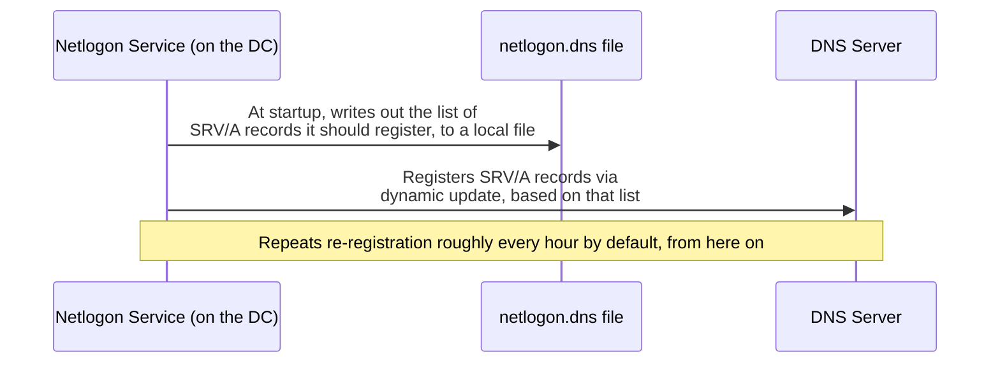

## Introduction

- **What You'll Learn From This Article**: [How DNS Zones and Records Work](/en/articles/dns-zones-records-guide) and [the Netlogon Service and Secure Channel](/en/articles/ad-netlogon-guide) covered the side where a client uses the DC Locator to "look up" SRV records. This article digs into the other side of that: **who actually "writes" those SRV records to DNS in the first place.** The answer is the Netlogon service itself, which holds **an entirely independent registration path from `ipconfig /registerdns`**, the command an ordinary client computer uses. Without understanding this difference, you'll waste time running an ineffective command when a new DC can't be found during a DC replacement.
- **Intended Audience**: Readers who know SRV records are used by the DC Locator, but can't explain concretely when, or by what, those SRV records actually get written to DNS.
- **Estimated Reading Time**: About 16 minutes

This article is part of the [Top 1% Series Complete Article Guide](/en/sitemap), and article 12.1 in the [Active Directory Series](/en/sitemap#series-list).

## Prerequisite Knowledge

- [The Netlogon Service and Secure Channel](/en/articles/ad-netlogon-guide): The premise that the Netlogon service is responsible for publishing a DC's role information as DNS SRV records.
- [How DNS Zones and Records Work](/en/articles/dns-zones-records-guide): The premise that an SRV record indicates "which server provides a specific service."

## Getting the Big Picture

**A DC's SRV records — the ones indicating the DC's own roles, like Kerberos, LDAP, and PDC emulator — are never something a human manually registers through DNS Manager.** **The Netlogon service itself automatically keeps registering its own role information to the DNS server, both when the DC starts up and repeatedly at a fixed interval afterward.** Without understanding this self-registration mechanism, you'll end up wasting time on a misguided remediation (running a client-oriented command on the DC, for instance) when you run into a failure like "the newly built DC can't be found by other DCs or clients."



## Deep Dive Into the Fundamentals

### How the Netlogon Service Registers Its Own Roles to DNS

**At the DC's startup, the Netlogon service computes the list of records it needs to register to DNS, and sends that list to the DNS server as a Dynamic DNS Update.** What gets registered includes **SRV records indicating which roles that DC itself provides** — the Kerberos Key Distribution Center (KDC), the LDAP server, the PDC emulator, the global catalog, and so on. **This registration isn't a one-time event — it repeats, resending roughly every hour by default** — so even if communication to the DNS server temporarily fails, it normally recovers naturally at the next re-registration cycle.

<details>
<summary>What Is the netlogon.dns File?</summary>

The Netlogon service also writes out the list of records it's supposed to register into a text file, **`%windir%\System32\config\netlogon.dns`.** Regardless of whether registration to the DNS server actually succeeded, this file is **a local record of "the list of records this DC recognizes, from Netlogon's perspective, as the ones it should register."** Comparing the DNS server's actual records against this file's contents gives you a clue for discovering a mismatch like "registration is supposedly being attempted, but it's never actually reflected on the DNS side."

</details>

### Why `ipconfig /registerdns` Is Effectively a No-Op on a DC

On an ordinary client computer, running `ipconfig /registerdns` has the DHCP Client service re-register that computer's own A/AAAA record (matching its hostname) and reverse-lookup PTR record to the DNS server. **On a domain controller, though, this role belongs not to the DHCP Client service, but to the Netlogon service.** A DC's own hostname record, just like its SRV records, **falls under the management of the Netlogon service's self-registration mechanism**, so **running `ipconfig /registerdns` on a DC effectively does nothing at all.** This is exactly why the remediation that's effective on a client device — "DNS registration seems off, so let's just try `ipconfig /registerdns`" — carries no meaning at all on a DC.

> **Important note**: This behavior — "`ipconfig /registerdns` is effectively a no-op on a DC" — is based on multiple practitioners' own verification and reports, not an explicitly guaranteed specification in Microsoft's official documentation. The behavior may differ by environment or OS version, so in actual incident response, prioritize `nltest /dsregdns` (covered below) or restarting the Netlogon service — the tools clearly provided for DCs specifically.

## What a Pro Sees Here (Top 1% Understanding)

### The First Command to Try When a New DC Can't Be Found

In real-world DC replacement work, when a newly built DC's SRV records just won't show up in DNS, you broadly have two options. **One is restarting the Netlogon service itself.** A service restart forcibly re-triggers the startup-time self-registration process, so it's a reliable method, but **at the moment of restart, that DC's own Netlogon-related processing (secure channel verification, for instance) temporarily pauses.** **The other is running the `nltest /dsregdns` command.** This command can forcibly redo just the registration of the DC-specific DNS records, without restarting the Netlogon service, and is **effective in situations where you want to redo just the registration immediately, without taking on the risk of stopping the service.** In real-world practice, it's reasonable to try `nltest /dsregdns` first, and only switch to the more disruptive option — restarting the service — if that doesn't resolve it.

<details>
<summary>A Concrete Diagnostic Procedure: Comparing netlogon.dns Against the DNS Server's Actual Records</summary>

```powershell
# Check the contents of the netlogon.dns file (the list of records that should be registered)
Get-Content "$env:windir\System32\config\netlogon.dns"

# Check whether the SRV record actually exists on the DNS server side
Resolve-DnsName -Type SRV _ldap._tcp.dc._msdcs.contoso.com

# Forcibly redo registration of the DC-specific DNS records, without restarting the service
nltest /dsregdns
```

If a record listed in `netlogon.dns` doesn't actually exist on the DNS server side, it's quite likely that **the dynamic update to the DNS server itself is failing** — the next thing to check is whether the relevant zone is configured to allow dynamic updates, and whether there's a problem on the communication path to the DNS server.

</details>

## Common Misconceptions and Pitfalls

- **Misconception 1: "`ipconfig /registerdns` is a DNS re-registration command that works the same way on any Windows computer."**
  On a domain controller, the role of DNS registration belongs to the Netlogon service, so `ipconfig /registerdns` carries effectively no meaning at all.
- **Misconception 2: "Once an SRV record is registered, it persists forever without needing anything further."**
  An SRV record is a dynamic entity, re-registered by the Netlogon service roughly every hour by default. Even if it's accidentally deleted on the DNS server side, it can get restored naturally at the next re-registration cycle.
- **Misconception 3: "You always have to restart the Netlogon service to force SRV records to re-register."**
  Using `nltest /dsregdns` lets you forcibly redo just the DNS record registration, without restarting the Netlogon service at all.

## Troubleshooting Perspective

1. **A newly built DC can't be found by other DCs or clients**: Compare the `netlogon.dns` file's contents against the actual records on the DNS server, to check whether the registration has actually taken effect.
2. **Something seems off with DNS registration, and you want to try something right away**: On a DC, run `nltest /dsregdns`, not `ipconfig /registerdns`.
3. **`nltest /dsregdns` doesn't improve things**: Check whether the relevant DNS zone is configured to allow dynamic updates, and whether there's a problem on the communication path to the DNS server; consider restarting the Netlogon service itself if needed.

## Summary

- A DC's SRV records are automatically registered by the Netlogon service itself, as a dynamic update to the DNS server, both at startup and roughly every hour afterward.
- The `netlogon.dns` file is a local record of the list of records the Netlogon service recognizes it should register.
- On a domain controller, `ipconfig /registerdns` carries effectively no meaning at all, since the role of DNS registration belongs to the Netlogon service.
- Using `nltest /dsregdns` lets you forcibly redo just the registration of DC-specific DNS records, without restarting the Netlogon service.

**Takeaways to Apply Today**
1. When you need to redo DNS registration on a DC, use `nltest /dsregdns`, not `ipconfig /registerdns`.
2. When you run into a failure where a new DC can't be found, make it a habit to first compare the `netlogon.dns` file against the actual DNS records.

## References

- [How can I force a domain controller (DC) to reregister its DNS records? | ITPro Today](https://www.itprotoday.com/windows-78/how-can-i-force-domain-controller-dc-reregister-its-dns-records)
- [Service (SRV) Locator Records Registered By Windows Domain Controllers | Jorge's Quest For Knowledge](https://jorgequestforknowledge.wordpress.com/2011/09/11/service-srv-locator-records-registered-by-windows-domain-controllers/)
