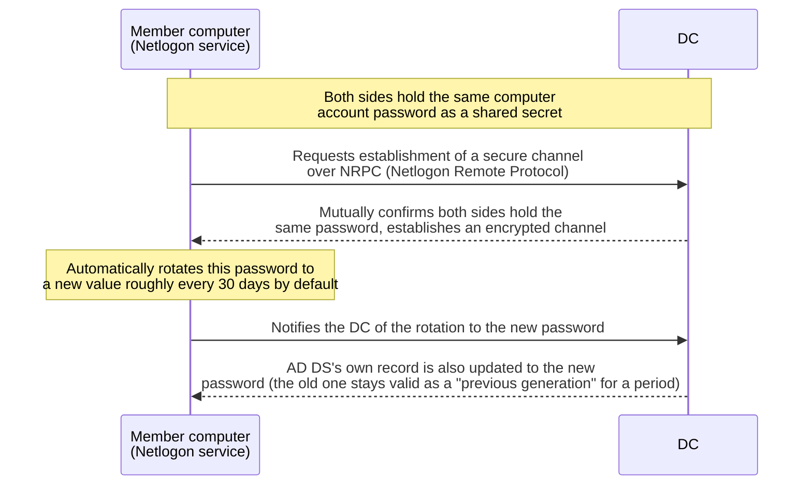

## Introduction

- **What You'll Learn From This Article**: The **Netlogon service** and the **secure channel**, both mentioned repeatedly in [What's the Difference Between sysdm.cpl and netdom computername?](/en/articles/ad-computername-netdom-guide) and [Understanding DNS Zones and Records](/en/articles/dns-zones-records-guide), get a systematic explanation of what mechanism each one actually is. In particular, this article covers the mechanism by which a machine account password automatically rotates every 30 days by default, and — along with a full diagnostic path — why the common real-world problem of "I restored a VM snapshot to an old state, and now it can't log on to the domain" happens.
- **Intended Audience**: This article is aimed at readers who've hit a "trust relationship" error and fixed it by rejoining the domain, but can't explain the root cause, as well as readers who've seen the name "Netlogon" but can't pin down what the service actually does.
- **Estimated Reading Time**: About 20 minutes

This article is part of the [Top 1% Series' full article guide](/en/sitemap), and the twelfth article in the [Active Directory series](/en/sitemap#series-list). Reading the computer account and secure channel prerequisites covered in [What's the Difference Between sysdm.cpl and netdom computername?](/en/articles/ad-computername-netdom-guide) first will make this article easier to follow.

## Prerequisites

- **Computer account passwords**: A domain-joined device gets a computer account created in AD DS, with that account's own password (a random value, rotated automatically every 30 days by default). See [What's the Difference Between sysdm.cpl and netdom computername?](/en/articles/ad-computername-netdom-guide) for details.
- **Two different meanings of "trust relationship"**: In an AD DS context, "trust relationship" carries two entirely distinct meanings: the **trust relationship (secure channel) between a member computer (or a DC) and a DC**, which is what this article covers, and a **trust relationship between domains** (a "trust") that links multiple domains or forests together. This article is about the former.

## Getting the Big Picture

### In a Nutshell

**The Netlogon service is what manages the encrypted communication channel — the secure channel — that a domain-joined device (a member computer, or a DC itself) establishes and maintains with a DC, using its own computer account's password as the key.** It helps to think of it as a mechanism where both sides mutually prove "is this PC really the computer account it claims to be, registered in AD DS?" using a shared secret — the password.



## Fundamentals, Explained Thoroughly

### The True Identity of the Secure Channel

The secure channel is an authenticated, encrypted communication path established on top of an RPC-based protocol called **NRPC** (Netlogon Remote Protocol). What anchors this authentication is the computer account password mentioned above. Both the member computer and the DC (more precisely, AD DS) are assumed to know this same password, and each side proves to the other "I really am that account." **This secure channel functions correctly only for as long as the password value both sides know actually matches.**

### The Three Main Roles of the Netlogon Service

The responsibilities the Netlogon service handles break down into three broad categories:

1. **DC discovery (the DC locator)**: At startup and logon, it uses DNS SRV records to search for the DC it should connect to. This is covered in more depth in [Understanding AD "Sites" and Replication Topology](/en/articles/ad-sites-guide).
2. **Establishing and maintaining the secure channel**: As described above, it establishes a trust relationship with the DC using the computer account password, and also handles the password's automatic rotation.
3. **Pass-through authentication**: For legacy authentication methods that don't rely on Kerberos, such as NTLM, the Netlogon service also relays the client's authentication request through to the DC.

### Automatic Machine Account Password Rotation, and What Happens Behind the Scenes

By default, a computer account's password gets automatically rotated to a new value roughly **every 30 days**, driven by the computer itself. As touched on in [What's the Difference Between sysdm.cpl and netdom computername?](/en/articles/ad-computername-netdom-guide), with every rotation, **AD DS keeps not just the latest password valid but also the previous generation's (N-2) password, for a certain grace period.** This acts as a buffer, so that if an authentication request happens to land on a different DC before the password-rotation notification has fully propagated through inter-DC replication, authentication still doesn't fail.

### Why Restoring a VM Snapshot to an Old State Triggers a "Trust Relationship Failure"

A very common problem in practice: **you restore a virtual machine's snapshot to some point reasonably far in the past, and that VM can no longer log on to the domain.** The logon screen shows an error along the lines of "The trust relationship between this workstation and the primary domain failed."

The knowledge covered so far lets you diagnose exactly what's going on:

1. At the moment the snapshot was taken, that VM's computer account password matched AD DS's record.
2. If the VM kept running afterward without the snapshot being restored, the Netlogon service would have automatically rotated the password roughly every 30 days, with AD DS's record following along.
3. **Now restore the snapshot back to that old point — only that VM's local memory of the password rolls back in time; AD DS's side (based on the memory of the other instance that kept running after the snapshot was taken) has already moved on to a newer password.**
4. As a result, the VM and AD DS disagree on the password, and establishing the secure channel fails. The "the previous generation's password stays valid for a period" buffer mentioned earlier does exist, but **if the snapshot is old enough, it exceeds even that tolerance.**

Understanding this mechanism naturally leads to the preventive measure: **if you genuinely need to restore a snapshot as part of your operations, avoid restoring one older than the default password rotation interval (roughly 30 days)** — and if you have no choice but to do so anyway, you need to explicitly resynchronize the secure channel afterward, using the method covered next.

### Diagnosing and Repairing the Secure Channel with `Test-ComputerSecureChannel` and `nltest`

You can check and repair the secure channel's state from the affected machine itself, with the following commands:

```powershell
# Check the state of the secure channel
Test-ComputerSecureChannel

# Check the state of the secure channel, and if it's broken, explicitly
# resynchronize both the local and AD DS passwords to repair it
# (only works on a member computer — not usable on a DC)
Test-ComputerSecureChannel -Repair

# You can also check with the nltest command
nltest /sc_verify:corp.example.com

# Reset the secure channel (the nltest version)
nltest /sc_reset:corp.example.com
```

**`-Repair` explicitly rebuilds just the secure channel, without needing to rejoin the domain.** In most cases, this alone resolves the "trust relationship failure" error, without resorting to the much heavier procedure of leaving and rejoining the domain.

<details>
<summary>When you need deeper diagnostics: Netlogon's debug log</summary>

For more complicated cases where `Test-ComputerSecureChannel` or `nltest` alone can't pin down the cause, you can enable the Netlogon service's own debug logging to see its detailed internal behavior.

```powershell
# Enable Netlogon debug logging
nltest /dbflag:0x2080ffff

# Disable it (always turn it back off once you're done investigating)
nltest /dbflag:0x0
```

Once enabled, detailed logs get written to `%windir%\debug\netlogon.log`. This log records detailed results of secure-channel establishment attempts and password verification, making it useful for investigating tangled failures that a single simple command can't isolate. Since it generates a lot of log output, be sure to disable it again once you're done investigating.

</details>

## The View From the Top 1% Perspective

### Why Netlogon Is Treated as Such a Critical Security Boundary: The Zerologon Vulnerability

One event that symbolizes just how important the Netlogon service is: **Zerologon** (CVE-2020-1472), a vulnerability disclosed in 2020. By exploiting a flaw in how NRPC's encryption was implemented, this vulnerability was extremely severe — it let **an attacker with no credentials at all reset a DC's own computer account password to an empty string, remotely, over the network.** Losing control of a DC's own computer account password is effectively equivalent to losing administrative control of the entire domain, and leads to a complete takeover of the whole AD environment.

What this vulnerability shows is that **Netlogon isn't just "some background service that helps with logon" — it underpins the very foundation of trust that all of AD DS rests on.** Breaking the secure-channel mechanism Netlogon provides (mutual authentication via a shared password) means breaking the very mechanism that guarantees "who is who." This particular vulnerability was fixed as of the August 2020 security update, but the fact that Netlogon-related vulnerabilities keep getting discovered and patched over time is itself a testament to how critical this service is. Keeping security updates current — on both DCs and member computers — is the single most fundamental and important defense here, more so than any other measure.

## Common Misconceptions and Pitfalls

- **Misconception 1: "A broken secure channel means the same thing as being fully removed from the domain"**
  The computer account itself keeps existing in AD DS even after the secure channel breaks. In many cases, `Test-ComputerSecureChannel -Repair` recovers things with just a password resync, no domain rejoin needed.
- **Misconception 2: "A 'trust relationship failure' always refers to a problem with the trust relationship (trust) between domains"**
  The "trust relationship failure" covered in this article is a secure-channel problem between a member computer and a DC — a different thing entirely from a trust linking multiple domains or forests. It's worth noting that the same term, "trust relationship," refers to completely different things depending on context.
- **Misconception 3: "Automatic machine account password rotation is a fully invisible background process administrators never need to think about"**
  That's usually true, but you need to be aware that **an operation like "turning back the clock" — restoring a VM snapshot — can break that assumption.**

## The Troubleshooting Perspective

Triage Netlogon and secure-channel issues along the axis of: **"do this computer and AD DS actually agree on the same password?"**

1. **The logon screen shows a "trust relationship failure" error**: Run `Test-ComputerSecureChannel` on the affected machine to check the secure channel's state. If it's broken, try `-Repair` to fix it (a DC can't use `-Repair`, so handle it via `repadmin` or similar, covered in a later article).
2. **A VM stopped being able to log on right after a snapshot restore**: As covered in this article, suspect that the password rotated automatically after the snapshot was taken. If the snapshot is more than 30 days old, this is very likely the cause.
3. **A specific DC keeps generating a flood of Netlogon-related event log entries (such as event ID 5719)**: Suspect a problem with that DC's own computer account password.
4. **Simple commands can't pin down the cause**: Enable Netlogon's debug log (`nltest /dbflag`) and check the detailed internal behavior in `netlogon.log`.

### Preventive Measures and Permanent Fixes

- If VM snapshots are part of your operational workflow, avoid restoring one older than the default password rotation interval (roughly 30 days).
- If you absolutely must restore an older snapshot, make it standard practice to always check the secure channel's state with `Test-ComputerSecureChannel` afterward.
- Apply security updates addressing Netlogon-related vulnerabilities (such as Zerologon) promptly, on both DCs and member computers.

## Summary

- The Netlogon service handles three roles that form the foundation of AD authentication: DC discovery, establishing and maintaining the secure channel, and pass-through authentication.
- The secure channel is an authenticated, encrypted communication path between a member computer (or a DC) and a DC, keyed by the computer account's password.
- Because a computer account's password rotates automatically roughly every 30 days by default, restoring a VM snapshot older than that causes a secure-channel mismatch (a "trust relationship failure").
- `Test-ComputerSecureChannel -Repair` rebuilds just the secure channel without a domain rejoin, and is the first recovery step to reach for in practice.

**Things to Keep in Mind From Today**
1. When working with VM snapshots, avoid restoring to a state older than the default password rotation interval (roughly 30 days).
2. When you hit a "trust relationship failure" error, try `Test-ComputerSecureChannel -Repair` before reaching for a full domain rejoin.

## References

- [How the Secure Channel Works | Microsoft Learn](https://learn.microsoft.com/en-us/previous-versions/windows/it-pro/windows-2000-server/bb742499(v=technet.10))
- [Test-ComputerSecureChannel | Microsoft Learn](https://learn.microsoft.com/en-us/powershell/module/microsoft.powershell.management/test-computersecurechannel)
- [CVE-2020-1472 | Microsoft Security Response Center](https://msrc.microsoft.com/update-guide/vulnerability/CVE-2020-1472)
