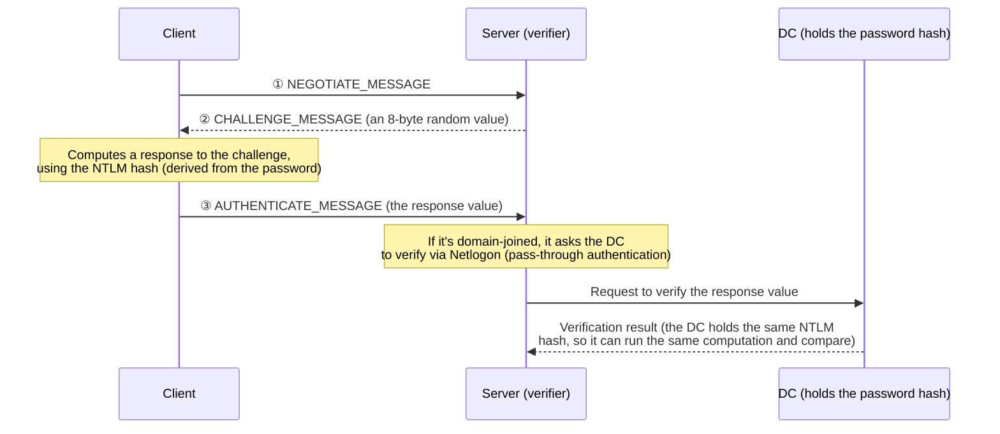

## Introduction

- **What You'll Learn From This Article**: Building on the comparison table in [How Kerberos Authentication Works](/en/articles/ad-kerberos-guide), understand **NTLM's own internal mechanism**, following its actual three-stage exchange: Negotiate, Challenge, and Authenticate. You'll also learn the structural reason **non-domain-joined machines and workgroup environments still have to rely on NTLM today**, and an existing workaround for it: the **KDC Proxy**.
- **Intended Audience**: Readers who understand how NTLM differs from Kerberos, but can't explain NTLM authentication's own internal mechanism — specifically, what the challenge-response exchange is actually computing.
- **Estimated Reading Time**: About 18 minutes

This article is part of the [Top 1% Series Complete Article Guide](/en/sitemap), and article 13.1 in the [Active Directory Series](/en/sitemap#series-list). Reading [How Kerberos Authentication Works](/en/articles/ad-kerberos-guide) first will make this article's comparisons easier to follow.

## Prerequisite Knowledge

- **Contrast With Kerberos**: The ticket-based authentication approach covered in [How Kerberos Authentication Works](/en/articles/ad-kerberos-guide).
- **Netlogon and the Secure Channel**: The trust relationship between a server and a DC, covered in [How the Netlogon Service and Secure Channel Work](/en/articles/ad-netlogon-guide). This mechanism operates behind the scenes of NTLM verification.

## Getting the Big Picture

NTLM, true to its name, descends from the old **NT LAN Manager** protocol, and verifies identity through a **challenge-response** scheme — a fundamentally different idea from Kerberos.

## Deep Dive Into the Fundamentals

### What Each of the Three Messages Actually Means

1. **NEGOTIATE_MESSAGE**: The client tells the server "I'd like to start NTLM authentication," presenting the features it supports (character encoding, whether signing is required, and similar).
2. **CHALLENGE_MESSAGE**: The server generates an **8-byte random value (the challenge)** and sends it back to the client. **This value is single-use, different on every authentication attempt.**
3. **AUTHENTICATE_MESSAGE**: The client sends back, as its response value, **the result of computing HMAC-MD5 over data that includes this challenge, using the NTLM hash (derived from the password) as the key** (this is how the now-standard Net-NTLMv2 works).

**At no point does the password itself, or the NTLM hash itself, ever travel across the network.** What travels across the network is only "the result of a computation that used the NTLM hash as a key, against the challenge the server issued."

How Does the Verifier Know the "Correct" Answer?

**The verifier (the server, or the DC it queries) already holds the target account's NTLM hash ahead of time, in AD DS (or the local SAM database).** When verifying the response value received from the client, the verifier **runs the exact same computation itself, using the NTLM hash it holds.** If the result matches the response value sent by the client, it can conclude "the client knows the correct password, since it was able to derive the same NTLM hash." This is the same underlying principle as Kerberos's pre-authentication (encrypting and decrypting a timestamp): "use the fact that both sides can independently compute the same value, as proof of identity."

### When the Server Itself Isn't a DC, Who's Actually Verifying?

**When the server itself is an ordinary domain-joined member server, it doesn't hold domain users' NTLM hashes itself.** In this case, the server uses the secure channel established between the server and the DC — covered in [How the Netlogon Service and Secure Channel Work](/en/articles/ad-netlogon-guide) — to **delegate the actual verification of the response value received from the client to the DC itself.** This is **pass-through authentication.** The server itself never judges whether the client's response value is correct — it judges purely based on "whether the DC said it was correct." This property — **a query to the DC occurs on every single authentication** — is the concrete identity behind "a query to the DC on every attempt," one of the differences listed in [the comparison table with Kerberos](/en/articles/ad-kerberos-guide#the-difference-between-kerberos-and-ntlm-authentication).

## What a Pro Sees Here (Top 1% Understanding)

### The Structural Reason Non-Domain-Joined Machines Still Have to Rely on NTLM

**For Kerberos to work, both the client and the server need to be in a relationship where they can each prove their legitimacy through the same KDC (a trusted realm).** A machine that isn't domain-joined, or a local account in a workgroup environment, **simply has no corresponding KDC at all.** A local account's password information only ever lives in that one machine's local SAM database, and there's no party there that can issue a Kerberos ticket.

**NTLM, by contrast, is a mechanism built on a looser premise: "it works as long as the verifier can obtain the target account's NTLM hash from somewhere."** For authentication between local accounts, the verifier (the very PC being accessed) holds that exact local account's NTLM hash in its own SAM database, so verification completes on the spot, with no third party like a KDC involved at all. **This structural looseness — working even where no trust foundation like a KDC exists — is the real reason non-domain-joined machines keep depending on NTLM.**

### An Existing Workaround: the KDC Proxy

That said, there are plenty of real-world scenarios where you'd want Kerberos even from a non-domain-joined machine (for example: accessing a domain resource inside the company, from an outside PC, via a Remote Desktop Gateway). The existing mechanism addressing this is the **KDC Proxy.** **A KDC Proxy server relays (proxies) the Kerberos exchange to a DC on the client's behalf**, letting the client obtain a Kerberos ticket over HTTPS, even when the client itself can never directly reach the DC (for example, when it can't communicate with the DC directly from an outside network). This is positioned as the precursor case for a newer mechanism, covered in the next article: **IAKerb and the local KDC.**

## Common Misconceptions and Pitfalls

- **Misconception 1: "In NTLM authentication, the password or its hash travels across the network."**
  Only "a response value computed using the NTLM hash as a key, against the challenge" ever travels across the network. The NTLM hash itself is never sent.
- **Misconception 2: "A server accepting NTLM authentication judges the password's correctness by itself."**
  When the server itself isn't a DC, verifying the response value is delegated to the DC, through pass-through authentication via Netlogon.
- **Misconception 3: "A non-domain-joined machine can only ever use NTLM, forever."**
  The KDC Proxy is an existing mechanism that already addresses this, and the newer IAKerb and local KDC mechanisms, covered in the next article, are emerging too.

## Troubleshooting Perspective

1. **NTLM authentication fails on a domain member server**: Check whether pass-through authentication is working correctly, and whether the secure channel between the server and the DC is healthy, using `Test-ComputerSecureChannel`, covered in [How the Netlogon Service and Secure Channel Work](/en/articles/ad-netlogon-guide).
2. **NTLM authentication is unusually slow on one specific server**: Since that server depends on pass-through authentication, querying the DC every single time, check whether there's a problem on the network path (latency, and similar) to the DC.
3. **A non-domain-joined machine can't reach internal resources over Kerberos**: Check whether a KDC Proxy is configured, or consider using IAKerb/local KDC, covered in the next article.

## Summary

- NTLM authentication is a challenge-response scheme, completed through a three-message exchange: Negotiate, Challenge, and Authenticate.
- Only a response value, computed using the NTLM hash as a key, ever travels across the network — the password or the hash itself never does.
- When the server itself isn't a DC, verifying the response value gets delegated to the DC through pass-through authentication, querying the DC on every single authentication attempt.
- Non-domain-joined machines depend on NTLM precisely because Kerberos's premise, a KDC, simply doesn't exist for them. The KDC Proxy is an existing workaround.

**Takeaways to Apply Today**
1. When troubleshooting an NTLM authentication issue, check the secure channel between the server and the DC, on the premise that verification itself happens at the DC.
2. Never treat "a non-domain-joined machine can't use Kerberos" as a fixed assumption — stay aware of existing workarounds like the KDC Proxy.

## References

- [NTLM Overview | Microsoft Learn](https://learn.microsoft.com/en-us/windows-server/security/kerberos/ntlm-overview)
- [Microsoft NTLM | Microsoft Learn](https://learn.microsoft.com/en-us/windows/win32/secauthn/microsoft-ntlm)
- [KDC Proxy Protocol [MS-KKDCP] | Microsoft Learn](https://learn.microsoft.com/en-us/openspecs/windows_protocols/ms-kkdcp/5bcebb8d-b747-4ee5-9453-428aec1c5c38)
