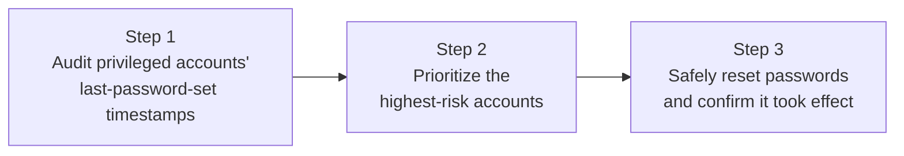

## Introduction

- **What You'll Learn From This Article**: Building on the risk revealed in [the incident investigation hands-on for why you can't log in as Administrator after a new DC promotion](/en/articles/ad-dc-replace-ntlm-lockout-investigation-guide) — "**an account whose password hasn't changed in a long time may only hold an older encryption type's key**" — learn the procedure for **auditing this yourself and resolving it preventively, before a DC replacement.** The goal is to be able to treat this as a preventive measure taken in advance, not a reactive fix after the fact.
- **Intended Audience**: Readers who've read the previous incident-investigation article and want to know how to prevent a similar incident before it happens, or readers planning an upcoming DC replacement or domain migration.
- **Estimated Reading Time**: About 20 minutes, including the hands-on exercise

This article is part of the [Top 1% Series Complete Article Guide](/en/sitemap), and article 15.2 in the [Active Directory Series](/en/sitemap#series-list).

## Prerequisite Knowledge

- **The AES Key Gap Risk**: The relationship between a password change and Kerberos keys, covered in [the incident investigation hands-on](/en/articles/ad-dc-replace-ntlm-lockout-investigation-guide).

## Getting the Big Picture

This hands-on covers three steps.



## Hands-On Steps

### Step 1: List Out Privileged Accounts' Last-Password-Set Timestamps

First, list the last-password-set timestamps for accounts belonging to the main privileged groups: Administrators, Domain Admins, and Enterprise Admins.

```powershell
$privilegedGroups = "Administrators", "Domain Admins", "Enterprise Admins"
$targets = foreach ($group in $privilegedGroups) {
    Get-ADGroupMember -Identity $group -Recursive | Where-Object { $_.objectClass -eq "user" }
}
$targets | Select-Object -Unique -ExpandProperty SamAccountName |
    ForEach-Object {
        Get-ADUser -Identity $_ -Properties PasswordLastSet, whenCreated |
            Select-Object SamAccountName, PasswordLastSet, whenCreated
    } | Sort-Object PasswordLastSet
```

**Output (illustrative):**

```
SamAccountName  PasswordLastSet       whenCreated
--------------  ---------------       -----------
Administrator   2019-04-02 09:12:00   2019-04-02 09:10:15
svc-backup       2020-11-15 14:30:00   2020-11-15 14:28:40
j.tanaka         2026-08-10 10:00:00   2024-03-01 09:00:00
```

**Sorting this list by last-password-set timestamp, oldest first, lets you see at a glance "which account is most likely to hold only the oldest encryption type's key."** The built-in Administrator account, in particular, often has never had its password changed since the domain was created, and **it's not uncommon for it to sit right at the top of this list.**

### Step 2: Prioritize the Highest-Risk Accounts

From the audited list, identify accounts matching the following two criteria as **the highest-priority, highest-risk accounts to address.**

- **It's the built-in Administrator account** (since it exists in every single domain, and is genuinely likely to get used during DC-replacement troubleshooting)
- **Its last-password-set timestamp is still at domain creation, or at least several years old**

```powershell
# Extract accounts where whenCreated and PasswordLastSet are nearly identical (i.e., never changed)
$targets | Select-Object -Unique -ExpandProperty SamAccountName |
    ForEach-Object {
        Get-ADUser -Identity $_ -Properties PasswordLastSet, whenCreated
    } | Where-Object {
        ($_.PasswordLastSet - $_.whenCreated).TotalMinutes -lt 5
    } | Select-Object SamAccountName, PasswordLastSet
```

**Output (relevant part, illustrative):**

```
SamAccountName  PasswordLastSet
--------------  ---------------
Administrator   2019-04-02 09:12:00
```

**An account whose `whenCreated` (creation timestamp) and `PasswordLastSet` (last-password-set timestamp) sit nearly identical means "the password set at creation has never once been changed."** In this hands-on's example, the Administrator account matched exactly this criterion.

### Step 3: Safely Reset the Password and Confirm It Took Effect on the New DC

Once you've identified the highest-risk accounts, reset their passwords in a planned way, **before the actual cutover of a DC-replacement operation.**

```powershell
# Generate a safe new password and reset it
$newPassword = ConvertTo-SecureString -String "<a strong new password>" -AsPlainText -Force
Set-ADAccountPassword -Identity Administrator -NewPassword $newPassword -Reset
```

<details>
<summary>Why a Second Reset Is Sometimes Recommended, Rather Than Just One</summary>

Due to an internal AD implementation quirk, **right after a password change, the new key material can first get written into a "staging" area (called `KerberosNew`), without yet taking effect in the area holding the currently active key (`Kerberos`).** **This "staging" material only gets promoted to "currently active" the next time the password gets changed again** — so for an especially important account, **resetting it twice, with some time in between, rather than stopping at a single reset,** is recommended as the more reliable approach.

</details>

After resetting, confirm this account's password change has correctly replicated to every DC, including the new one.

```powershell
repadmin /showrepl <new-DC-hostname>
```

**Building this step into a DC replacement's formal work procedure prevents the kind of Administrator login-failure incident encountered in [the previous incident investigation](/en/articles/ad-dc-replace-ntlm-lockout-investigation-guide), ahead of time.**

## What a Pro Sees Here (Top 1% Understanding)

### "Auditing" Is Never a Task You Only Need to Perform Once

The audit you performed in this hands-on **isn't a one-time task you only need to perform right before a DC replacement.** Accounts inside an organization keep changing over time — some newly created, and others left behind with a password that never gets changed for a long time. **"How old a password is" connects structurally not only to how old its encryption type is, but also to [the risk of a guessable password staying in use indefinitely](/en/articles/ad-fgpp-handson-guide).** A top-1% engineer treats this audit not as a task tied to the specific event of a DC replacement, but as **a recurring part of regular security operations, built right into the calendar.**

## Common Misconceptions and Pitfalls

- **Misconception 1: "A password audit is a special task only needed at the time of a DC replacement."**
  The risk tied to password age keeps accumulating continuously, regardless of whether a DC replacement is happening. Regular auditing is preferable.
- **Misconception 2: "Resetting a password once always, instantly and completely, propagates every key."**
  Due to an internal AD implementation quirk, resetting an especially important account twice is sometimes recommended as the more reliable approach.
- **Misconception 3: "Auditing only the built-in Administrator account is sufficient."**
  A service account, or a long-tenured individual administrator's account, can carry the same risk, and should be included in the audit's scope too.

## Troubleshooting Perspective

1. **The audit script flags more accounts as "at risk" than expected**: Check the organization's actual operating practice (whether a regular password-rotation policy exists) and narrow the priority list further.
2. **You reset the password, but can't confirm it took effect on the new DC**: Use `repadmin /showrepl` to check whether a replication error is occurring.
3. **A service stopped starting after you reset a service account's password**: Whatever service uses that password also needs its own configuration updated after the change. Consider adopting a mechanism like [gMSA (group managed service accounts)](/en/articles/ad-gmsa-handson-guide), which frees you from password management entirely.

## Summary

- Auditing privileged accounts' last-password-set timestamps before a DC replacement lets you grasp the AES key gap risk ahead of time.
- An account where `whenCreated` and `PasswordLastSet` are nearly identical is a high-risk account whose password has never been changed.
- For an important account, resetting its password twice, rather than just once, is sometimes recommended as the more reliable approach.
- This audit isn't a task tied solely to a DC replacement — it should be performed repeatedly, as part of regular security operations.

**Takeaways to Apply Today**
1. Whenever you plan a DC replacement or domain migration, always build a privileged-account password audit into the very first step of your work procedure.
2. Build password auditing into the calendar as part of regular security operations, not something tied only to a specific event.

## References

- [The Incident Investigation Hands-On for Why You Can't Log In as Administrator After a New DC Promotion](/en/articles/ad-dc-replace-ntlm-lockout-investigation-guide)
- [Set-ADAccountPassword | Microsoft Learn](https://learn.microsoft.com/en-us/powershell/module/activedirectory/set-adaccountpassword)
