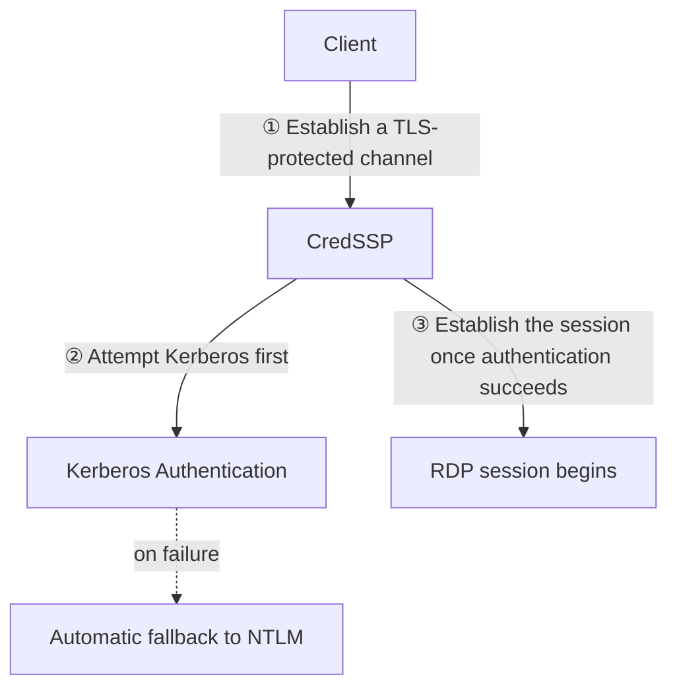

## Introduction

- **What You'll Learn From This Article**: Building further on the premise touched on in [the incident investigation into why you can't log in as Administrator after a new DC promotion](/en/articles/ad-dc-replace-ntlm-lockout-investigation-guide) — that "RDP's popup authentication and Windows's own logon process are two separate exchanges" — understand the mechanism underneath: **RDP's NLA (Network Level Authentication) actually runs through a mechanism called CredSSP, which tries Kerberos first and automatically falls back to NTLM.** Building on this, systematically organize three real changes that landed with Windows 11 24H2 and Windows Server 2025 — **NTLMv1's removal**, **strengthened duplicate-SID detection for cloned machines**, and **Credential Guard being enabled by default** — and how they actually affect real-world practice.
- **Intended Audience**: Readers who understood, from [Understanding IAKerb and LocalKDC](/en/articles/ad-iakerb-localkdc-guide), that the claim "NTLM is disabled by default in Windows Server 2025" is inaccurate, but can't concretely explain what actually did change in Windows Server 2025 and Windows 11 24H2.
- **Estimated Reading Time**: About 20 minutes

This article is part of the [Top 1% Series Complete Article Guide](/en/sitemap), and article 13.4 in the [Active Directory Series](/en/sitemap#series-list).

## Prerequisite Knowledge

- [Understanding How NTLM Authentication Works From a Top 1% Perspective](/en/articles/ad-ntlm-mechanism-guide): The basics of NTLM's challenge-response scheme are a prerequisite.
- [Understanding IAKerb and LocalKDC From a Top 1% Perspective](/en/articles/ad-iakerb-localkdc-guide): NTLM's real deprecation roadmap is a prerequisite.

## Getting the Big Picture

The credentials-entry popup shown during an RDP connection is driven by a mechanism called **NLA** (Network Level Authentication). But **NLA is really just the name of a policy — "finish authentication before connecting" — and the actual processing happens through a separate mechanism, `CredSSP`.**

**CredSSP first attempts authentication via Kerberos, and automatically falls back to NTLM if Kerberos can't be used for some reason.** The incident confirmed in [the incident investigation](/en/articles/ad-dc-replace-ntlm-lockout-investigation-guide) — "RDP's popup authenticated fine, but the subsequent logon screen rejected it" — can be explained as a combination of **this automatic fallback behavior, and the fact that the popup stage (NLA/CredSSP) and the actual logon process to the desktop operate at separate timings, under separate criteria.**

## Deep Dive Into the Fundamentals

### Change 1: NTLMv1's Removal (NTLMv2 Remains Usable)

Starting with Windows 11 24H2 and Windows Server 2025, **support for NTLMv1, an older version of NTLM, was removed.** What matters here is that this is **an entirely separate change** from the claim corrected in [Understanding IAKerb and LocalKDC](/en/articles/ad-iakerb-localkdc-guide) — "NTLM is disabled by default." **Only NTLMv1 got removed — NTLMv2, still widely used today, remains fully usable.** Lumping this together under the single word "NTLM" causes you to miss this exact distinction in granularity.

### Change 2: Strengthened Duplicate-SID Detection for Cloned Machines

Launching multiple instances from an AMI (machine image) on AWS is extremely common in real-world practice. But **if multiple cloned machines exist without going through a SID-regenerating step like `sysprep`, they end up sharing the same SID.** Starting with recent cumulative updates, **Windows now detects this duplicate SID and blocks authentication itself.**

How This Change Relates to the Incident Covered in [the Computer Name Article](/en/articles/ad-computername-netdom-guide)

The incident covered in [What's the Difference Between sysdm.cpl and netdom computername?](/en/articles/ad-computername-netdom-guide) — **DC① joining the domain under DC②'s own hostname, overwriting its computer account password** — was a problem caused by duplicate "names." **This strengthened duplicate-SID detection defends against a duplicate of a more fundamental identifier — the SID — rather than the "name."** When launching multiple instances from an AWS AMI, cloning without running `sysprep` produces **multiple genuinely identical machines at the SID level, even if their hostnames have been changed.** This strengthened check now surfaces the problem, in such environments, as a visible authentication error.

### Change 3: Credential Guard Enabled by Default

Starting with Windows 11 22H2 and Windows Server 2025, a feature called **Credential Guard** got enabled by default. This is a mechanism that **uses virtualization-based security (VBS) to store "derived" credential material — like an NTLM hash or a Kerberos TGT — in a protected region, isolated from the ordinary OS execution environment.**

How This Change Relates to [the Unconstrained Delegation Article](/en/articles/ad-unconstrained-delegation-handson-guide)

The danger confirmed in [the unconstrained delegation hands-on](/en/articles/ad-unconstrained-delegation-handson-guide) — **an attacker extracting and abusing a TGT left sitting in a server's memory** — was premised on "if you can seize that server's admin or SYSTEM privilege, you can freely access the credential material in memory." **In an environment with Credential Guard enabled, the ordinary OS execution environment (including admin and SYSTEM privilege) can no longer directly access this protected region, making extracting the TGT itself significantly harder.** That said, this doesn't neutralize the structural danger of unconstrained delegation itself — it needs to be understood as **an additional defensive layer that raises the difficulty of the attack.**

## What a Pro Sees Here (Top 1% Understanding)

### Always Distinguish Granularity When Grasping "What Changed in Windows Server 2025"

The three changes covered in this article are **each changes at an entirely different layer.** NTLMv1's removal is a change to "which protocol version is supported"; strengthened duplicate-SID detection is strengthened validation of "a machine identifier's uniqueness"; Credential Guard is strengthened defense of "where credential material gets stored." **Summarizing all of it under one statement, "Windows Server 2025 strengthened security," makes it impossible to concretely judge which change actually affects which part of your own environment.** A top-1% engineer, when researching a new OS version's changes, **always classifies and organizes whether a change actually belongs to the "protocol," "identifier validation," or "data storage location" layer.**

## Common Misconceptions and Pitfalls

- **Misconception 1: "NTLMv1 got removed, so all of NTLM is now unusable."**
  Only NTLMv1 got removed — NTLMv2, still widely used today, remains fully usable.
- **Misconception 2: "Strengthened duplicate-SID detection is a problem specific to AWS or cloud environments."**
  This is a change to Windows itself, affecting any environment, cloud or on-premises alike, wherever a cloned machine exists without having run `sysprep`.
- **Misconception 3: "Enabling Credential Guard eliminates the danger of unconstrained delegation itself."**
  Credential Guard is an additional defensive layer that raises the difficulty of the attack — it doesn't fundamentally resolve [unconstrained delegation's own structural danger](/en/articles/ad-unconstrained-delegation-handson-guide).

## Troubleshooting Perspective

1. **Authentication errors started occurring across multiple instances cloned from an AMI**: Check whether `sysprep` actually ran correctly on each instance, regenerating its SID.
2. **RDP connection authentication started failing from an old client**: Check whether that client is using an old implementation that only supports the now-removed NTLMv1.
3. **A specific legacy application stopped working after enabling Credential Guard**: Check whether that application was attempting to directly access credential material, in a way that never assumed it would be protected.

## Summary

- RDP's NLA is implemented through a mechanism called CredSSP, which tries Kerberos first and automatically falls back to NTLM as needed.
- Windows 11 24H2 and Windows Server 2025 introduced three changes at different layers: removing NTLMv1 (not NTLMv2), strengthening duplicate-SID detection for cloned machines, and enabling Credential Guard by default.
- Strengthened duplicate-SID detection for cloned machines is a change that's especially likely to affect real-world practice, wherever an instance got cloned from an AMI or similar without running `sysprep`.
- Credential Guard doesn't resolve Kerberos's structural danger in something like unconstrained delegation — it's an additional defensive layer that raises the difficulty of the attack.

**Takeaways to Apply Today**
1. When researching a new OS version's changes, classify and organize which layer each change actually belongs to — "protocol," "identifier validation," or "data storage location."
2. When cloning instances or machines from an AMI or template, always build running `sysprep` into your standard procedure.

## References

- [How Authentication Works When You Use Remote Desktop | syfuhs.net](https://syfuhs.net/how-authentication-works-when-you-use-remote-desktop)
- [Credential Guard Overview | Microsoft Learn](https://learn.microsoft.com/en-us/windows/security/identity-protection/credential-guard/)
- [NTLM Overview | Microsoft Learn](https://learn.microsoft.com/en-us/windows-server/security/kerberos/ntlm-overview)
