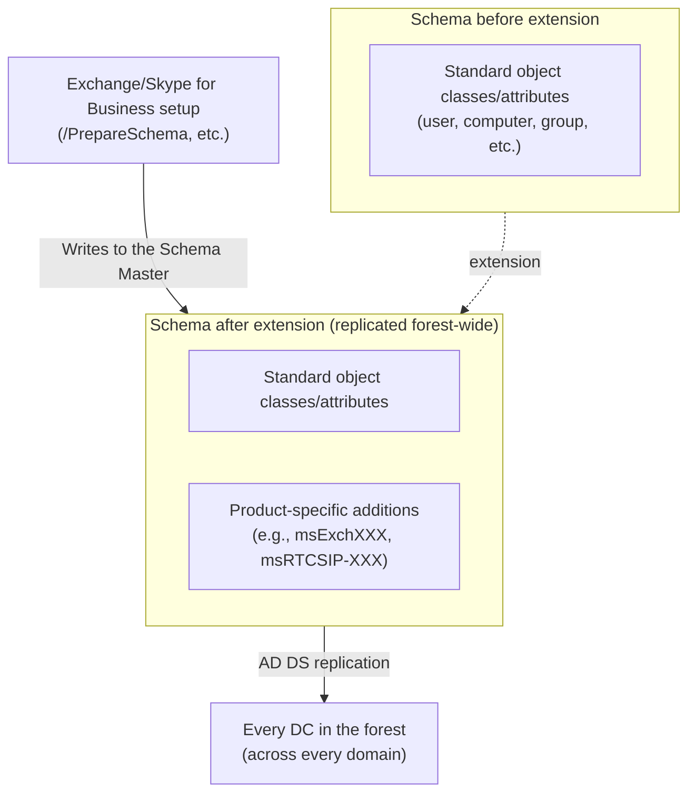

## Introduction

- **What you'll get from this article**: Ever since [Understanding AD vs. DC, and Domains vs. Forests](/en/articles/ad-dc-fundamentals-guide), this series has repeatedly described the schema as "the rulebook that defines object types and their attributes" — but never stepped into the actual moment that schema gets **extended**. This article systematically covers what "schema extension" — an operation that inevitably occurs when deploying products like Exchange Server or Skype for Business — actually does, why it affects the **entire forest** rather than a single domain, why it's essentially irreversible once done, and how to think about extending a schema safely in production.
- **Intended audience**: Readers who've heard the term "schema extension" in something like an Exchange deployment guide, but can't explain what it actually changes or why it's treated with so much caution.
- **Estimated reading time**: About 16 minutes

This article is part of the [Top 1% Series — Full Article Guide](/en/sitemap), and the 21st entry in the [Active Directory series](/en/sitemap#series-list). Reading [Understanding AD vs. DC, and Domains vs. Forests](/en/articles/ad-dc-fundamentals-guide) and [Understanding FSMO](/en/articles/fsmo-guide) first will make this article easier to follow.

## Prerequisite Knowledge

- **Schema**: Covered in [Understanding AD vs. DC, and Domains vs. Forests](/en/articles/ad-dc-fundamentals-guide) — the rulebook defining what types of objects (object classes) AD DS can store and which attributes each can have.
- **Schema Master**: One of the five FSMO roles covered in [Understanding FSMO](/en/articles/fsmo-guide) — there's exactly one per forest, and it's the only DC with permission to write changes to the schema.
- **Forest**: Covered in [Understanding AD vs. DC, and Domains vs. Forests](/en/articles/ad-dc-fundamentals-guide) — the top-level security boundary that contains multiple domains/trees.

## Getting the Big Picture

### In a nutshell

**Schema extension is the operation of adding new object classes or attributes to the standard set AD DS already has.** Directory-integrated applications like Exchange or Skype for Business, instead of maintaining a database of their own, borrow the "database replicated across the entire forest" that is AD DS as the storage location for their own configuration and mailbox information. Because of that, setting up these products inevitably triggers a process that adds product-specific object classes and attributes to the AD DS schema.

## Deep Dive into the Fundamentals

### Products that actually extend the schema

In practice, schema extension typically shows up the first time you deploy a product that "borrows AD DS as its data store":

- **Microsoft Exchange Server**: Adds hundreds of object classes and attributes (attribute groups beginning with `msExch`, and so on) to store mailbox settings, message-routing information, and organization-wide Exchange configuration. It's triggered either from the setup wizard, or by the command `setup.exe /PrepareSchema`.
- **Skype for Business (formerly Lync Server)**: Adds attributes related to telephony features, such as voice policies and dial plans (attribute groups beginning with `msRTCSIP`, and so on).
- **System Center Configuration Manager (SCCM/MECM)**: Optionally extends the schema when you use the feature that publishes client-management configuration into AD DS (unlike Exchange, SCCM itself can run without a schema extension — the situation differs there).

Why borrow AD DS instead of a dedicated database?

The biggest advantage an application like Exchange gets by borrowing AD DS, rather than standing up a dedicated database of its own, is that it can **directly use the "already forest-wide-replicated database of centrally managed user and group information" that already exists in the organization.** Storing mailbox settings as attributes on the user object frees you from the burden of keeping "who this user is" and "this user's mailbox settings" consistent across two separate databases.

### Why it affects the entire forest, and is essentially irreversible

The schema is data replicated to every DC across the **entire forest** — not a single domain — as part of the **schema partition** covered in [Understanding AD vs. DC, and Domains vs. Forests](/en/articles/ad-dc-fundamentals-guide). In other words, if you extend the schema to deploy Exchange in just one domain of the forest, that extension also gets replicated to DCs in every other domain, entirely unrelated to Exchange.

More importantly, **an object class or attribute definition, once added, cannot be deleted afterward.** That's because AD DS can never fully rule out the possibility that the attribute or class is already in use by some object somewhere in the forest. The only alternative to deletion is marking the definition **defunct** (disabled), preventing it from being used going forward.

Schema changes require a special permission group: Schema Admins

By default, changing the schema requires an account that's both a member of the special security group **Schema Admins** and holds **Enterprise Admins** privileges. Because this permission is powerful enough to perform destructive operations affecting the entire forest, the standard practice is that **membership should not be left in place for day-to-day administrative work.** The recommended pattern is to add membership temporarily right before work that requires schema extension, and promptly remove it once the work is complete.

## What Top-1% Engineers See

### How to safely proceed with schema extension in practice

Because schema extension is difficult to reverse, top-1% engineers follow a sequence like this before applying it directly to production:

1. **Try the extension first in an isolated test forest that reproduces the same forest functional level and schema version as production.** Confirm the application behaves as expected after the extension, and that no unexpected impact hits existing objects, without touching production.
2. **Take a snapshot of the DC holding the Schema Master (a system state backup, for example) right before the extension.** You can't individually "undo" the schema definition itself, but this gives you a broader recovery option in case something goes seriously wrong.
3. **Perform the extension during a low-impact window when replication to every DC in the forest can be expected to complete promptly.** Schema changes propagate to every DC over the replication paths covered in [Understanding AD Sites and Replication Topology](/en/articles/ad-sites-guide) — extending the schema while replication is lagging risks a prolonged, temporary state where different DCs hold different schema versions.
4. **Confirm with a tool like `repadmin` beforehand that every DC in the target forest is online and able to replicate normally.** If a DC that's been offline for a long time comes back later, it may return holding an old schema version, which can be a source of confusion.

## Common Misconceptions and Pitfalls

- **Misconception 1: "Schema extension only affects the domain where the application is being deployed."**
  Since the schema is data shared and replicated across the entire forest, an extension performed in one domain also replicates to DCs in every other domain in the forest. The impact can't be contained to a single domain.
- **Misconception 2: "Uninstalling the application reverts the schema additions."**
  Uninstalling an application doesn't delete the object class/attribute definitions added to the schema. The definitions themselves remain in place — they can be marked defunct (disabled), but they can never be fully erased.
- **Misconception 3: "It's fine to keep Schema Admins membership permanently granted to administrator accounts."**
  Schema Admins is a powerful permission capable of destructive operations affecting the entire forest, so it shouldn't be granted on an ongoing basis. The standard practice is to grant and revoke membership temporarily, only around work that actually requires schema extension.

## Troubleshooting Perspective

Trouble related to schema extension is usually caused by a mismatch between the extension work and replication timing, or by insufficient permissions.

1. **A schema extension command (like `/PrepareSchema`) fails with a permission error**: Check whether the executing account is a member of both Schema Admins and Enterprise Admins, and whether it can reach the Schema Master.
2. **Right after an extension, the application doesn't behave as expected on some DCs**: Replication of the schema change to that DC may not have completed yet. Check the schema partition's replication status with `repadmin /showrepl`.
3. **After bringing a long-offline DC back online, overall environment behavior became unstable**: That DC may have come back holding an old schema version, causing temporary inconsistency with other DCs. Wait for replication to finish after it returns, then re-check the state.

### Prevention and Long-Term Countermeasures

- Before deploying any product that involves a schema extension, always try it first in an isolated test environment.
- Enforce the practice of granting and revoking Schema Admins membership only temporarily, around the work that actually needs it.
- Before performing a schema extension, confirm every DC is online and able to replicate normally, and schedule the work for a low-impact time window.

## Summary

- Schema extension is the operation of adding new object classes or attributes to AD DS, and it inevitably occurs when deploying products — like Exchange or Skype for Business — that borrow AD DS as their data store.
- Because the schema is data replicated across the entire forest, an extension's impact isn't confined to a single domain — it reaches every domain and every DC in the forest.
- An object class or attribute definition, once added, can never be deleted — only marked defunct (disabled) — so schema extension needs to be treated as an operation that's essentially irreversible.
- Changing the schema requires Schema Admins + Enterprise Admins privileges; the recommended practice is to grant and revoke that membership temporarily around the work, not keep it granted permanently.

**What to keep in mind starting today**
1. Before deploying any product that involves schema extension, always try the extension first in an isolated test environment.
2. Check whether Schema Admins group membership has been left permanently granted somewhere in your environment.

## References

- [What is an Active Directory Schema Extension? | JumpCloud](https://jumpcloud.com/it-index/what-is-an-active-directory-schema-extension)
- [Active Directory schema extensions, classes, and attributes | Microsoft Learn](https://learn.microsoft.com/en-us/skypeforbusiness/schema-reference/active-directory-schema-extensions-classes-and-attributes/active-directory-schema-extensions-classes-and-attributes)
- [Prepare Active Directory and domains for Exchange Server | Microsoft Learn](https://learn.microsoft.com/en-us/exchange/plan-and-deploy/prepare-ad-and-domains)
