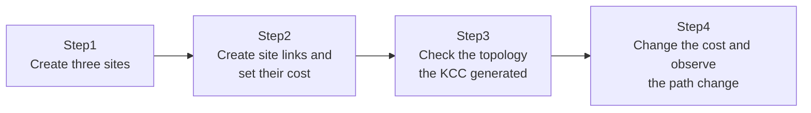

## Introduction

- **What You'll Learn From This Article**: Building on the site concept covered in [Understanding Sites: Teaching AD About Physical Distance](/en/articles/ad-sites-guide), you'll actually build a hub-and-spoke setup across three sites, and see with your own eyes how changing **site link cost** changes the replication path automatically generated by the **KCC (Knowledge Consistency Checker).**
- **Intended Audience**: Readers who understand the concept of sites and site links, but have never actually seen how a replication path gets decided in a real multi-site environment.
- **Estimated Reading Time**: About 25 minutes (about an hour if you build along with the hands-on)

This article is part of the [Top 1% Series Complete Article Guide](/en/sitemap), the 41st article in the [Active Directory Series](/en/sitemap#series-list).

## Prerequisites

- [Understanding Sites: Teaching AD About Physical Distance, from a "Top 1%" Perspective](/en/articles/ad-sites-guide): This article assumes you already know the difference between intra-site and inter-site replication.

## The Big Picture

This hands-on consists of four steps. We'll model three locations — Tokyo, Osaka, and Nagoya — in a hub-and-spoke arrangement with Tokyo as the hub.



## Hands-On Steps

### Step 1: Create three sites

Create three sites — Tokyo, Osaka, and Nagoya — along with a corresponding subnet for each.

```powershell
New-ADReplicationSite -Name "Tokyo"
New-ADReplicationSite -Name "Osaka"
New-ADReplicationSite -Name "Nagoya"
New-ADReplicationSubnet -Name "10.1.0.0/16" -Site "Tokyo"
New-ADReplicationSubnet -Name "10.2.0.0/16" -Site "Osaka"
New-ADReplicationSubnet -Name "10.3.0.0/16" -Site "Nagoya"
```

### Step 2: Create site links and set their cost

Create site links between Tokyo-Osaka and Tokyo-Nagoya, but **deliberately don't create a direct site link between Osaka and Nagoya.**

```powershell
New-ADReplicationSiteLink -Name "Tokyo-Osaka" -SitesIncluded "Tokyo","Osaka" -Cost 100 -ReplicationFrequencyInMinutes 15
New-ADReplicationSiteLink -Name "Tokyo-Nagoya" -SitesIncluded "Tokyo","Nagoya" -Cost 100 -ReplicationFrequencyInMinutes 15
```

### Step 3: Check the topology the KCC generated

Force the KCC to recalculate the topology.

```powershell
repadmin /kcc
```

Open Sites and Services (`dssite.msc`) and check the connection objects under Osaka's DC's `NTDS Settings`. **Even though you never created a direct site link between Osaka and Nagoya, you'll find the KCC has automatically calculated a path allowing replication between Osaka's DC and Nagoya's DC.** That's because the KCC has automatically discovered a path through Osaka ↔ Tokyo ↔ Nagoya.

### Step 4: Change the cost and observe the path change

Now add a direct link between Osaka and Nagoya with a cost of 50 — lower than the 200 total cost of routing through Tokyo.

```powershell
New-ADReplicationSiteLink -Name "Osaka-Nagoya" -SitesIncluded "Osaka","Nagoya" -Cost 50 -ReplicationFrequencyInMinutes 15
repadmin /kcc
```

Check the connection objects again. **Since the KCC prefers whichever path has the lowest cost, the topology automatically gets recalculated so that replication between Osaka and Nagoya now uses this new direct link, instead of routing through Tokyo.**

## What a Pro Sees Here (Top 1% Understanding)

### Cost is an abstract, administrator-assigned preference — not "bandwidth"

Looking at a site link's `-Cost` parameter, it's tempting to assume you're entering the link's actual bandwidth, but that's not accurate. **Cost is purely an abstract number an administrator uses to express "how much I want this path preferred."** When multiple paths exist, the KCC simply picks whichever one has the lowest total cost. In practice, an administrator needs to deliberately design this number based on actual line speed, cost (in the monetary sense), reliability, and similar factors.

### Site link transitivity (bridging): a mechanism enabled by default

The reason a replication path formed between Osaka and Nagoya in Step 3, despite no direct site link between them, is that **site link transitivity (bridging)** is enabled by default. This treats the two site links, Tokyo-Osaka and Tokyo-Nagoya, as if they were bridged together into one larger connection. **Thanks to this setting, you don't need to create a site link for every single pair of locations as your number of locations grows.** In some unusual network setups (where communication genuinely can't reach between certain locations, for example), you may deliberately need to disable this transitivity, to prevent an unintended path from being calculated.

### The self-healing benefit that comes from the KCC's automatic calculation

Every connection object you saw in this hands-on was automatically generated by the KCC — none of them were manually created by an administrator. **The KCC re-evaluates the topology every 15 minutes by default, so even if Tokyo's DC were to go down temporarily, as long as a path exists for Osaka and Nagoya to communicate directly, the KCC automatically discovers it, keeping replication from stopping completely.** This self-healing property is a major operational benefit that would be difficult to achieve if every connection object had to be managed manually.

## Common Misconceptions and Pitfalls

- **Misconception 1: "Two locations with no site link between them can never replicate at all."**
  Site link transitivity (enabled by default) can automatically calculate an indirect path between them.
- **Misconception 2: "A site link's cost is a field for entering the actual bandwidth of the line."**
  Cost is an abstract number an administrator uses to express path preference — it isn't meant to hold the literal bandwidth value.
- **Misconception 3: "Once the KCC generates a connection object, it stays fixed."**
  The KCC re-evaluates the topology every 15 minutes by default, automatically revisiting paths as needed.

## Troubleshooting Perspective

1. **Replication isn't following the path you expected**: After forcing a topology recalculation with `repadmin /kcc`, check the actual connection objects and each site link's cost in `dssite.msc`.
2. **Replication is extremely slow between two specific locations**: Check whether that path's total cost is higher than an alternative, and whether it's routing through more hops than expected.
3. **An unintended path (a transitivity-driven detour) is occurring**: Consider disabling bridging on that site link, or adjusting cost with `Set-ADReplicationSiteLink`, so the path you intended gets preferred instead.

## Summary

- A site link's cost is an abstract number an administrator uses to express path preference — it isn't bandwidth itself.
- When multiple paths exist, the KCC automatically picks whichever has the lowest total cost.
- Site link transitivity (enabled by default) can automatically calculate an indirect path even between locations with no direct site link.
- The KCC re-evaluates the topology every 15 minutes by default, self-healing paths when failures occur.

**Takeaways to Apply Today**
1. When adding a new location, deliberately design site link cost based on the actual state of the network line.
2. When you notice replication delay, make it a habit to check the path actually in use with `repadmin /kcc` and `dssite.msc`.

## References

- [How the Knowledge Consistency Checker Works | Microsoft Learn](https://learn.microsoft.com/en-us/windows-server/identity/ad-ds/get-started/adac/active-directory-replication-concepts)
- [New-ADReplicationSiteLink | Microsoft Learn](https://learn.microsoft.com/en-us/powershell/module/activedirectory/new-adreplicationsitelink)
