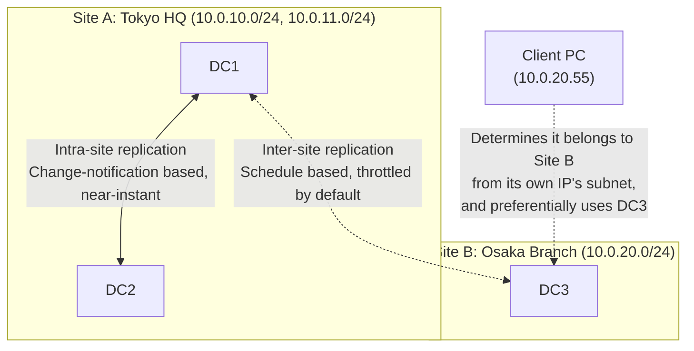
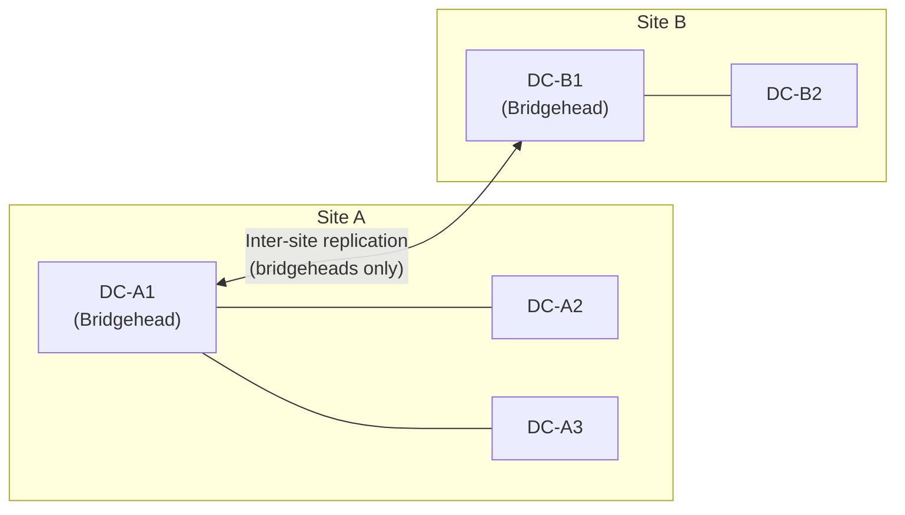

## Introduction

- **What You'll Learn From This Article**: The true nature of **Sites**, the concept you always encounter when opening `dssite.msc` (Active Directory Sites and Services); why you need to associate subnets with sites; and why replication speed and mechanism differ between DCs within the same site (intra-site replication) versus DCs across locations (inter-site replication). Along the way, this article untangles what terms like KCC, ISTG, bridgehead servers, and site link cost are actually calculating and deciding, down to the mechanism behind how a client determines which DC to query.
- **Intended Audience**: This article is aimed at engineers who've seen the `dssite.msc` screen but can't concretely explain what a site represents or why subnet registration is necessary, as well as anyone planning to work on AD design or migration involving DCs placed across multiple locations.
- **Estimated Reading Time**: About 20 minutes

This article is part of the [Top 1% Series' full article guide](/en/sitemap), and the eighth article in the [Active Directory series](/en/sitemap#series-list). It assumes you understand the configuration partition covered in [Understanding the Difference Between AD and DC, and Domains vs. Forests, from a "Top 1%" Perspective](/en/articles/ad-dc-fundamentals-guide), and the `repadmin` content covered in [Understanding DC Health Checks from a "Top 1%" Perspective](/en/articles/dc-health-check-guide).

## Prerequisites

- **DCs (Domain Controllers) and Replication**: Multiple DCs replicate each other's changes through multi-master replication. See [Understanding the Difference Between AD and DC, and Domains vs. Forests](/en/articles/ad-dc-fundamentals-guide) for details.
- **Configuration Partition**: Site definitions and replication topology are stored in the configuration partition, which replicates to every DC in the forest. The key point up front is that the concept of a site itself is information shared forest-wide.

## Grasping the Big Picture

### In a Nutshell

**A site is a logical grouping that tells AD DS where the boundaries of a "location connected by a low-bandwidth, slow link" are.** By knowing this boundary, AD DS performs three optimizations: (1) DCs within the same location replicate with each other as fast as possible, (2) replication across locations is throttled so it doesn't saturate the link, and (3) clients are preferentially directed to a DC in their own location (which is generally the fastest one to reach). The substance of a site is simply a straightforward mapping: **a collection of IP subnets** and **the list of DCs tied to those subnets**.

## A Thorough Grounding in the Fundamentals

### The Substance of a Site: A Mapping of Subnets to DCs

Open `dssite.msc` and, under the `Sites` container, you'll find each created site listed (by default just one, named `Default-First-Site-Name`), with a `Servers` folder under each site listing the DCs that belong to it as server objects. Meanwhile, the `Subnets` container lists IP subnets such as `10.0.10.0/24`, and each subnet object carries a property indicating which site it belongs to.

**Right after promoting your very first DC with the default configuration, the `Subnets` container starts out completely empty. That's not a problem — it's the expected initial state.** Promoting a DC automatically creates the `Default-First-Site-Name` site under `Sites`, along with that DC's own server object and NTDS Settings object — but **linking an IP subnet to a site is the one step that's never automated; an administrator has to explicitly create and register it in `dssite.msc`.** In a single-location, single-DC environment, skipping this registration causes little real harm, since clients are simply treated as belonging to `Default-First-Site-Name` by default. But if you're planning for multiple locations or multiple DCs, make sure you explicitly register your subnets once you understand the rest of this article.

**This "subnet-to-site" mapping is precisely the substance of the site mechanism.** A DC determines which site it belongs to by checking which subnet its own IP address falls into. Clients do the same: they determine which site they belong to from their own IP address, then use [DNS SRV records](/en/articles/dns-zones-records-guide) to search for a DC — and **preferentially query the DCs registered in their own site first**. This is the more precise answer to the question of "how does a PC find its DC," which we touched on in [Understanding Windows Login and User Profiles](/en/articles/ad-windows-login-guide) — a PC doesn't just find some arbitrary DC in the domain; it **preferentially finds the DC in its own location (site), which should offer the best reachability**.

What happens if you forget to register a subnet to a site

If a given subnet isn't registered to any site, clients and DCs belonging to that subnet are **treated as belonging to the default site, `Default-First-Site-Name`**. In a multi-location environment, if you forget to register a new location's subnet to a site, clients at that location will preferentially query a distant DC (often at HQ) that happens to belong to `Default-First-Site-Name`, instead of the DC that's actually closest to them — a common real-world issue that causes logon and GPO retrieval to become needlessly slow. When adding a DC to a new location, the checklist for the work should include not just deploying the DC itself, but **correctly registering that location's IP subnet to a site**.

### The Difference Between Intra-Site and Inter-Site Replication

The mechanism differs fundamentally between DCs within the same site (intra-site replication) and DCs across sites (inter-site replication).

| | Intra-Site Replication | Inter-Site Replication |
|---|---|---|
| What triggers it | **Change notification** (when a DC has a change, it actively notifies its partners) | **Schedule** (a periodic run at a default minimum interval of 15 minutes) |
| Propagation speed | About 15 seconds to the first partner, then a 3-second interval to each subsequent partner (default values) | At minimum a 15-minute unit by default (can also be made near-instant, just like intra-site, by enabling change notification on the site link) |
| Compression | Not compressed by default (assumes ample bandwidth within the same location) | Compressed by default (to avoid saturating the narrower inter-location link) |
| Design intent | **Keep every DC's state aligned as quickly as possible** | **Replicate within an acceptable delay, without saturating the link** |

In other words, "changes propagate to DCs at the same location within tens of seconds, but can leave stale data at a location across sites for up to nearly 15 minutes" is a design AD DS deliberately chooses. Without understanding this distinction, you can easily misread a frequently-seen event in AD migrations or multi-site operations — **"I changed a password at Location A, but Location B's DC still fails logon with the old password"** — as an "anomaly" when it isn't.

### KCC, ISTG, and Bridgehead Servers: Who Decides the Replication Path

In an environment with multiple DCs and multiple sites, you don't need to manually design the replication topology — which DC replicates with which DC, over which path. A mechanism called the **KCC (Knowledge Consistency Checker)** calculates this automatically.

- **Within a site**: Each DC's own KCC automatically generates a connection topology among the other DCs in the same site, balancing redundancy against keeping the number of replication hops from growing too large.
- **Across sites**: For each site, the DC that was the first to come online in that site (per a default election rule) takes on the role of **ISTG (Inter-Site Topology Generator)**, which calculates the inter-site replication path based on the **cost** of each site link (a management-configured value representing link quality or expense, where a lower number is preferred). In this process, a **bridgehead server** is automatically elected to actually handle inter-site replication on behalf of each site — so that **rather than every DC in a location individually communicating with other locations, only the bridgehead server represents that location** and replicates with the bridgehead server of the other location.

This design means **the replication traffic flowing over the inter-location link is limited to only what passes through the bridgehead servers**. You can manually designate bridgehead servers as well, but leaving it to automatic election is the common default.

## The View From the Top 1%

### Thinking About Site Link Cost

When multiple locations exist and there's more than one possible path between them (for example, HQ and two branch offices each have a dedicated line to HQ, while the branches are also connected to each other via VPN), **site link cost** controls which path is preferentially used for replication. A lower cost value is preferred, and the ISTG uses this value to calculate the path that reaches every site at minimum total cost (a minimum spanning tree). In practice, the basic policy is to **assign a lower cost value to faster, more stable links**: for example, setting a dedicated line's cost to 100 and a backup VPN path's cost to 500 achieves a configuration where the dedicated line is preferred under normal conditions, and the VPN path is automatically used only when the dedicated line fails.

### The Relationship Between `repadmin` Output and Sites

The output of `repadmin /showrepl`, covered in [Understanding DC Health Checks](/en/articles/dc-health-check-guide), includes a `Site Options` field. Furthermore, whether a partner DC is within the same site or across sites changes what interval you should consider "normal" for replication. **If the last success time with a partner in the same site is more than 15 minutes old, you should clearly suspect an anomaly — but for a partner across sites, you need to judge this against the default schedule interval (a minimum of 15 minutes, and potentially much longer depending on the site link configuration).** The same displayed value — "last success 20 minutes ago" — can mean something completely different depending on whether the partner is intra-site or inter-site, and that distinction matters in practice.

## Common Misconceptions and Pitfalls

- **Misconception 1: "A site is a security or authentication boundary, similar to a domain or forest."**
  A site is purely a logical grouping that represents **physical network topology (link speed, location boundaries)**, and has nothing to do with an authentication or policy boundary like a domain. A single domain can span multiple sites, and a single site can host DCs from multiple domains — both are entirely normal.
- **Misconception 2: "Placing a DC at a new location automatically creates a site for that location."**
  A site must be explicitly created by an administrator via `dssite.msc`, with the corresponding subnet registered to it. Simply deploying a DC doesn't automatically make it belong to a "new site for that location" (without subnet registration, it falls back to `Default-First-Site-Name`).
- **Misconception 3: "Inter-site replication propagates just as fast as intra-site replication."**
  By default, inter-site replication is schedule-based and designed to tolerate a delay of at minimum about 15 minutes. If you need to urgently propagate a change to every location, you need to force manual synchronization with tools like [repadmin /syncall](/en/articles/dc-health-check-guide).

## A Troubleshooting Perspective

Site-related issues are best triaged along two axes: **"is the client/DC correctly assigned to the site you intended?"** and **"is the inter-site replication path functioning as intended?"**

1. **Logon or GPO retrieval at a specific location is abnormally slow**: Check in `dssite.msc` whether that location's subnet is correctly registered to the right site. A missing registration causes preferential queries to a distant DC.
2. **Propagation between locations takes longer than expected**: Check the site link's schedule and replication interval settings. In an emergency, you can force manual synchronization with `repadmin /syncall` (see the practical commands covered in [Understanding DC Health Checks](/en/articles/dc-health-check-guide)).
3. **A particular DC isn't functioning as a bridgehead (inter-site replication is overly concentrated on one DC)**: If you're relying on automatic KCC election, first confirm the ISTG is functioning correctly. If you want to deliberately exclude or pin specific DCs as bridgeheads, consider manual bridgehead server designation.

### Prevention and Long-Term Countermeasures

- When adding a DC to a new location, always include registering that location's IP subnet to a site in the work checklist — not just deploying the DC.
- Where multiple paths between locations are possible, explicitly set site link cost according to link quality, rather than relying on an implicit priority order.
- Share within the team that delay in cross-site replication is expected, by-design behavior, so the team doesn't jump to "not propagated = outage" as the default interpretation.

## Summary

- A site is a mapping of subnets to DCs that tells AD DS where the boundaries of locations connected by low-bandwidth links lie.
- Intra-site replication is change-notification based and near-instant, while inter-site replication is schedule-based by default (minimum 15 minutes) — a deliberate design distinction.
- The KCC automatically calculates the replication topology, and across sites, a bridgehead server elected by the ISTG represents each location in replication, keeping inter-location link load down.
- A client determines its site from its own IP address, and uses [DNS SRV records](/en/articles/dns-zones-records-guide) to preferentially search for DCs in its own site first.

**Things to Keep in Mind Starting Today**
1. When adding a DC to a new location, include subnet-to-site registration in your work checklist.
2. When you observe a time lag in propagation between locations, first suspect that it's expected inter-site replication behavior before jumping to conclude it's a failure.

## References

- [Active Directory Replication Concepts | Microsoft Learn](https://learn.microsoft.com/en-us/windows-server/identity/ad-ds/get-started/replication/active-directory-replication-concepts)
- [Modify the default intra-site DC replication interval | Microsoft Learn](https://learn.microsoft.com/en-us/troubleshoot/windows-server/active-directory/modify-default-intra-site-dc-replication-interval)
- [What Is the Knowledge Consistency Checker (KCC) | Microsoft Learn](https://learn.microsoft.com/en-us/windows-server/identity/ad-ds/get-started/replication/active-directory-replication-concepts)
