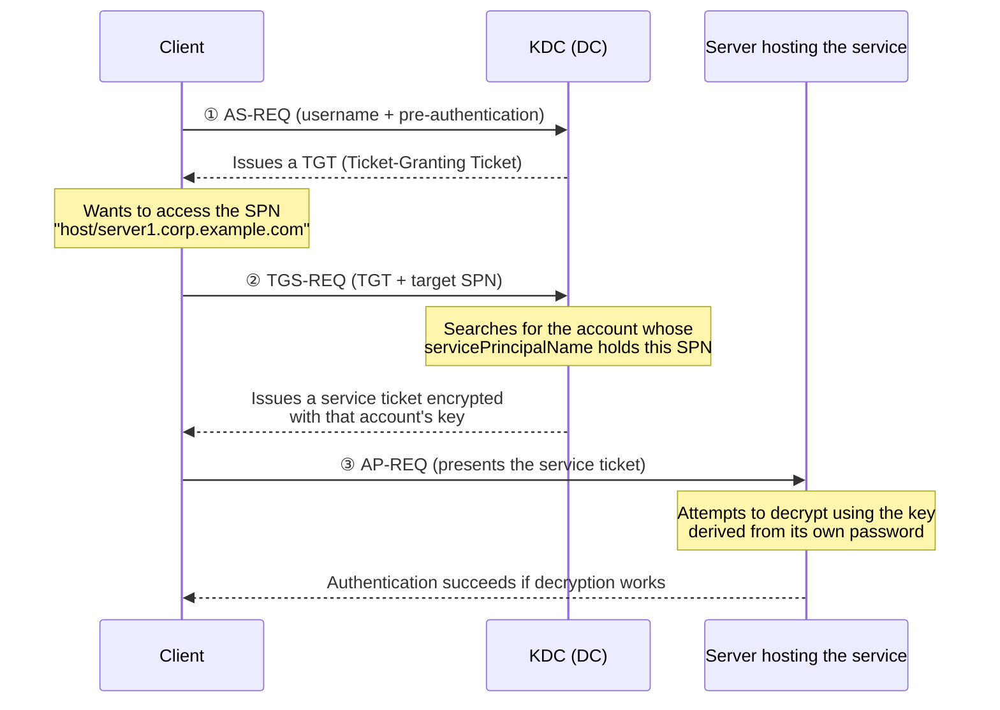

## Introduction

- **What You'll Learn From This Article**: **SPN (Service Principal Name)** kept coming up in [What's the Difference Between sysdm.cpl and netdom computername?](/en/articles/ad-computername-netdom-guide) and [Understanding DNS Zones and Records](/en/articles/dns-zones-records-guide) — this article systematically explains what identifier it actually represents, and how it's actually used during a Kerberos service-ticket exchange. Along the way, it covers how to check, add, and remove SPNs with the `setspn` command, what happens when SPNs collide, and how to diagnose the common real-world problem of "Kerberos authentication silently falls back to NTLM."
- **Intended Audience**: This article is aimed at readers who've seen the term SPN many times but can't picture much more than "a service invoked under this name responds as this account," and readers who've run into `setspn` or SPN-related errors in practice.
- **Estimated Reading Time**: About 19 minutes

This article is part of the [Top 1% Series' full article guide](/en/sitemap), and the eleventh article in the [Active Directory series](/en/sitemap#series-list). Reading [Understanding the Difference Between AD and DC, and Domains vs. Forests, from a "Top 1%" Perspective](/en/articles/ad-dc-fundamentals-guide) and [What's the Difference Between sysdm.cpl and netdom computername?](/en/articles/ad-computername-netdom-guide) first will make this article easier to follow.

## Prerequisites

- **The basic flow of Kerberos authentication**: A client first proves its identity to a DC (the KDC, Key Distribution Center) and receives a "Ticket-Granting Ticket" (TGT). Later, when it wants to access a specific service, it uses this TGT to request a "service ticket" from the KDC. This article focuses on how an SPN is used within this second-stage request.
- **Computer accounts and the servicePrincipalName attribute**: Every computer account (and user account) in AD DS has a multi-valued attribute called `servicePrincipalName`, which holds the list of SPNs tied to that account.

## Getting the Big Picture

### In a Nutshell

**An SPN is like a service's address — it's what lets the KDC decide which account in AD DS a client's "I want to access this service" request should be processed as a ticket for.** The KDC searches AD DS for the account whose `servicePrincipalName` attribute holds the SPN the client presented, and encrypts the service ticket using the key derived from that account's password. **The key insight is that an SPN doesn't point at "the server itself" — it points at "the account running that service."**



## Fundamentals, Explained Thoroughly

### The Concrete Format of an SPN

An SPN is expressed in the following format:

```
service-class/hostname:port/service-name
```

- **Service class**: A string indicating what kind of service the SPN represents. Common ones include `HOST` (a generic host service, used by remote administration and many basic services), `HTTP` (web services), `MSSQLSvc` (SQL Server), `CIFS` (file sharing), and `TERMSRV` (Remote Desktop).
- **Hostname:port**: The name of the computer the service is running on. The port can be omitted if the service uses its default port.
- **Service name**: Optional additional information, used when multiple instances exist on the same host (such as a named SQL Server instance).

Some concrete examples:

| Example SPN | Meaning |
|---|---|
| `HOST/server1.corp.example.com` | The generic host service provided by `server1` (covers many basic functions, including remote administration) |
| `HTTP/intranet.corp.example.com` | Web access aimed at `intranet.corp.example.com` (default ports 80/443) |
| `MSSQLSvc/dbserver.corp.example.com:1433` | The SQL Server instance running on `dbserver`, on TCP port 1433 |
| `TERMSRV/rdshost.corp.example.com` | A Remote Desktop connection to `rdshost` |

As touched on in [What's the Difference Between sysdm.cpl and netdom computername?](/en/articles/ad-computername-netdom-guide), a computer account is automatically registered by default with an SPN in the form `HOST/computer-name`. This exists so that many basic services running on that computer (file sharing, printing, remote administration, and so on) can all authenticate by piggybacking off this one shared `HOST` SPN.

### Where an SPN Gets Registered: Computer Account vs. a Dedicated Service Account

An SPN is registered in the `servicePrincipalName` attribute of one of the account objects in AD DS — either a computer account or a user account. This is where an important practical choice comes in.

- **When the service runs under the security context of "the computer itself"** (the default behavior for many Windows services): that service's SPN gets registered on the computer account. The `HOST/...` SPN mentioned above is exactly this pattern.
- **When the service runs under the security context of a dedicated service account** (an ordinary user account, or a gMSA): in configurations like SQL Server or an IIS application pool running under a dedicated account, the SPN needs to be registered on that service account instead. This is exactly where a very common real-world problem comes from: changing the account a service runs under, but forgetting to move the SPN registration along with it.

<details>
<summary>gMSAs (Group Managed Service Accounts) and their relationship to SPNs</summary>

Using a Group Managed Service Account (gMSA) automates SPN registration and updates in most cases. Configure a service to run as a gMSA, and Windows automatically registers and maintains the SPNs that service needs whenever it starts — cutting down significantly on how often you need to run `setspn` by hand. If you've been burned by SPN management headaches with a traditional service account (an ordinary user account), migrating to a gMSA is an option that substantially reduces that burden.

</details>

### Checking, Adding, and Removing SPNs with `setspn`

SPN management is done with the `setspn` command (or PowerShell's `Set-ADComputer`/`Set-ADUser` with the `-ServicePrincipalNames` parameter).

```powershell
# List the SPNs registered on a given account
setspn -L server1

# Search the forest for who currently holds this SPN (useful for checking duplicates)
setspn -Q HTTP/intranet.corp.example.com

# Add an SPN (-A is the legacy option, which doesn't check for duplicates)
setspn -A HTTP/intranet.corp.example.com server1

# Add an SPN (-S is the safer option, which automatically checks for duplicates before adding)
setspn -S HTTP/intranet.corp.example.com server1

# Remove an SPN
setspn -D HTTP/intranet.corp.example.com server1
```

**The difference between `-A` and `-S` matters in practice.** `-A` simply adds the given SPN as-is, without checking whether the same SPN is already registered on some other account elsewhere in the forest. `-S`, on the other hand, searches the entire forest for duplicates before adding, and only proceeds if none are found. To head off the "duplicate SPN" problem covered next, **using `-S` instead of `-A` is the recommended practice.**

### What Happens When SPNs Collide

An SPN **needs to be unique across the entire forest.** If the same SPN ends up registered on two or more accounts, the KDC can no longer uniquely identify which account a client's presented SPN corresponds to, and ticket issuance fails with one of the following errors:

- **`KDC_ERR_S_PRINCIPAL_UNKNOWN`**: No account holding the given SPN could be found
- **`KDC_ERR_PRINCIPAL_NOT_UNIQUE`**: Multiple accounts holding the given SPN were found, so it can't be uniquely identified

The typical real-world pattern that causes an SPN collision is **changing the account a service runs under, adding the SPN to the new account, but never removing it from the old one.** This leaves the same SPN sitting on both the old and new accounts, and Kerberos authentication starts failing with `KDC_ERR_PRINCIPAL_NOT_UNIQUE`. Whenever you change a service account, it's essential to **treat adding the SPN to the new account and removing it from the old account as one single, paired step.**

### What Happens When an SPN Isn't Registered: A Silent Fallback to NTLM

If an SPN isn't correctly registered, or is duplicated and can't be resolved, Windows will (depending on configuration) sometimes **give up on Kerberos authentication and fall back to NTLM authentication.** What makes this tricky in practice is that **you often don't get an immediate error to alert you — instead, you end up in a state that looks like it's working, where "authentication succeeds, but for some reason it's using NTLM instead of Kerberos."** NTLM has more functional limitations than Kerberos (it can't be delegated, it performs worse, and so on), and this can surface later as a seemingly unrelated problem, such as "double-hop authentication doesn't work." **Whenever authentication itself succeeds but something feels off, the standard move is to first suspect whether that access is actually going over Kerberos at all.**

## The View From the Top 1% Perspective

### Diagnosing SPN Problems That Cluster Around SQL Server

SQL Server is where SPN-related trouble tends to concentrate in practice. A typical case is changing SQL Server's service account without updating the corresponding `MSSQLSvc/...` SPN, which is then left stale. The symptom in this case is often a partial malfunction that's hard to pin down quickly: "the application's connection to SQL Server itself succeeds (via NTLM), but only features that assume Kerberos — like double-hop authentication through delegation — fail." The first diagnostic step is to run `klist` on the client to check what kind of ticket was actually obtained.

<details>
<summary>Checking ticket state with the klist command</summary>

```powershell
# List the Kerberos tickets currently cached
klist

# Check the details of a ticket for a specific service
klist get MSSQLSvc/dbserver.corp.example.com:1433
```

If no ticket for the target service exists in the cache, or an attempt to obtain one errors out, that's a strong signal there's a problem with the SPN registration.

</details>

### The Relationship Between SPNs and Delegation

SPNs also play a key role in configuring Kerberos delegation (the mechanism where one service accesses another service on a client's behalf). When configuring constrained delegation, you explicitly specify, on the account's properties, "which SPNs is this account allowed to delegate to." When delegation is configured but doesn't work, the basic troubleshooting step is to check whether the SPN you specified as the delegation target actually matches the SPN registered for that service. The mechanics of delegation itself are covered in more depth in a separate article on Kerberos authentication.

## Common Misconceptions and Pitfalls

- **Misconception 1: "An SPN is just a mechanism for registering a server's name"**
  An SPN doesn't point at "the server itself" — it points at "the account running that service." Even on the same server, services running under different accounts each need their own SPN registered on their respective accounts.
- **Misconception 2: "Adding a new SPN automatically cleans up the old one"**
  Adding and removing an SPN are completely independent operations. Whenever you change a service's execution account, you need to remember to remove the SPN from the old account as well as add it to the new one.
- **Misconception 3: "If Kerberos authentication fails, you'll always get a clear error"**
  SPN-related problems aren't always caught via an error — they can surface as a silent fallback to NTLM instead. "Authentication succeeds, but something feels off" is exactly the kind of situation where you should suspect an SPN problem.

## The Troubleshooting Perspective

Triage SPN-related failures around one axis: **"is this SPN correctly registered on the one, single account it's supposed to be on?"**

1. **Access to a specific service alone fails with Kerberos authentication**: Run `setspn -L <account name>` to check whether the SPN for that service is registered on the correct account.
2. **A `KDC_ERR_PRINCIPAL_NOT_UNIQUE` error occurs**: Search the forest with `setspn -Q <SPN>` to check whether the same SPN is registered on multiple accounts, and remove the one that shouldn't have it.
3. **Authentication succeeds, but only delegation-dependent features fail**: Run `klist` on the client to check whether a Kerberos ticket was actually obtained for the target service (versus having fallen back to NTLM).
4. **Kerberos authentication started failing after changing a service account**: Check whether the SPN is still sitting on the old account, and whether the migration to the new account's SPN was fully completed.

### Preventive Measures and Permanent Fixes

- When adding an SPN, use `setspn -S`, which checks for duplicates beforehand, rather than `setspn -A`.
- Whenever you change a service's execution account, manage "add the SPN to the new account" and "remove the SPN from the old account" as one single, paired work step.
- Where feasible, consider migrating to gMSAs (Group Managed Service Accounts) to reduce the burden of SPN management.

## Summary

- An SPN is the identifier the KDC uses to decide "which account in AD DS should respond when invoked under this service name" — it's tied to the account running the service, not the server's name.
- An SPN is expressed as `service-class/hostname:port/service-name`, and is registered in the `servicePrincipalName` attribute of either a computer account or a dedicated service account.
- An SPN must be unique across the forest; a duplicate causes Kerberos authentication to fail with errors like `KDC_ERR_PRINCIPAL_NOT_UNIQUE`.
- SPN problems don't always surface as a clear error — they can show up as a silent fallback to NTLM, so "authentication succeeds, but something feels off" is a sign to suspect an SPN issue.

**Things to Keep in Mind From Today**
1. Get in the habit of using `setspn -S`, which checks for duplicates, when adding SPNs.
2. Whenever you change a service's execution account, always plan the SPN addition and removal as one paired task.

## References

- [Service Principal Names (SPNs) | Microsoft Learn](https://learn.microsoft.com/en-us/windows-server/security/kerberos/service-principal-names)
- [How to configure SPN for Windows Server | Microsoft Learn](https://learn.microsoft.com/en-us/windows-server/identity/ad-ds/manage/how-to-configure-spn)
- [Kerberos Generates KDC_ERR_S_PRINCIPAL_UNKNOWN or KDC_ERR_PRINCIPAL_NOT_UNIQUE Error | Microsoft Learn](https://learn.microsoft.com/en-us/troubleshoot/windows-server/windows-security/kerberos-error-kdc-err-s-principal-unknown-or-not-unique)
- [Setspn | Microsoft Learn](https://learn.microsoft.com/en-us/windows-server/administration/windows-commands/setspn)
