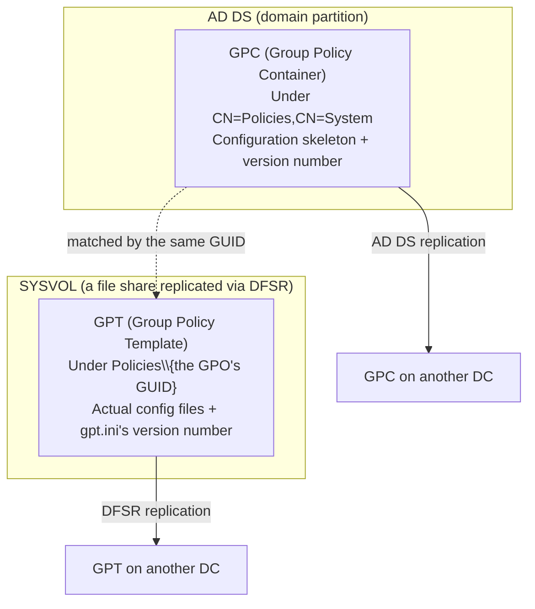

## Introduction

- **What You'll Learn From This Article**: **SYSVOL**, **DFSR**, and **Group Policy (GPO)** — names that kept showing up throughout [Understanding the Difference Between AD and DC, and Domains vs. Forests](/en/articles/ad-dc-fundamentals-guide) and [Understanding DC Health Checks](/en/articles/dc-health-check-guide) without a full explanation — get a systematic explanation here, including why a GPO is actually split across two independent locations. This article also covers the difference between DFSR and its predecessor, FRS, and how to diagnose the real-world GPO version-mismatch problem that arises when these two independent replication paths drift out of sync.
- **Intended Audience**: This article is aimed at readers who use terms like "the SYSVOL share" and "Group Policy" daily, but can't explain exactly where a GPO's actual content lives or how a change to it propagates to every DC.
- **Estimated Reading Time**: About 19 minutes

This article is part of the [Top 1% Series' full article guide](/en/sitemap), and the seventeenth article in the [Active Directory series](/en/sitemap#series-list). Reading [Understanding the Difference Between AD and DC, and Domains vs. Forests](/en/articles/ad-dc-fundamentals-guide) and [Understanding DC Health Checks](/en/articles/dc-health-check-guide) first will make this article easier to follow.

## Prerequisites

- **SYSVOL**: As touched on in [Understanding DC Health Checks](/en/articles/dc-health-check-guide), this is a shared folder, replicated across DCs, that holds Group Policy's actual files and logon scripts.
- **The domain partition and configuration partition**: The AD DS database's replication-scope divisions, covered in [Understanding the Difference Between AD and DC, and Domains vs. Forests](/en/articles/ad-dc-fundamentals-guide).

## Getting the Big Picture

### In a Nutshell

**A GPO (Group Policy Object) isn't actually a single object — it's the combination of two independent parts: a "configuration skeleton" that lives in AD DS, and the "configuration content itself," which lives as files in SYSVOL.** These two parts are replicated to other DCs through **two entirely separate mechanisms** — AD DS replication, and file replication via DFSR. Without understanding this design, you can't diagnose the common real-world problem of "I edited a GPO, but it hasn't reached some of the clients yet" — you won't know which of the two replication paths is lagging.



## Fundamentals, Explained Thoroughly

### The Two-Tier Structure of a GPO: GPC and GPT

The two parts that make up a GPO each have their own name.

The **GPC (Group Policy Container)** is an ordinary AD DS object that lives at `CN=Policies,CN=System` within the domain partition. It holds the GPO's state (enabled/disabled) and a number indicating what version that GPO currently is.

The **GPT (Group Policy Template)** is a set of files describing the actual configuration content, located in the `Policies\{that GPO's GUID}` folder within the SYSVOL share. Things like the list of registry values to write and the logon script bodies themselves live here as real files. Inside the GPT folder there's a small config file called `gpt.ini`, which also records its own version number.

The GPC and the GPT are linked purely by convention — by the GPO's GUID (a unique identifier assigned when it's created) — and are, in substance, **two completely independent pieces of data.** It's accurate to think of it this way: **the GPC holds the skeleton (metadata) of "what state this GPO is in, and what version it is," and the GPT holds the actual per-setting files that follow that skeleton.**

### What a GPO Can Actually Configure in Bulk, Concretely

The range of settings a GPO can push out is genuinely broad. Representative examples include:

- **Registry-based settings (administrative templates)**: Settings like "enable password complexity requirements," "block USB storage devices," or "force automatic Windows Update" — all implemented as writes to registry keys. Administrative templates (ADMX files) define the mapping between a GUI checkbox and its corresponding registry key.
- **Logon scripts / startup scripts**: The actual script file (a batch file, a PowerShell script, and so on) that runs automatically at PC startup or user logon is placed directly in the GPT's folder and distributed from there.
- **Software deployment (Group Policy Software Installation)**: Settings that automatically install a specific MSI package on target computers or users.
- **Folder redirection**: Settings that point folders like "Desktop" or "Documents" at a shared folder on a file server instead of the local disk.
- **Security settings**: Settings that enforce the membership of the local Administrators group, or enable specific audit-log categories.

None of these actually apply to a client correctly until both halves are present: the GPC's skeleton ("this GPO is enabled, and this is its version") and the GPT's actual data ("specifically, this registry value, this script file").

### Why the Split Exists, and Why the Replication Paths Are Separate Too

There's a reason for this split. What the GPC holds is relatively small metadata — the GPO's state and version. Since it's just an ordinary AD DS object, it gets replicated to every DC in the domain via ordinary AD DS replication, as part of the **domain partition** covered in [Understanding the Difference Between AD and DC, and Domains vs. Forests](/en/articles/ad-dc-fundamentals-guide).

What the GPT holds, on the other hand, is the actual content — a list of registry settings, script files — which can get fairly large depending on the GPO. Since this is a file, not an AD DS object, it gets replicated as part of the SYSVOL **file share**, through a dedicated file-replication mechanism called **DFSR (Distributed File System Replication)** — entirely separate from AD DS replication.

**In other words, a GPO's replication actually completes via two independent paths — AD DS replication and DFSR file replication — each on its own separate timing.** Given what we covered in [Understanding AD "Sites" and Replication Topology](/en/articles/ad-sites-guide) about how replication speed differs within a site versus across sites, it becomes clear there's no guarantee these two paths ever complete at exactly the same moment.

<details>
<summary>What happens when the GPC and GPT version numbers drift apart</summary>

Whenever a client is about to apply a GPO, Windows double-checks that **the GPC's version number (the AD DS value) matches the GPT's version number (the `gpt.ini` value).** If AD DS replication finishes first while the DFSR-based SYSVOL replication hasn't caught up yet, a client querying that DC hits a temporary **version mismatch**: the GPC says "there's a new version," while the GPT's actual files are still the old ones. If a `gpresult /h` report shows a warning to the effect of "SYSVOL Version Mismatch," that's exactly this state. In most cases it resolves itself once replication catches up, but if it doesn't clear up for a long time, you should suspect a genuine backup in DFSR replication itself.

</details>

### The Difference Between DFSR and Its Predecessor, FRS

DFSR was introduced as the successor to an older mechanism called **FRS (File Replication Service)** for SYSVOL replication. The decisive difference between the two is how they handle a file change.

FRS, whenever even a single byte of a file changed, replicated **the entire file** to every replication partner. DFSR, by contrast, uses a technology called **RDC (Remote Differential Compression)**, comparing hashes of a file's contents block by block and replicating **only the blocks that actually changed** (by default, for files 64KB or larger). For a large file with only a small portion updated, this makes a substantial difference in how much data actually gets transferred.

FRS has been deprecated since 2008-era Windows Server, and **starting with Windows Server 2016, you can't even add a new DC to a domain whose SYSVOL replication still relies on FRS.** For a domain that hasn't migrated yet, you need to use a command called `dfsrmig` to progress through three phases in order — **Prepared → Redirected → Eliminated** (fully retiring FRS) — to migrate to DFSR.

<details>
<summary>A weakness DFSR can hit too: USN journal wrap</summary>

DFSR (and FRS before it, in the same way) detects "which files changed" by monitoring a log NTFS maintains called the **USN change journal.** But if the DFSR service is stopped for a long time, or a huge number of files change in a short window, this journal can fail to record every change and end up overwriting older entries — a phenomenon called **USN journal wrap.** When this happens, DFSR can no longer correctly determine what actually changed, and is forced to perform a non-authoritative restore — a full resync — of the affected folder. Never leaving the DFSR service stopped for an extended period, and checking DFSR's state before performing bulk file operations, are the practical preventive measures here.

</details>

## The View From the Top 1% Perspective

### Visualizing a SYSVOL Replication Backup with `dfsrdiag`

If you run into a symptom like "GPO changes reach every DC except one, and slowly," reach for `dfsrdiag` — a diagnostic command dedicated to DFSR — alongside `repadmin`, covered in [Understanding DC Health Checks](/en/articles/dc-health-check-guide).

```powershell
# Check the backlog of replication items that haven't propagated yet
dfsrdiag backlog /receiveport:5722 /sendport:5722

# Generate a health report for DFSR replication overall
dfsrdiag healthreport

# Have the DFSR service immediately re-poll AD DS for configuration
# changes (such as site or replication group changes)
dfsrdiag pollad
```

Where `repadmin` looks at the replication state of AD DS's data itself, `dfsrdiag` looks at **the replication state of the SYSVOL file share.** For GPO-related troubleshooting, checking both is the only way to accurately pin down which side — the GPC or the GPT — is actually lagging.

## Common Misconceptions and Pitfalls

- **Misconception 1: "A GPO is a single object, stored entirely within AD DS"**
  A GPO's substance is the combination of two independent pieces of data — the GPC (the skeleton) in AD DS, and the GPT (the actual files) in SYSVOL — each replicated over its own separate path.
- **Misconception 2: "DFSR is just a newer version of FRS, with basically the same underlying mechanism"**
  FRS replicates an entire file every single time, while DFSR is a fundamentally different design that replicates only block-level differences via RDC.
- **Misconception 3: "As soon as SYSVOL replication finishes, the GPO applies correctly right away"**
  Even once SYSVOL (the GPT) has finished replicating, AD DS replication (the GPC) completes on its own separate timing — so a temporary inconsistency can persist until both version numbers actually match.

## The Troubleshooting Perspective

Triage GPO-related failures along the axis of: **"which side is lagging — the GPC or the GPT?"**

1. **GPOs are slow to reach a specific client or DC**: Check whether `gpresult /h` reports a SYSVOL version mismatch warning. If it does, check whether AD DS replication or DFSR replication is the one lagging, using `repadmin /showrepl` and `dfsrdiag backlog` respectively.
2. **SYSVOL replication is stalled between specific DCs only**: Check DFSR's overall health with `dfsrdiag healthreport`, and check whether the event log shows anything like a USN journal wrap.
3. **Adding a new DC to the domain fails with an error**: Suspect that domain is still replicating SYSVOL via FRS. Starting with Windows Server 2016, you can't add a DC while still on FRS.

### Preventive Measures and Permanent Fixes

- If a domain is still on FRS, plan a deliberate migration to DFSR using `dfsrmig`.
- Never leave the DFSR service stopped for an extended period. Check DFSR's replication state with `dfsrdiag` before performing bulk file operations.
- For GPO-propagation issues, make it a habit to check both `repadmin` (the AD DS side) and `dfsrdiag` (the SYSVOL side).

## Summary

- A GPO is the combination of two independent parts: the GPC (the skeleton and version number) in AD DS, and the GPT (the actual files) in SYSVOL.
- The GPC replicates via AD DS replication and the GPT via DFSR — two separate paths on two separate timings — so a temporary version mismatch can occur.
- DFSR is a fundamentally different successor to FRS, performing block-level differential replication via RDC. Starting with Windows Server 2016, you can't add a new DC while still on FRS.
- For GPO-related failures, checking both `repadmin` (the AD DS side) and `dfsrdiag` (the SYSVOL side) is how you accurately pin down which replication path is lagging.

**Things to Keep in Mind From Today**
1. When you hit a slow GPO-propagation issue, triage which side is lagging — AD DS (the GPC) or SYSVOL (the GPT) — using both `repadmin` and `dfsrdiag`.
2. If you find a domain still running FRS, plan a deliberate migration to DFSR with `dfsrmig`.

## References

- [Group Policy Storage | Microsoft Learn](https://learn.microsoft.com/en-us/previous-versions/windows/desktop/policy/group-policy-storage)
- [DFS Replication Overview | Microsoft Learn](https://learn.microsoft.com/en-us/previous-versions/windows/desktop/dfsr/dfsr-overview)
- [Migrate SYSVOL replication to DFS Replication | Microsoft Learn](https://learn.microsoft.com/en-us/windows-server/storage/dfs-replication/migrate-sysvol-to-dfsr)
- [Troubleshoot journal_wrap errors on SYSVOL | Microsoft Learn](https://learn.microsoft.com/en-us/troubleshoot/windows-server/networking/how-frs-uses-usn-change-journal-ntfs-file-system)
