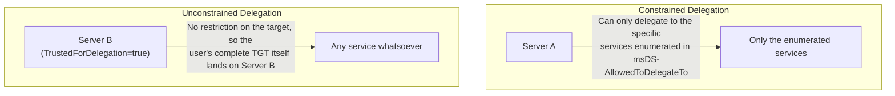

## Introduction

- **What You'll Learn From This Article**: Building on [the Kerberos constrained delegation hands-on](/en/articles/ad-constrained-delegation-handson-guide) — where "**constrained delegation** restricts the delegation target to one specific service" — reproduce, inside a safe, controlled test environment, the danger of its counterpart: "**unconstrained delegation**, which sets no restriction at all on the delegation target." You'll confirm how a privileged user accessing that server even once leaves the server holding that user's complete TGT, and the defense achieved by the "**account is sensitive and cannot be delegated**" flag.
- **Intended Audience**: Readers who've worked through the Kerberos constrained delegation hands-on, but can't explain exactly how "unconstrained" delegation is dangerous. **This hands-on exercise is for educational and defensive purposes — to strengthen the defenses of an environment you yourself control. Never run this procedure against someone else's live environment without authorization.**
- **Estimated Reading Time**: About 20 minutes

This article is part of the [Top 1% Series Complete Article Guide](/en/sitemap), and article 43.1 in the [Active Directory Series](/en/sitemap#series-list).

## Prerequisite Knowledge

- [The Kerberos constrained delegation hands-on](/en/articles/ad-constrained-delegation-handson-guide): The basic mechanism of delegation itself, and the idea of restricting the delegation target via `msDS-AllowedToDelegateTo`, are prerequisites for this article.
- [How Kerberos Authentication Works](/en/articles/ad-kerberos-guide): The premise that a TGT is a certificate encrypted with the KDC's own key, unreadable even by the client itself.

## Getting the Big Picture

Constrained delegation was a mechanism that restricted its target: "this server may only access, on the user's behalf, the specific services explicitly enumerated." **Unconstrained delegation applies no such restriction at all** — it's the oldest implementation of delegation.



## Hands-On Steps

### Step 1: Configure Unconstrained Delegation on a Test Server

```powershell
Get-ADComputer -Identity "FILESRV01" | Set-ADAccountControl -TrustedForDelegation $true
```

**Confirming the result:**

```powershell
Get-ADComputer -Identity "FILESRV01" -Properties TrustedForDelegation | Select-Object Name, TrustedForDelegation
```

```
Name       TrustedForDelegation
----       --------------------
FILESRV01                 True
```

**This is a setting that says: "this computer is unconditionally trusted for Kerberos delegation, from any user whatsoever."** In real-world practice, it's not uncommon for this to have been set casually on an old application server — "just to get it working" during the build — and then left in place ever since.

### Step 2: Confirm the Behavior When a Privileged User Accesses This Server

Using a test account belonging to the Domain Admins group (`admin-test`), access a shared folder on this server.

```powershell
# Run from admin-test's session
net use \\FILESRV01\share
```

**Something important happens behind the scenes, from this single access alone.** As covered in [How Kerberos Authentication Works](/en/articles/ad-kerberos-guide), with ordinary Kerberos authentication, the client only ever presents a service ticket to the server, and **the TGT itself stays in the client's own hands.** But when the target is a server granted unconstrained delegation, **the KDC bundles the client's own TGT directly into the service ticket and delivers it to the server.**

```powershell
# Run on FILESRV01 (as an administrator)
klist sessions
```

**Output (illustrative):**

```
[0] Session 0
    Client Name: admin-test @ EXAMPLE.COM
    ...the TGT is now cached in this server's memory
```

**From this single access alone, `admin-test`'s complete TGT ended up cached in the server's own memory.**

<details>
<summary>Why Does the TGT Itself Need to Be Sent to the Server at All?</summary>

**Unconstrained delegation exists for the purpose of letting a server access, on the user's behalf, any service not predetermined in advance.** Where [constrained delegation](/en/articles/ad-constrained-delegation-handson-guide) used a mechanism called S4U2Proxy to let a server obtain only the specific, enumerated services' tickets, unconstrained delegation provides no such restriction mechanism at all. **The danger stems directly from the design itself: in order to "be ready to handle access to any service whatsoever," the server is simply handed the TGT — the one "original document" that lets it fully become the user.**

</details>

### Step 3: Confirm the Defense via "Account Is Sensitive and Cannot Be Delegated"

Configure a defense that prevents a privileged account, like one in Domain Admins, from being delegated at all.

```powershell
Set-ADAccountControl -Identity "admin-test" -AccountNotDelegated $true
```

```powershell
# Attempt the access again
net use \\FILESRV02\share
```

**This time, the TGT never gets sent to the server.** An account with the `AccountNotDelegated` flag set (shown in the GUI as "This account is sensitive and cannot be delegated") **has its TGT rejected by the KDC from being handed to any delegation target at all, no matter which server is granted unconstrained delegation.**

## What a Pro Sees Here (Top 1% Understanding)

### Why Compromising One Unconstrained-Delegation Server Can Compromise the Entire Domain

As you confirmed in this hands-on, **once a privileged user, like one in Domain Admins, accesses a server granted unconstrained delegation even once, that user's complete TGT lands in that server's memory.** If an attacker manages to compromise that server itself by any means (local admin rights, or SYSTEM privilege), **they can use the TGT sitting in memory to access any resource in the domain, directly as that Domain Admin.** This is a critically important real-world realization: **"one seemingly unremarkable file server, granted unconstrained delegation," can actually be "the shortest possible stepping stone to Domain Admins escalation."** **A top-1% engineer, when auditing computer objects across a domain, always treats any server with `TrustedForDelegation` set to `True` as a top-priority investigation target.**

## Common Misconceptions and Pitfalls

- **Misconception 1: "Unconstrained and constrained delegation only differ in how broad or narrow the delegation scope is."**
  It's not just scope — unconstrained delegation is a structurally, fundamentally more dangerous mechanism, sending the client's complete TGT itself to the server.
- **Misconception 2: "Setting `AccountNotDelegated` makes that account unable to use Kerberos authentication at all."**
  This flag only prevents "that account's TGT from being handed to a delegation target server." The account itself can continue performing ordinary Kerberos authentication without issue.
- **Misconception 3: "Unconstrained delegation only exists in old Windows versions, and has already been retired."**
  Unconstrained delegation remains a live, configurable feature even in current Windows Server. That's exactly why servers with it set unintentionally, and left in place, keep being a real-world risk.

## Troubleshooting Perspective

1. **You want to find out how many computers in the domain have unconstrained delegation configured**: `Get-ADComputer -Filter {TrustedForDelegation -eq $true} -Properties TrustedForDelegation` lists them.
2. **A legitimate delegation process stopped working after setting `AccountNotDelegated`**: Reconfirm whether that account actually needs a legitimate delegation mechanism (like constrained delegation), and consider switching to it.
3. **You can't disable existing unconstrained delegation right away, and want a stopgap**: To minimize the blast radius, at minimum protect privileged accounts (Domain Admins, Enterprise Admins, and similar) individually, by adding them to the Protected Users group, or setting `AccountNotDelegated`.

## Summary

- The moment a user accesses a server granted unconstrained delegation even once, that user's complete TGT ends up cached in that server's memory.
- This danger stems directly from the design itself: because unconstrained delegation sets no restriction on its target, it entrusts the client's TGT itself to the server.
- An account with the `AccountNotDelegated` flag set has its TGT rejected by the KDC from being handed to any delegation target, regardless of which server is granted unconstrained delegation.
- One seemingly ordinary server, granted unconstrained delegation, can become the shortest possible stepping stone to Domain Admins escalation.

**Takeaways to Apply Today**
1. When auditing computer objects across a domain, always treat any server with `TrustedForDelegation` set to `True` as a top-priority investigation target.
2. Apply `AccountNotDelegated`, or membership in the Protected Users group, as a standard protection for privileged accounts like Domain Admins.

## References

- [Kerberos Constrained Delegation Overview | Microsoft Learn](https://learn.microsoft.com/en-us/windows-server/security/kerberos/kerberos-constrained-delegation-overview)
- [Guidance About How to Configure Protected Accounts | Microsoft Learn](https://learn.microsoft.com/en-us/windows-server/identity/ad-ds/manage/how-to-configure-protected-accounts)
