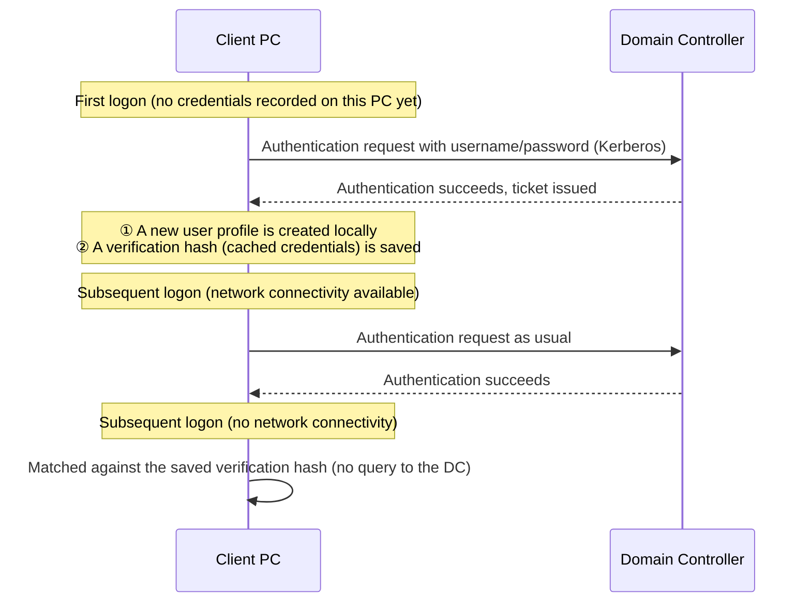
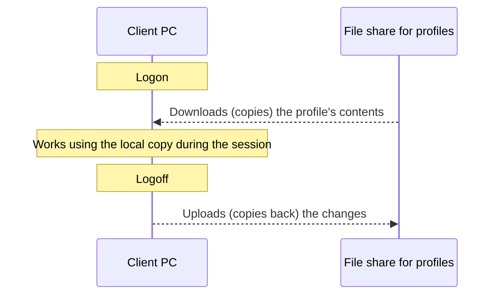

## Introduction

- **What You'll Learn From This Article**: Starting from the question "why does the very first logon on a PC with a domain account require connectivity to the corporate network, and what's happening under the hood on subsequent logons," this article systematically explains Windows's domain logon process, the true nature of the locally created user profile, and the mechanism called **cached credentials**. Along the way, it also lays out how VDI (Virtual Desktop Infrastructure) — where the same user reaches the same desktop no matter which PC they log in from — achieves this through a different approach than ordinary PC logons.
- **Intended Audience**: This article is aimed at engineers who work with domain-joined PC operations or VDI environment build/operation, but who can't concretely explain the difference between the first logon and subsequent logons, or how a user profile actually gets created and stored.
- **Estimated Reading Time**: About 17 minutes

This article is part of the [Top 1% Series' full article guide](/en/sitemap), and the third article in the [Active Directory series](/en/sitemap#series-list).

## Prerequisites

- **Kerberos authentication**: The default authentication protocol within an AD domain. A client requests a ticket from a domain controller (DC) for each authentication. The mechanics behind this ticket exchange are covered thoroughly in [Understanding Kerberos Authentication from a "Top 1%" Perspective](/en/articles/ad-kerberos-guide).
- **SID (Security Identifier)**: A value that uniquely identifies a user or computer. Windows's permission management is based on this SID, not on the username string. How a SID is actually used inside real authentication processing clicks into place alongside the PAC (Privilege Attribute Certificate), covered in [Understanding Kerberos Authentication](/en/articles/ad-kerberos-guide).
- **Local user profile**: The collection of that user's desktop settings, documents, application settings, and so on, stored under `C:\Users\<username>`.
- **How does a PC find its DC in the first place?**: This article focuses on the substance of Kerberos authentication (the ticket exchange itself), but many readers will naturally wonder, as a prerequisite question, how a PC even knows which DC to query in the first place. To give away the short answer: **a PC uses DNS SRV records to search for a DC.** That means it's essential for the PC's DNS configuration to point at your internal DNS (a DNS server integrated with AD) — either distributed via DHCP during kitting, or set statically if you're on fixed IPs. The detailed mechanics of DC discovery (the DC locator) are covered in [Understanding DNS Zones and Records from a "Top 1%" Perspective](/en/articles/dns-zones-records-guide); reading that first, if you haven't already, will make this article easier to follow.

## Getting the Big Picture

### In a Nutshell

**The first logon with a domain account requires corporate network connectivity because "that PC doesn't yet possess any information capable of verifying whether the user really is who they claim to be."** On subsequent logons, the PC can use a "verification hint" it saved for itself during the first logon, letting it verify to a limited extent on its own even in situations where it can't reach the network.

## Fundamentals, Explained Thoroughly

### What Happens on the First Logon

When a user tries to log on with a domain account to a domain-joined PC **for the first time on that particular PC**, that PC needs to be able to reach the corporate network (more precisely, a DC) for two reasons:

1. **Verifying the credentials itself requires querying a DC**: The client PC itself holds absolutely nothing that would let it judge whether the username and password the user entered are correct (such as a password hash). That information exists only in AD DS, so the client needs to go through a Kerberos authentication exchange with a DC.
2. **A local profile dedicated to that user doesn't exist on this PC yet**: Once authentication succeeds, Windows newly creates a profile folder dedicated to that user under `C:\Users\<username>`. This is done by copying the contents of the default template folder at `C:\Users\Default`, and at this point, user-specific registry settings (such as the `NTUSER.DAT` file, which corresponds to `HKEY_CURRENT_USER`) are also newly generated.

In other words, the "heaviness" of the first logon comes from two distinct processes happening simultaneously: **authentication itself (communication with the DC)** and **creating a brand-new profile (writing to the local disk)**.

### Cached Credentials: What Happens Behind Subsequent Logons

When authentication succeeds, Windows simultaneously saves **a hash value for verifying that user's credentials** to the local registry (a protected area). This is what's called **cached credentials** (implemented as a hash format called MSCacheV2).

The key point here is that **this cache doesn't store the password itself, and the saved hash can't be used to obtain a ticket for accessing other resources on the network (such as a file server).** What cached credentials can be used for is strictly **"deciding whether to allow a local logon (getting past the sign-in screen) on this PC itself."** The next time the PC can reach a DC, a proper Kerberos authentication is performed again, and the cache is refreshed to the latest state.

| | First logon | Subsequent (network connectivity available) | Subsequent (no network connectivity) |
|---|---|---|---|
| Credential verification | Verified via query to the DC (mandatory) | Verified via query to the DC | Matched against the local cache |
| Local profile | Newly created | Existing profile is loaded | Existing profile is loaded |
| Access to network resources | Works normally | Works normally | **Not possible** (a Kerberos ticket can't be obtained) |

Settings to disable or limit cached credentials

The number of cached logon generations retained is controlled by the Group Policy setting "Interactive logon: Number of previous logons to cache (in case domain controller is not available)" (registry: `CachedLogonsCount`). By default, several generations of logon information are retained, but in environments with strict security requirements — where you don't want to allow offline logon attempts at all in case a PC is stolen or lost, for example — this value can be set to `0` to disable the cache entirely. However, setting it to `0` means that nobody can log on to that PC at all in a situation where it can't reach a DC (such as during a corporate network outage), so it's a trade-off against availability.

### Local Profiles Are Independent Per PC

As noted above, a local user profile is created **on that PC's local disk.** So when the same user logs into a different PC, that PC doesn't yet have a profile for that user, and **an entirely new, empty profile gets created from scratch.** The desktop wallpaper, saved documents, and application settings don't carry over to the other PC at all. This — holding an independent profile per PC — is a basic property of Windows domain logon by default.

### Roaming Profiles: Managing a Profile Centrally Over the Network

To address the need for "the same desktop environment even for a user who bounces between several PCs," AD has long had a feature called **roaming profiles**. By setting a network share path (such as `\\fileserver\profiles\%username%`) as the **profile path** on the "Profile" tab of an AD user object, the profile's contents get copied down to the local machine from that path at logon, and any local changes get copied back up to that network share at logoff. This achieves synchronization of the profile's content across multiple PCs.

However, roaming profiles come with practical challenges too. As the profile grows larger (piling up a lot of files on the desktop, browser cache bloating, and so on), the copy process that runs on every logon and logoff takes longer, directly hurting the perceived speed. There's also a well-known operational gotcha in the behavior when the same user is logged on to multiple PCs at once — the so-called "last write wins" problem, where the content from whichever PC logs off later ends up overwriting the rest.

### How VDI (Virtual Desktop) Achieves "The Same Desktop From Any PC"

The experience of "reaching your familiar, personalized desktop no matter which device — a thin client or your desk PC — you connect from" in a VDI (Virtual Desktop Infrastructure) environment is a more thoroughgoing realization of the same idea behind roaming profiles. VDI broadly comes in two flavors:

- **Persistent VDI**: Each user is assigned a dedicated virtual machine, and that user always connects to the same one. In this case, the profile is kept on that virtual machine's local disk (its virtual disk) exactly as it would be, so this works on the same idea as an ordinary physical PC — the local profile simply stays intact.
- **Non-Persistent VDI**: Multiple users connect to virtual machines that are freshly generated each time from a single, shared master image. Since the virtual machine itself is discarded and reset after the session ends, a profile saved to its local disk doesn't carry over to the next session. This is where you need **a mechanism that manages the profile externally, over the network, outside the virtual machine.**

Profile management in non-persistent VDI has traditionally relied on the roaming profiles described above, but in recent years, a newer approach called **FSLogix (profile containers)** has become the mainstream choice.

How FSLogix differs from roaming profiles

Roaming profiles copy a profile's contents (a large number of small files) one by one over the network to the local machine at logon, which meant logon time grew in proportion to profile size — a well-known pain point. FSLogix instead holds each user's entire profile as **a single virtual disk file (VHD/VHDX)** on a network share, and at logon, **mounts that virtual disk file directly over the network**, as-is. Rather than copying files one at a time, it mounts the profile as a disk directly, so logon time stays roughly constant even as profile size grows. This is widely adopted as a countermeasure against "logon storms" in VDI environments — the surge of simultaneous logons that happens right when everyone starts work in the morning.

Given all this, the hypothesis some engineers form — "VDI must let you reach your desktop from any PC by centrally managing user profiles" — is, **broadly correct, but only for a non-persistent VDI + FSLogix (or roaming profiles) configuration.** In persistent VDI, this kind of centralized management mechanism isn't used at all — the profile simply continues to exist on a dedicated virtual machine, exactly as it would on an ordinary physical PC.

## The View From the Top 1% Perspective

### "First Logon Always Means Slow" Isn't Necessarily True: Pre-Provisioning as an Option

In environments doing mass PC kitting (initial setup at scale), there's often a desire to avoid having the heavy work of a first logon (authentication + brand-new profile creation) happen right at the moment a user first touches the PC. To address this, Windows offers **synchronous provisioning** and, combined with configuration management tools like SCCM/Intune, **pre-provisioning** mechanisms that let you complete template profile generation and pre-stage applications ahead of time, before the user actually starts using the device. In VDI environments too, similar techniques — such as baking an FSLogix container template directly into the non-persistent VDI's master image — are a common way to improve perceived speed at first access, and are treated as a serious practical concern.

### Enterprise State Roaming / OneDrive Sync: A Different Approach from Roaming Profiles

In recent years, an approach that **selectively syncs only specific folders or settings**, rather than the traditional roaming profile approach of copying the profile wholesale, has become widely used. Prominent examples include OneDrive's **Known Folder Move** (which moves known folders like Desktop, Documents, and Pictures into OneDrive's sync scope), and Microsoft Entra ID's (formerly Azure AD) **Enterprise State Roaming**, which syncs things like browser favorites and some Windows settings via the cloud. Rather than syncing the entire profile wholesale as roaming profiles do, these can be understood as an approach that **narrows the scope of what's synced**, avoiding the logon/logoff wait-time problem while still achieving a partial "same experience on any PC."

## Common Misconceptions and Pitfalls

- **Misconception 1: "As long as cached credentials exist, you can access the corporate file server even without network connectivity"**
  Cached credentials only exist to judge whether a local logon on that PC should be allowed. Accessing network resources requires a proper Kerberos ticket, which can't be obtained in a situation where a DC can't be reached.
- **Misconception 2: "Once roaming profiles are configured, logging on to multiple PCs simultaneously syncs everything without issue"**
  Roaming profile synchronization is a simple mechanism of download-at-logon, upload-at-logoff, so simultaneous logons on multiple PCs can trigger the "last write wins" problem — whichever PC logs off later overwrites the other's changes.
- **Misconception 3: "VDI always uses a mechanism for centrally managing user profiles"**
  In persistent VDI, the profile simply continues to exist on each virtual machine's local disk, just like an ordinary physical PC — no centralized management mechanism (FSLogix or roaming profiles) is used at all.

## The Troubleshooting Perspective

For logon- and profile-related issues, the basic approach is to **first isolate whether the problem is an authentication issue or a profile issue.**

1. **A PC that used to work fine now can't be logged into during a corporate network outage**: Check whether cached credentials are disabled (`CachedLogonsCount` is 0), or whether that user is actually attempting to log into that PC for the first time (in which case no cache exists yet).
2. **Logon succeeds, but the desktop is empty or looks unfamiliar**: The roaming profile download may have failed, and a temporary profile may have been created instead. Check the event log for errors related to the "User Profile Service."
3. **Logon takes an extremely long time (especially in VDI environments)**: Suspect a bloated roaming profile, or a logon storm (concentrated load on the file server/storage from everyone logging on at once at the start of the workday).
4. **In a VDI environment, previous settings didn't carry over**: In non-persistent VDI, check whether the profile container (FSLogix) mount failed, or whether the correct container is assigned to the correct user.

### Preventive Measures and Permanent Fixes

- In environments doing mass PC kitting, use pre-provisioning to reduce the burden of first logons ahead of time.
- In VDI environments, consider migrating to a profile container approach like FSLogix, which is faster than roaming profiles.
- Explicitly design the number of retained cached credential generations (`CachedLogonsCount`) with the trade-off between security requirements and availability in mind.

## Summary

- The first logon requires corporate network connectivity because verifying the credentials requires a query to the DC, and because that user doesn't yet have a local profile on that PC.
- On subsequent logons, cached credentials saved during the first logon allow a local logon even without network connectivity, but access to network resources isn't possible.
- Local profiles are independent per PC by default, so maintaining the same environment across multiple PCs requires a mechanism like roaming profiles or FSLogix to centrally manage the profile over the network.
- VDI's ability to "reach the same desktop from any device" is achieved through a non-persistent VDI + FSLogix (or roaming profiles) configuration; in persistent VDI, the profile simply continues to exist on a dedicated virtual machine, just like an ordinary PC.

**What to Keep in Mind From Today**
1. When you run into an issue where "the first logon is slow / requires the network," remember that two processes — authentication (communication with the DC) and brand-new profile creation — are running simultaneously.
2. When designing or troubleshooting a VDI environment, first check whether it's persistent or non-persistent, and if non-persistent, what profile sync approach (roaming profiles / FSLogix) it uses.

## References

- [How Windows Logon Works | Microsoft Learn](https://learn.microsoft.com/en-us/windows/security/identity-protection/access-control/microsoft-accounts)
- [Cached and Stored Credentials Technical Overview | Microsoft Learn](https://learn.microsoft.com/en-us/windows-server/security/kerberos/cached-and-stored-credentials-technical-overview)
- [Configure Roaming User Profiles | Microsoft Learn](https://learn.microsoft.com/en-us/windows-server/storage/folder-redirection/roaming-profiles-configuring)
- [FSLogix Profile Container Overview | Microsoft Learn](https://learn.microsoft.com/en-us/fslogix/concepts-profile-container/)
- [Enterprise State Roaming Overview | Microsoft Learn](https://learn.microsoft.com/en-us/entra/identity/users/enterprise-state-roaming-overview)
