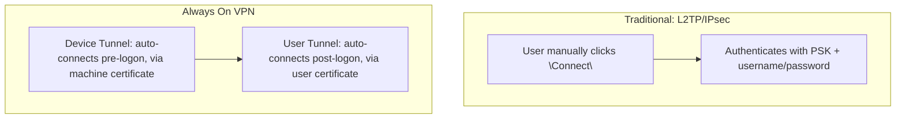

## Introduction

- **What You'll Learn From This Article**: Where [Windows Server (RRAS)'s L2TP/IPsec VPN](/en/articles/windows-server-l2tp-vpn-guide) combined a PSK with user authentication, requiring the user to manually click "Connect," **Always On VPN (AOVPN)** holds an entirely different design philosophy: authenticating with only IKEv2 and certificates, establishing a connection automatically even before the user logs on. You'll systematically understand why two independent tunnels — the **device tunnel** and the **user tunnel** — are both needed, and how distributing settings via **ProfileXML** differs from the traditional "connection icon."
- **Intended Audience**: Readers who understand [L2TP/IPsec](/en/articles/l2tp-ipsec-guide) and [RRAS's roles](/en/articles/windows-rras-roles-guide), but have only heard the name "Always On VPN" without being able to explain concretely what it refers to.
- **Estimated Reading Time**: About 18 minutes

This article is part of the [Top 1% Series Complete Article Guide](/en/sitemap), and article 7.1 in the [Remote Access VPN / L2TP+IPsec Series](/en/sitemap#series-list).

## Prerequisite Knowledge

- [Windows Server (RRAS)'s L2TP/IPsec VPN](/en/articles/windows-server-l2tp-vpn-guide): The premise that a traditional VPN establishes a connection through the user's own manual action.
- [The Differences Between Windows Server RRAS's Roles](/en/articles/windows-rras-roles-guide): The premise that RRAS is a feature holding multiple distinct roles.
- [How PKI and Digital Certificates Work](/en/articles/pki-guide): The basics of certificate chain validation are a prerequisite.

## Getting the Big Picture

[L2TP/IPsec](/en/articles/l2tp-ipsec-guide) was a VPN built on the premise that **the user takes an explicit "Connect" action**: establishing an IPsec tunnel with a pre-shared key (PSK), then authenticating the user themselves with a username and password. **Always On VPN stands on a fundamentally different premise.** Its goal is to **authenticate using only IKEv2 and certificates, and establish a connection automatically — either before the user even logs on, or the instant the device connects to a network.** The name "Always On VPN" doesn't refer to a specific product, or a single feature that works once enabled — it refers to **an entire distribution design pattern, combining multiple elements: certificate authentication, IKEv2, and ProfileXML.**

## Deep Dive Into the Fundamentals

### Why Two Tunnels Are Needed: the Device Tunnel and the User Tunnel

Always On VPN holds two independent kinds of tunnels: the **device tunnel** and the **user tunnel**. **The device tunnel is established automatically using a machine certificate (computer certificate), even at the stage before the user has logged on at all.** This makes possible management work that doesn't presuppose a user logon at all — communication with a domain controller, applying Group Policy, or remote operations from the help desk — even at a stage before any user has logged on. **The user tunnel, meanwhile, is established using a user certificate, after the user has actually logged on,** and provides that specific user with access to the resources they use for their own work.

Why Does the Device Tunnel Require the Windows Enterprise or Education Edition?

**The device tunnel overlaps significantly, in functionality, with the now-deprecated legacy DirectAccess that Microsoft retired, and it requires both domain membership and a machine certificate issued by a PKI, carrying the Client Authentication EKU (Extended Key Usage).** This requirement carries over to the device tunnel for the same reason DirectAccess itself was originally limited to the Enterprise/Education editions. **The user tunnel, by contrast, is also available on the Pro edition,** and doesn't carry constraints as strict as the device tunnel's.

### Distribution via ProfileXML Is Fundamentally Different From RRAS's "Connection Icon"

With a traditional VPN, users either created the VPN connection themselves through Control Panel or Windows Settings, or clicked a connection icon an administrator had distributed. **With Always On VPN, the connection's own configuration information is bundled into a single XML document called ProfileXML, and distributed to devices from MDM software like Intune, through a Windows configuration-management mechanism called the VPNv2 CSP (Configuration Service Provider).** In other words, rather than a user manually entering each setting one by one, **the entire profile an administrator defined gets applied to the device as-is** — an entirely different distribution model.

## What a Pro Sees Here (Top 1% Understanding)

### IKEv2's MOBIKE Keeps the Connection Alive Across a Network Switch

One reason Always On VPN adopts IKEv2 is an extension called **MOBIKE** (IKE Mobility and Multihoming Protocol). **A traditional VPN connection would often get disconnected, requiring reconnection, whenever a device's network environment changed — switching from Wi-Fi to cellular data, for instance.** **IKEv2 with MOBIKE support can keep an existing IKE session alive even when the IP address changes, switching the tunnel's endpoint over to the new IP address** — so a user moving around never perceives the connection as having dropped at all. **You need to understand that the "always connected" nature behind the name "Always On" doesn't just mean connecting automatically — it also includes this resilience to network changes, via MOBIKE.** It's also worth not overlooking, in real-world practice, that [RRAS's default setup alone can't achieve the device tunnel's machine-certificate authentication](/en/articles/windows-rras-roles-guide) — you need to additionally configure NPS (Network Policy Server) as a RADIUS server.

## Common Misconceptions and Pitfalls

- **Misconception 1: "Always On VPN is a single feature built into Windows that just works once you enable it."**
  Always On VPN isn't a single feature — it refers to an entire design pattern combining multiple elements: IKEv2, certificate authentication, ProfileXML, and MDM distribution.
- **Misconception 2: "The device tunnel and user tunnel are two options where you only ever use one or the other."**
  The device tunnel is for pre-logon management work, and the user tunnel is for the user's own post-logon access — their roles are clearly distinct, and combining both in a single deployment is common.
- **Misconception 3: "Always On VPN works the same way on any Windows edition."**
  The device tunnel requires both domain membership and the Windows Enterprise or Education edition — it isn't available on the Pro edition.

## Troubleshooting Perspective

1. **The device tunnel never establishes**: Check whether the device is domain-joined, whether it's running the Windows Enterprise or Education edition, and whether the machine certificate carries the Client Authentication EKU.
2. **The user tunnel doesn't establish even after the user logs on**: Check whether the user certificate was issued and deployed correctly, and whether the ProfileXML distribution completed successfully on the MDM side.
3. **The connection frequently drops in mobile environments**: Check whether IKEv2 and MOBIKE are correctly enabled, and whether the tunnel's endpoint is switching over correctly when the network changes.

## Summary

- Always On VPN holds an entirely different design philosophy from L2TP/IPsec: authenticating with only IKEv2 and certificates, establishing a connection automatically even before the user logs on.
- The device tunnel authenticates pre-logon with a machine certificate, while the user tunnel authenticates post-logon with a user certificate — their roles are clearly distinct.
- The device tunnel requires both domain membership and the Windows Enterprise or Education edition.
- Configuration is bundled into ProfileXML and distributed to devices through MDM software — a distribution model entirely different from the traditional connection icon.

**Takeaways to Apply Today**
1. Understand the name "Always On VPN" not as a single feature, but as a design pattern combining multiple elements.
2. Before deploying the device tunnel, always confirm the target devices' edition and domain membership status in advance.

## References

- [Tutorial: Create Always On VPN Connection on Windows Client Devices | Microsoft Learn](https://learn.microsoft.com/en-us/windows-server/remote/remote-access/tutorial-aovpn-deploy-configure-client)
- [DirectAccess deprecated: migrate to Always On VPN | 4sysops](https://4sysops.com/archives/directaccess-deprecated-migrate-to-always-on-vpn/)
