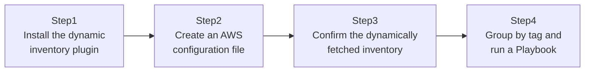

## Introduction

- **What You'll Learn From This Article**: [The Top 1% Hands-On for Automating Config Deployment to Multiple Servers With Ansible](/en/articles/ansible-handson-guide) had you hand-write managed servers' IP addresses into `inventory.ini`. But in a cloud environment, an instance's IP address changes every time it's stopped and started, and auto scaling can even change the number of instances outright. In this article, instead of hand-editing a static file, you'll build a **dynamic inventory that has Ansible directly query AWS for the current list of EC2 instances, every single run.**
- **Intended Audience**: Readers who only know how to hand-write IP addresses into `inventory.ini`, and have struggled with inventory management in a cloud environment.
- **Estimated Reading Time**: About 20 minutes (about 45 minutes if you build along with the hands-on)

This article is part of the [Top 1% Series Complete Article Guide](/en/sitemap), the 5th article in the [Ansible Series](/en/sitemap#series-list).

## Prerequisites

- [The Top 1% Hands-On for Automating Config Deployment to Multiple Servers With Ansible](/en/articles/ansible-handson-guide): This article assumes you already know how to write a static Inventory file.
- [The Top 1% Hands-On for Never Giving EC2 an Access Key With an IAM Role](/en/articles/aws-iam-role-handson-guide): This article assumes you already know how to avoid hardcoding credentials.

## Why a Static Inventory File Can't Keep Up in the First Place

Hand-writing server IP addresses into `inventory.ini` isn't a problem when, as in an on-premises environment, a server's IP address stays fixed. But an AWS EC2 instance's public IP address commonly **changes every time it's restarted** (unless you use an Elastic IP). **Continuing to manually rewrite `inventory.ini` every time instances are added or removed undermines the very agility a cloud environment is supposed to provide.**

## The Big Picture

This hands-on consists of four steps.



## Hands-On Steps

### Step 1: Install the dynamic inventory plugin

Install the AWS collection.

```bash
ansible-galaxy collection install amazon.aws
pip install boto3 botocore
```

### Step 2: Create an AWS configuration file

Instead of writing fixed IP addresses, create a YAML file containing only the configuration for "fetch this dynamically from AWS."

```yaml
# aws_ec2.yml
plugin: amazon.aws.aws_ec2
regions:
  - ap-northeast-1
filters:
  instance-state-name: running
keyed_groups:
  - key: tags.Role
    prefix: role
```

**Notice this file contains not a single IP address or server name.** The `plugin: amazon.aws.aws_ec2` declaration is itself the instruction: "query the AWS API every time this runs, and fetch the current list of instances."

### Step 3: Confirm the dynamically fetched inventory

Point at this file and confirm you can actually fetch the list of instances currently running on AWS.

```bash
ansible-inventory -i aws_ec2.yml --list
```

**Confirm that AWS-side information — tags, instance IDs, public and private IPs — shows up directly as the inventory.** At no point in this have you used a static file like `inventory.ini` at all.

### Step 4: Group by tag and run a Playbook

Thanks to the `keyed_groups` configuration, Ansible groups get created automatically based on the value of the `Role` tag on each EC2 instance. Let's run a Playbook targeting only instances tagged `Role: webserver`.

```bash
ansible-playbook -i aws_ec2.yml site.yml --limit role_webserver
```

**Without manually defining any groups in an inventory file, simply changing a tag in the AWS console is enough to automatically classify that instance into the correct Ansible group.**

## What a Pro Sees Here (Top 1% Understanding)

### What it means to combine dynamic inventory with an IAM role

If the `control` node in this hands-on is itself an EC2 instance on AWS, the AWS API queries here work with **an IAM role attached and no access key configured at all**, exactly as covered in [The Top 1% Hands-On for Never Giving EC2 an Access Key With an IAM Role](/en/articles/aws-iam-role-handson-guide). The dynamic inventory plugin internally calls the API through the AWS SDK (boto3), and that SDK looks for credentials in order — environment variables, a config file, then an IAM role. **"Use a fixed access key encrypted with Ansible Vault" is also an option, but if the `control` node itself runs on EC2, using an IAM role is the better choice — it lets you eliminate the credential you'd otherwise have to manage at all.**

### The real practical value dynamic inventory provides

Dynamic inventory's real value goes beyond the convenience of "not having to hand-write IP addresses." **In an environment where an auto scaling group automatically changes the instance count, it simply isn't realistic for a human to keep track of the exact list of target servers at all.** With dynamic inventory, only the instances actually running at the exact moment the Playbook runs automatically become the target. This is a concrete Ansible-side application of the design philosophy covered in [The Top 1% Hands-On for Escaping Service Account Password Management With a gMSA](/en/articles/ad-gmsa-handson-guide): reducing the amount of state a human has to manage.

## Common Misconceptions and Pitfalls

- **Misconception 1: "Using dynamic inventory requires also using a static file like inventory.ini."**
  Dynamic inventory can be used entirely on its own, or you can combine multiple inventory sources (a static file plus dynamic inventory).
- **Misconception 2: "With dynamic inventory, you have to manually re-specify groups every single run."**
  The `keyed_groups` configuration automatically generates Ansible groups based on AWS-side tags.
- **Misconception 3: "Dynamic inventory always requires configuring an access key."**
  If the `control` node has an IAM role attached, no access key configuration is needed at all.

## Troubleshooting Perspective

1. **`ansible-inventory --list` shows zero instances**: Check whether `regions` is specified correctly, and whether any instances actually exist matching the `filters` condition (such as `instance-state-name: running`).
2. **You get an authentication error**: Check whether the `control` node has an IAM role correctly attached, and whether that role includes permission to list EC2 instances (`ec2:DescribeInstances`, for example).
3. **Grouping by tag isn't working**: Check whether the EC2 instances actually have a tag set with the key name you specified (`Role`, for example).

## Summary

- Dynamic inventory eliminates the need for a static inventory file containing fixed IP addresses.
- The `amazon.aws.aws_ec2` plugin queries the AWS API for the current instance list, every single run.
- `keyed_groups` automatically generates Ansible groups based on AWS-side tags.
- If the `control` node runs on EC2 with an IAM role attached, no access key configuration is needed.

**Takeaways to Apply Today**
1. When using Ansible in a cloud environment, first consider whether dynamic inventory can replace a static one.
2. Make it standard practice to consistently tag EC2 instances (by role, environment, and so on) from the moment they're created, so they're usable for Ansible grouping.

## References

- [Ansible: Amazon AWS Guide](https://docs.ansible.com/ansible/latest/collections/amazon/aws/docsite/aws_ec2_guide.html)
- [amazon.aws.aws_ec2 inventory plugin | Ansible Documentation](https://docs.ansible.com/ansible/latest/collections/amazon/aws/aws_ec2_inventory.html)
