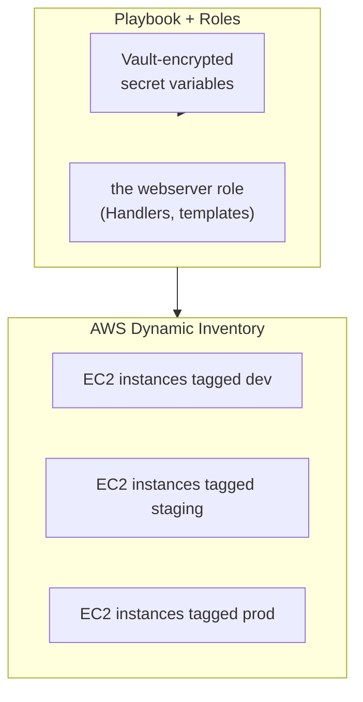

## Introduction

- **What You'll Learn From This Article**: This is the Ansible/IaC Department's capstone project, where you'll **integrate, on your own, the techniques you've learned one at a time in earlier hands-on labs** (roles/Handlers/templates, Ansible Vault, AWS dynamic inventory, dev/staging/prod environment separation, Ansible Galaxy, error handling with block/rescue/always, secrets protection) **into a single fictional startup's configuration management platform.** Where earlier articles aimed at "following steps to reliably master one technique," this article takes a format much closer to real-world work: **presenting only requirements, and leaving you to design which techniques to combine, and how.**
- **Intended Audience**: Readers who've worked through the Ansible/IaC Department's Junior, Senior, and Graduate School content and can execute each individual hands-on lab, but have never designed a single configuration management platform combining them.
- **Estimated Reading Time**: Expect several days to about a week, including design, building, and documentation (the heaviest single hands-on in this series).

This article is part of the [Top 1% Series Complete Article Guide](/en/sitemap). It's positioned as the capstone project within the [Ansible/IaC Department's full curriculum](/en/university#ansibleiac-department).

## Prerequisite Knowledge

This hands-on doesn't teach any new technique. **You'll combine and use the techniques you've already mastered in the following completed hands-on labs.**

- [The Top 1% Hands-On for Real-World Config Management With Ansible Roles, Handlers, and Templates](/en/articles/ansible-roles-handson-guide)
- [The Top 1% Hands-On for Never Leaving a Password in Plaintext in Git With Ansible Vault](/en/articles/ansible-vault-handson-guide)
- [The Top 1% Hands-On for Escaping the Static IP List With Ansible's AWS Dynamic Inventory](/en/articles/ansible-aws-dynamic-inventory-handson-guide)
- [The Top 1% Hands-On for Safely Running dev/staging/prod From One Ansible Playbook](/en/articles/ansible-environments-handson-guide)
- [The Top 1% Hands-On for Using Community Roles and Collections With Ansible Galaxy](/en/articles/ansible-galaxy-collections-handson-guide)
- [The Top 1% Hands-On for Designing a Rollback on Failed Configuration Changes With Ansible's block/rescue/always](/en/articles/ansible-error-handling-handson-guide)
- [The Top 1% Hands-On for Closing Off the Paths Where Secrets Leak Into Logs and Process Lists During an Ansible Run](/en/articles/ansible-secrets-exposure-handson-guide)

## The Assignment: a Fictional Startup's Configuration Management Platform

**You're an infrastructure engineer at a fictional startup, "KoiKoi Tech." The company runs multiple web servers on AWS EC2 across three environments: dev, staging, and prod. Until now, you've been SSHing into servers one at a time to configure them by hand, but that's hit its limit as the fleet grows. Your assignment is to build, on your own, an Ansible-based configuration management platform that satisfies all of the following requirements.**

### Requirement 1: Never Manage the Server List by Hand

**Build a mechanism that automatically discovers target servers based on AWS tags (`Environment=dev`, say).** Avoid writing a static list of IP addresses directly into a config file.

### Requirement 2: Organize Configuration Into Reusable Units

**Organize the web server configuration (package installation, template-rendering config files, restarting services) into a reusable role.** Also build in a mechanism that only restarts the service when its config file actually changed.

### Requirement 3: Never Leave Secrets in Plaintext in the Git Repository

**Store variables containing secrets, like the database password, encrypted in the repository.** Set it up so a different password can be used per environment.

### Requirement 4: Let Three Environments Be Switched Between Safely From a Single Playbook

**Set up dev, staging, and prod so the same Playbook applies different variable values per environment (instance count, domain name, and similar).** Also consider a safeguard against accidentally applying an in-progress change to production.

### Requirement 5: Avoid Reinventing the Wheel

**For generic configuration (an NTP client, firewall settings, and similar), use a battle-tested role or Collection from Ansible Galaxy instead of writing a role from scratch yourself.**

### Requirement 6: Prepare for a Configuration Change Failing Partway Through

**Build into at least one role a mechanism that automatically rolls back to the previous state if a configuration change fails partway through.**

### Requirement 7: Keep Secrets From Leaking Through Execution Logs

**Audit whether a Playbook's execution log, or the target server's process list, leaks secrets like passwords anywhere, and fix any path you find.**

## Deliverable Requirements: Assemble It as a Portfolio

**This hands-on's final deliverable isn't just a Playbook's execution output.** Put together a repository, on GitHub or similar, containing:

- **README.md**: An overview of this scenario, and the full picture of the directory structure and role design you adopted (including diagrams, such as Mermaid).
- **A record of your design decisions**: Why you chose that specific directory structure or way of holding variables — especially how you expressed the differences between environments.
- **The steps you actually took**: A record of the commands you ran and your Playbook's structure (be sure to remove any sensitive information).
- **A retrospective**: What challenges you discovered while doing this, and what you'd additionally consider in genuine real-world work (CI/CD integration, adopting Ansible Tower, and similar).

**This deliverable itself is a concrete accomplishment you can present in a job search or as a portfolio piece.** Being able to show "I designed a solution combining multiple techniques under the realistic constraints of multi-environment configuration management, and can articulate my reasoning" is far more persuasive than simply saying "I did the Ansible Vault hands-on."

## What a Pro Sees Here (Top 1% Understanding)

### "Following Steps" and "Designing From Requirements" Are Entirely Different Skills

Every earlier hands-on in this series took the form of "Step 1, Step 2, ..." — following a fixed, predetermined sequence. **But what actually gets valued in real-world work isn't the ability to execute a procedure exactly as written — it's the ability to look at given requirements (Requirements 1 through 7 in this article) and design, yourself, which techniques to combine, and how.** These are similar-looking but entirely different skills. Completing every individual hands-on doesn't make you immediately effective in real work if you've never designed one coherent configuration management platform combining them. This capstone project is deliberately designed to bridge exactly that gap.

### Why a "Multi-Environment Configuration Management" Setting?

There's a reason this hands-on deliberately models a realistic, long-running project — operating dev, staging, and prod over time — instead of a single-shot technical demo. **Most real-world Ansible rollouts never wrap up with a single one-time push to one environment — they require continuously, safely switching between multiple environments over the long haul.** Knowing how to write roles alone doesn't help in a real project if you can't also see ahead to environment separation, secrets protection, and rollback on failure. The ultimate goal of this capstone is elevating your knowledge of individual techniques into **the design ability to see ongoing operations.**

## Common Misconceptions and Pitfalls

- **Misconception 1: "This hands-on has one fixed, correct directory structure."**
  There's no single correct answer here. Multiple valid approaches exist as long as they satisfy the requirements. Recording the design you chose, and why, in README.md is what matters.
- **Misconception 2: "A log of the Playbook's execution results is sufficient as a deliverable."**
  Execution logs matter, but they're not enough on their own. Being able to articulate the reasoning behind your design decisions is this hands-on's real value.
- **Misconception 3: "Having completed every individual hands-on means this one will go quickly too."**
  There's a real gap between knowing individual techniques and integrating them into one coherent design. Expect this to take considerable time.

## Troubleshooting Perspective

This hands-on's main challenge isn't individual technical troubleshooting — it's **design rework.**

1. **You thought you satisfied the requirements, but notice a contradiction later**: Before starting implementation, write out only the design section of README.md first, and confirm on paper that all seven requirements are genuinely satisfied.
2. **You've forgotten the steps for an individual hands-on**: Don't hesitate to go back and re-read the prerequisite article for that requirement. This capstone tests design ability, not memorization.
3. **You're not sure how thorough to make this**: Use "could I show this README.md to an interviewer I've never met and explain my design decisions" as your bar for completeness.

## Summary

- This capstone project is an integrative exercise combining the techniques you've learned individually in the Ansible/IaC Department, into a single fictional startup's configuration management platform.
- What's being tested is the ability to design from requirements yourself, not the ability to follow a procedure.
- Assemble your deliverable as a portfolio piece — a document articulating the reasoning behind your design decisions, not just execution results.

**Takeaways to Apply Today**
1. Even while learning individual hands-on labs, build the habit of asking "under what future requirements would I actually use this?"
2. Beyond the technical deliverable itself, build the habit of articulating your reasoning in your day-to-day work too.

## References

- [The Ansible/IaC Department's Full Curriculum](/en/university#ansibleiac-department)
