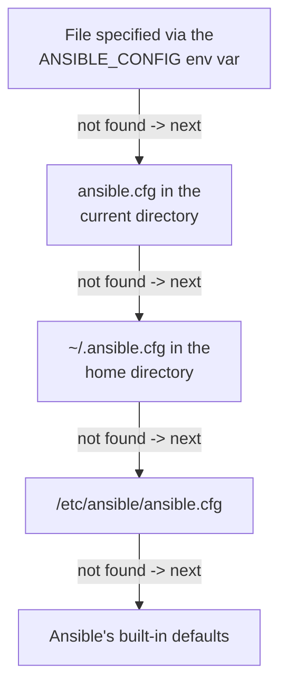

## Introduction

- **What You'll Learn From This Article**: Building on the fundamentals covered in [Understanding What Ansible Is From a "Top 1%" Perspective](/en/articles/ansible-guide), this article gives you a systematic understanding of `ansible.cfg`, the file that controls Ansible's behavior itself, and the precedence order that applies when multiple configuration sources overlap.
- **Intended Audience**: Readers who can write a Playbook but have never paid attention to what's inside `ansible.cfg`, and who've experienced "Ansible behaves differently on my machine than on a coworker's."
- **Estimated Reading Time**: About 12 minutes

This article is part of the [Top 1% Series Complete Article Guide](/en/sitemap), the 13th article in the [Ansible Series](/en/sitemap#series-list).

## The Big Picture



## A Thorough, Grounds-Up Explanation

### ansible.cfg Gets Loaded From "One of Four Places"

When you run Ansible, it searches for `ansible.cfg` in the order shown above, and loads only the **first one it finds.** Even if files exist in multiple locations, they never get merged. In practice, placing `ansible.cfg` in the same directory as your Playbooks (the current directory) is the most common setup — it lets you switch configuration per project, and lets the whole team share it under git.

### Settings Commonly Configured in ansible.cfg

```ini
[defaults]
inventory = ./inventory/hosts.yml
remote_user = deploy
host_key_checking = False
retry_files_enabled = False

[privilege_escalation]
become = True
become_method = sudo
```

- **`inventory`**: Pins a default inventory file, so you don't need to pass `-i` every time.
- **`host_key_checking`**: Disables SSH's known-hosts verification. Convenient for a disposable test environment, but setting it to `False` means you lose the ability to detect a host being spoofed — a decision that needs care in production.
- **`become`/`become_method`**: Controls whether privilege escalation (`sudo`) happens by default.

## What a Pro Sees Here (Top 1% Understanding)

### "Same Playbook, Different Result" Usually Comes Down to Setting Precedence

Ansible's settings aren't determined by `ansible.cfg` alone. **In practice, they get overridden in this order** (the lower items win, meaning they take final priority):

1. Ansible's built-in defaults
2. `ansible.cfg`
3. Environment variables (e.g., `ANSIBLE_HOST_KEY_CHECKING=False`)
4. Command-line arguments (e.g., `ansible-playbook -i other-inventory.yml`)

**When "only my environment behaves differently" shows up on a team, the first thing to suspect is that somewhere in these four stages, an environment variable in someone's personal shell, or a command-line argument baked into a personal alias, is overriding the team's shared `ansible.cfg`.** Even if `ansible.cfg` is shared via git, an `export ANSIBLE_*` line sitting in someone's `.bashrc` still wins. When investigating, the `ansible-config dump --only-changed` command lists exactly which settings differ from the defaults, and which source overrode each one.

## Common Misconceptions and Pitfalls

- **Misconception 1: "Placing ansible.cfg in multiple locations merges the settings."**
  Only the first file found gets loaded; files anywhere else are simply ignored, never merged.
- **Misconception 2: "A setting written in ansible.cfg always wins, with the highest priority."**
  Environment variables and command-line arguments both take priority over `ansible.cfg`, overriding it at runtime.
- **Misconception 3: "Setting host_key_checking = False is always the safer default."**
  It disables SSH's known-hosts verification, which comes with the clear tradeoff of no longer being able to detect a spoofed host.

## Troubleshooting Perspective

1. **Ansible behaves differently across teammates**: Run `ansible-config dump --only-changed` and check whether each differing setting is coming from the default, `ansible.cfg`, or an environment variable.
2. **The intended inventory file isn't being used**: Check for a missing `-i` argument, or a conflict between `ansible.cfg`'s `inventory` setting and a `-i` argument baked into a shell alias.
3. **Ansible behaves differently only in CI**: Check whether the CI environment has an unexpected `ANSIBLE_*` environment variable set.

## Summary

- `ansible.cfg` gets loaded from one of four fixed locations, and only the first one found is used.
- Setting precedence runs "built-in defaults < ansible.cfg < environment variables < command-line arguments," with later ones overriding earlier ones.
- `ansible-config dump --only-changed` shows which settings come from where.

**Takeaways to Apply Today**
1. Keep your project's `ansible.cfg` in the current directory and under git, so the whole team shares the same settings.
2. When something feels like "only my environment is different," suspect your own shell's environment variables first.

## References

- [Ansible Configuration Settings | Ansible Documentation](https://docs.ansible.com/ansible/latest/reference_appendices/config.html)
