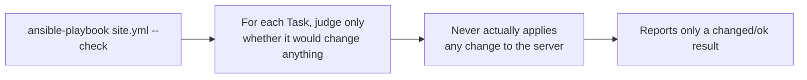

## Introduction

- **What You'll Learn From This Article**: Building on the idempotency covered in [Understanding What Ansible Is From a "Top 1%" Perspective](/en/articles/ansible-guide), this article gives you a systematic understanding of two features — Check Mode and Diff Mode — that let you confirm **what will actually change** before applying real changes to a production environment.
- **Intended Audience**: Readers who currently only review a Playbook's content visually before running it in production, and don't know of any way to confirm in advance exactly which Tasks will make changes.
- **Estimated Reading Time**: About 12 minutes

This article is part of the [Top 1% Series Complete Article Guide](/en/sitemap), the 15th article in the [Ansible Series](/en/sitemap#series-list).

## The Big Picture

## A Thorough, Grounds-Up Explanation

### Check Mode: A "Dry Run" That Only Predicts What Would Change

Run `ansible-playbook site.yml --check` with the `--check` flag, and Ansible evaluates each Task **without actually making any change at all**, judging and reporting only whether running it for real would produce a change. It's a feature that reuses the exact same `changed`/`ok` mechanism covered in [Understanding What Ansible Is From a "Top 1%" Perspective](/en/articles/ansible-guide), letting you get that judgment without any actual change taking effect.

### Diff Mode: Seeing "What" Changes, as a Concrete Diff

Add the `--diff` flag, and Ansible shows the concrete before-and-after difference for file contents or rendered templates, in a format resembling the `diff` command. `--check` and `--diff` are commonly combined — run `ansible-playbook site.yml --check --diff`, and you can review, ahead of time and without making any real change, exactly which Task changes what, and how.

## What a Pro Sees Here (Top 1% Understanding)

### Not Every Module Fully Supports Check Mode

**The single biggest caveat with Check Mode is that not every module can simulate its behavior accurately.** For a Playbook where a later Task's behavior depends on the output of an earlier command, for example, the `command` or `shell` module never actually runs during Check Mode, so it can't correctly simulate any Task downstream that depends on its output. You can force such a module to actually run even during Check Mode by setting `check_mode: false` on that specific Task, but that naturally carries the risk of a real change happening as a side effect.

**In practice, it's important to treat Check Mode's result as reference information, not something to take at face value.** For a Playbook that makes heavy use of `command`/`shell` modules in particular, always keep in mind the possibility that Check Mode's result doesn't accurately reflect reality. Even so, Check Mode plus Diff Mode is worth wiring into a CI/CD pipeline, as a final safety net before applying anything to production.

## Common Misconceptions and Pitfalls

- **Misconception 1: "Adding --check gives a 100% accurate prediction for any Playbook."**
  Some modules, such as `command`/`shell`, never actually run during Check Mode, so they can't accurately simulate their effect on downstream Tasks.
- **Misconception 2: "Specifying either --check or --diff alone is enough."**
  `--check` shows whether something would change, while `--diff` shows specifically what would change — combining both is the standard practice for a pre-production review.
- **Misconception 3: "Using Check Mode eliminates the need for an actual test run against production."**
  Check Mode is purely a prediction of the outcome — it's never a substitute for an actual test run in a real test environment.

## Troubleshooting Perspective

1. **Check Mode's result doesn't match what actually happened at runtime**: Identify every place the Playbook uses a `command`/`shell` module, and check whether those couldn't be correctly simulated during Check Mode.
2. **Check Mode stops with an error**: A specific module may not support Check Mode — consider whether to set `check_mode: false` on that Task.
3. **Diff Mode's output is hard to read**: Combine it with the `-v` (verbose output) flag to see the diff alongside more context.

## Summary

- Check Mode (`--check`) judges, for each Task, only whether it would produce a change, without ever making a real change.
- Diff Mode (`--diff`) shows the concrete before-and-after difference for files and templates.
- Some modules, such as `command`/`shell`, can't be accurately simulated in Check Mode, so treat the result as reference information rather than taking it at face value.

**Takeaways to Apply Today**
1. Build the habit of reviewing a Playbook with `--check --diff` before applying it to production.
2. Don't over-trust Check Mode's result for a Playbook that makes heavy use of `command`/`shell` modules.

## References

- [Check Mode ("Dry Run") | Ansible Documentation](https://docs.ansible.com/ansible/latest/playbook_guide/playbooks_checkmode.html)
