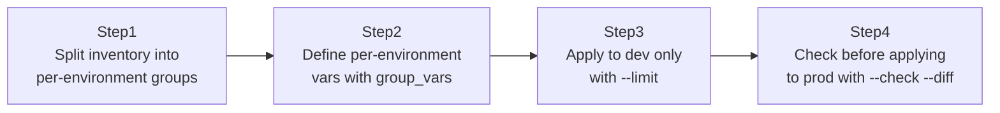

## Introduction

- **What You'll Learn From This Article**: Take the role built in [The Top 1% Hands-On for Experiencing Production-Grade Configuration Management With Ansible Roles, Handlers, and Templates](/en/articles/ansible-roles-handson-guide) and safely apply it to three different environments — dev, staging, and prod — each with different config values. You'll experience two mechanisms used every single day in real-world Ansible operations: per-environment variable management with `group_vars`, and narrowing the target hosts with `--limit`.
- **Intended Audience**: Readers who write every host into a single inventory file, and have never thought about how to vary configuration per environment or how to guard against accidentally targeting the wrong environment.
- **Estimated Reading Time**: About 20 minutes (about 40 minutes if you build along with the hands-on)

This article is part of the [Top 1% Series Complete Article Guide](/en/sitemap), the 6th article in the [Ansible Series](/en/sitemap#series-list).

## The Big Picture

This hands-on consists of four steps.



## Hands-On Steps

### Step 1: Split inventory into per-environment groups

Split `inventory.ini` into three groups: `dev`, `staging`, and `prod`.

```ini
[dev]
dev-web1 ansible_host=10.0.1.10

[staging]
staging-web1 ansible_host=10.0.2.10

[prod]
prod-web1 ansible_host=10.0.3.10
prod-web2 ansible_host=10.0.3.11
```

**At this point, the three groups are clearly separated within the inventory.** But this alone doesn't yet prevent the accident of "targeting the wrong environment when running a Playbook." The mechanism that prevents it comes in the next steps.

### Step 2: Define per-environment vars with group_vars

Under the `group_vars/` directory, create a file with the same name as each group, and define different config values per environment.

```yaml
# group_vars/dev.yml
app_debug_mode: true
app_worker_count: 1

# group_vars/prod.yml
app_debug_mode: false
app_worker_count: 4
```

**As long as the inventory group name matches a filename under `group_vars/`, Ansible automatically applies this variable with no explicit include needed at all.** The Playbook itself doesn't need to be written differently per environment — it just references the same `app_debug_mode` variable name every time.

### Step 3: Apply to dev only with --limit

Run the Playbook, narrowed to just the `dev` group, with the `--limit` option.

```bash
ansible-playbook -i inventory.ini site.yml --limit dev
```

**Without `--limit`, the entire group written in the Playbook's `hosts:` (for example `all`) becomes the target.** Building the habit of always explicitly narrowing the target with `--limit` during development testing is the first step toward preventing accidents.

### Step 4: Check before applying to prod with --check --diff

Against the `prod` group, run a "dry run" that doesn't actually make any changes, to confirm ahead of time exactly what would change.

```bash
ansible-playbook -i inventory.ini site.yml --limit prod --check --diff
```

**With `--check`, the Playbook doesn't actually apply any change to any host.** Combined with `--diff`, you can even visually confirm, before execution, exactly what change would be made to a file's content. Only after reviewing this output and confirming there's no problem do you move on to the real run with `--check` removed.

## What a Pro Sees Here (Top 1% Understanding)

### "Accidentally applying to prod" is prevented by a mechanism, not by carefulness

The most feared accident in real-world Ansible operations is **a Playbook run intended for the development environment turning out to have actually been applied to the entire production environment.** This can't be fundamentally prevented by the mindset of "just be careful." In real-world work, you make `--limit` mandatory via a wrapper script, or build a CI/CD pipeline that won't proceed to applying to the `prod` group until a human has reviewed the `--check --diff` output — building **a mechanism where one last line of defense stops a careless mistake even when it happens.** This is exactly the same idea as the defense-in-depth thinking behind the public access block covered in [The Top 1% Hands-On for Publishing a Static Website From an S3 Bucket](/en/articles/aws-s3-static-website-handson-guide).

### The priority order of group_vars — a niche but important spec

`group_vars/` actually has multiple levels. When `group_vars/all.yml` (common to all hosts), `group_vars/prod.yml` (a specific group), and `host_vars/prod-web1.yml` (a single specific host) all exist at once, the value from the more specific scope (a single host) overrides the value from the broader scope (all hosts). Without accurately grasping this priority order, you'll waste time investigating "why is only this one host's config different."

## Common Misconceptions and Pitfalls

- **Misconception 1: "A group_vars file isn't loaded unless the Playbook explicitly includes it."**
  As long as the inventory group name matches the filename, Ansible loads it automatically. No explicit include is needed.
- **Misconception 2: "Even with --check, something can actually change anyway."**
  `--check` mode accurately does "make no change" for most modules, but some modules (ones that directly run a shell command, for example) don't support `--check` mode and can actually execute for real.
- **Misconception 3: "Specifying --limit also automatically narrows which group_vars get applied to just that group."**
  `--limit` only narrows the target hosts being run against. The variable-loading rules themselves don't change.

## Troubleshooting Perspective

1. **The value in `group_vars/prod.yml` isn't taking effect**: Check whether the filename exactly matches the inventory group name (including case).
2. **`--limit` was supposed to narrow it, but an unexpected host is targeted anyway**: Check whether that host belongs to multiple groups in the inventory.
3. **Even in `--check` mode, a change was actually made**: Check the module's documentation to see whether the module you're using supports `--check` mode.

## Summary

- Split the inventory into per-environment groups, and manage per-environment variables with `group_vars/`.
- Explicitly narrowing the target hosts with `--limit` is the first step toward preventing accidental targeting.
- Always do a dry run with diff confirmation via `--check --diff` before applying to production.
- group_vars has an all/group/single-host priority order, where the more specific scope wins.

**Takeaways to Apply Today**
1. Insert a step where a human reviews `--check --diff` output before any production application.
2. Always be conscious of what gets targeted when `--limit` is omitted, before running anything.

## References

- [Working with inventory | Ansible Documentation](https://docs.ansible.com/ansible/latest/inventory_guide/intro_inventory.html)
- [Check mode ("Dry Run") | Ansible Documentation](https://docs.ansible.com/ansible/latest/playbook_guide/playbooks_checkmode.html)
