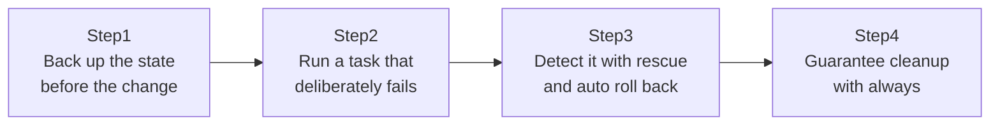

## Introduction

- **What You'll Learn From This Article**: Deliberately reproduce a scenario that happens frequently in real-world work — a task failing partway through a configuration deployment — and experience designing a full exception-handling flow using `block`/`rescue`/`always`: detecting that failure, automatically rolling back to the pre-change state, and cleaning up afterward.
- **Intended Audience**: Readers who've handled every failure with just `ignore_errors: true`, and have never been conscious of `block`/`rescue`'s existence.
- **Estimated Reading Time**: About 20 minutes (about 40 minutes if you build along with the hands-on)

This article is part of the [Top 1% Series Complete Article Guide](/en/sitemap), the 10th article in the [Ansible Series](/en/sitemap#series-list).

## The Big Picture

This hands-on consists of four steps.



## Hands-On Steps

### Step 1: Back up the state before the change

Before changing the Nginx config file, back up the existing config.

```yaml
- name: Back up the current nginx config before making changes
  copy:
    src: /etc/nginx/nginx.conf
    dest: /etc/nginx/nginx.conf.bak
    remote_src: true
```

**This backup is the prerequisite for the rollback processing that follows.** A rollback is the process of "returning to the healthy state from before the failure" — impossible to achieve without having saved that healthy state itself.

### Step 2: Wrap a deliberately failing task in a block

Deploy a syntactically invalid config, so that `nginx -t`'s syntax check detects it and fails — write this situation inside a `block`.

```yaml
- block:
    - name: Deploy a (deliberately broken) nginx config
      template:
        src: broken_nginx.conf.j2
        dest: /etc/nginx/nginx.conf

    - name: Validate nginx config syntax
      command: nginx -t
```

**A `block` is a mechanism for treating multiple tasks as a single unit.** If any task inside it fails, execution of the whole `block` stops right there, and control moves to the `rescue` section described next.

### Step 3: Detect it with rescue and auto roll back

Right after the `block`, add a `rescue` section that only runs on failure.

```yaml
  rescue:
    - name: Roll back to the backed-up config
      copy:
        src: /etc/nginx/nginx.conf.bak
        dest: /etc/nginx/nginx.conf
        remote_src: true

    - name: Restart nginx with the rolled-back config
      service:
        name: nginx
        state: restarted

    - name: Fail the play with a clear message
      fail:
        msg: "Deployment failed and was rolled back. Check broken_nginx.conf.j2."
```

**The `rescue` section only runs if a failure occurred inside the `block`.** Here it performs three stages: restoring from the backup, restarting nginx with the healthy config, and finally, explicitly ending the whole Playbook as a failure with the `fail` module.

### Step 4: Guarantee cleanup with always

Right after `rescue`, add an `always` section that runs unconditionally, whether the block succeeded or failed.

```yaml
  always:
    - name: Remove the temporary backup file
      file:
        path: /etc/nginx/nginx.conf.bak
        state: absent
```

**The `always` section always runs in both cases — whether the `block` succeeded, or `rescue` handled a failure.** Write cleanup work you always want done regardless of success or failure — removing a temp file, releasing a lock — here.

## What a Pro Sees Here (Top 1% Understanding)

### ignore_errors and block/rescue serve fundamentally different purposes

`ignore_errors: true` is an extremely simple mechanism that just says "even if this task fails, keep going with what follows anyway." `block`/`rescue`/`always`, on the other hand, is structured exception handling: "detect the failure, run a specific recovery process only on failure, and always run common cleanup regardless of success or failure." **Casually relying on `ignore_errors` leads to one of the most dangerous patterns in real-world work: processing continuing as if nothing happened, when it actually failed.** If any response is needed on failure — a rollback, a notification, switching to an alternate path — use `block`/`rescue`, not `ignore_errors`.

### The design philosophy of never leaving behind a "changed but unverified" state

Notice that this hands-on's `rescue` section doesn't just roll back — it also explicitly reports the failure via the `fail` module at the end. **If it simply rolled back and ended normally, an operator looking only at the Playbook's execution result would mistakenly believe it "succeeded," never noticing that the config deployment actually failed and got rolled back.** Even though the rollback returned the system to a safe state, accurately conveying, through the execution result, that a root-cause investigation into "why it failed" is still needed, is the essence of real-world exception-handling design.

## Common Misconceptions and Pitfalls

- **Misconception 1: "Using ignore_errors: true can accomplish the same thing as block/rescue."**
  ignore_errors only ignores the failure and continues. Performing recovery on failure (like a rollback) requires block/rescue.
- **Misconception 2: "If a task inside a rescue section fails, yet another rescue runs for it."**
  If something fails inside a rescue section, that error propagates to an outer block, or fails the whole Playbook. It doesn't nest infinitely.
- **Misconception 3: "The always section doesn't run if the block succeeded."**
  The always section always runs regardless of whether the block succeeded or failed.

## Troubleshooting Perspective

1. **The rescue section doesn't run as expected**: Confirm the failing task is genuinely inside the block — a failure outside the block isn't covered by rescue.
2. **The service still isn't back to normal even after rollback**: Check whether the rollback processing itself (restoring the config file, restarting the service) completed correctly, by checking the execution result of the tasks inside the rescue section.
3. **The Playbook stops without running the always section**: Check whether a task inside the always section itself is failing. A failure inside always can prevent further cleanup from happening.

## Summary

- ignore_errors is a simple mechanism that just ignores a failure and keeps going.
- block/rescue/always let you structure failure detection, recovery, and cleanup.
- The rescue section only runs if a failure occurred inside the block.
- The always section always runs regardless of success or failure.

**Takeaways to Apply Today**
1. For a task that needs any kind of recovery on failure, use block/rescue instead of ignore_errors.
2. When writing rollback processing, add an explicit failure report at the end so it doesn't look like it succeeded.

## References

- [Handling errors | Ansible Documentation](https://docs.ansible.com/ansible/latest/playbook_guide/playbooks_blocks.html)
- [Error handling with blocks | Ansible Documentation](https://docs.ansible.com/ansible/latest/playbook_guide/playbooks_error_handling.html)
