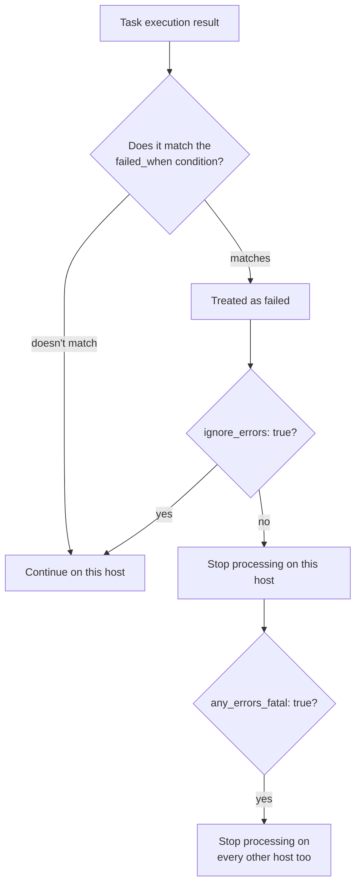

## Introduction

- **What You'll Learn From This Article**: Building on the block/rescue/always exception handling for groups of Tasks covered in [The Top 1% Hands-On for Designing a Rollback on Configuration-Change Failure With Ansible's block/rescue/always](/en/articles/ansible-error-handling-handson-guide), this article gives you a systematic understanding of three mechanisms that control error handling at a finer, **per-Task** level: `ignore_errors`, `any_errors_fatal`, and `failed_when`.
- **Intended Audience**: Readers who've used block/rescue before, but can't explain the difference between `ignore_errors` and `failed_when`, or don't know how to make one host's failure halt an entire multi-host Playbook.
- **Estimated Reading Time**: About 13 minutes

This article is part of the [Top 1% Series Complete Article Guide](/en/sitemap), the 17th article in the [Ansible Series](/en/sitemap#series-list).

## The Big Picture



## A Thorough, Grounds-Up Explanation

### ignore_errors: "Ignore This Task's Failure, on This Host"

Add `ignore_errors: true` to a Task, and even if it fails, **the remaining Tasks on that host still continue to run.** The Playbook as a whole still records that host had a failed Task, though. A typical use case is something with no real downside if it fails — "delete it if it exists, and if it doesn't, don't error out, just move on."

### failed_when: Defining "What Counts as a Failure," Yourself

By default, Ansible decides `ok`/`changed`/`failed` based on a module's exit code and similar signals, but `failed_when` lets you **override that judgment logic entirely.**

```yaml
- name: Check disk usage
  ansible.builtin.command: df -h /
  register: disk_result
  failed_when: "'100%' in disk_result.stdout"
```

Even though the `command` module itself exits normally (exit code 0), this Task gets treated as "failed" in Ansible's eyes if its output contains the string `100%`.

## What a Pro Sees Here (Top 1% Understanding)

### any_errors_fatal: Turning "One Host's Failure" Into an Emergency Stop for Everything

Consider a Playbook deploying to multiple hosts at once, like the one covered in [The Top 1% Hands-On for Safely Handling dev/staging/prod With a Single Playbook](/en/articles/ansible-environments-handson-guide). **By default, when a Task fails on one host, Ansible's behavior is simply to stop processing on that host — deployment to every other host continues regardless.** That sounds reasonable at first glance, but consider "deployment failed on 1 out of 10 hosts": letting the deployment to the remaining 9 proceed as-is can lead to a genuinely dangerous scenario — **serving production traffic from a fleet with mismatched versions.**

**Setting `any_errors_fatal: true` on a Play changes this behavior.** The instant a Task fails on even one host, **every other host that hasn't finished yet is immediately stopped too.** For a scenario requiring all-or-nothing behavior — "either every host succeeds, or the whole thing halts" — such as a coordinated deployment behind a load balancer, understand that setting `any_errors_fatal` is effectively mandatory in practice.

## Common Misconceptions and Pitfalls

- **Misconception 1: "Adding ignore_errors: true makes that Task always count as a success."**
  Processing continues on that host, but the Playbook as a whole still records that a failure happened on that host, and it shows up in the final run summary too.
- **Misconception 2: "One host's failure automatically spreads to other hosts even without any_errors_fatal."**
  Ansible's default behavior is the opposite: a failure on one host stops processing only on that host, with no effect on the others. To halt the entire run, you need to explicitly set `any_errors_fatal: true`.
- **Misconception 3: "failed_when directly rewrites the Task's actual exit code."**
  `failed_when` overrides how Ansible judges "failure" — it doesn't change the underlying command's actual exit code.

## Troubleshooting Perspective

1. **A Playbook looks like it succeeded overall, even though a Task failed on some hosts**: Check whether that Task has `ignore_errors: true`, and check the final run summary (`PLAY RECAP`).
2. **A deployment doesn't halt entirely even though you want one host's failure to stop the whole thing**: Check whether the relevant Play has `any_errors_fatal: true` set.
3. **A command exits normally, but Ansible still judges the Task as failed**: Check whether that Task has `failed_when` set, and whether the intended condition actually matches the real output.

## Summary

- `ignore_errors: true` lets processing continue on that host despite a per-Task failure, though the failure is still recorded for the Playbook as a whole.
- `failed_when` is a mechanism for redefining, yourself, the judgment logic behind what Ansible considers a "failure."
- `any_errors_fatal: true` acts as an emergency stop switch, letting a single host's failure immediately halt processing on every other host too.

**Takeaways to Apply Today**
1. For a Play that deploys to multiple hosts at once, always consider whether `any_errors_fatal` should be set.
2. Every time you use `ignore_errors`, deliberately judge whether that particular failure is genuinely safe to ignore.

## References

- [Error Handling In Playbooks | Ansible Documentation](https://docs.ansible.com/ansible/latest/playbook_guide/playbooks_error_handling.html)
