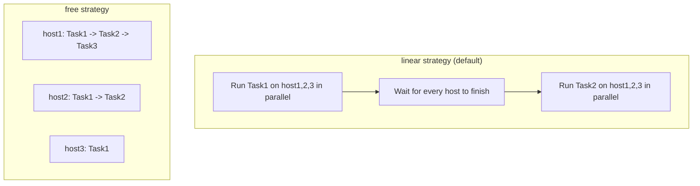

## Introduction

- **What You'll Learn From This Article**: Following the execution-time optimization covered in [The Top 1% Hands-On for Caching Ansible's Facts Gathering to Speed Up a Large Inventory](/en/articles/ansible-facts-caching-handson-guide), this article gives you a systematic understanding of the execution strategy itself — the order and degree of parallelism Ansible uses to actually run against multiple hosts.
- **Intended Audience**: Readers who've changed the `forks` value before, but can't explain specifically how Ansible's default execution strategy, `linear`, actually works.
- **Estimated Reading Time**: About 13 minutes

This article is part of the [Top 1% Series Complete Article Guide](/en/sitemap), the 16th article in the [Ansible Series](/en/sitemap#series-list).

## The Big Picture

## A Thorough, Grounds-Up Explanation

### The linear Strategy: The Default, "Keeping Every Host in Lockstep, One Task at a Time"

Ansible's default execution strategy is **linear.** Under this strategy, **Ansible never moves to the next Task until every target host has finished the current one.** It runs Task1 in parallel across host1, host2, and host3, waits until all three finish, and only then moves on to Task2 — repeating this for every Task in the Playbook.

### forks: The Parallelism Setting for "How Many Hosts at Once"

`forks` controls the degree of parallelism — **how many hosts a single Task runs against at the same time.** The default is 5; if there are more than 5 target hosts, Ansible processes 5 at a time, then the next 5, and so on. You can change it via the `forks` setting in `ansible.cfg`, or the `-f` flag.

## What a Pro Sees Here (Top 1% Understanding)

### linear's Weakness: One Slow Host Drags Down the Whole Run

**The structural weakness of the linear strategy is that, for any given Task, every host has to wait for the single slowest host to finish.** Say 99 out of 100 hosts finish a Task in one second, but one host takes 30 seconds due to a network issue — the Task as a whole is treated as having taken 30 seconds. That wait accumulates once for every single Task in the Playbook.

**The `free` strategy solves exactly this weakness.** Under `free`, each host progresses through every Task in the Playbook independently, **at its own pace, without waiting for any other host's progress.** In the example above, the 99 fast hosts move straight on to the next Task without waiting for the one slow host. However, **the free strategy carries a side effect: a host can move on to a later Task before other hosts have caught up.** For a Playbook that includes a step requiring synchronization across hosts — say, "wait until every host finishes Task3, then have just one designated host run Task4 (registering with a load balancer, for example)" — the free strategy risks running Task4 at an unintended moment.

## Common Misconceptions and Pitfalls

- **Misconception 1: "Raising the forks value always makes a Playbook run faster, without limit."**
  The control node's CPU, memory, and network bandwidth, and the limit on simultaneous connections each target host can accept, mean pushing it too high can actually make things less stable.
- **Misconception 2: "Switching to the free strategy safely speeds up any Playbook."**
  A Playbook that includes a step depending on execution order across hosts — such as waiting for every host to finish before running a specific Task — can end up executing in an unintended order under the free strategy.
- **Misconception 3: "The linear strategy processes hosts one at a time, even within a single Task."**
  Within a single Task, linear runs in parallel (according to the forks setting) — it only keeps every host in lockstep at the point of moving to the next Task.

## Troubleshooting Perspective

1. **A Playbook's run time grows more than expected as the host count increases**: Check whether the `forks` value is too low relative to the number of target hosts, and use `-v` to check whether one specific host has an unusually slow Task.
2. **Switching to the free strategy produced an unexpected execution order**: Check whether the Playbook includes a Task that assumes other hosts have already finished — such as registering with a load balancer, or a notification sent from a designated host.
3. **Raising parallelism increased SSH connection errors**: Check whether the target hosts' SSH daemon has hit its simultaneous-connection limit (such as `MaxStartups`).

## Summary

- Ansible's default execution strategy is linear, which waits for every host to finish a Task before moving to the next one.
- forks is the parallelism setting controlling how many hosts a single Task runs against at once.
- The free strategy lets each host progress through every Task at its own pace without waiting for others, but it's not suited to a step requiring synchronization across hosts.

**Takeaways to Apply Today**
1. When a Playbook slows down as host count grows, check the forks value and look for a bottleneck on one specific host first.
2. Before switching to the free strategy, always check whether the Playbook contains a Task that requires synchronization across hosts.

## References

- [Playbook Execution Strategies | Ansible Documentation](https://docs.ansible.com/ansible/latest/playbook_guide/playbooks_strategies.html)
