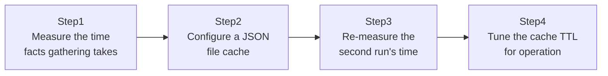

## Introduction

- **What You'll Learn From This Article**: Every time you run a Playbook, **facts gathering** (collecting information like the target host's OS, IP address, and disk capacity) repeats once per target host — and this hands-on reduces that cost with a fact cache. This process barely registers when you have a handful of target hosts, but you'll feel exactly how expensive it becomes at hundreds of hosts, and experience the speedup a cache provides.
- **Intended Audience**: Readers who've only ever used Ansible against a handful of servers, and have never deeply considered what `gather_facts` actually does or why it takes time on every run.
- **Estimated Reading Time**: About 20 minutes (about 35 minutes if you build along with the hands-on)

This article is part of the [Top 1% Series Complete Article Guide](/en/sitemap), the 9th article in the [Ansible Series](/en/sitemap#series-list).

## Prerequisite Knowledge

- [The Top 1% Hands-On for Escaping the Static IP List With Ansible's AWS Dynamic Inventory](/en/articles/ansible-aws-dynamic-inventory-handson-guide): in an environment where the target host count fluctuates due to auto scaling and similar, facts-gathering cost fluctuates proportionally too.

## The Big Picture

This hands-on consists of four steps.



## Hands-On Steps

### Step 1: Measure the time facts gathering takes

With no cache, measure the execution time of a Playbook that only does facts gathering.

```yaml
# facts_only.yml
- hosts: all
  gather_facts: true
  tasks:
    - name: Do nothing, just gather facts
      debug:
        msg: "Facts gathered"
```

```bash
time ansible-playbook -i inventory.ini facts_only.yml
```

**With a handful of target hosts this takes only a few seconds, but this time grows nearly proportionally with the number of target hosts.** The starting point of this hands-on is the fact that this cost is incurred, every single time, across hundreds of hosts, on every single Playbook run.

### Step 2: Configure a JSON file cache

Add fact caching configuration to `ansible.cfg`.

```ini
[defaults]
gathering = smart
fact_caching = jsonfile
fact_caching_connection = /tmp/ansible_facts_cache
fact_caching_timeout = 3600
```

**Setting `gathering = smart` makes Ansible skip facts gathering entirely whenever the cache is valid and fresh.** `fact_caching_timeout` is the number of seconds (here, 3600 seconds = 1 hour) for which the cache is considered valid.

### Step 3: Re-measure the second run's time

Run the same Playbook again and compare the execution time.

```bash
time ansible-playbook -i inventory.ini facts_only.yml
```

**It should be dramatically shorter than the first run.** Look inside the `/tmp/ansible_facts_cache` directory, and you'll see each host's facts content saved as a JSON file.

### Step 4: Tune the cache TTL for operation

Try running it again once the cache has expired.

```bash
# Make the cache file's timestamp look expired
touch -d "2 hours ago" /tmp/ansible_facts_cache/*

time ansible-playbook -i inventory.ini facts_only.yml
```

**Since the time specified in `fact_caching_timeout` has passed, facts gathering runs again, and the cache is refreshed with new content.** Tuning this TTL value appropriately, based on how frequently the target hosts' configuration actually changes, is the real-world key point.

## What a Pro Sees Here (Top 1% Understanding)

### What gather_facts actually does under the hood

`gather_facts` establishes an SSH connection to the target host and actually runs a Python script (the `setup` module), collecting hundreds of pieces of information — OS version, network interfaces, disk capacity, environment variables, and more. **Without understanding that this process itself carries the far-from-trivial cost of establishing an SSH connection and running a Python script**, it's easy to fall into the misconception that "facts gathering should finish instantly." As the host count grows, this cost accumulates, and facts gathering's share of the Playbook's total execution time becomes impossible to ignore.

### How to weigh the risk of a cache going stale

A fact cache naturally carries the risk that "the cached information diverges from the target host's actual current state." For example, if a host's disk was expanded during the cache period, a task referencing the stale cached disk information could make an incorrect judgment. **The real-world answer to this risk is weighing "the heavy cost of an SSH connection on every facts gathering" against "the risk of a stale cache," and tuning the TTL based on how frequently the target system's configuration actually changes.** Setting a short TTL for an environment whose configuration changes frequently, and a long TTL for one that barely changes, is the real-world way to strike this balance.

## Common Misconceptions and Pitfalls

- **Misconception 1: "Facts gathering finishes nearly instantly, so caching it is pointless."**
  At hundreds of target hosts, facts gathering's cumulative cost becomes impossible to ignore.
- **Misconception 2: "Once fact_caching_timeout is set, the cache keeps being used forever."**
  Once the specified number of seconds passes, the cache is automatically invalidated, and facts gathering runs again.
- **Misconception 3: "Enabling the cache means only stale information ever gets used."**
  Within the TTL window, stale information is used, but once the TTL passes, it's automatically refreshed with the latest information.

## Troubleshooting Perspective

1. **Configured the cache but execution time didn't shrink**: Check whether `gathering = smart` is correctly set in `ansible.cfg`, and whether `fact_caching_connection`'s path has write permission.
2. **A task misbehaves referencing stale information**: Check whether `fact_caching_timeout`'s value is too long relative to how frequently the target system's configuration actually changes.
3. **One specific host needs the latest facts**: Explicitly specify `gather_facts: true` for just that task, or clear the cache with `meta: clear_facts`.

## Summary

- `gather_facts` carries the far-from-trivial cost of establishing an SSH connection and running a Python script.
- Setting `fact_caching = jsonfile` and a TTL reduces facts-gathering cost.
- A cache carries the risk of going stale, so its TTL needs tuning based on how frequently configuration actually changes.
- The more target hosts you have, the bigger both facts gathering's cumulative cost and the cache's payoff become.

**Takeaways to Apply Today**
1. For a Playbook targeting more than a few dozen hosts, consider adopting a fact cache.
2. Always factor in how frequently the target system's configuration actually changes when setting a TTL.

## References

- [Caching facts | Ansible Documentation](https://docs.ansible.com/ansible/latest/playbook_guide/playbooks_vars_facts.html#caching-facts)
- [ansible.cfg reference | Ansible Documentation](https://docs.ansible.com/ansible/latest/reference_appendices/config.html)
