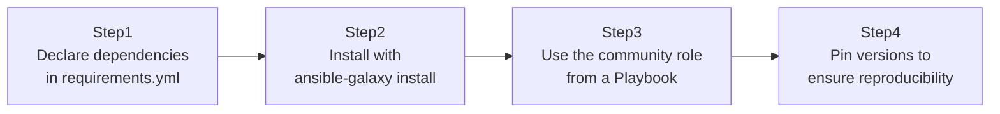

## Introduction

- **What You'll Learn From This Article**: In [The Top 1% Hands-On for Experiencing Production-Grade Configuration Management With Ansible Roles, Handlers, and Templates](/en/articles/ansible-roles-handson-guide) you built your own role, but in real-world work, reusing a role or Collection that engineers around the world have already built and battle-tested is far more common. You'll use `requirements.yml` to install a Collection and role from Ansible Galaxy with pinned versions, and actually use it to set up Nginx.
- **Intended Audience**: Readers who assume writing every Playbook entirely from scratch themselves is just how it's done, and have never been conscious of the Ansible Galaxy ecosystem's existence.
- **Estimated Reading Time**: About 20 minutes (about 35 minutes if you build along with the hands-on)

This article is part of the [Top 1% Series Complete Article Guide](/en/sitemap), the 7th article in the [Ansible Series](/en/sitemap#series-list).

## The Big Picture

This hands-on consists of four steps.



## Hands-On Steps

### Step 1: Declare dependencies in requirements.yml

Declare the Collection and role you want to use in a file called `requirements.yml`.

```yaml
collections:
  - name: community.general
    version: "8.0.0"

roles:
  - name: geerlingguy.nginx
    version: "3.1.4"
```

**This file is the equivalent of `package.json` or `requirements.txt` in a programming language.** It explicitly declares, as code, exactly what to use and at what version.

### Step 2: Install with ansible-galaxy install

Actually install the Collection and role according to `requirements.yml`.

```bash
ansible-galaxy install -r requirements.yml
ansible-galaxy collection install -r requirements.yml
```

**The installed role and Collection are unpacked locally under `~/.ansible/roles/` and `~/.ansible/collections/`.** The important point is that this happens without cluttering your own Playbook directory — they land somewhere independent of your existing codebase.

### Step 3: Use the community role from a Playbook

Specify the installed role under the Playbook's `roles:`, exactly the same way you would with a role you wrote yourself.

```yaml
- hosts: web
  become: true
  roles:
    - role: geerlingguy.nginx
      vars:
        nginx_vhosts:
          - listen: "80"
            server_name: "example.com"
            root: "/var/www/example.com"
```

**This role has been used by a huge number of users worldwide over a long period, and battle-tested across many different OSes and many different edge cases.** It's usually the case that fewer known bugs exist and a wider range of configurable variables is available than if you wrote `nginx.conf`'s template from scratch yourself.

### Step 4: Pin versions to ensure reproducibility

Commit the state where you've explicitly pinned versions in `requirements.yml` straight into Git.

```bash
git add requirements.yml
git commit -m "Pin geerlingguy.nginx to 3.1.4 and community.general to 8.0.0"
```

**Run `ansible-galaxy install` without pinning a version, and a different version could get installed each time you run it.** Pinning versions is nearly mandatory practice in real-world work, to prevent the accident of a Playbook's behavior suddenly changing one day because of a spec change on the role's side.

## What a Pro Sees Here (Top 1% Understanding)

### Why "building everything from scratch yourself" is the choice to avoid

Whether it's Ansible or anything else in infrastructure configuration management, "don't reinvent the wheel" is an extremely important principle. Even something as simple as setting up Nginx involves countless considerations — automatic SSL certificate renewal, managing multiple virtual hosts, package name differences across OSes. **A battle-tested role on Ansible Galaxy has usually already resolved these countless edge cases, based on feedback from a huge number of users**, and is frequently superior to something homegrown in both quality and maintainability. The top 1% of engineers are the ones who, early on, default to suspecting "someone has surely already built and validated this," and make the call to avoid reinventing the wheel.

### A Collection and a Role are different concepts

A **Collection** is a package format for distributing modules, plugins, roles, and more together, while a **Role** is a narrower, reusable unit bundling a specific task (in this case, setting up Nginx). A single Collection can contain multiple Roles, but a Role like `geerlingguy.nginx` can also be published on Galaxy entirely independently of any Collection. Without accurately understanding this distinction, it's a common real-world source of confusion figuring out whether something belongs under `requirements.yml`'s `collections:` or `roles:`.

## Common Misconceptions and Pitfalls

- **Misconception 1: "Ansible Galaxy only has roles officially guaranteed for quality by the Ansible company."**
  Ansible Galaxy is an open ecosystem anyone can publish to. Quality varies wildly role by role and Collection by Collection — you need to check download counts, GitHub stars, and update frequency before choosing one.
- **Misconception 2: "Even without a version written in requirements.yml, the same version always gets installed."**
  Without a specified version, whatever is the latest version at run time gets installed, so the result can change every time you run it.
- **Misconception 3: "Installing a Collection automatically makes all of its Roles usable too."**
  A Collection and a Role sometimes need to be installed separately. Check both sections of `requirements.yml`.

## Troubleshooting Perspective

1. **`ansible-galaxy install` fails**: Check whether you can reach the Galaxy server, whether directly or through a corporate proxy.
2. **Running the Playbook gives a "role not found" error**: Check whether you forgot to run `ansible-galaxy install -r requirements.yml` beforehand.
3. **The Playbook's behavior suddenly changed one day**: If `requirements.yml` doesn't pin a version, a newer version of the role may have been installed unintentionally.

## Summary

- Declare the Collection and role you use, with a version, in `requirements.yml`.
- Install them with `ansible-galaxy install`, then use them from a Playbook exactly like a role you wrote yourself.
- A battle-tested community role has usually already resolved countless edge cases, and is frequently superior to something homegrown.
- Pinning versions and committing them to Git ensures reproducible execution results.

**Takeaways to Apply Today**
1. When you need to set up a new piece of middleware, first search Ansible Galaxy for an existing role.
2. Always pin the version in `requirements.yml`, and bump it deliberately when you do update it.

## References

- [Ansible Galaxy](https://galaxy.ansible.com/)
- [Ansible collections | Ansible Documentation](https://docs.ansible.com/ansible/latest/collections_guide/index.html)
