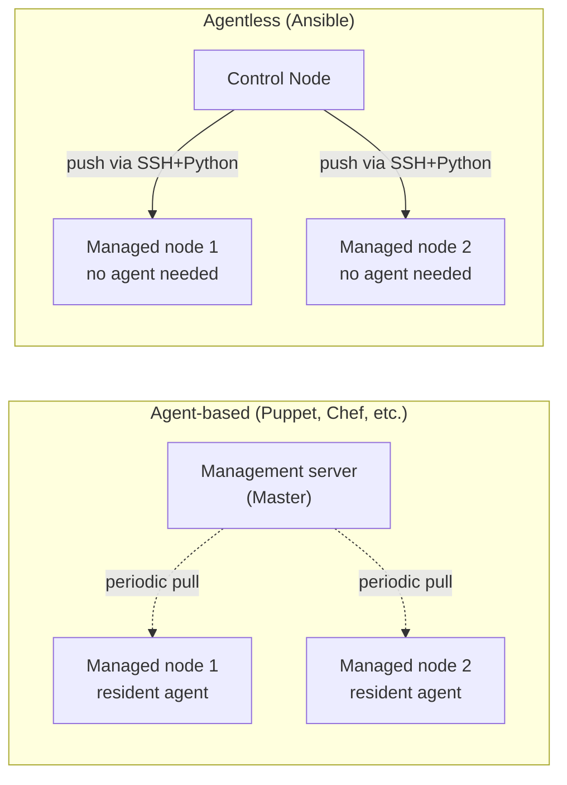

## Introduction

- **What You'll Learn From This Article**: Starting from "I've heard of Ansible, but its usefulness hasn't quite clicked," this article systematically explains **how Ansible actually works under the hood** and **what sets it apart from a hand-written shell script.**
- **Intended Audience**: This article is aimed at engineers who build and configure servers by hand or with shell scripts every time, have heard the name Ansible, but don't yet have a clear sense of what it actually does.
- **Estimated Reading Time**: About 20 minutes

This article is part of the [Top 1% Series' full article guide](/en/sitemap), and the first article in a new series on Ansible. If you want to get hands-on and actually try it, continue to [A "Top 1%" Hands-On Lab: Automating Configuration Across Multiple Servers with Ansible](/en/articles/ansible-handson-guide).

## Prerequisites

- **The basics of SSH connections**: The operation covered in [Getting Started with Ubuntu Server: A Hands-On Prep Manual](/en/articles/ubuntu-server-setup-guide), connecting to a remote Linux server with `ssh <username>@<ip-address>`. Ansible runs on top of this SSH connection.
- **The basics of YAML syntax**: Ansible's configuration is written in **YAML**, a data format that expresses structure through indentation. All you need to know for now is the basic `key: value` syntax, and that a line starting with `- ` (a hyphen followed by a space) represents a list item.

## Getting the Big Picture

### The Problem "Configuration Management Tools" Set Out to Solve

If you only have a single server, doing the work of installing packages, editing configuration files, and restarting services by hand isn't a big deal. But once you need to **apply the same configuration consistently across ten, or a hundred, servers**, manual work starts to hit its limits. Even following a written procedure to the letter, human error and missed steps creep in, and **configuration drift** — where, say, one server ends up with an outdated version of the procedure applied — becomes common.

A **configuration management tool** is software built to solve exactly this problem: applying consistent configuration across a large number of servers, in a reproducible way. Ansible is one of the leading tools in this category.

### Two Architectures: Agent-Based and Agentless

Configuration management tools broadly fall into two architectures.



- **Agent-based (Puppet, Chef, etc.)**: Each managed server has a dedicated, always-running **agent** installed on it ahead of time. Each agent periodically and autonomously checks in with a management server (the Master) — a **pull** — retrieving configuration changes and applying them to itself.
- **Agentless (Ansible)**: No agent needs to be installed on the managed servers at all. Instead, a **Control Node** — the machine where you run your work from — **connects to each managed node over SSH** and **pushes** configuration to it each time. All the managed side needs is an SSH server and **Python**, which Ansible uses to actually execute its logic.

**Ansible's biggest advantage from choosing the agentless model is low adoption cost.** There's no need to distribute, install, and maintain a dedicated agent across hundreds of servers ahead of time — as long as a server is reachable over SSH, you can start managing its configuration from where you stand. The agent-based model, on the other hand, has its own strengths in large-scale concurrency and network reachability (since the managed node reaches out on its own, no inbound connection from the control side is needed).

## Fundamentals, Explained Thoroughly

### The Five Basic Concepts That Make Up Ansible

| Term | Meaning |
|---|---|
| **Inventory** | A file defining the list of managed servers. Hosts (by IP address or hostname) are organized into groups by role. |
| **Playbook** | A file written in **YAML**, **declaratively describing** which servers should end up in which state, doing what. This is the substance of Ansible's actual work. |
| **Task** | A single unit of work within a Playbook — for example, "install this package" or "make this configuration file look like this." |
| **Module** | The actual piece of logic a Task calls. Hundreds of built-in modules exist for different purposes — `apt` (package management), `copy` (placing files), `service` (managing services), and more. |
| **Role** | A reusable bundle of multiple Tasks and files, organized by role — such as "web server configuration" or "database server configuration." |

### A Playbook Declares "State," Not "Commands"

What's distinctive about writing a Playbook is that it declares **what final state you want**, rather than **how to get there (the steps)**. For example, a Task to "install Nginx and make sure it's running" looks like this:

```yaml
- name: Install Nginx
  ansible.builtin.apt:
    name: nginx
    state: present   # A declaration: "I want this to be in an installed state"
- name: Make sure Nginx is running
  ansible.builtin.service:
    name: nginx
    state: started    # A declaration: "I want this to be in a running state"
    enabled: true      # A declaration: "I want this to auto-start on boot"
```

`state: present` isn't **an instruction to run an install command** — it's **a declaration that this should be in an installed state.** This distinction is the foundation for idempotency, the design principle explained next.

## The View From the Top 1% Perspective

### Idempotency — the Design Principle That Running the Same Playbook Any Number of Times Stays Safe

Ansible's core design principle is described by the term **idempotency**. Idempotency is the property that **running the same operation once, or a hundred times, produces the same end result.**

Trying to achieve the same thing with a shell script runs into trouble quickly. `apt install -y nginx` is fairly safe to re-run, but a command that **appends to a file**, like `echo "some-setting" >> /etc/some.conf`, adds the same line again every time it runs. Making a script safely re-runnable requires the developer to manually write a conditional check — "has this already been configured?" — for every single step.

Each of Ansible's Modules **has this check — "is the desired state already in place?" — built in internally.** As a result, running a Playbook reports one of the following results for each Task:

- **`changed`**: Something was actually changed (it wasn't yet in the desired state).
- **`ok`**: Nothing was changed (it was already in the desired state).

**If you run the same Playbook twice in a row, the second run should report `changed=0` (nothing changed) for every single Task.** This is the most basic way to verify that a Playbook is written correctly and idempotently. Never having to re-read a shell script by hand to figure out "has this already run or not" is the biggest reason Ansible stands apart from an imperative script.

## Common Misconceptions and Pitfalls

- **Misconception 1: "To use Ansible, you need to install dedicated software on the managed servers"**
  Ansible is agentless — all the managed side needs is an SSH server and Python. No dedicated agent software is required.
- **Misconception 2: "A Playbook is just a shell script rewritten in YAML"**
  A Playbook declares "what final state you want," not "the steps to take" — and each Module handles idempotency internally, which is a fundamental difference from a procedural shell script.
- **Misconception 3: "Using Ansible means you no longer need to know SSH or Linux"**
  Ansible is a tool built on top of foundational knowledge — SSH connections, Linux package management, service management — to make that work more efficient and reproducible. It doesn't replace that foundational knowledge itself.

## The Troubleshooting Perspective

This article is an overview covering Ansible's big picture, so hands-on operations and troubleshooting perspectives are covered concretely in [A "Top 1%" Hands-On Lab: Automating Configuration Across Multiple Servers with Ansible](/en/articles/ansible-handson-guide).

## Summary

- Ansible is a configuration management tool for applying consistent configuration across a large number of servers, in a reproducible way.
- Unlike agent-based tools like Puppet and Chef, Ansible is agentless, running on nothing but SSH and Python.
- It's built from five basic concepts: Inventory (the target list), Playbook (a YAML declaration), Task (a unit of work), Module (the actual logic), and Role (a role-based bundle).
- Ansible's core design principle is idempotency — each Module internally checks whether the desired state is already in place, so running the same Playbook any number of times stays safe.

**What to Keep in Mind From Today**
1. When you encounter the term Ansible, remember it's about "declaring state," not "automating steps."
2. When writing a Playbook, remind yourself to think in terms of "what final state do I want," not "how do I get there" — that shift in mindset is the whole point.

## References

- [Ansible Documentation](https://docs.ansible.com/)
- [Ansible: Idempotency](https://docs.ansible.com/ansible/latest/reference_appendices/glossary.html)
- [Red Hat: What is Ansible?](https://www.redhat.com/en/topics/automation/what-is-ansible)
